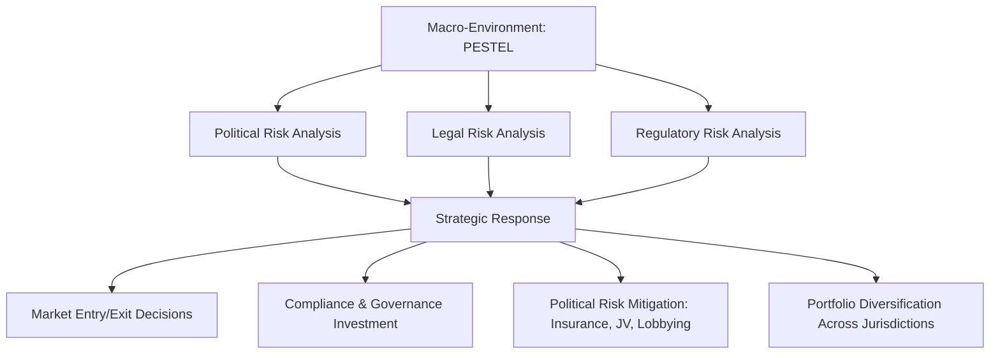
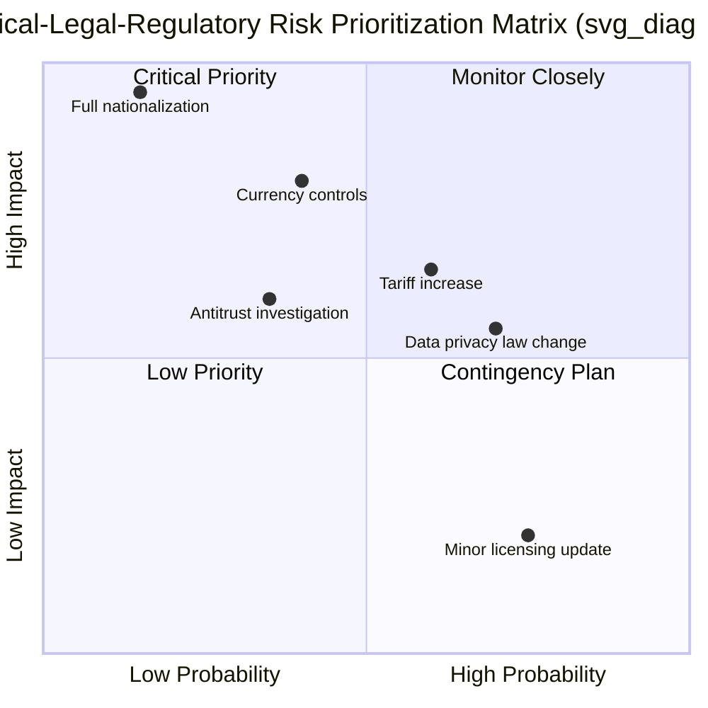

## Political, Legal, and Regulatory Risk Analysis

### Definition and Strategic Purpose

Political, legal, and regulatory risk analysis is the systematic assessment of how government actions, legal systems, and regulatory bodies create uncertainty or constraints affecting firm strategy, operations, and value. It forms the "P" (Political) and "L" (Legal) components of PESTEL analysis and is a critical input to market entry decisions, investment location choices, and ongoing compliance strategy. Unlike macroeconomic risk, which stems from aggregate economic forces, political-legal-regulatory (PLR) risk stems from discretionary human and institutional decisions—elections, legislation, court rulings, expropriation, sanctions—making it less cyclical and often less predictable using quantitative models alone.

The strategic purpose is threefold: (1) avoid catastrophic loss from adverse government action, (2) identify regulatory-driven opportunities (e.g., subsidies, protectionist barriers favoring incumbents), and (3) build organizational resilience through diversification, compliance investment, and political engagement.

### Position in the External Environment Hierarchy

### Distinguishing the Three Dimensions

| Dimension | Definition | Example Triggers |
| --- | --- | --- |
| **Political risk** | Uncertainty from government stability, ideology shifts, civil unrest, expropriation, or geopolitical conflict | Regime change, coups, war, sanctions, nationalization |
| **Legal risk** | Uncertainty from the judicial system, contract enforceability, property rights, and rule-of-law quality | Weak courts, corruption, inconsistent contract enforcement, IP theft |
| **Regulatory risk** | Uncertainty from changes in laws, rules, and administrative enforcement by government agencies | New environmental standards, antitrust action, tariffs, data privacy law, licensing changes |

These dimensions overlap significantly in practice—a regulatory change is often driven by a political shift and interpreted through the legal system—but analytically separating them helps target the appropriate mitigation strategy (e.g., legal risk is mitigated through contract structuring; political risk through insurance and diversification).

### Categories of Political Risk

**Key Points**

- **Macro (country-level) political risk**: Affects all firms operating in a jurisdiction regardless of industry—e.g., currency inconvertibility, war, general expropriation policy, widespread corruption.
- **Micro (firm/industry-specific) political risk**: Targets specific sectors or companies—e.g., nationalization of a single industry (oil, telecom), discriminatory taxation of foreign firms, sector-specific tariffs.
- **Transfer risk**: Government restrictions on capital repatriation or currency convertibility, trapping profits within the host country.
- **Operational risk**: Government interference in day-to-day operations—labor law mandates, local content requirements, price controls.
- **Ownership/control risk**: Forced divestiture, expropriation, or mandatory joint-venture requirements with local partners.
- **Contract/credit risk**: Government reneging on contracts (e.g., canceled concessions, unpaid receivables from state-owned buyers).

### Political Risk Assessment Frameworks

**Country Risk Rating Models**

Firms and specialized agencies use composite scoring systems combining political, economic, and financial risk indicators:

- **ICRG (International Country Risk Guide)**: Scores countries across political (government stability, corruption, law and order), financial, and economic risk sub-indices, aggregated into a composite rating.
- **World Bank Worldwide Governance Indicators (WGI)**: Measures voice and accountability, political stability, government effectiveness, regulatory quality, rule of law, and control of corruption across six dimensions.
- **Transparency International Corruption Perceptions Index (CPI)**: Focused specifically on perceived public-sector corruption, widely used as a proxy for legal/institutional risk.
- **BERI (Business Environment Risk Intelligence) Index**: Combines political risk, operational risk, and remittance/repatriation risk into a composite score used for investment decisions.

[Unverified: Specific current country scores and rankings from these indices should be verified against the latest published editions, as ratings are updated annually or more frequently and methodologies occasionally change.]

**Political Risk Impact-Probability Matrix**

Analysts plot identified risks by likelihood and severity of impact to prioritize monitoring and mitigation resources:

Note: the quadrantChart syntax above is Mermaid notation shown as raw text per formatting requirements; it is not rendered as a live chart in this response.

### Legal Risk Analysis Components

**Rule of Law and Institutional Quality**

Firms assess the reliability of the host country's legal system: judicial independence, enforceability of contracts, protection of property rights (including intellectual property), and predictability of legal outcomes. Weak rule of law increases transaction costs, discourages long-term investment, and elevates the risk of expropriation without adequate compensation.

**Contract and Dispute Resolution Risk**

Key considerations include whether contracts are enforceable domestically, whether international arbitration clauses (e.g., ICSID, ICC arbitration) are honored, and historical patterns of government or counterparty contract breach.

**Intellectual Property Risk**

In jurisdictions with weak IP enforcement, firms face risks of counterfeiting, patent infringement, and forced technology transfer (often a condition of market access in some regulatory regimes). This is a persistent strategic concern in industries with high R&D intensity (pharmaceuticals, technology, luxury goods).

### Regulatory Risk Analysis Components

**Regulatory Change Categories**

- **Entry/exit regulation**: Licensing requirements, foreign ownership caps, antitrust/merger approval requirements.
- **Operational regulation**: Labor law, environmental standards, product safety and quality standards, data privacy/protection law.
- **Pricing regulation**: Price controls, tariff schedules, subsidy structures.
- **Fiscal regulation**: Corporate tax rates, transfer pricing rules, tax incentive/holiday programs.
- **Trade regulation**: Tariffs, quotas, export controls, sanctions regimes.

**Regulatory Lifecycle Monitoring**

Regulatory risk is not static; it follows a lifecycle from proposal to enforcement that firms should track to enable proactive rather than reactive response:

Firms with mature government-affairs functions engage during the consultation and drafting stages (stages A-C), where influence on final rules is highest, rather than waiting until enforcement (stage F) to react.

### Strategic Mitigation Approaches

**Key Points**

- **Political risk insurance**: Instruments from institutions like MIGA (Multilateral Investment Guarantee Agency, part of the World Bank Group), OPIC/DFC (US International Development Finance Corporation), and private insurers (Lloyd's syndicates) cover expropriation, currency inconvertibility, and political violence.
- **Joint ventures and local partnerships**: Sharing ownership with local partners can reduce expropriation risk (higher political cost for host government to seize jointly-owned assets) and improve regulatory navigation through local expertise.
- **Diversification across jurisdictions**: Spreading operations across multiple countries reduces concentration risk from any single political event, analogous to portfolio diversification in finance.
- **Contract structuring**: Stabilization clauses (freezing regulatory terms at contract signing), international arbitration clauses, and currency-hedged payment terms reduce exposure.
- **Corporate political activity (CPA)**: Lobbying, trade association participation, and coalition-building to influence regulatory outcomes—must be balanced against reputational and compliance (anti-corruption law) risk.
- **Scenario planning and contingency triggers**: Pre-defined response plans tied to specific political/regulatory trigger events (e.g., election outcomes, sanctions announcements).
- **Local compliance capability**: Dedicated legal/regulatory affairs teams embedded in-market to track changes and maintain relationships with regulators.

### Political Risk Assessment Process (Practical Example)

**Example**

A consumer electronics manufacturer evaluates market entry into a Southeast Asian country:

1. **Macro political scan**: Reviews ICRG political risk sub-index, WGI government effectiveness and rule-of-law scores, and recent election/succession history. Finds moderate political stability with periodic policy shifts tied to election cycles.
2. **Legal risk assessment**: Reviews contract enforcement track record via World Bank Doing Business-style legal indicators (historical) and consults local counsel on IP enforcement precedent; finds patent enforcement inconsistent outside major cities.
3. **Regulatory scan**: Identifies a pending data localization law requiring in-country server infrastructure, and a proposed increase in import tariffs on finished electronics (protectionist policy favoring domestic assembly).
4. **Strategic response**: Firm opts for a joint-venture entry structure with a local partner to reduce ownership risk, negotiates a stabilization clause on tax treatment, purchases political risk insurance covering currency inconvertibility, and begins local assembly to preempt the tariff threat and qualify for local-content incentives.

**Output**: Entry proceeds via JV with phased capital commitment; a monitoring dashboard tracks the data localization bill's legislative status with a defined trigger (bill passage) for infrastructure investment activation.

### Sanctions and Geopolitical Risk

A distinct and increasingly prominent subcategory involves state-imposed sanctions regimes (e.g., OFAC in the US, EU sanctions frameworks, UN Security Council sanctions) and export control regimes affecting cross-border trade, technology transfer, and financial transactions. Firms operating internationally must maintain sanctions screening processes for counterparties, and technology firms in particular face export control regimes governing sensitive technologies (e.g., semiconductors, AI/ML systems, encryption). [Inference: the pace and scope of sanctions and export control expansion in strategically sensitive sectors has increased in recent years, though specific current restrictions should be verified against current regulatory guidance given how frequently these regimes are updated.]

### Common Pitfalls in Political-Legal-Regulatory Analysis

- **Recency bias**: Overweighting the most recent political event while underweighting longer-term institutional patterns.
- **Home-country projection**: Assuming host-country legal/regulatory institutions function like the firm's home jurisdiction.
- **Underestimating regulatory lag effects**: Failing to anticipate that today's political rhetoric often becomes tomorrow's binding regulation.
- **Treating political risk as uninsurable/unmanageable**: Overlooking available mitigation instruments (insurance, contract structuring, JV) and defaulting to complete market avoidance, potentially ceding first-mover advantage to competitors with better risk management capability.
- **Siloed analysis**: Treating political, legal, and regulatory risk as separate from competitive strategy, rather than integrating findings into entry mode choice, capital structure, and operational design.

### Integration with Strategic Decision-Making

**Conclusion**

Political, legal, and regulatory risk analysis directly shapes market entry mode (wholly-owned subsidiary vs. joint venture vs. licensing), capital allocation pacing (phased vs. full commitment), and geographic portfolio construction. Because PLR risk is driven by discretionary institutional actors rather than smooth economic cycles, it demands continuous qualitative monitoring (government-affairs intelligence, legal counsel, country-risk services) complemented by structured scoring frameworks (ICRG, WGI, CPI) rather than purely quantitative forecasting. Firms that embed PLR risk assessment into strategic planning—rather than treating it as a one-time due-diligence checkbox at market entry—are better positioned to anticipate regulatory shifts, engage proactively during policy formation, and deploy mitigation instruments before risk materializes into loss.

**Related Topics**

- PESTEL Analysis (full framework)
- Macroeconomic Analysis for Strategic Planning
- Market Entry Mode Selection (Exporting, Licensing, JV, Wholly-Owned Subsidiary)
- Country Risk Assessment and Sovereign Risk Models
- Corporate Political Activity and Lobbying Strategy
- International Arbitration and Dispute Resolution Mechanisms
- Sanctions Compliance and Export Control Strategy
- Non-Market Strategy and Stakeholder Management
- Global Value Chain Reconfiguration and Geopolitical Risk
- Corporate Governance in Emerging Markets