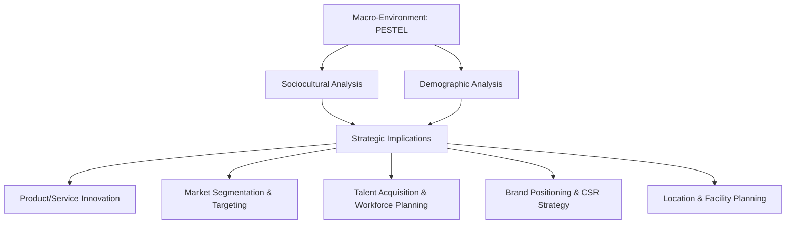
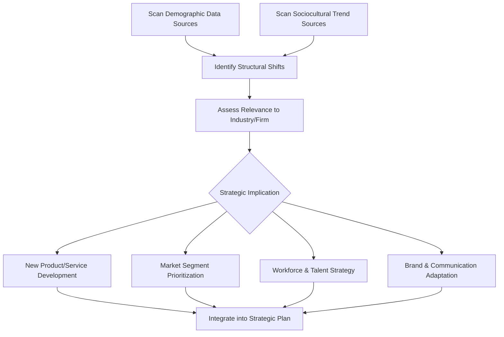

## Sociocultural and Demographic Trend Analysis

### Definition and Strategic Purpose

Sociocultural and demographic trend analysis is the systematic study of population characteristics, cultural values, lifestyle patterns, and social attitudes to identify how shifts in society shape demand, labor markets, and organizational legitimacy. It constitutes the "S" (Social) component of PESTEL analysis and is distinct from macroeconomic analysis in that it focuses on *who* consumers and workers are and *what they value*, rather than aggregate income and price levels. This dimension changes more slowly than political or economic variables but has deep, structural, and often irreversible strategic implications—shaping which markets grow, which products become obsolete, and what talent pools firms can draw from.

The strategic purpose is to anticipate demand shifts before competitors, align products/services/employer branding with evolving social values, and avoid legitimacy risk from misreading cultural sensitivities.

### Position in the External Environment Hierarchy

### Distinguishing Demographic and Sociocultural Dimensions

| Dimension | Definition | Example Variables |
| --- | --- | --- |
| **Demographic analysis** | Quantifiable population structure and composition | Age distribution, population growth rate, urbanization, household formation, migration, education levels |
| **Sociocultural analysis** | Qualitative values, attitudes, lifestyles, and social norms | Consumer values, work-life priorities, health consciousness, sustainability attitudes, cultural diversity, gender roles |

Demographic shifts are typically more measurable and forecastable over multi-decade horizons (population pyramids project with reasonable accuracy decades ahead, barring major shocks), while sociocultural shifts are more qualitative and can move faster, particularly when amplified by social media and generational turnover.

### Key Demographic Variables

**Key Points**

- **Age structure and population pyramids**: Determine the size of age-based market segments and the ratio of working-age to dependent populations (dependency ratio), directly affecting labor supply and consumption patterns.
- **Population growth/decline rates**: Shape long-run market size trajectories; declining-population markets (e.g., parts of East Asia, Eastern Europe) face structurally different growth dynamics than high-growth markets (parts of Sub-Saharan Africa, South Asia).
- **Urbanization rate**: Influences infrastructure demand, retail format viability, and distribution logistics; urbanizing populations typically show rising demand for convenience, formal retail, and services.
- **Household formation and composition**: Shifts toward smaller households, delayed marriage, or single-person households change demand patterns for housing, packaging sizes, and durable goods.
- **Migration patterns**: Both international and internal migration reshape labor supply, consumer market composition, and regional demand distribution.
- **Educational attainment**: Affects workforce skill availability, income potential, and consumption sophistication.
- **Generational cohorts**: Distinct formative experiences (Baby Boomers, Gen X, Millennials, Gen Z, Gen Alpha) produce measurably different values, media consumption, and purchasing behavior, though generational generalizations should be treated as tendencies rather than deterministic rules. [Inference: generational cohort behavioral differences are well-documented in aggregate survey and spending data, but significant within-cohort variation exists and individual-level predictions from cohort membership carry meaningful uncertainty.]

### Key Sociocultural Variables

**Key Points**

- **Health and wellness consciousness**: Rising demand for functional foods, fitness services, mental health support, and preventive healthcare across many markets.
- **Sustainability and environmental values**: Growing consumer and investor expectation for environmentally responsible sourcing, packaging, and corporate practice—intersects with the Environmental (E) dimension of PESTEL.
- **Work-life priorities**: Shifts in attitudes toward work centrality, remote/hybrid work preference, and career-life integration affect talent attraction/retention strategy.
- **Diversity, equity, and inclusion (DEI) expectations**: Evolving societal and stakeholder expectations regarding representation and inclusion in products, marketing, and workforce composition.
- **Digital and social media behavior**: Changing patterns of information consumption, peer influence, and purchase decision-making mediated through digital platforms.
- **Cultural values and norms across markets**: Variation in individualism/collectivism, power distance, uncertainty avoidance, and other cultural dimensions affecting product design, marketing messaging, and organizational practice fit.
- **Attitudes toward institutions and brands**: Shifting trust levels in corporations, government, and media affect corporate communication strategy and stakeholder engagement approach.

### Analytical Frameworks

**Population Pyramid Analysis**

A population pyramid visualizes age-sex distribution and is a standard tool for assessing long-run demand and labor supply trajectories:

<svg xmlns="http://www.w3.org/2000/svg" viewBox="0 0 700 420" font-family="Arial, sans-serif">
<text x="350" y="28" text-anchor="middle" font-size="17" font-weight="bold" fill="#1a1a1a">Contrasting Population Pyramid Shapes (svg_diagram)</text>

<text x="150" y="55" text-anchor="middle" font-size="13" font-weight="bold" fill="#333">Expansive (High Growth)</text>

<rect x="130" y="70" width="10" height="18" fill="`#4a7c9c`" />

<rect x="120" y="90" width="30" height="18" fill="`#4a7c9c`" />

<rect x="110" y="110" width="50" height="18" fill="`#4a7c9c`" />

<rect x="100" y="130" width="70" height="18" fill="`#4a7c9c`" />

<rect x="90" y="150" width="90" height="18" fill="`#4a7c9c`" />

<rect x="80" y="170" width="110" height="18" fill="`#4a7c9c`" />

<rect x="70" y="190" width="130" height="18" fill="`#4a7c9c`" />

<text x="150" y="225" text-anchor="middle" font-size="11" fill="#555">Broad base, young</text>

<text x="150" y="240" text-anchor="middle" font-size="11" fill="#555">population (e.g., Nigeria)</text>

<text x="350" y="55" text-anchor="middle" font-size="13" font-weight="bold" fill="#333">Stationary (Stable)</text>

<rect x="330" y="70" width="40" height="18" fill="`#c9a227`" />

<rect x="330" y="90" width="42" height="18" fill="`#c9a227`" />

<rect x="328" y="110" width="44" height="18" fill="`#c9a227`" />

<rect x="326" y="130" width="48" height="18" fill="`#c9a227`" />

<rect x="324" y="150" width="52" height="18" fill="`#c9a227`" />

<rect x="322" y="170" width="56" height="18" fill="`#c9a227`" />

<rect x="320" y="190" width="60" height="18" fill="`#c9a227`" />

<text x="350" y="225" text-anchor="middle" font-size="11" fill="#555">Even distribution</text>

<text x="350" y="240" text-anchor="middle" font-size="11" fill="#555">(e.g., United States)</text>

<text x="550" y="55" text-anchor="middle" font-size="13" font-weight="bold" fill="#333">Constrictive (Aging)</text>

<rect x="530" y="70" width="70" height="18" fill="`#a33b2c`" />

<rect x="525" y="90" width="80" height="18" fill="`#a33b2c`" />

<rect x="527" y="110" width="76" height="18" fill="`#a33b2c`" />

<rect x="530" y="130" width="70" height="18" fill="`#a33b2c`" />

<rect x="535" y="150" width="60" height="18" fill="`#a33b2c`" />

<rect x="540" y="170" width="50" height="18" fill="`#a33b2c`" />

<rect x="545" y="190" width="40" height="18" fill="`#a33b2c`" />

<text x="550" y="225" text-anchor="middle" font-size="11" fill="#555">Narrow base, aging</text>

<text x="550" y="240" text-anchor="middle" font-size="11" fill="#555">population (e.g., Japan)</text>

<line x1="40" y1="280" x2="660" y2="280" stroke="#333" stroke-width="1.5" />
<text x="350" y="305" text-anchor="middle" font-size="12" fill="#333">Strategic implication: expansive pyramids favor consumer-durables and</text>
<text x="350" y="322" text-anchor="middle" font-size="12" fill="#333">education/employment-sector growth; constrictive pyramids favor healthcare,</text>
<text x="350" y="339" text-anchor="middle" font-size="12" fill="#333">retirement services, automation investment, and labor-saving technology adoption</text>
</svg>

**Cultural Dimensions Frameworks**

For firms operating across multiple national markets, cross-cultural frameworks provide structured comparison of societal values relevant to product design, management practice, and marketing:

- **Hofstede's Cultural Dimensions**: Compares countries on power distance, individualism vs. collectivism, masculinity vs. femininity, uncertainty avoidance, long-term vs. short-term orientation, and indulgence vs. restraint.
- **GLOBE Study dimensions**: An extension/refinement covering similar cultural value dimensions with additional focus on leadership expectations across cultures, developed through cross-national management research.
- **Trompenaars' Cultural Dimensions**: Focuses on how cultures resolve dilemmas around relationships, time, and environment (universalism vs. particularism, specific vs. diffuse cultures, etc.).

[Inference: cross-cultural dimension scores from these frameworks represent aggregated survey-based tendencies at the national level and should be applied with caution to individual-level or organizational-level predictions, as significant within-country variation exists.]

**Generational Cohort Analysis**

Segmenting markets and workforces by generational cohort to anticipate value and behavior shifts as cohorts age into peak consumption or leadership roles:

**Trend Diffusion Analysis (Rogers' Diffusion of Innovations, Applied to Social Trends)**

Sociocultural trends, like technological innovations, diffuse through populations following an adoption curve—useful for timing market entry relative to trend maturity: innovators and early adopters signal emerging shifts, while early/late majority adoption indicates mainstream market readiness.

### Strategic Analysis Process

### Practical Example

**Example**

A mid-sized packaged food company conducts sociocultural and demographic analysis ahead of a five-year product portfolio review:

1. **Demographic scan**: National statistics show a rising median age, declining household size, and continued urbanization in the firm's core market.
2. **Sociocultural scan**: Consumer surveys and social listening data indicate rising health consciousness, growing demand for reduced-sugar and functional-ingredient products, and increasing preference for smaller portion/single-serve packaging aligned with smaller households.
3. **Segment implication**: The aging population segment shows rising demand for functional/fortified foods (bone health, cognitive support), while urban single-person households show rising demand for convenient, smaller-format packaging.
4. **Strategic response**: The firm reformulates two flagship product lines to reduce sugar content and add functional ingredients, introduces single-serve packaging formats, and shifts marketing emphasis from family-size value messaging toward health and convenience messaging for urban segments.

**Output**: Portfolio reallocation directs 30% of new-product-development budget toward functional/health-oriented reformulations and single-serve formats over the planning horizon, with quarterly consumer panel tracking to validate trend persistence before further scaling.

### Data Sources for Sociocultural and Demographic Scanning

- **National census bureaus and statistical agencies**: Primary source for population structure, household composition, and migration data.
- **UN Population Division**: Global demographic projections and cross-country comparative data.
- **Pew Research Center and similar survey organizations**: Sociocultural attitude tracking across generations and geographies.
- **Consumer research firms**: Nielsen, Euromonitor, Mintel—commercial trend-tracking and consumer segmentation data.
- **Social listening and sentiment analysis platforms**: Real-time tracking of emerging cultural conversations and sentiment shifts.
- **Academic cross-cultural research**: Hofstede Insights, GLOBE study publications for cross-national cultural comparison.

[Unverified: Specific current statistics and survey figures should be verified against the latest published releases from these sources, as demographic and sociocultural data are updated periodically and trend interpretations can shift with new survey waves.]

### Common Pitfalls in Sociocultural and Demographic Analysis

- **Overgeneralizing generational cohorts**: Treating broad generational labels as deterministic rather than probabilistic tendencies, ignoring substantial within-cohort heterogeneity.
- **Mistaking short-term fads for durable trends**: Failing to distinguish trend diffusion stage (early hype vs. mainstream, durable adoption) before committing significant resources.
- **Ethnocentric projection**: Applying home-market cultural assumptions to culturally distinct target markets without local validation.
- **Static snapshot analysis**: Treating demographic/sociocultural data as a one-time assessment rather than a continuously monitored trend line, missing inflection points.
- **Ignoring intersectionality**: Analyzing demographic and sociocultural variables in isolation rather than recognizing how they interact (e.g., age cohort effects differ by urban/rural location and income level).

### Integration with Strategic Decision-Making

**Conclusion**

Sociocultural and demographic trend analysis shapes strategy over longer time horizons than most other PESTEL dimensions, but with high strategic stakes: it determines which markets will structurally grow or shrink, what values products and employer brands must reflect to remain relevant, and what skills and preferences will define the available workforce. Because demographic shifts are comparatively forecastable decades in advance while sociocultural shifts require more continuous qualitative monitoring, effective strategic planning combines long-run demographic projection with agile sociocultural trend-tracking, validating emerging signals against diffusion-stage evidence before committing significant capital. Firms that treat this analysis as an ongoing input—rather than a periodic checkbox—are better positioned to anticipate category growth and decline ahead of competitors reacting only after demand shifts become obvious.

**Related Topics**

- PESTEL Analysis (full framework)
- Macroeconomic Analysis for Strategic Planning
- Political, Legal, and Regulatory Risk Analysis
- Market Segmentation, Targeting, and Positioning (STP)
- Cross-Cultural Management and International Strategy
- Employer Branding and Talent Strategy
- Corporate Social Responsibility (CSR) and Stakeholder Theory
- Diffusion of Innovations and Technology Adoption Curves
- Consumer Behavior Analysis
- Workforce Planning in Aging vs. Youthful Labor Markets