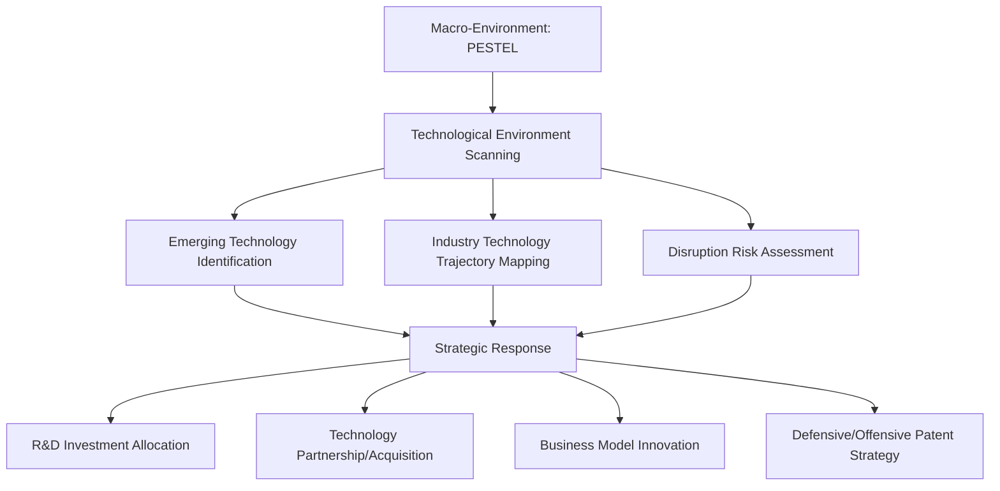
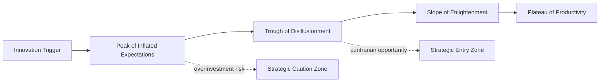
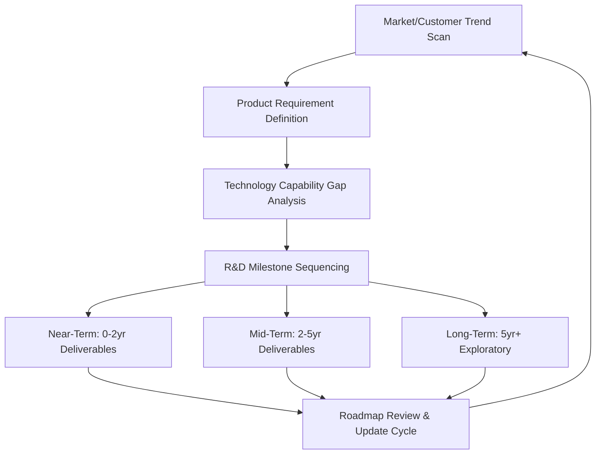
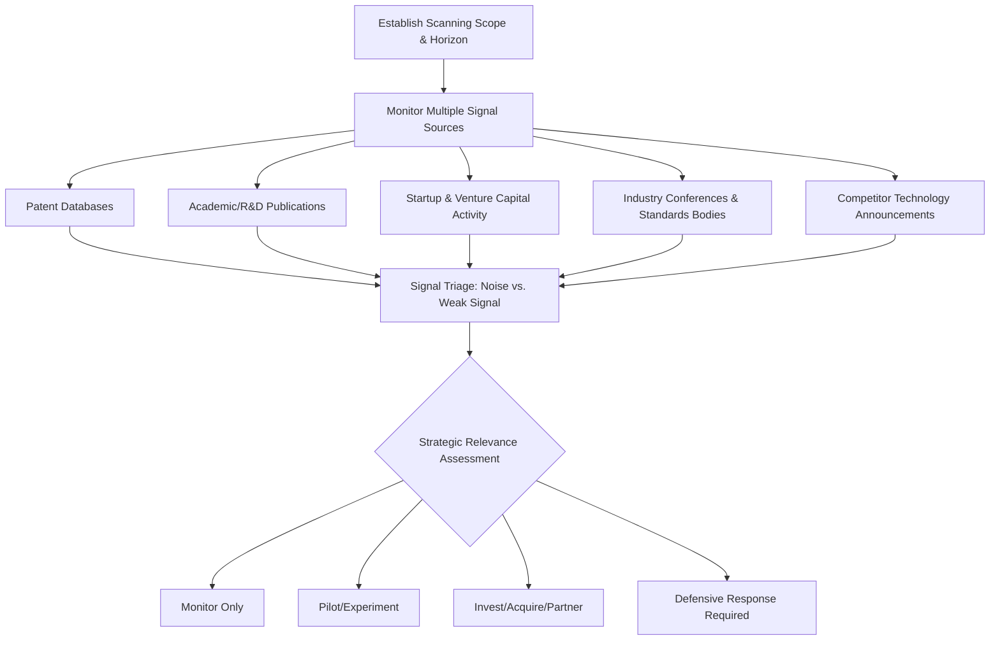

## Technological Environment Scanning

### Definition and Strategic Purpose

Technological environment scanning is the systematic monitoring, evaluation, and interpretation of technological developments—emerging innovations, obsolescence risks, R&D trends, and infrastructure shifts—to identify strategic opportunities and threats. It constitutes the "T" (Technological) component of PESTEL analysis and is distinguished from firm-level technology strategy in that it focuses on the external technological landscape rather than internal R&D execution. Technological change is often the fastest-moving and most disruptive of the PESTEL dimensions, capable of reshaping entire industry structures (disintermediation, new entrant barriers, substitute products) within a single strategic planning cycle.

The strategic purpose is to detect technology-driven disruption early enough to respond proactively (through adoption, partnership, or defensive innovation) rather than reactively, and to distinguish genuine strategic inflection points from transient hype cycles.

### Position in the External Environment Hierarchy

### Key Technological Variables to Monitor

**Key Points**

- **Rate of technological change in the industry**: Determines planning horizon length and the urgency of technology investment—fast-clockspeed industries (semiconductors, software) require shorter planning cycles than slow-clockspeed industries (heavy industrials, utilities).
- **R&D intensity and investment trends**: Industry-wide and competitor R&D spending signals where innovation investment is concentrating.
- **Patent activity and IP landscape**: Patent filing trends reveal where competitors and adjacent industries are directing innovation effort, and identify potential freedom-to-operate constraints.
- **Automation and process technology**: Shifts in manufacturing, logistics, and service delivery automation affecting cost structure and labor requirements.
- **Digital infrastructure maturity**: Broadband/mobile penetration, cloud computing adoption, and digital payment infrastructure affecting market readiness for digital business models.
- **Platform and ecosystem shifts**: Changes in dominant technology platforms (operating systems, app stores, cloud providers, AI model providers) that firms depend on for distribution or infrastructure.
- **Substitute technology emergence**: New technologies that could substitute for the firm's current product/service category entirely (a core input to Porter's Five Forces threat-of-substitutes analysis).
- **Technology standards and interoperability**: Emerging or competing technical standards that could determine which technology approach becomes dominant (standards wars).

### Analytical Frameworks

**Technology S-Curve Analysis**

Technologies typically follow an S-curve of performance improvement over time/investment: slow initial improvement, rapid mid-life acceleration, and eventual maturation as physical or engineering limits are approached. Strategic technology scanning aims to identify when an incumbent technology is approaching its performance ceiling and when a new S-curve (a potentially disruptive successor technology) is beginning its acceleration phase.

<svg xmlns="http://www.w3.org/2000/svg" viewBox="0 0 700 400" font-family="Arial, sans-serif">
<text x="350" y="28" text-anchor="middle" font-size="17" font-weight="bold" fill="#1a1a1a">Technology S-Curve Transition (svg_diagram)</text>
<line x1="70" y1="340" x2="650" y2="340" stroke="#333" stroke-width="2" />
<line x1="70" y1="340" x2="70" y2="50" stroke="#333" stroke-width="2" />
<text x="360" y="375" text-anchor="middle" font-size="13" fill="#333">Time / Cumulative Investment</text>
<text x="30" y="200" text-anchor="middle" font-size="13" fill="#333" transform="rotate(-90 30 200)">Performance</text>
<path d="M 90 320 C 150 315, 200 280, 250 220 C 300 160, 340 100, 400 90" stroke="#4a7c9c" stroke-width="3" fill="none" />
<text x="420" y="85" font-size="12" fill="#4a7c9c" font-weight="bold">Incumbent Technology (maturing)</text>
<path d="M 280 330 C 330 325, 380 300, 430 240 C 480 170, 540 90, 620 70" stroke="#a33b2c" stroke-width="3" fill="none" />
<text x="440" y="245" font-size="12" fill="#a33b2c" font-weight="bold">Emerging Technology</text>
<line x1="280" y1="200" x2="280" y2="340" stroke="#888" stroke-width="1" stroke-dasharray="4,4" />
<text x="230" y="360" font-size="11" fill="#555">Strategic Inflection Point</text>
<text x="230" y="350" font-size="11" fill="#555">(monitoring window)</text>
</svg>

**Hype Cycle Analysis**

A widely used qualitative model (popularized by Gartner) tracks emerging technologies through phases: Innovation Trigger, Peak of Inflated Expectations, Trough of Disillusionment, Slope of Enlightenment, and Plateau of Productivity. Strategic value lies in avoiding overinvestment during peak hype and identifying genuine productivity-stage opportunities others have abandoned during the trough. [Inference: the specific time-to-plateau for any given emerging technology is inherently uncertain and Gartner's own published estimates are revised across editions; the framework is best used as a qualitative positioning tool rather than a precise timing forecast.]

**Disruptive Innovation Framework (Christensen)**

Distinguishes sustaining innovations (improving performance for existing customers along established metrics) from disruptive innovations (initially underperforming on mainstream metrics but offering new value dimensions—typically simplicity, convenience, or lower cost—that eventually displace incumbents from the low end or a new market). Technological scanning should specifically watch for disruptive-pattern entrants: technologies dismissed as inferior by mainstream customers but gaining traction in overlooked segments.

**Technology Roadmapping**

A structured planning tool linking market trends, product requirements, and technology development timelines into a visual roadmap, used to align R&D investment sequencing with anticipated market windows:

**Patent Landscape Analysis**

Systematic review of patent filing trends (by technology class, assignee, and geography) to identify competitor innovation focus areas, potential freedom-to-operate risks, and whitespace opportunities where patent density is low but adjacent activity is rising.

### Sources of Technological Discontinuity Requiring Scanning

- **Component/architectural innovation**: New underlying technology components or new ways of configuring existing components that redefine product architecture.
- **Platform shifts**: Migration of the technology base an industry depends on (e.g., mainframe to client-server to cloud to edge computing; each transition reshaped competitive positioning within affected industries).
- **Convergence**: Merging of previously distinct technology domains (e.g., telecommunications and computing, biology and information technology) creating new competitive dynamics.
- **Cost-curve technologies**: Technologies following steep cost-decline curves (historically observed in areas like solar photovoltaics and battery storage) that can make previously uneconomical business models viable within a compressed timeframe. [Inference: specific technology cost-decline trajectories vary by technology maturity and market conditions and should be verified against current industry data rather than assumed to continue linearly.]

### Strategic Scanning Process

### Practical Example

**Example**

A traditional automotive parts manufacturer conducts technological environment scanning as part of its five-year strategic review:

1. **Signal scan**: Patent landscape analysis shows accelerating filing activity in electric drivetrain components and battery thermal management from both traditional automakers and new entrants. Venture capital funding data shows rising investment in EV charging infrastructure and battery recycling startups.
2. **S-curve assessment**: Internal combustion engine (ICE) component technology shows performance improvements flattening (approaching the maturity plateau of its S-curve), while EV powertrain technology shows steep improvement in cost-per-kWh and charging speed (early-to-mid acceleration phase of a new S-curve).
3. **Hype cycle positioning**: Solid-state battery technology is assessed as still in the "Peak of Inflated Expectations" phase based on publicly announced commercialization timelines versus observed manufacturing scale-up progress, suggesting near-term overinvestment risk in that specific sub-technology.
4. **Strategic response**: The firm classifies core ICE component lines as facing medium-term disruption risk, initiates a technology roadmap reallocating R&D toward EV thermal management systems (a capability adjacency to existing expertise), and pursues a minority-stake partnership with a battery component startup rather than committing to full in-house solid-state battery development given the hype-cycle-driven timeline uncertainty.

**Output**: A phased R&D reallocation plan shifts 40% of the five-year R&D budget toward EV-adjacent component technology, with quarterly technology-scanning reviews tied to specific trigger metrics (competitor EV component patent filings, battery cost-per-kWh benchmarks) to accelerate or decelerate the pivot.

### Data Sources for Technological Scanning

- **Patent databases**: USPTO, EPO (Espacenet), WIPO Global Brand/Patent databases for filing trend analysis.
- **Academic and technical publications**: IEEE Xplore, arXiv (for computing/AI-related fields), industry-specific technical journals.
- **Venture capital and startup tracking platforms**: Crunchbase, PitchBook—signal early-stage investment concentration by technology area.
- **Industry analyst reports**: Gartner, Forrester, IDC—hype cycle and market maturity assessments (commercial, subscription-based).
- **Standards bodies and industry consortia**: IEEE Standards Association, ISO, sector-specific consortia—signal emerging interoperability standards.
- **Government and multilateral technology reports**: National science/technology foundations, OECD technology and innovation outlook reports.

[Unverified: Specific current patent filing statistics, VC funding figures, and analyst hype-cycle positioning should be verified against the latest published data, as these data sources update frequently and technology assessments are revised as new evidence emerges.]

### Common Pitfalls in Technological Environment Scanning

- **Hype-cycle overreaction**: Committing significant capital during the Peak of Inflated Expectations phase based on vendor/media narrative rather than validated productivity evidence.
- **Incumbent myopia**: Dismissing early-stage disruptive technologies because they underperform on the metrics that matter to current mainstream customers, missing their trajectory toward new value dimensions.
- **Single-source signal reliance**: Depending on one information channel (e.g., only analyst reports) rather than triangulating across patents, academic research, startup funding, and competitor moves.
- **Static roadmap assumption**: Treating technology roadmaps as fixed rather than living documents requiring regular trigger-based revision as new signals emerge.
- **Ignoring adjacent-industry convergence**: Focusing scanning narrowly within the firm's own industry classification while missing disruptive technology arriving from an unrelated adjacent domain.

### Integration with Strategic Decision-Making

**Conclusion**

Technological environment scanning is the PESTEL dimension most directly linked to long-run competitive survival, since technology shifts can invalidate an otherwise sound strategy by altering industry structure itself—enabling new entrants, creating substitutes, or eliminating a firm's core capability advantage. Because signals are often weak and ambiguous in early stages, effective scanning requires triangulating multiple sources (patents, R&D publications, venture funding, standards activity) rather than relying on any single indicator, and applying structured frameworks (S-curve, hype cycle, disruptive innovation theory) to separate durable trajectory shifts from transient hype. Firms that treat technology scanning as a continuous, cross-functional discipline—linked directly to R&D roadmap and portfolio allocation decisions—are structurally better positioned to respond to discontinuities proactively rather than defensively after competitive position has already eroded.

**Related Topics**

- PESTEL Analysis (full framework)
- Macroeconomic Analysis for Strategic Planning
- Political, Legal, and Regulatory Risk Analysis
- Sociocultural and Demographic Trend Analysis
- Porter's Five Forces (Threat of Substitutes)
- Disruptive Innovation Theory and Strategic Response
- Technology Roadmapping and R&D Portfolio Management
- Open Innovation and Strategic Technology Partnerships
- Digital Transformation Strategy
- Intellectual Property and Patent Strategy