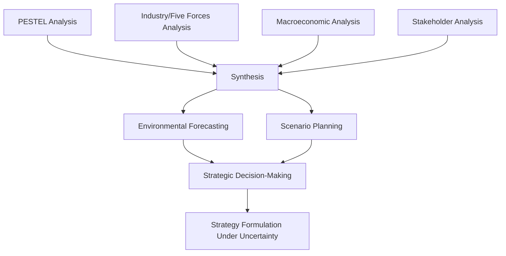
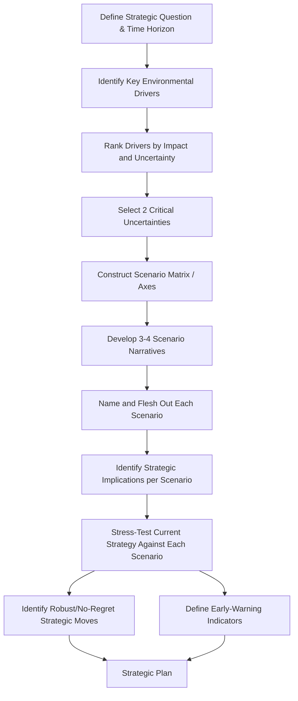

## Scenario Planning and Environmental Forecasting

### Definition and Strategic Purpose

Scenario planning and environmental forecasting are complementary methodologies for anticipating and preparing for future states of the external environment under conditions of uncertainty. Environmental forecasting attempts to project the future values of specific environmental variables (demand, prices, technology adoption rates), while scenario planning constructs multiple internally-consistent, plausible future narratives to stress-test strategy against a range of outcomes rather than a single predicted future. Together they form the synthesis stage of external environment analysis, integrating insights from PESTEL, industry analysis, and stakeholder assessment into forward-looking strategic inputs.

The strategic purpose is not to predict the future accurately (a task with well-documented, persistent failure rates for complex socioeconomic systems) but to build organizational preparedness: strategies that perform acceptably across multiple plausible futures, early-warning systems that detect which future is emerging, and decision-making agility when conditions shift.

### Position in the External Environment Analysis Process

### Environmental Forecasting: Approaches and Techniques

**Key Points**

- **Quantitative extrapolative methods**: Time-series techniques (trend extrapolation, moving averages, exponential smoothing, regression) projecting historical patterns forward; most reliable for stable, low-uncertainty environments and shorter time horizons.
- **Causal/econometric models**: Multi-variable regression or structural models linking environmental outcomes to identified driver variables; more robust than pure extrapolation when causal relationships are well understood but require valid underlying assumptions about driver behavior.
- **Qualitative/judgmental methods**: Expert judgment techniques including the Delphi method (structured, iterative expert polling with controlled feedback to converge toward consensus or clarify disagreement) and jury-of-executive-opinion approaches, used when historical data is sparse or the environment is undergoing structural change that breaks historical patterns.
- **Analogy-based forecasting**: Drawing on historical precedents from comparable situations (other industries, other geographies) to inform judgment about likely trajectories, with explicit acknowledgment of the analogy's limitations.
- **Cross-impact analysis**: Systematically assessing how the occurrence of one forecasted event would affect the probability of other forecasted events, capturing interdependencies that isolated single-variable forecasts miss.

**Forecasting Technique Selection by Time Horizon and Uncertainty**

| Time Horizon | Environmental Uncertainty | Recommended Approach |
| --- | --- | --- |
| Short-term (0-1 yr) | Low | Quantitative extrapolation, causal/econometric models |
| Medium-term (1-3 yr) | Moderate | Causal models supplemented by expert judgment (Delphi) |
| Long-term (3-10 yr) | High | Scenario planning, qualitative/judgmental methods |
| Long-term (10 yr+) | Very high / structural uncertainty | Scenario planning, cross-impact analysis, contingency-based planning |

[Inference: the general principle that quantitative extrapolation loses reliability as time horizon and environmental turbulence increase is well established in the forecasting literature, though the precise horizon at which any given technique's accuracy degrades is domain-specific and not a fixed universal threshold.]

### Scenario Planning Methodology

**Origins and Strategic Rationale**

Scenario planning was pioneered in a corporate strategic planning context by Royal Dutch Shell in the early 1970s, credited with improving the firm's preparedness for the 1973 oil shock relative to competitors who relied on single-point forecasts. The core insight is that under genuine structural uncertainty, the goal shifts from "predicting correctly" to "being prepared regardless of which future occurs."

**The Scenario Planning Process (Standard Methodology)**

**Step-by-Step Detail**

1. **Define the strategic question and time horizon**: Scenario planning is most valuable for specific, consequential strategic decisions (e.g., "Should we build a new manufacturing facility with a 15-year payback horizon?") rather than generic "future of the industry" exercises without decision relevance.
2. **Identify key environmental drivers**: Compile the full range of PESTEL, macroeconomic, and industry-structure variables that could materially affect the strategic question.
3. **Rank by impact and uncertainty**: Plot drivers on an impact/uncertainty matrix. High-impact, high-uncertainty drivers become candidate scenario axes; high-impact, low-uncertainty drivers become shared assumptions across all scenarios (predetermined elements); low-impact variables are set aside.
4. **Select critical uncertainties as scenario axes**: Typically two orthogonal high-impact/high-uncertainty drivers are selected to form a 2x2 scenario matrix, though some methodologies use more axes or narrative-based (non-matrix) scenario construction for more complex situations.
5. **Construct the scenario matrix and develop narratives**: Each quadrant becomes a distinct, internally consistent scenario, given an evocative name to aid organizational memory and communication (e.g., "Green Acceleration," "Fragmented World").
6. **Flesh out each scenario**: Develop each scenario into a coherent narrative describing how the world would look, including secondary effects and plausible triggering events, not merely a label.
7. **Assess strategic implications**: For each scenario, identify what strategic moves would succeed or fail, and what capabilities would be most valuable.
8. **Stress-test current/candidate strategy**: Evaluate the firm's actual strategic options against all scenarios to identify robustness (strategies that perform acceptably across all scenarios) versus scenario-specific bets (high payoff in one scenario, high risk in others).
9. **Define early-warning indicators**: Identify observable, trackable signals that would indicate which scenario is becoming reality, enabling adaptive strategy execution rather than a fixed plan.

### The 2x2 Scenario Matrix (Generic Illustration)

<svg xmlns="http://www.w3.org/2000/svg" viewBox="0 0 700 500" font-family="Arial, sans-serif">
<text x="350" y="28" text-anchor="middle" font-size="17" font-weight="bold" fill="#1a1a1a">2x2 Scenario Matrix Construction (svg_diagram)</text>
<line x1="350" y1="70" x2="350" y2="430" stroke="#333" stroke-width="2" />
<line x1="80" y1="250" x2="620" y2="250" stroke="#333" stroke-width="2" />

<text x="350" y="55" text-anchor="middle" font-size="13" fill="#333">Critical Uncertainty A: High</text>

<text x="350" y="450" text-anchor="middle" font-size="13" fill="#333">Critical Uncertainty A: Low</text>

<text x="60" y="250" text-anchor="middle" font-size="13" fill="#333" transform="rotate(-90 60 250)">Uncertainty B: Low ← → High</text>

<rect x="360" y="80" width="250" height="160" fill="#4a7c9c" fill-opacity="0.15" stroke="#4a7c9c" />
<text x="485" y="150" text-anchor="middle" font-size="14" font-weight="bold" fill="#1a1a1a">Scenario 1</text>
<text x="485" y="170" text-anchor="middle" font-size="11" fill="#333">"Best Case"</text>
<rect x="90" y="80" width="250" height="160" fill="#c9a227" fill-opacity="0.15" stroke="#c9a227" />
<text x="215" y="150" text-anchor="middle" font-size="14" font-weight="bold" fill="#1a1a1a">Scenario 2</text>
<text x="215" y="170" text-anchor="middle" font-size="11" fill="#333">"Divergent Path"</text>
<rect x="90" y="260" width="250" height="160" fill="#a33b2c" fill-opacity="0.15" stroke="#a33b2c" />
<text x="215" y="330" text-anchor="middle" font-size="14" font-weight="bold" fill="#1a1a1a">Scenario 3</text>
<text x="215" y="350" text-anchor="middle" font-size="11" fill="#333">"Worst Case"</text>
<rect x="360" y="260" width="250" height="160" fill="#7c9d4a" fill-opacity="0.15" stroke="#7c9d4a" />
<text x="485" y="330" text-anchor="middle" font-size="14" font-weight="bold" fill="#1a1a1a">Scenario 4</text>
<text x="485" y="350" text-anchor="middle" font-size="11" fill="#333">"Alternate Path"</text>

<text x="350" y="475" text-anchor="middle" font-size="12" fill="#555">Each quadrant developed into a full narrative; strategy stress-tested against all four</text>

</svg>

### Distinguishing Scenario Planning from Related Techniques

| Technique | Purpose | Key Distinction |
| --- | --- | --- |
| **Forecasting** | Predict most likely single future value | Point estimate or range around one central projection |
| **Scenario planning** | Prepare for multiple plausible futures | Explicitly multiple, divergent, internally consistent narratives |
| **Sensitivity analysis** | Test how outputs change with input variation | Typically varies one variable at a time around a base case |
| **Contingency planning** | Define response actions for specific risk events | Tactical response plans, often derived from scenario early-warning triggers |
| **War gaming** | Simulate competitive/adversarial responses | Focuses on strategic interaction with rivals, not just environmental states |

### Strengths and Limitations

**Key Points**

- **Strength**: Reduces overconfidence in single-point forecasts and surfaces strategic blind spots that a base-case-only planning process would miss.
- **Strength**: Improves organizational agility by pre-identifying early-warning indicators, shortening response time when environmental conditions shift.
- **Strength**: Facilitates productive strategic conversation across functions and hierarchy levels by providing a shared, structured vocabulary for discussing uncertainty.
- **Limitation**: Resource-intensive; a rigorous scenario planning process requires significant time and cross-functional participation, which can be difficult to sustain as a continuous practice rather than an occasional exercise.
- **Limitation**: Risk of scenario proliferation diluting focus; too many scenarios (beyond roughly 3-4) tend to overwhelm decision-makers and reduce actionability.
- **Limitation**: Does not eliminate uncertainty, and poorly facilitated processes can produce scenarios that are not genuinely divergent (mere optimistic/pessimistic variants of a single narrative rather than structurally different futures). [Inference: process quality varies substantially by facilitation skill and organizational commitment, and outcomes described in scenario-planning case studies should not be assumed to generalize automatically to any given firm's implementation.]

### Practical Example

**Example**

A regional airline undertakes scenario planning for a fleet investment decision with a 12-year asset life:

1. **Strategic question**: Should the airline commit to a large-body aircraft order now, given long lead times and high capital commitment?
2. **Key drivers identified**: Fuel price trajectory, regulatory carbon policy stringency, business travel recovery/substitution by videoconferencing, and low-cost carrier competitive intensity.
3. **Critical uncertainties selected**: (Axis A) Fuel price and carbon policy cost trajectory: Low vs. High; (Axis B) Business travel demand recovery: Full Recovery vs. Structural Reduction.
4. **Four scenarios developed**:
   - *"Clear Skies"* (low fuel/carbon cost, full travel recovery): Aggressive fleet expansion favored.
   - *"Cost Headwinds"* (high fuel/carbon cost, full travel recovery): Fuel-efficient fleet renewal favored over expansion.
   - *"Quiet Cabin"* (low fuel/carbon cost, structural travel reduction): Right-sizing toward smaller aircraft and leisure-route focus favored.
   - *"Turbulence"* (high fuel/carbon cost, structural travel reduction): Capital preservation and fleet reduction favored.
5. **Robustness test**: A mixed order combining a moderate number of fuel-efficient narrow-body aircraft (useful across all four scenarios) with an option (not firm commitment) on additional large-body aircraft is identified as the most robust "no-regret" strategy, avoiding the worst outcomes in "Turbulence" while preserving upside optionality in "Clear Skies."
6. **Early-warning indicators defined**: Carbon pricing policy announcements, jet fuel futures curves, and quarterly business-travel booking data relative to pre-pandemic baselines are tracked to signal which scenario is emerging, with the large-body aircraft option decision point tied explicitly to these triggers.

**Output**: The airline commits to the fuel-efficient narrow-body order immediately, secures a large-body aircraft purchase option exercisable within a three-year window, and establishes a quarterly scenario-review process tied to the defined early-warning indicators to inform the option exercise decision.

### Integrating Forecasting and Scenario Planning

Environmental forecasting and scenario planning are complementary rather than competing techniques. In practice, quantitative forecasting is often used *within* each scenario to generate internally consistent numerical projections (e.g., demand forecasts conditional on the "Clear Skies" scenario assumptions), while scenario planning provides the structural framework determining which sets of assumptions are worth forecasting under. Firms operating in stable environments may rely primarily on forecasting with light sensitivity analysis; firms in turbulent or structurally uncertain environments should weight scenario planning more heavily.

### Common Pitfalls

- **False precision in forecasting**: Presenting single-point long-horizon forecasts with unwarranted confidence, obscuring the true uncertainty range.
- **Scenario planning without decision linkage**: Conducting an interesting scenario exercise disconnected from an actual pending strategic decision, producing insight without action.
- **Insufficiently divergent scenarios**: Building scenarios that are merely "good," "medium," and "bad" variants of the same underlying narrative rather than structurally distinct futures driven by genuinely different critical uncertainties.
- **One-time exercise mentality**: Treating scenario planning as a single workshop rather than an ongoing capability with periodic refresh and active early-warning-indicator monitoring.
- **Ignoring cross-impacts**: Treating each forecasted variable independently when real-world environmental variables are frequently interdependent.

### Integration with Strategic Decision-Making

**Conclusion**

Scenario planning and environmental forecasting together convert the raw external-environment analysis from earlier PESTEL, macroeconomic, and industry-structure work into decision-ready strategic input. Forecasting techniques should be matched to time horizon and environmental turbulence, shifting from quantitative extrapolation in stable, short-term conditions toward scenario-based and judgmental methods as uncertainty and horizon length increase. Scenario planning's core contribution is not improved prediction accuracy but improved strategic preparedness: identifying robust, no-regret strategic moves that perform acceptably across multiple plausible futures, while establishing early-warning indicators that allow the organization to adapt as ambiguity resolves. Firms that embed this as a continuous, decision-linked capability—rather than an occasional planning offsite exercise—build durable strategic agility against environmental turbulence that single-point forecasting cannot provide.

**Related Topics**

- PESTEL Analysis (full framework)
- Macroeconomic Analysis for Strategic Planning
- Political, Legal, and Regulatory Risk Analysis
- Sociocultural and Demographic Trend Analysis
- Technological Environment Scanning
- Strategic Decision-Making Under Uncertainty
- Real Options Theory in Strategic Investment
- Contingency Planning and Crisis Management
- War Gaming and Competitive Simulation
- Delphi Method and Expert Elicitation Techniques