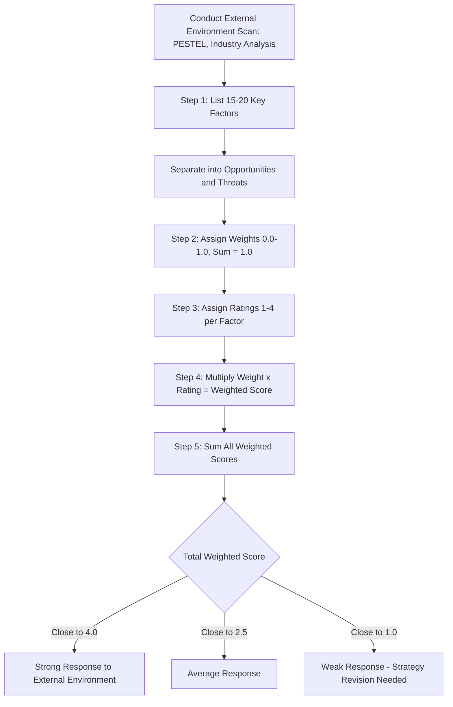

## External Factor Evaluation Matrix

### Definition

The External Factor Evaluation (EFE) Matrix is a strategic management tool used to summarize and evaluate economic, social, cultural, demographic, environmental, political, governmental, legal, technological, and competitive information gathered during external environment analysis. It converts qualitative environmental scanning data into a quantitative score that indicates how effectively an organization's current strategies respond to external opportunities and threats.

The EFE Matrix was developed as a companion tool to the Internal Factor Evaluation (IFE) Matrix, both commonly attributed to Fred R. David's strategic management framework, and is typically used alongside the Competitive Profile Matrix (CPM) in the Input Stage of the strategy formulation framework.

### Purpose and Strategic Role

**Key Points**

- Provides a structured method to audit and score external opportunities and threats
- Enables comparison of an organization's responsiveness to environmental factors over time or against competitors
- Serves as an input to matching-stage tools such as the SWOT Matrix, SPACE Matrix, BCG Matrix, and Grand Strategy Matrix
- Forces strategists to think analytically rather than relying purely on intuition when assessing the external environment

[Inference] The specific weighting and rating values in an EFE Matrix are inherently judgment-based; the tool's value lies in structuring the discussion rather than producing an objectively "correct" numeric score.

### Construction Process

The EFE Matrix is built through five sequential steps.

#### Step 1: List Key External Factors

Identify 15–20 key external factors from environmental scanning (PESTEL analysis, industry reports, competitive intelligence, trend analysis). Separate factors into two categories:

- **Opportunities**: favorable trends or events in the external environment
- **Threats**: unfavorable trends or events in the external environment

Factors should be:

- Stated specifically, using percentages, ratios, and comparative numbers where possible
- Actionable and measurable, not vague generalities
- Applicable to the entire industry (not firm-specific, which belongs in the IFE Matrix)

#### Step 2: Assign Weights

Assign each factor a weight ranging from $0.0$ (not important) to $1.0$ (very important).

$$\sum_{i=1}^{n} w_i = 1.0$$

Where $w_i$ is the weight of factor $i$ and $n$ is the total number of factors (opportunities and threats combined).

Weights indicate the relative importance of a factor to success in the industry, not to the specific firm. Weights are typically derived through:

- Industry benchmarking
- Comparison against successful competitors
- Consensus among the strategy team (e.g., Delphi technique or group discussion)

#### Step 3: Assign Ratings

Assign each factor a rating from 1 to 4, indicating how effectively the firm's *current strategies* respond to that factor:

| Rating | Meaning |
| --- | --- |
| 4 | Response is superior |
| 3 | Response is above average |
| 2 | Response is average |
| 1 | Response is poor |

Ratings are company-based, while weights are industry-based. Both opportunities and threats can receive ratings of 1 through 4.

#### Step 4: Calculate Weighted Scores

Multiply each factor's weight by its rating to obtain the weighted score:

$$WS_i = w_i \times r_i$$

Where $WS_i$ is the weighted score for factor $i$ and $r_i$ is the rating assigned to factor $i$.

#### Step 5: Sum Weighted Scores

Sum all weighted scores to obtain the total weighted score:

$$TWS = \sum_{i=1}^{n} (w_i \times r_i)$$

### Interpretation of Total Weighted Score

The total weighted score ranges from $1.0$ to $4.0$, with $2.5$ as the midpoint average.

| Score Range | Interpretation |
| --- | --- |
| Close to 4.0 | Organization responds exceptionally well to existing opportunities and threats |
| Close to 2.5 | Average responsiveness to the external environment |
| Close to 1.0 | Strategies fail to capitalize on opportunities or avoid threats |

[Inference] A high total weighted score indicates effective strategic response to the environment, but it does not by itself guarantee competitive advantage, since it does not account for internal resource strength — this requires pairing with the IFE Matrix (e.g., in an IE Matrix).

### Worked Example

**Example**

A mid-sized regional coffee chain conducts an EFE analysis.

| Key External Factors | Weight | Rating | Weighted Score |
| --- | --- | --- | --- |
| **Opportunities** |  |  |  |
| Growing demand for specialty/artisanal coffee (+8% YoY) | 0.10 | 4 | 0.40 |
| Expansion of mobile ordering and delivery platforms | 0.08 | 3 | 0.24 |
| Rising disposable income in target demographic | 0.06 | 3 | 0.18 |
| Sustainability-conscious consumer trends | 0.07 | 4 | 0.28 |
| Underserved suburban markets | 0.09 | 2 | 0.18 |
| **Threats** |  |  |  |
| Intense competition from national chains | 0.12 | 2 | 0.24 |
| Rising coffee bean commodity prices | 0.10 | 2 | 0.20 |
| Labor cost inflation and minimum wage increases | 0.09 | 1 | 0.09 |
| Economic slowdown reducing discretionary spending | 0.11 | 2 | 0.22 |
| New entrants with low-cost models | 0.08 | 2 | 0.16 |
| Changing regulations on single-use plastics | 0.10 | 3 | 0.30 |
| **Total** | **1.00** |  | **2.49** |

**Interpretation**: A total weighted score of 2.49 is just below the industry average midpoint of 2.5, indicating the coffee chain's current strategies are responding to external opportunities and threats at a roughly average level, with particular weakness in managing labor cost inflation (rating of 1).

### Diagram: EFE Matrix Construction Workflow

### Comparison with Related Matrices

| Matrix | Focus | Rating Basis |
| --- | --- | --- |
| EFE Matrix | External opportunities and threats | Firm's response effectiveness (1–4) |
| IFE Matrix | Internal strengths and weaknesses | Firm's internal status (1–4, strength/weakness) |
| CPM (Competitive Profile Matrix) | Critical success factors vs. competitors | Firm strength relative to rivals (1–4) |

### Common Pitfalls

**Key Points**

- Assigning equal weights to all factors, which defeats the purpose of prioritization
- Confusing weight (industry importance) with rating (firm response) — weights should not vary based on how well the firm is doing
- Listing factors that are too vague to act upon (e.g., "technology" instead of "growth of AI-driven personalization, +15% adoption in sector")
- Including internal factors (firm-specific strengths/weaknesses) rather than industry-wide external factors
- Treating the total score as a definitive predictor of success rather than a structured diagnostic input

### Limitations

[Inference] Because weights and ratings depend on subjective managerial judgment, EFE Matrix outcomes can vary significantly between analysts evaluating the same environment; the tool is best used to structure strategic dialogue and comparative analysis rather than as a standalone quantitative decision rule. Behavior of any formal scoring convention may also vary slightly across textbooks or consulting frameworks that adapt the original David model.

**Related Topics**

- Internal Factor Evaluation (IFE) Matrix
- Competitive Profile Matrix (CPM)
- PESTEL Analysis
- Porter's Five Forces
- SWOT Matrix (Matching Stage)
- Internal-External (IE) Matrix
- Environmental Scanning Techniques
- Industry Life Cycle Analysis