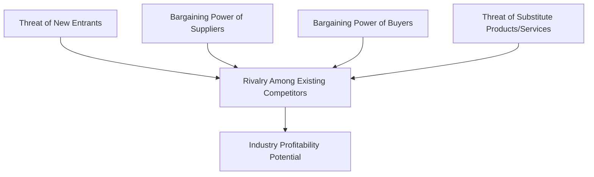

## Porter's Five Forces Framework

### Definition

Porter's Five Forces Framework is a model for analyzing the competitive intensity and profitability potential of an industry. Developed by Michael E. Porter and introduced in his 1979 Harvard Business Review article "How Competitive Forces Shape Strategy," the framework identifies five structural forces that collectively determine the average level of competition and long-run profitability within an industry.

The framework operates at the industry level (not the firm level), helping strategists understand why some industries are structurally more profitable than others, independent of individual company performance.

### Theoretical Foundation

Porter's framework draws from Industrial Organization (IO) economics, particularly the Structure-Conduct-Performance (SCP) paradigm, which holds that industry structure influences firm conduct (strategy), which in turn influences performance (profitability). The Five Forces model operationalizes "structure" into five measurable competitive pressures.

### The Five Forces

#### 1. Threat of New Entrants

The ease or difficulty with which new competitors can enter the industry. High threat of entry pressures existing firms to keep prices low and invest in deterrents, reducing overall industry profitability.

**Key Points — Barriers to Entry**

- Economies of scale (cost advantages from production volume)
- Capital requirements
- Product differentiation and brand loyalty
- Switching costs for customers
- Access to distribution channels
- Government policy and regulation
- Proprietary technology or intellectual property
- Expected retaliation from incumbents

#### 2. Bargaining Power of Suppliers

The degree to which suppliers can influence the price and terms of inputs. Powerful suppliers can squeeze industry profitability by raising prices or reducing quality/service.

**Key Points — Factors Increasing Supplier Power**

- Supplier industry is dominated by few firms (concentrated)
- Supplier's product is a critical, differentiated, or unique input
- High switching costs to change suppliers
- No substitute inputs available
- Supplier can credibly threaten forward integration
- Industry is not an important customer to the supplier group

#### 3. Bargaining Power of Buyers

The degree to which customers can pressure firms to lower prices, demand higher quality, or extract more service, thereby compressing margins.

**Key Points — Factors Increasing Buyer Power**

- Buyers are concentrated or purchase in large volumes
- Products are standardized or undifferentiated
- Low switching costs for buyers
- Buyers have full price/cost information
- Buyer can credibly threaten backward integration
- Product represents a significant fraction of buyer's cost

#### 4. Threat of Substitute Products or Services

The availability of alternative products or services from outside the industry that fulfill the same customer need, placing a ceiling on prices the industry can charge.

**Key Points**

- Substitutes limit potential returns by capping the price firms can charge before customers switch
- Threat is high when substitutes offer a favorable price-performance trade-off
- Threat is high when switching costs to the substitute are low
- Assessment requires looking beyond direct competitors to functionally similar alternatives (e.g., video conferencing as a substitute for business travel)

#### 5. Rivalry Among Existing Competitors

The intensity of competitive jockeying among firms already in the industry via price competition, advertising, product introductions, and service improvements.

**Key Points — Factors Increasing Rivalry**

- Numerous or equally balanced competitors
- Slow industry growth (fight for market share rather than growth)
- High fixed or storage costs (pressure to fill capacity)
- Lack of differentiation or low switching costs
- High strategic stakes
- High exit barriers (specialized assets, labor agreements, emotional attachment)
- Diverse competitors with different strategies and origins

### Diagram: Five Forces Structure

### SVG Illustration: Five Forces Positioning

<svg xmlns="http://www.w3.org/2000/svg" viewBox="0 0 640 520">
<text x="320" y="30" font-size="18" font-weight="bold" text-anchor="middle" fill="#1a1a1a">Porter's Five Forces (svg_diagram)</text>

<rect x="220" y="210" width="200" height="100" rx="8" fill="#2c5282" stroke="#1a365d" stroke-width="2" />
<text x="320" y="250" font-size="14" font-weight="bold" text-anchor="middle" fill="#ffffff">Rivalry Among</text>
<text x="320" y="268" font-size="14" font-weight="bold" text-anchor="middle" fill="#ffffff">Existing Competitors</text>
<text x="320" y="288" font-size="11" text-anchor="middle" fill="#cbd5e0">(Industry Profitability)</text>

<rect x="220" y="40" width="200" height="80" rx="8" fill="#2f855a" stroke="#22543d" stroke-width="2" />
<text x="320" y="70" font-size="13" font-weight="bold" text-anchor="middle" fill="#ffffff">Threat of</text>
<text x="320" y="88" font-size="13" font-weight="bold" text-anchor="middle" fill="#ffffff">New Entrants</text>
<line x1="320" y1="120" x2="320" y2="210" stroke="#4a5568" stroke-width="2" marker-end="url(#arrow)" />

<rect x="20" y="210" width="170" height="100" rx="8" fill="#c05621" stroke="#7b341e" stroke-width="2" />
<text x="105" y="250" font-size="13" font-weight="bold" text-anchor="middle" fill="#ffffff">Bargaining</text>
<text x="105" y="268" font-size="13" font-weight="bold" text-anchor="middle" fill="#ffffff">Power of Suppliers</text>
<line x1="190" y1="260" x2="220" y2="260" stroke="#4a5568" stroke-width="2" marker-end="url(#arrow)" />

<rect x="450" y="210" width="170" height="100" rx="8" fill="#c05621" stroke="#7b341e" stroke-width="2" />
<text x="535" y="250" font-size="13" font-weight="bold" text-anchor="middle" fill="#ffffff">Bargaining</text>
<text x="535" y="268" font-size="13" font-weight="bold" text-anchor="middle" fill="#ffffff">Power of Buyers</text>
<line x1="450" y1="260" x2="420" y2="260" stroke="#4a5568" stroke-width="2" marker-end="url(#arrow)" />

<rect x="220" y="400" width="200" height="80" rx="8" fill="#6b46c1" stroke="#44337a" stroke-width="2" />
<text x="320" y="430" font-size="13" font-weight="bold" text-anchor="middle" fill="#ffffff">Threat of</text>
<text x="320" y="448" font-size="13" font-weight="bold" text-anchor="middle" fill="#ffffff">Substitute Products</text>
<line x1="320" y1="400" x2="320" y2="310" stroke="#4a5568" stroke-width="2" marker-end="url(#arrow)" />
</svg>

### Applied Example

**Example**

Analysis of the global airline industry (long-haul passenger segment):

| Force | Intensity | Rationale |
| --- | --- | --- |
| Threat of New Entrants | Low | High capital requirements, regulatory approval (slots, licenses), economies of scale in fleet/route networks |
| Supplier Power | High | Duopoly in aircraft manufacturing (Boeing, Airbus); labor unions; limited number of fuel suppliers at some airports |
| Buyer Power | Moderate-High | Price comparison sites increase transparency; low switching costs for leisure travelers; loyalty programs partially offset this |
| Threat of Substitutes | Moderate | High-speed rail on short-haul routes; video conferencing for business travel |
| Rivalry | High | Numerous carriers, high fixed costs, price wars, low differentiation on commoditized routes |

**Conclusion**: The combination of high supplier power, high rivalry, and moderate-to-high buyer power explains the historically thin margins characteristic of the airline industry, despite significant barriers to new entry.

### Strategic Implications

**Key Points**

- A favorable five-forces profile (weak forces) suggests higher sustainable industry profitability
- Firms can use the analysis to select which industries to enter or exit
- Firms can attempt to reshape forces in their favor (e.g., building switching costs, forming supplier partnerships, creating patents as entry barriers)
- The framework informs generic strategy choice (cost leadership, differentiation, focus) by revealing where competitive pressure is strongest

### Extensions and Criticisms

[Inference] Later strategists (notably Adam Brandenburger and Barry Nalebuff) proposed adding a sixth force — "complementors" — under the label "Value Net" analysis, arguing that firms offering complementary products can expand rather than compress industry profits, which the original five-forces model does not explicitly capture.

**Common criticisms of the framework**:

- Assumes a relatively static industry structure, which may understate the impact of rapid technological disruption or platform-based business models
- Focuses on structural attractiveness rather than firm-specific resources and capabilities (contrast with the Resource-Based View)
- Industry boundaries can be difficult to define precisely in converging or digital markets
- Does not explicitly address the role of complementary products/services or ecosystem dynamics

[Inference] In digital and platform-based industries, some scholars argue the framework requires adaptation because network effects and multi-sided markets alter how buyer/supplier power and entry barriers function; practitioners should treat the classic model as a starting lens rather than a fully sufficient tool in these contexts.

### Relationship to Other Strategic Tools

| Tool | Relationship to Five Forces |
| --- | --- |
| PESTEL Analysis | Provides macro-environmental inputs that shape the intensity of the five forces |
| SWOT Analysis | Five Forces findings often populate the "Opportunities" and "Threats" categories |
| Value Chain Analysis | Examines firm-level activities once industry attractiveness is understood |
| Generic Strategies (Porter) | Strategy selection responds directly to the competitive pressures identified |
| Resource-Based View (RBV) | Complements Five Forces by shifting focus from industry structure to internal firm resources |

**Related Topics**

- PESTEL Analysis
- Value Chain Analysis
- Porter's Generic Competitive Strategies
- Resource-Based View (RBV) of the Firm
- Strategic Group Mapping
- Industry Life Cycle Analysis
- Value Net Analysis (Brandenburger & Nalebuff)
- Blue Ocean Strategy