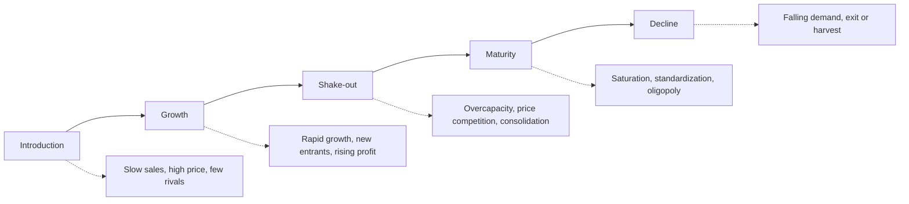

## Industry Life Cycle Analysis

### Definition

Industry Life Cycle Analysis is a strategic framework that examines how industries evolve through predictable stages over time — introduction, growth, shake-out, maturity, and decline — and how competitive dynamics, strategic priorities, and organizational requirements shift at each stage. The model draws an analogy to the biological life cycle and to the product life cycle concept in marketing, applied at the industry level of analysis.

The framework helps strategists anticipate structural changes in competition, adjust strategy to the industry's stage of development, and time entry, investment, or exit decisions.

### Purpose and Strategic Role

**Key Points**

- Identifies the stage of industry evolution to inform appropriate generic strategy selection
- Explains why growth rates, profitability, and the number of competitors change predictably over an industry's history
- Helps anticipate shifts in key success factors (KSFs) as an industry matures
- Supports portfolio decisions (e.g., in conjunction with the BCG Matrix) about resource allocation across business units in different industries
- Assists in forecasting future competitive structure and identifying inflection points requiring strategic pivots

### The Five Stages

#### 1. Introduction (Embryonic) Stage

The industry is newly formed, typically following a technological innovation or the identification of an unmet market need.

**Key Points — Characteristics**

- Slow sales growth as the market is largely unaware of the product
- High prices due to low production volume and lack of economies of scale
- Few competitors, often innovators and early movers
- High risk of failure; heavy R&D and marketing investment
- Negative or minimal profitability industry-wide
- Buyers are primarily innovators/early adopters willing to tolerate imperfections

**Strategic priorities**: Product innovation, establishing product credibility, educating the market, building initial distribution channels.

#### 2. Growth Stage

Demand accelerates as the product gains market acceptance and awareness spreads.

**Key Points — Characteristics**

- Rapid sales growth; new customer segments enter the market
- Entry of new competitors attracted by growth and profit potential
- Economies of scale begin to reduce unit costs and prices
- Distribution channels expand
- Industry profitability typically peaks during this stage
- Product designs begin to standardize toward a "dominant design"

**Strategic priorities**: Building brand loyalty, expanding distribution, achieving scale, differentiating before standardization fully sets in.

#### 3. Shake-out Stage

Growth decelerates as the market approaches saturation; demand growth falls below industry capacity growth.

**Key Points — Characteristics**

- Intensifying price competition as firms compete for market share rather than new customers
- Weaker competitors are acquired or exit
- Industry consolidation begins
- Overcapacity becomes common
- Profitability declines from growth-stage peaks

**Strategic priorities**: Cost control, efficiency improvements, market share defense, potential consolidation through mergers and acquisitions.

#### 4. Maturity Stage

Industry growth slows to the rate of overall economic growth (or population growth); the market is largely saturated.

**Key Points — Characteristics**

- Demand is primarily replacement demand rather than first-time purchase
- Product is highly standardized; few remaining differentiation opportunities
- Barriers to entry are typically high, protecting incumbents
- Competition often shifts toward price, service, and brand loyalty
- Industry structure tends toward oligopoly (a few dominant firms)
- Emphasis on operational efficiency and cost leadership

**Strategic priorities**: Cost efficiency, incremental innovation, customer retention, cash generation, international expansion into less mature markets.

#### 5. Decline Stage

Industry-wide demand falls, often due to technological substitution, changing consumer preferences, demographic shifts, or globalization/import competition.

**Key Points — Characteristics**

- Sustained decline in sales across the industry
- Excess capacity becomes severe
- Price competition intensifies further
- Exit barriers determine how orderly or chaotic the decline is
- Consolidation continues; weaker firms exit or are liquidated

**Strategic Options in Decline** (per Harrigan's end-game strategies):

| Strategy | Description |
| --- | --- |
| Leadership | Pursue dominant market share as competitors exit |
| Niche | Focus on a defensible segment of continuing demand |
| Harvest | Minimize investment, maximize cash extraction |
| Divestment/Exit | Sell or liquidate the business early, before decline deepens |

### Diagram: Industry Life Cycle Stages

### SVG Illustration: Industry Life Cycle Curve

<svg xmlns="http://www.w3.org/2000/svg" viewBox="0 0 680 420">
<text x="340" y="30" font-size="18" font-weight="bold" text-anchor="middle" fill="#1a1a1a">Industry Life Cycle (svg_diagram)</text>

<line x1="60" y1="360" x2="640" y2="360" stroke="#4a5568" stroke-width="2" />
<line x1="60" y1="360" x2="60" y2="60" stroke="#4a5568" stroke-width="2" />
<text x="350" y="395" font-size="13" text-anchor="middle" fill="#1a1a1a">Time</text>
<text x="30" y="210" font-size="13" text-anchor="middle" fill="#1a1a1a" transform="rotate(-90 30 210)">Sales Volume</text>

<path d="M 60 350 C 150 350, 180 320, 220 260 C 260 200, 300 130, 380 110 C 440 100, 480 110, 540 150 C 590 185, 620 240, 640 300" fill="none" stroke="`#2c5282`" stroke-width="3" />

<line x1="180" y1="60" x2="180" y2="360" stroke="#cbd5e0" stroke-width="1" stroke-dasharray="4" />
<line x1="330" y1="60" x2="330" y2="360" stroke="#cbd5e0" stroke-width="1" stroke-dasharray="4" />
<line x1="440" y1="60" x2="440" y2="360" stroke="#cbd5e0" stroke-width="1" stroke-dasharray="4" />
<line x1="560" y1="60" x2="560" y2="360" stroke="#cbd5e0" stroke-width="1" stroke-dasharray="4" />

<text x="120" y="380" font-size="11" text-anchor="middle" fill="`#2f855a`" font-weight="bold">Introduction</text>

<text x="255" y="380" font-size="11" text-anchor="middle" fill="`#2f855a`" font-weight="bold">Growth</text>

<text x="385" y="380" font-size="11" text-anchor="middle" fill="`#c05621`" font-weight="bold">Shake-out</text>

<text x="500" y="380" font-size="11" text-anchor="middle" fill="`#6b46c1`" font-weight="bold">Maturity</text>

<text x="605" y="380" font-size="11" text-anchor="middle" fill="`#9b2c2c`" font-weight="bold">Decline</text>

</svg>

### Applied Example

**Example**

Life cycle positioning of the electric vehicle (EV) industry vs. the internal combustion engine (ICE) automobile industry (illustrative, as of mid-2020s market conditions):

| Dimension | EV Industry | ICE Automobile Industry |
| --- | --- | --- |
| Life cycle stage | Growth (transitioning toward shake-out in some markets) | Maturity |
| Sales growth | High in most major markets | Flat to slightly declining |
| Number of competitors | Expanding, then consolidating in some regions | Stable, oligopolistic |
| Key success factor | Battery technology, charging infrastructure, cost reduction | Operational efficiency, brand loyalty, dealer networks |
| Profitability pattern | Mixed; many entrants still unprofitable, capital-intensive | Generally stable but margin-pressured |

**Conclusion**: [Inference] Firms operating in the ICE segment face a classic maturity-stage strategic choice between harvesting cash from legacy operations and investing aggressively to establish position in the growth-stage EV segment; the correct choice depends on firm-specific capital access, brand positioning, and risk tolerance rather than a single "correct" industry-wide answer.

### Shifting Key Success Factors (KSFs) by Stage

| Stage | Typical Key Success Factors |
| --- | --- |
| Introduction | Innovation, product performance, access to capital |
| Growth | Brand building, distribution expansion, scale-up capability |
| Shake-out | Cost efficiency, operational excellence, market share defense |
| Maturity | Cost leadership, customer retention, incremental differentiation |
| Decline | Cash management, niche focus, disciplined exit timing |

### Limitations

**Key Points**

- Not all industries follow the classic S-curve; some skip stages, cycle repeatedly (e.g., through "rejuvenation"), or plateau indefinitely
- Technological disruption can trigger sudden stage transitions rather than gradual evolution
- Industry boundaries are sometimes ambiguous, making stage classification subjective
- Global industries may have business units simultaneously in different life cycle stages across different geographic markets

[Inference] Because life cycle stage identification relies on retrospective and forward-looking judgment about growth trends, two analysts examining the same industry data may reasonably classify the current stage differently, particularly near inflection points between growth and maturity.

### Relationship to Other Strategic Tools

| Tool | Relationship to Industry Life Cycle |
| --- | --- |
| BCG Matrix | Growth-stage industries often correspond to "Stars" or "Question Marks"; mature industries to "Cash Cows"; declining industries to "Dogs" |
| Porter's Five Forces | Force intensities (especially rivalry and entry threat) shift predictably across life cycle stages |
| Product Life Cycle | Industry life cycle aggregates across the collective product life cycles within an industry |
| Generic Strategies | Appropriate generic strategy often correlates with life cycle stage |

**Related Topics**

- Porter's Five Forces Framework
- BCG Growth-Share Matrix
- Product Life Cycle (Marketing)
- Generic Competitive Strategies (Porter)
- Strategic Group Mapping
- Harrigan's End-Game Strategies for Declining Industries
- Technology S-Curves and Disruptive Innovation