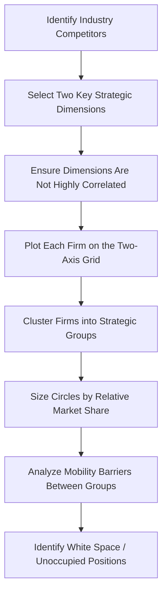

## Strategic Group Mapping

### Definition

Strategic Group Mapping is an analytical technique used to visualize and analyze the competitive positioning of firms within an industry by plotting them according to two key strategic dimensions. A strategic group is a cluster of firms within an industry that follow similar strategies along key dimensions such as price, quality, geographic scope, distribution channels, or product line breadth. The technique reveals the competitive structure within an industry that a single, undifferentiated industry-level analysis (such as basic Five Forces) may obscure.

The concept originated in industrial organization economics and was popularized in strategic management by Michael Porter as a tool for understanding intra-industry competitive dynamics.

### Purpose and Strategic Role

**Key Points**

- Identifies clusters of direct competitors that compete more intensely with each other than with the industry as a whole
- Reveals "strategic distance" between groups, indicating how difficult it would be for a firm to move from one group to another
- Highlights mobility barriers that protect groups from competitors in adjacent groups
- Identifies "white space" — strategic positions not currently occupied by any firm, representing potential opportunities
- Helps explain differences in profitability between groups within the same industry
- Supports competitive benchmarking against the firms most similar to one's own strategy

### Construction Process

#### Step 1: Identify Relevant Strategic Dimensions

Select two variables that best differentiate competitors and are not highly correlated with each other. Common dimensions include:

**Key Points — Common Mapping Dimensions**

- Price / quality level
- Geographic scope (local, regional, national, global)
- Product line breadth
- Degree of vertical integration
- Distribution channel choice
- Level of service/customization
- Brand identity/reputation
- R&D or technological investment intensity

Selecting the two most strategically significant and independent dimensions is critical; using two highly correlated dimensions (e.g., price and quality when they move in lockstep for all firms) produces a diagonal line rather than a meaningful map.

#### Step 2: Plot Firms Along the Two Axes

Position each competitor on a two-dimensional grid according to its strategy on the chosen dimensions.

#### Step 3: Draw Circles Representing Strategic Groups

Firms occupying similar space are enclosed in a circle representing a strategic group. Circle size is often drawn proportional to the group's share of total industry revenue.

#### Step 4: Analyze Group Dynamics

Examine competitive intensity within groups (typically high, since firms compete directly), competitive intensity between adjacent groups (moderate, since they may be substitutes), and mobility barriers preventing movement between groups.

### Diagram: Strategic Group Mapping Process

### SVG Illustration: Strategic Group Map Example

<svg xmlns="http://www.w3.org/2000/svg" viewBox="0 0 640 480">
<text x="320" y="30" font-size="18" font-weight="bold" text-anchor="middle" fill="#1a1a1a">Strategic Group Map: Restaurant Industry (svg_diagram)</text>

<line x1="80" y1="400" x2="580" y2="400" stroke="#4a5568" stroke-width="2" />
<line x1="80" y1="400" x2="80" y2="60" stroke="#4a5568" stroke-width="2" />
<text x="330" y="435" font-size="13" text-anchor="middle" fill="#1a1a1a">Price Level (Low to High)</text>
<text x="35" y="230" font-size="13" text-anchor="middle" fill="#1a1a1a" transform="rotate(-90 35 230)">Menu Breadth (Narrow to Broad)</text>

<ellipse cx="160" cy="340" rx="70" ry="45" fill="#2c5282" fill-opacity="0.3" stroke="#2c5282" stroke-width="2" />
<text x="160" y="345" font-size="12" font-weight="bold" text-anchor="middle" fill="#1a365d">Quick Service</text>

<ellipse cx="330" cy="230" rx="90" ry="55" fill="#2f855a" fill-opacity="0.3" stroke="#2f855a" stroke-width="2" />
<text x="330" y="235" font-size="12" font-weight="bold" text-anchor="middle" fill="#22543d">Casual Dining</text>

<ellipse cx="480" cy="130" rx="65" ry="45" fill="#6b46c1" fill-opacity="0.3" stroke="#6b46c1" stroke-width="2" />
<text x="480" y="135" font-size="12" font-weight="bold" text-anchor="middle" fill="#44337a">Fine Dining</text>

<text x="470" y="330" font-size="11" font-style="italic" text-anchor="middle" fill="`#9b2c2c`">White Space</text>

<text x="470" y="345" font-size="11" font-style="italic" text-anchor="middle" fill="`#9b2c2c`">(high price, narrow menu,</text>

<text x="470" y="360" font-size="11" font-style="italic" text-anchor="middle" fill="`#9b2c2c`">low service level)</text>

</svg>

### Applied Example

**Example**

Strategic group mapping of the global airline industry using **price level** and **route network scope** as dimensions:

| Strategic Group | Representative Firms (illustrative) | Price Level | Network Scope |
| --- | --- | --- | --- |
| Ultra-low-cost carriers | Point-to-point budget carriers | Very Low | Regional/short-haul |
| Full-service network carriers | Major national/global flag carriers | High | Global hub-and-spoke |
| Regional carriers | Domestic feeder airlines | Moderate | Regional/domestic |
| Premium long-haul specialists | Carriers focused on long-haul premium cabins | Very High | Selected international routes |

**Conclusion**: Ultra-low-cost carriers and full-service network carriers occupy distant positions on the map, indicating relatively low direct rivalry between them (different customer segments, different value propositions), whereas two full-service network carriers serving overlapping hub routes would show intense within-group rivalry.

### Mobility Barriers

Mobility barriers are the factors that make it costly or difficult for a firm to shift from one strategic group to another, analogous to entry barriers but operating between groups within an industry rather than at the industry's outer boundary.

**Key Points — Examples of Mobility Barriers**

- Brand reputation built over time (difficult to replicate quickly)
- Scale economies specific to a group's operating model
- Distribution relationships and channel commitments
- Technological or process capabilities specific to the group's strategy
- Regulatory approvals or licenses tied to a specific business model
- Sunk costs in existing infrastructure incompatible with the target group's strategy

[Inference] The height of mobility barriers between two adjacent groups is generally correlated with the profitability gap between them; higher barriers tend to allow more sustained profitability differences, though this relationship is not universally quantifiable across all industries.

### Strategic Applications

**Key Points**

- Identifying which competitors are the most relevant benchmark set (same strategic group) versus distant industry participants
- Evaluating the attractiveness of repositioning into a different strategic group by weighing mobility barriers against potential profitability gains
- Spotting unoccupied "white space" positions that may represent viable new strategic positions
- Explaining intra-industry profitability variance that a single industry-level Five Forces analysis would not capture, since forces can affect groups differently
- Anticipating competitive response patterns, since firms within the same group typically react more strongly to each other's moves

### Limitations

**Key Points**

- Selection of the two mapping dimensions is subjective and can materially change the resulting group structure
- Two-dimensional maps oversimplify multidimensional competitive strategies
- Group boundaries are often fuzzy in practice rather than cleanly separated
- Static snapshot; does not inherently capture how groups and mobility barriers evolve over time
- Risk of confirmation bias if dimensions are chosen to validate a predetermined view of the competitive landscape

[Inference] Because dimension selection significantly shapes the resulting map, analysts are advised to construct multiple strategic group maps using different variable pairs and compare the resulting insights, rather than relying on a single two-dimensional view as definitive.

### Relationship to Other Strategic Tools

| Tool | Relationship to Strategic Group Mapping |
| --- | --- |
| Porter's Five Forces | Five Forces intensities can vary by strategic group; mapping refines industry-level analysis to the group level |
| Competitive Profile Matrix (CPM) | CPM often benchmarks firms identified as being in the same or adjacent strategic groups |
| Industry Life Cycle Analysis | Strategic group structures often shift as an industry moves through life cycle stages (e.g., consolidation during shake-out) |
| Blue Ocean Strategy | White space identification in strategic group maps parallels the search for uncontested market space |

**Related Topics**

- Porter's Five Forces Framework
- Competitive Profile Matrix (CPM)
- Industry Life Cycle Analysis
- Mobility Barriers and Entry Barriers
- Blue Ocean Strategy
- Benchmarking and Competitive Intelligence
- Generic Competitive Strategies (Porter)