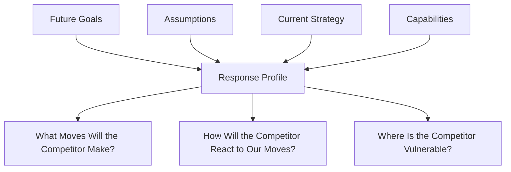
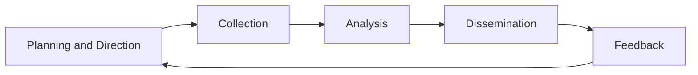

## Competitor Analysis and Competitive Intelligence

### Definition

Competitor Analysis is the systematic process of identifying, evaluating, and interpreting information about current and potential competitors to anticipate their strategic moves, understand their capabilities, and inform a firm's own strategic decisions. Competitive Intelligence (CI) is the broader, ongoing discipline of legally and ethically gathering, analyzing, and disseminating information about the competitive environment — including competitors, customers, and market conditions — to support strategic and tactical decision-making.

While competitor analysis often refers to a discrete analytical exercise, competitive intelligence describes the continuous organizational function and process that feeds such analysis.

### Purpose and Strategic Role

**Key Points**

- Anticipates competitor moves before they occur, enabling proactive rather than reactive strategy
- Identifies competitor strengths and weaknesses relative to the firm's own position
- Informs strategic decisions on pricing, product launches, market entry, and resource allocation
- Reduces strategic surprise by building early-warning systems for competitive threats
- Supports benchmarking to identify performance gaps and best practices
- Feeds into scenario planning and war-gaming exercises

### Porter's Four-Component Competitor Analysis Framework

Michael Porter proposed a structured framework for analyzing individual competitors across four components, aimed at predicting a competitor's future strategy.

#### 1. Future Goals

What drives the competitor at all organizational levels — financial goals, risk tolerance, values, and organizational structure. Understanding goals helps predict whether a competitor will react aggressively, defensively, or passively to industry changes.

#### 2. Current Strategy

How the competitor is currently competing — its positioning, generic strategy (cost leadership, differentiation, focus), functional policies, and how business units interrelate.

#### 3. Assumptions

Beliefs the competitor holds about itself and the industry — including possible blind spots, biases, or outdated assumptions that create exploitable strategic opportunities.

#### 4. Capabilities

The competitor's strengths and weaknesses across functional areas (operations, marketing, R&D, finance, management) that determine its ability to initiate or respond to strategic moves.

**Key Points**

- The four components combine to form a **Response Profile**, predicting how a competitor is likely to react to environmental changes or competitive moves
- Goals and assumptions drive "what drives the competitor," while strategy and capabilities drive "what the competitor is doing and can do"

### Diagram: Porter's Competitor Analysis Components

### Competitive Intelligence Process Cycle

Competitive intelligence typically follows a structured cycle adapted from military and national intelligence methodology.

| Stage | Description |
| --- | --- |
| Planning and Direction | Define intelligence needs and priorities aligned with strategic decisions |
| Collection | Gather raw data from primary and secondary sources |
| Analysis | Convert raw data into actionable insight through structured analytical techniques |
| Dissemination | Deliver findings to decision-makers in usable formats and timeframes |
| Feedback | Decision-makers refine future intelligence requirements based on utility of prior output |

### Sources of Competitive Intelligence

**Key Points — Primary Sources**

- Trade shows and industry conferences
- Customer and supplier interviews
- Sales force field reports
- Competitor job postings (reveal strategic priorities and capability gaps)
- Patent filings and R&D publications

**Key Points — Secondary Sources**

- Annual reports, SEC/regulatory filings, and investor presentations
- Industry analyst reports and trade publications
- News media and press releases
- Competitor websites, product catalogs, and pricing pages
- Academic and government databases

### Ethical and Legal Boundaries

**Key Points**

- Legitimate competitive intelligence relies exclusively on publicly available or ethically obtained information
- Prohibited practices include corporate espionage, bribery, misrepresentation to obtain confidential information, and theft of trade secrets
- Many professional bodies (e.g., Strategic and Competitive Intelligence Professionals, SCIP) publish codes of ethics governing acceptable CI practice
- Legal frameworks such as trade secret law (e.g., the U.S. Defend Trade Secrets Act) and equivalent statutes in other jurisdictions establish boundaries around what information can be lawfully collected and used

[Unverified] Specific legal thresholds for what constitutes improper acquisition of trade secrets vary by jurisdiction; organizations should consult qualified legal counsel before implementing competitive intelligence programs involving any ambiguous data-gathering methods.

### Applied Example

**Example**

A mid-sized consumer electronics firm applies Porter's four-component framework to a key rival preparing to enter its core smart-home product category:

| Component | Findings |
| --- | --- |
| Future Goals | Rival's investor communications emphasize aggressive revenue growth targets and market share expansion, suggesting high risk tolerance |
| Current Strategy | Rival currently competes via a differentiation strategy centered on ecosystem integration and premium design |
| Assumptions | Rival appears to assume its existing brand loyalty will transfer seamlessly into the new category, based on public statements |
| Capabilities | Rival has strong R&D and brand capabilities but limited experience in the specific hardware category, per patent filings and job posting analysis |

**Conclusion**: The response profile suggests the rival is likely to enter aggressively with a premium-positioned product but may be vulnerable on hardware-specific execution, informing the analyzing firm's decision to compete on manufacturing reliability and after-sales service rather than brand alone.

### Common Analytical Techniques Used Within Competitor Analysis

| Technique | Purpose |
| --- | --- |
| Competitive Profile Matrix (CPM) | Quantitatively benchmarks critical success factors across key rivals |
| Strategic Group Mapping | Identifies which competitors are most directly comparable |
| War Gaming | Simulates competitor responses to hypothetical strategic moves |
| SWOT Analysis (competitor-focused) | Applies strengths/weaknesses/opportunities/threats lens to a specific rival |
| Financial Ratio Benchmarking | Compares profitability, efficiency, and leverage against competitors |

### Common Pitfalls

**Key Points**

- Over-relying on publicly available financial data while ignoring qualitative signals (hiring patterns, patent activity, executive statements)
- Treating competitor analysis as a one-time exercise rather than a continuous intelligence process
- Mirror-imaging: assuming competitors think and behave the way the analyzing firm would
- Focusing only on direct, named competitors while ignoring potential entrants or substitute providers
- Failing to disseminate intelligence findings to relevant decision-makers in a timely, actionable format

### Limitations

[Inference] Competitive intelligence is inherently based on incomplete and sometimes deliberately obscured information, since competitors have incentives to conceal strategic intentions; conclusions drawn from CI analysis should be treated as probabilistic assessments rather than certainties, and should be continuously updated as new information emerges.

### Relationship to Other Strategic Tools

| Tool | Relationship to Competitor Analysis |
| --- | --- |
| Competitive Profile Matrix (CPM) | Structures competitor analysis findings into a quantitative comparison format |
| Strategic Group Mapping | Narrows the competitive set to the most strategically relevant rivals |
| Porter's Five Forces | Industry-level rivalry assessment is informed by individual competitor analyses |
| SWOT Analysis | Competitor capabilities and strategies often populate the "Threats" category of a firm's own SWOT |
| Scenario Planning | Competitor response profiles feed into scenario development for strategic contingencies |

**Related Topics**

- Competitive Profile Matrix (CPM)
- Strategic Group Mapping
- Porter's Five Forces Framework
- Benchmarking Techniques
- War Gaming in Strategy
- SWOT Analysis
- Scenario Planning and Strategic Foresight