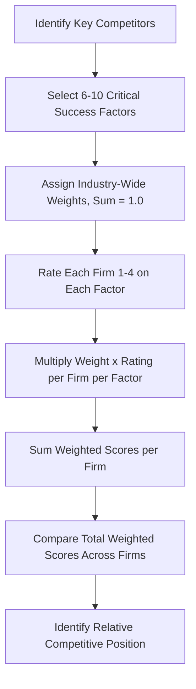

## Competitive Profile Matrix

### Definition

The Competitive Profile Matrix (CPM) is a strategic management tool that identifies a firm's major competitors and compares them against the firm's own position using critical success factors (CSFs) — the key variables that determine competitive success within an industry. Unlike the EFE and IFE matrices, which separate external and internal factors, the CPM combines both external and internal critical success factors into a single comparative framework, since these factors are typically broad enough to encompass both dimensions.

The CPM is commonly grouped with the EFE Matrix and IFE Matrix as one of the three primary Input Stage tools in the strategy formulation framework popularized by Fred R. David.

### Purpose and Strategic Role

**Key Points**

- Benchmarks the firm directly against its most significant rivals on the same set of weighted factors
- Reveals relative competitive strengths and weaknesses that inform strategy formulation
- Identifies which critical success factors most heavily determine performance within the industry
- Complements Strategic Group Mapping by quantifying, rather than only visualizing, competitive position
- Supports resource allocation decisions by highlighting areas of competitive vulnerability

### Construction Process

#### Step 1: Identify Critical Success Factors (CSFs)

Select 6–10 factors that are critical to competitive success in the industry. Unlike EFE/IFE factors, CSFs in a CPM are typically broader and can combine external and internal elements.

**Key Points — Common CSF Categories**

- Market share
- Financial position/strength
- Product quality
- Price competitiveness
- Management experience
- Advertising and marketing effectiveness
- Customer loyalty
- Global expansion/geographic reach
- Organizational structure
- E-commerce/technological capability

#### Step 2: Assign Weights

Assign each CSF a weight from $0.0$ (unimportant) to $1.0$ (very important), such that all weights sum to $1.0$:

$$\sum_{i=1}^{n} w_i = 1.0$$

Weights reflect the CSF's importance to success within the industry as a whole, applied identically across all firms being compared.

#### Step 3: Assign Ratings

For each firm (the analyzing firm and each key competitor), assign a rating for every CSF, typically on a 1–4 scale:

| Rating | Meaning |
| --- | --- |
| 4 | Major strength |
| 3 | Minor strength |
| 2 | Minor weakness |
| 1 | Major weakness |

Unlike EFE/IFE, ratings in a CPM are applied to every competing firm on the same factors, enabling direct comparison.

#### Step 4: Calculate Weighted Scores

For each firm and each factor:

$$WS_{i,j} = w_i \times r_{i,j}$$

Where $WS_{i,j}$ is the weighted score for factor $i$ and firm $j$, and $r_{i,j}$ is the rating assigned to firm $j$ on factor $i$.

#### Step 5: Sum Weighted Scores per Firm

$$TWS_j = \sum_{i=1}^{n} (w_i \times r_{i,j})$$

Total weighted scores range from $1.0$ to $4.0$ and can be directly compared across firms to assess relative overall competitive position.

### Diagram: CPM Construction Workflow

### Worked Example

**Example**

A CPM comparing a mid-sized athletic footwear brand against two major competitors:

| Critical Success Factor | Weight | Firm A (Our Company) Rating | Firm A WS | Competitor 1 Rating | Competitor 1 WS | Competitor 2 Rating | Competitor 2 WS |
| --- | --- | --- | --- | --- | --- | --- | --- |
| Market Share | 0.20 | 2 | 0.40 | 4 | 0.80 | 3 | 0.60 |
| Brand Reputation | 0.18 | 3 | 0.54 | 4 | 0.72 | 3 | 0.54 |
| Product Innovation | 0.15 | 4 | 0.60 | 3 | 0.45 | 3 | 0.45 |
| Price Competitiveness | 0.12 | 3 | 0.36 | 2 | 0.24 | 4 | 0.48 |
| Financial Position | 0.15 | 2 | 0.30 | 4 | 0.60 | 3 | 0.45 |
| Global Distribution | 0.10 | 2 | 0.20 | 4 | 0.40 | 2 | 0.20 |
| E-commerce Capability | 0.10 | 4 | 0.40 | 3 | 0.30 | 3 | 0.30 |
| **Total** | **1.00** |  | **2.80** |  | **3.51** |  | **3.02** |

**Interpretation**: Competitor 1 holds the strongest overall competitive position (3.51), driven by leadership in market share, brand reputation, financial position, and distribution. Our company (2.80) trails both rivals overall but leads specifically in product innovation and e-commerce capability, suggesting these are viable areas for competitive differentiation rather than attempting to compete head-on in market share or distribution scale.

**Conclusion**: The CPM indicates that Firm A's strategy should emphasize innovation-led differentiation and digital channel strength rather than direct competition on scale-dependent factors like market share and global distribution, where both competitors currently hold clear advantages.

### Comparison: CPM vs. EFE vs. IFE

| Aspect | CPM | EFE Matrix | IFE Matrix |
| --- | --- | --- | --- |
| Factor scope | Combined external and internal | External only | Internal only |
| Firms evaluated | Multiple (focal firm + competitors) | Single firm (industry response) | Single firm |
| Factor specificity | Broader, industry-comparative CSFs | Specific external opportunities/threats | Specific internal strengths/weaknesses |
| Rating meaning | Relative strength/weakness (1–4) | Response effectiveness (1–4) | Strength/weakness status (1–4) |
| Primary use | Direct competitive benchmarking | Assessing environmental responsiveness | Assessing internal position |

### Common Pitfalls

**Key Points**

- Selecting CSFs that are too narrow or firm-specific rather than broadly applicable across all compared competitors
- Applying inconsistent rating standards between the focal firm and competitors (rater bias favoring one's own firm)
- Including too many CSFs, diluting the weight and analytical clarity of the most critical factors
- Failing to update the CPM as competitive conditions and CSF importance shift over time
- Treating total weighted scores as precise measurements rather than directional indicators of relative position

### Limitations

[Inference] Because ratings for competitors are typically estimated by the analyzing firm rather than obtained from the competitors themselves, CPM results are subject to information asymmetry and potential bias; external competitor ratings should be treated as informed estimates rather than verified data, particularly for privately held rivals with limited public disclosure.

**Behavioral disclaimer**: [Inference] The relative ranking produced by a CPM reflects a snapshot assessment based on the specific CSFs and weights chosen; changes in CSF selection or weighting can alter the resulting competitive ranking, so results should be interpreted alongside qualitative competitor analysis rather than in isolation.

### Relationship to Other Strategic Tools

| Tool | Relationship to CPM |
| --- | --- |
| EFE Matrix | Companion Input Stage tool; CPM factors often draw partly from EFE-identified external factors |
| IFE Matrix | Companion Input Stage tool; CPM factors often draw partly from IFE-identified internal factors |
| Strategic Group Mapping | Identifies which competitors are most relevant to include in the CPM |
| Competitor Analysis (Porter's Four Components) | Provides qualitative depth behind the quantitative CPM ratings |
| SWOT Matrix | CPM findings often inform the strengths/weaknesses assessment relative to competitors |

**Related Topics**

- External Factor Evaluation (EFE) Matrix
- Internal Factor Evaluation (IFE) Matrix
- Strategic Group Mapping
- Competitor Analysis and Competitive Intelligence
- Porter's Five Forces Framework
- Benchmarking Techniques
- SWOT Matrix (Matching Stage)