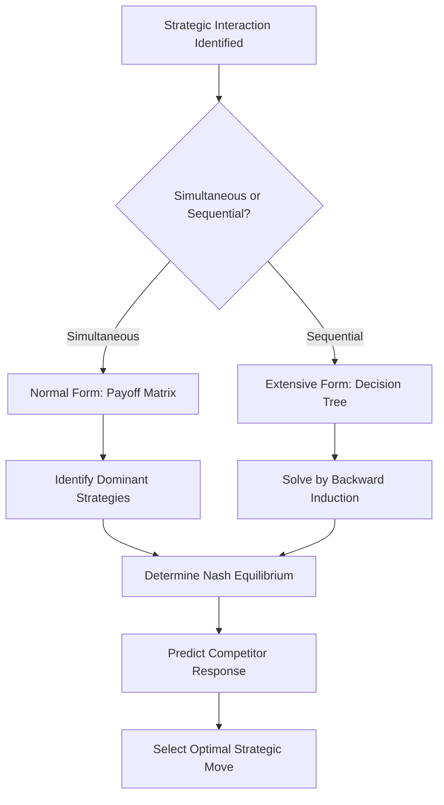

## Game Theory in Competitive Strategy

### Definition

Game Theory in Competitive Strategy applies mathematical models of strategic interaction to analyze how firms make decisions when outcomes depend not only on their own choices but also on the choices of rivals. Originating in economics and mathematics — most notably through the work of John von Neumann, Oskar Morgenstern, and John Nash — game theory provides a formal structure for anticipating competitor responses, identifying equilibrium outcomes, and designing strategies that account for interdependent decision-making.

In strategic management, game theory extends beyond static competitor analysis by modeling the dynamic, interactive nature of competitive rivalry, where each firm's optimal strategy depends on the anticipated strategies of others.

### Purpose and Strategic Role

**Key Points**

- Models strategic interdependence, where a firm's payoff depends on both its own actions and competitors' reactions
- Predicts competitor responses to specific strategic moves (pricing, capacity expansion, entry, innovation)
- Identifies stable outcomes (equilibria) where no player benefits from unilaterally changing strategy
- Supports "war gaming" exercises used to stress-test strategic plans against likely competitor countermoves
- Informs commitment strategies, signaling, and deterrence in competitive rivalry
- Provides a rigorous complement to qualitative frameworks like Porter's Five Forces by formalizing rival interaction

### Core Concepts

#### Players, Strategies, and Payoffs

Every game-theoretic model requires three basic elements:

| Element | Description |
| --- | --- |
| Players | The decision-making firms or actors in the competitive interaction |
| Strategies | The set of possible actions available to each player |
| Payoffs | The outcomes (typically profit, market share, or utility) resulting from each combination of strategies chosen |

#### Simultaneous vs. Sequential Games

**Key Points**

- **Simultaneous games**: Players choose strategies without knowledge of competitors' concurrent choices (e.g., sealed-bid pricing decisions), typically represented in normal form (payoff matrix)
- **Sequential games**: Players move in a defined order, with later movers observing earlier moves (e.g., market entry decisions), typically represented in extensive form (decision tree)

#### Nash Equilibrium

A Nash Equilibrium is a set of strategies, one for each player, such that no player can improve their payoff by unilaterally changing their own strategy, given the strategies chosen by others.

$$\pi_i(s_i^*, s_{-i}^*) \geq \pi_i(s_i, s_{-i}^*) \quad \forall s_i$$

Where $\pi_i$ is player $i$'s payoff, $s_i^*$ is player $i$'s equilibrium strategy, and $s_{-i}^*$ represents the equilibrium strategies of all other players.

[Inference] A Nash Equilibrium represents a stable prediction of rational behavior under the model's assumptions, but real-world competitive outcomes may deviate from theoretical equilibria due to bounded rationality, incomplete information, or behavioral factors not captured in simplified payoff structures.

#### Dominant Strategy

A strategy that yields a higher payoff for a player regardless of what strategy competitors choose. If a dominant strategy exists, rational players will select it independent of expectations about rivals' behavior.

#### The Prisoner's Dilemma

The most widely cited game-theoretic model in competitive strategy, illustrating how individually rational decisions can produce a collectively suboptimal outcome — commonly applied to price competition.

**Example**

Two firms (Firm A and Firm B) simultaneously decide whether to maintain high prices (cooperate) or cut prices (defect):

|  | Firm B: High Price | Firm B: Low Price |
| --- | --- | --- |
| **Firm A: High Price** | A: $10M, B: $10M | A: $2M, B: $12M |
| **Firm A: Low Price** | A: $12M, B: $2M | A: $5M, B: $5M |

Each firm's dominant strategy is to cut price (Low Price), regardless of the rival's choice, because cutting price yields a higher individual payoff in either scenario. The resulting Nash Equilibrium is (Low Price, Low Price), yielding $5M each — worse for both firms than the mutual high-price outcome of $10M each, illustrating why price wars persist even when both firms would be better off avoiding them.

### Diagram: Game Theory Applications in Strategy

### Repeated Games and Cooperation

**Key Points**

- Unlike one-shot games, repeated interactions allow reputation, retaliation, and tacit cooperation to emerge
- **Tit-for-tat** strategies (cooperate first, then mirror the opponent's previous move) have been shown in behavioral and computational tournaments to sustain cooperation effectively in repeated Prisoner's Dilemma settings
- The **Folk Theorem** suggests that with sufficiently patient players and repeated interaction, cooperative outcomes can be sustained as equilibria, supported by the credible threat of future punishment for defection
- Industries with frequent price-setting interactions (e.g., airlines, oligopolistic commodity markets) often display tacit price coordination consistent with repeated-game dynamics, without requiring explicit (and illegal) collusion

[Speculation] Whether observed pricing stability in a specific real-world oligopoly reflects tacit repeated-game cooperation versus other explanations (cost structures, regulatory constraints, demand patterns) is often difficult to determine definitively without detailed empirical investigation specific to that industry.

### Sequential Games and Commitment Strategies

**Key Points**

- **First-mover advantage**: Moving first can establish a credible commitment that shapes competitor responses (e.g., capacity expansion signaling intent to defend market share)
- **Credible commitment**: A strategic move is only effective as a deterrent if competitors believe the firm will follow through, often requiring visible, costly, and hard-to-reverse investments
- **Signaling**: Firms use observable actions (price announcements, capacity investments, patent filings) to influence competitor beliefs and expectations
- **Backward induction**: The method used to solve sequential games, working backward from final outcomes to determine optimal moves at each earlier decision point

### Applied Example: Market Entry Deterrence

**Example**

An incumbent firm considers whether to build excess production capacity to deter a potential entrant, modeled as a sequential game:

1. **Incumbent's decision**: Build excess capacity (costly signal) or maintain current capacity
2. **Entrant's decision** (observing incumbent's choice): Enter the market or stay out

| Incumbent Action | Entrant Response | Incumbent Payoff | Entrant Payoff |
| --- | --- | --- | --- |
| Build excess capacity | Stay out | $8M | $0M |
| Build excess capacity | Enter anyway | $3M | -$1M |
| Maintain current capacity | Stay out | $10M | $0M |
| Maintain current capacity | Enter | $4M | $3M |

**Conclusion**: Using backward induction, if the entrant believes the incumbent's excess capacity commitment is credible (i.e., the incumbent would indeed compete aggressively if entry occurred), the entrant's rational choice is to stay out following the "Build" branch. This makes capacity expansion a credible deterrence strategy, even though it reduces the incumbent's payoff in the no-entry outcome ($8M vs. $10M) — the cost of deterrence is the "insurance premium" against entry.

### Applications in Strategic Management

| Application | Game-Theoretic Concept Used |
| --- | --- |
| Pricing strategy and price wars | Prisoner's Dilemma, repeated games |
| Market entry and deterrence | Sequential games, credible commitment, signaling |
| Capacity expansion decisions | Sequential games, first-mover advantage |
| Bidding and auctions | Auction theory, incomplete information games |
| Coalition and alliance formation | Cooperative game theory |
| R&D and patent races | Sequential/simultaneous games with timing payoffs |
| Negotiation and bargaining | Bargaining theory, Nash bargaining solution |

### Limitations

**Key Points**

- Requires simplifying assumptions about payoffs, player rationality, and available information that may not hold in complex real-world settings
- Assumes competitors act rationally according to modeled payoffs, whereas real managers may exhibit bounded rationality or behavioral biases
- Payoff values are often difficult to estimate precisely in practice, introducing significant uncertainty into model outputs
- Static models may oversimplify dynamic, multi-period competitive environments with evolving strategies
- Multiple equilibria can exist in some games, complicating clear-cut strategic prescriptions

[Inference] Game theory is most useful in strategic management as a structured framework for reasoning about competitor interdependence and testing the logical consequences of strategic assumptions, rather than as a tool for generating precise numerical predictions of real-world competitive outcomes.

### Relationship to Other Strategic Tools

| Tool | Relationship to Game Theory |
| --- | --- |
| Porter's Five Forces | Rivalry intensity assessments can be formalized and tested using game-theoretic models |
| Competitor Analysis (Porter's Four Components) | Response profiles developed qualitatively can be modeled quantitatively as payoff structures |
| War Gaming | Direct practical application of game-theoretic simulation to strategic planning |
| Scenario Planning | Game theory can formalize competitor reaction scenarios within broader strategic foresight exercises |

**Related Topics**

- Competitor Analysis and Competitive Intelligence
- Porter's Five Forces Framework
- War Gaming in Strategy
- Auction Theory and Bidding Strategy
- Cooperative Game Theory and Alliance Formation
- Behavioral Strategy and Bounded Rationality
- Scenario Planning and Strategic Foresight