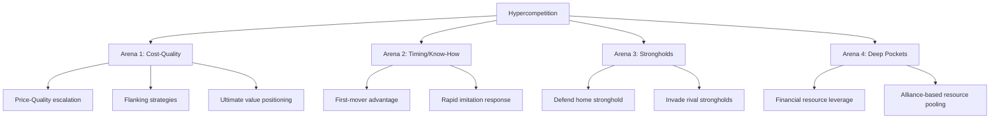

## Hypercompetition and Temporary Advantage

### Definition and Conceptual Foundation

Hypercompetition describes a condition of intense, rapidly escalating rivalry in which the frequency, boldness, and aggressiveness of competitive moves accelerates to the point that sustainable competitive advantage becomes difficult or impossible to maintain. The concept was developed primarily by Richard D'Aveni in his 1994 work *Hypercompetition: Managing the Dynamics of Strategic Maneuvering*.

Under hypercompetition, markets do not settle into stable equilibria. Instead, competitive positions are constantly created, eroded, and destroyed. Firms that once dominated an industry through cost leadership, differentiation, or entry barriers find these advantages neutralized faster than in traditional industry structures, forcing continuous strategic renewal rather than reliance on any single durable position.

**Key Points**

- Competitive advantage is inherently temporary, not permanent, under hypercompetitive conditions
- The pace of competitive escalation itself becomes a strategic variable
- Traditional sources of sustainable advantage (scale, patents, brand, distribution control) erode faster due to technological change, globalization, deregulation, and information diffusion
- Firms must shift from *defending* positions to *disrupting* their own and competitors' positions proactively

### Contrast with Traditional (Porterian) Strategy

Michael Porter's five forces and generic strategy frameworks assume industries can reach relatively stable structural equilibria where a firm can carve out a defensible position and sustain it over long periods. Hypercompetition theory challenges this assumption directly.

| Dimension | Traditional Strategy (Porter) | Hypercompetition (D'Aveni) |
| --- | --- | --- |
| Advantage duration | Long-term, sustainable | Short-term, temporary |
| Industry structure | Relatively stable | Constantly disrupted |
| Strategic goal | Build and defend position | Continuously create new advantages |
| Competitive posture | Avoid direct confrontation | Actively escalate and disrupt |
| Analysis focus | Structural forces (entry barriers, buyer/supplier power) | Dynamic moves and countermoves |
| Core risk | Erosion of position by imitators | Strategic inertia / complacency |

[Inference] Whether an industry is best analyzed through a Porterian structural lens or a hypercompetitive dynamic lens is itself contested in the strategy literature; many scholars treat these as complementary rather than mutually exclusive frameworks, applicable depending on industry clockspeed.

### The 4 Arenas of Competitive Escalation

D'Aveni's framework identifies four arenas in which hypercompetitive rivalry plays out, each representing an area where firms disrupt existing advantages.

#### 1. Cost-Quality Positioning

Firms compete by simultaneously escalating quality while driving down costs, collapsing the traditional cost-differentiation tradeoff. This progresses through stages:

- Price and quality competition
- Flanking (creating niches to avoid direct price wars)
- Reaching toward "ultimate value" (highest quality at lowest cost, often unsustainable long-term)

#### 2. Timing and Know-How

Competing through speed of innovation and proprietary knowledge. First-mover advantages are exploited aggressively, but competitors rapidly imitate, forcing firms into continuous innovation cycles rather than resting on a single breakthrough.

#### 3. Strongholds (Entry Barriers)

Firms attempt to create geographic or industry-based strongholds, but hypercompetition involves deliberate invasion of rivals' strongholds to disrupt their protected profit sanctuaries, often financed by a firm's own protected home markets.

#### 4. Deep Pockets

Large firms leverage superior financial resources to outlast smaller rivals in prolonged competitive battles, but this arena is increasingly contested through alliances, private equity backing, and access to capital markets that level resource asymmetries.

### The New 7-S Framework

D'Aveni proposed an alternative to McKinsey's traditional 7-S framework, tailored for disrupting rather than sustaining advantage.

| Element | Focus |
| --- | --- |
| Superior stakeholder satisfaction | Delivering disproportionate value versus merely satisfying customers |
| Strategic soothsaying | Anticipating and shaping future market trends rather than reacting to them |
| Positioning for speed | Building organizational capability to move faster than rivals |
| Positioning for surprise | Executing unexpected competitive moves that rivals cannot easily anticipate |
| Shifting the rules of competition | Changing the basis of competition to invalidate incumbents' advantages |
| Signaling strategic intent | Using announcements and moves to influence competitor behavior and deter retaliation |
| Simultaneous and sequential strategic thrusts | Launching multiple coordinated moves across arenas to overwhelm competitor response capacity |

### Sources of Hypercompetitive Pressure

**Key Points**

- **Technological discontinuities**: Digital transformation, AI, and platform shifts repeatedly reset competitive baselines
- **Globalization**: Removes geographic strongholds as protective barriers
- **Deregulation**: Opens previously protected industries (telecom, airlines, financial services) to new entrants
- **Deconstruction of value chains**: Modularity allows new entrants to compete in narrow slices of a value chain
- **Reduced product life cycles**: Compresses the window in which any single advantage can be monetized
- **Information transparency**: Digital tools accelerate competitor benchmarking and imitation

### Strategic Responses to Hypercompetition

#### 1. Disruption of Own Advantages (Self-Cannibalization)

Firms proactively obsolete their own products/services before competitors do. Example: technology firms releasing next-generation products that cannibalize current bestsellers to preempt competitor disruption.

#### 2. Series of Temporary Advantages

Rather than pursuing one durable moat, firms build a continuous pipeline of short-term advantages, each exploited quickly before being abandoned or eroded, echoed in later strategy literature (e.g., Rita McGrath's *The End of Competitive Advantage*, 2013) as the "transient advantage" framework.

#### 3. Strategic Soothsaying and Scenario Planning

Investment in foresight capabilities (scenario planning, trend analysis, weak-signal detection) to anticipate shifts before rivals.

#### 4. Organizational Agility

Flattened hierarchies, cross-functional teams, and rapid decision cycles to compress the time between market signal and strategic response.

#### 5. Strategic Alliances and Ecosystems

Partnering to access complementary capabilities quickly rather than building them internally, given that internal capability-building often takes too long relative to the competitive cycle.

**Example**

The smartphone industry illustrates hypercompetition clearly: Nokia's dominance (mid-2000s) was displaced by Apple/Google's platform-based ecosystem approach within a few years; Apple's own hardware advantages have since been continuously matched by Samsung, Xiaomi, and others within single product cycles, forcing continuous feature and ecosystem innovation rather than reliance on any static advantage.

### Related Theoretical Extensions

- **Transient Competitive Advantage (McGrath, 2013)**: Extends D'Aveni's logic, arguing firms should design organizations explicitly around launching, exploiting, and exiting waves of temporary advantage, replacing long-range planning with continuous strategic renewal.
- **Blue Ocean Strategy (Kim & Mauborgne)**: Offers a partial counterpoint, suggesting firms can escape hypercompetitive "red oceans" by creating uncontested market space, though [Inference] this is debated as a genuinely separate strategy versus another form of temporary advantage subject to eventual imitation.
- **Dynamic Capabilities (Teece)**: Provides the underlying organizational theory for *how* firms sense, seize, and reconfigure resources fast enough to compete under hypercompetitive conditions.

### Criticisms and Limitations

- **Industry applicability**: [Inference] Hypercompetition is more empirically evident in technology, media, and fast-moving consumer sectors than in capital-intensive, regulated, or infrastructure-heavy industries (utilities, heavy manufacturing), where structural barriers remain more durable.
- **Risk of strategic exhaustion**: Constant disruption can strain organizational resources, culture, and employee capacity, potentially undermining the operational excellence needed to execute strategy well.
- **Empirical measurement challenges**: Quantifying "hypercompetitiveness" of an industry is difficult, and some scholars argue the perception of accelerating competition may be partly a product of media/analyst narrative rather than uniformly measurable structural change. [Unverified]
- **Overlap with existing constructs**: Critics note conceptual overlap between hypercompetition and pre-existing ideas like Schumpeterian "creative destruction," raising questions about the framework's incremental theoretical contribution.

### Diagram: Advantage Decay Curve Under Hypercompetition

<svg xmlns="http://www.w3.org/2000/svg" viewBox="0 0 640 380" font-family="Arial, sans-serif">
<text x="320" y="24" text-anchor="middle" font-size="16" font-weight="bold" fill="#1a1a1a">Advantage Decay Curve Under Hypercompetition (svg_diagram)</text>
<line x1="60" y1="320" x2="600" y2="320" stroke="#333" stroke-width="2" />
<line x1="60" y1="320" x2="60" y2="50" stroke="#333" stroke-width="2" />
<text x="330" y="355" text-anchor="middle" font-size="13" fill="#333">Time</text>
<text x="25" y="185" text-anchor="middle" font-size="13" fill="#333" transform="rotate(-90 25 185)">Profitability / Advantage</text>

<path d="M 80 300 C 130 200, 160 90, 210 90 C 250 90, 260 150, 280 200 C 300 250, 320 280, 350 280 C 390 280, 400 180, 440 120 C 470 80, 490 70, 520 70 C 550 70, 560 130, 580 180" fill="none" stroke="`#2563eb`" stroke-width="3" />

<circle cx="210" cy="90" r="4" fill="#dc2626" />
<text x="210" y="75" text-anchor="middle" font-size="11" fill="#dc2626">Advantage 1 peak</text>
<circle cx="350" cy="280" r="4" fill="#dc2626" />
<text x="350" y="300" text-anchor="middle" font-size="11" fill="#dc2626">Erosion trough</text>
<circle cx="520" cy="70" r="4" fill="#dc2626" />
<text x="520" y="55" text-anchor="middle" font-size="11" fill="#dc2626">Advantage 2 peak</text>
<line x1="60" y1="320" x2="600" y2="320" stroke="#999" stroke-dasharray="4,4" />

<text x="330" y="375" text-anchor="middle" font-size="11" fill="#666" font-style="italic">Each peak represents a temporary advantage; decay forces continuous reinvention</text>

</svg>

### Related Topics

- Dynamic Capabilities Framework (Teece, Pisano, Shuen)
- Transient/Temporary Competitive Advantage (Rita McGrath)
- Creative Destruction (Schumpeter)
- Blue Ocean Strategy vs. Red Ocean Competition
- Porter's Five Forces (as contrasting structural framework)
- Industry Clockspeed and Strategic Time Horizons
- Strategic Agility and Organizational Ambidexterity
- First-Mover vs. Fast-Follower Strategies
- Platform Competition and Ecosystem Strategy