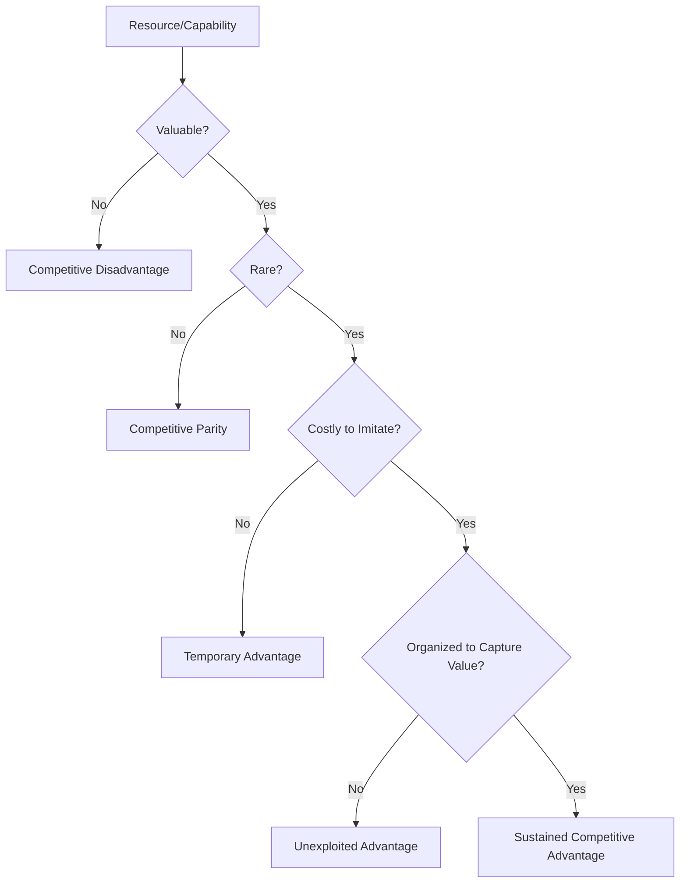

## The Resource-Based View of the Firm

### Definition and Conceptual Foundation

The Resource-Based View (RBV) is a strategic management framework asserting that sustained competitive advantage derives primarily from a firm's internal resources and capabilities rather than from external industry positioning. Where Porter's structural approach looks outward at industry forces, RBV looks inward at the heterogeneous bundle of assets, skills, and processes a firm controls.

The theoretical foundations trace to Edith Penrose's 1959 work *The Theory of the Growth of the Firm*, which conceptualized firms as collections of productive resources. The framework was formalized by Birger Wernerfelt (1984) in "A Resource-Based View of the Firm," and substantially developed and popularized by Jay Barney, particularly in his 1991 article "Firm Resources and Sustained Competitive Advantage."

**Key Points**

- Firms are viewed as bundles of heterogeneous resources and capabilities
- Resource heterogeneity across firms (not industry structure) explains performance differences
- Advantage is sustained when resources are difficult for competitors to acquire, imitate, or substitute
- Shifts strategic analysis from "what industry should we compete in" to "what do we uniquely possess"

### Core Assumptions of RBV

RBV rests on two foundational assumptions that distinguish it from industry-structure approaches:

1. **Resource heterogeneity**: Firms within the same industry may possess different bundles of resources and capabilities, even when producing similar products.
2. **Resource immobility**: Some resources are costly or impossible for competitors to acquire, meaning heterogeneity can persist over time rather than being competed away.

If both assumptions hold, resource differences can be a source of sustained competitive advantage rather than temporary variance.

### Classification of Resources

Barney and subsequent scholars typically classify firm resources into three broad categories:

| Category | Description | Examples |
| --- | --- | --- |
| Physical capital resources | Tangible assets used in production | Plant, equipment, geographic location, access to raw materials |
| Human capital resources | Knowledge, skills, and relationships of individuals | Employee training, experience, judgment, intelligence, relationships |
| Organizational capital resources | Structures and processes that coordinate resources | Formal reporting structures, planning systems, informal relations among groups, organizational culture |

A further common distinction separates:

- **Tangible resources**: Financial capital, physical assets — easier to identify and value, but also easier to imitate or purchase
- **Intangible resources**: Brand reputation, patents, organizational knowledge, culture — harder to identify and value, but often more durable sources of advantage
- **Capabilities**: The capacity to deploy resources purposefully, often embedded in organizational routines (distinguishing RBV from a purely asset-based view)

### The VRIO Framework

The VRIO framework (Barney) is the primary analytical tool for evaluating whether a specific resource or capability can generate sustained competitive advantage. It asks four sequential questions:

#### 1. Value

Does the resource enable the firm to exploit an opportunity or neutralize an external threat? A resource that does not create value is not a strategic asset regardless of its rarity or inimitability.

#### 2. Rarity

Is the resource currently controlled by only a small number of competing firms? A valuable but common resource can support competitive parity but not advantage, since many firms can employ it in similar ways.

#### 3. Imitability

Is the resource costly for firms without it to obtain or develop? Barney identifies four primary sources of costly imitation:

- **Unique historical conditions**: Resources developed through a firm's unique path-dependent history (e.g., first-mover reputation)
- **Causal ambiguity**: The link between the resource and the competitive advantage it generates is not clearly understood, even by the firm itself, making it difficult for rivals to replicate
- **Social complexity**: The resource is embedded in complex social phenomena (organizational culture, interpersonal relationships, trust) beyond the ability of firms to systematically manage or copy
- **Patents/legal protection**: Legally enforced barriers to imitation (though these are often time-limited and subject to invention-around strategies)

#### 4. Organization

Is the firm organized (via management systems, processes, structure, culture) to fully exploit the resource's potential? A firm may possess a valuable, rare, and inimitable resource yet fail to capture its potential value without complementary organizational capability.

**Outcomes of the VRIO Analysis**

| Value | Rare | Costly to Imitate | Organized | Competitive Implication | Performance Implication |
| --- | --- | --- | --- | --- | --- |
| No | — | — | — | Competitive disadvantage | Below normal returns |
| Yes | No | — | — | Competitive parity | Normal returns |
| Yes | Yes | No | — | Temporary competitive advantage | Above-normal returns (short-term) |
| Yes | Yes | Yes | No | Unexploited advantage | Below potential returns |
| Yes | Yes | Yes | Yes | Sustained competitive advantage | Above-normal returns (long-term) |

### Dynamic Capabilities as an Extension of RBV

A significant critique of classical RBV is its relatively static treatment of resources, which sits awkwardly in fast-changing environments. Teece, Pisano, and Shuen (1997) addressed this with the **Dynamic Capabilities** extension, defined as the firm's ability to integrate, build, and reconfigure internal and external competencies to address rapidly changing environments.

Dynamic capabilities are typically organized into three clusters:

- **Sensing**: Identifying and assessing opportunities and threats
- **Seizing**: Mobilizing resources to capture value from opportunities
- **Transforming/Reconfiguring**: Continuously renewing the resource base to maintain fit with the environment

[Inference] This extension is often viewed as a necessary complement to RBV in industries subject to hypercompetition, since a static resource advantage can decay quickly under conditions of rapid technological or market change.

### The Knowledge-Based View (KBV)

A related theoretical branch, the Knowledge-Based View (Grant, 1996; Kogut & Zander, 1992), treats knowledge as the most strategically significant resource, given its difficulty of imitation and transfer relative to other resource types. Tacit knowledge in particular (embedded in routines and experience rather than codified documentation) is considered a particularly durable source of advantage under causal ambiguity and social complexity.

### Practical Application: Conducting an RBV Analysis

**Example**

A mid-sized specialty coffee roaster evaluating its competitive position might apply VRIO as follows:

| Resource | Value | Rare | Inimitable | Organized | VRIO Outcome |
| --- | --- | --- | --- | --- | --- |
| Direct-trade farmer relationships built over 15 years | Yes | Yes | Yes (unique historical conditions, social complexity) | Yes | Sustained advantage |
| Roasting equipment | Yes | No (widely available) | No | Yes | Competitive parity |
| Proprietary roasting profile/recipe | Yes | Yes | Partially (causal ambiguity in flavor development) | Yes | Temporary-to-sustained advantage |
| E-commerce website | Yes | No | No | Yes | Competitive parity |

This illustrates how RBV directs strategic attention toward protecting and deepening the farmer-relationship resource (through continued relationship investment) rather than over-investing in commodity-like resources such as standard roasting equipment.

### Criticisms and Limitations of RBV

- **Definitional looseness**: Critics (notably Priem & Butler, 2001) argue RBV's core proposition can be tautological — valuable resources are defined as those that create advantage, and advantage is explained by valuable resources, risking circular logic.
- **Static bias**: Classical RBV struggles to explain advantage in rapidly changing environments without incorporating dynamic capabilities.
- **Limited actionability**: Managers may find VRIO analytically useful in retrospect but less prescriptive about *how* to build rare, inimitable resources going forward.
- **Underemphasis on external context**: By focusing internally, RBV can understate demand-side factors and competitive dynamics addressed more directly by industry-structure frameworks.
- **Measurement difficulty**: Intangible resources such as culture or causal ambiguity are inherently difficult to measure or benchmark objectively. [Unverified] Empirical testing of RBV propositions is often constrained by the difficulty of quantifying resource rarity and inimitability directly.

### RBV in Relation to Other Frameworks

| Framework | Primary Lens | Relationship to RBV |
| --- | --- | --- |
| Porter's Five Forces | External/industry structure | Complementary; RBV addresses "why do firms within the same industry perform differently" |
| SWOT Analysis | Internal + external | RBV provides theoretical rigor to the "Strengths" component of SWOT |
| Dynamic Capabilities | Internal, capability renewal | Direct extension addressing RBV's static limitations |
| Core Competence (Prahalad & Hamel) | Internal, cross-business capabilities | Closely related; core competencies are essentially VRIO-qualifying capabilities applied across business units |

### Related Topics

- VRIO Framework (deep-dive application exercises)
- Dynamic Capabilities Framework (Teece, Pisano, Shuen)
- Core Competencies and Prahalad & Hamel's Framework
- Knowledge-Based View of the Firm
- SWOT Analysis and Internal Capability Audits
- Value Chain Analysis (Porter) as a complementary internal tool
- Causal Ambiguity and Tacit Knowledge Transfer
- Resource Heterogeneity and Path Dependence