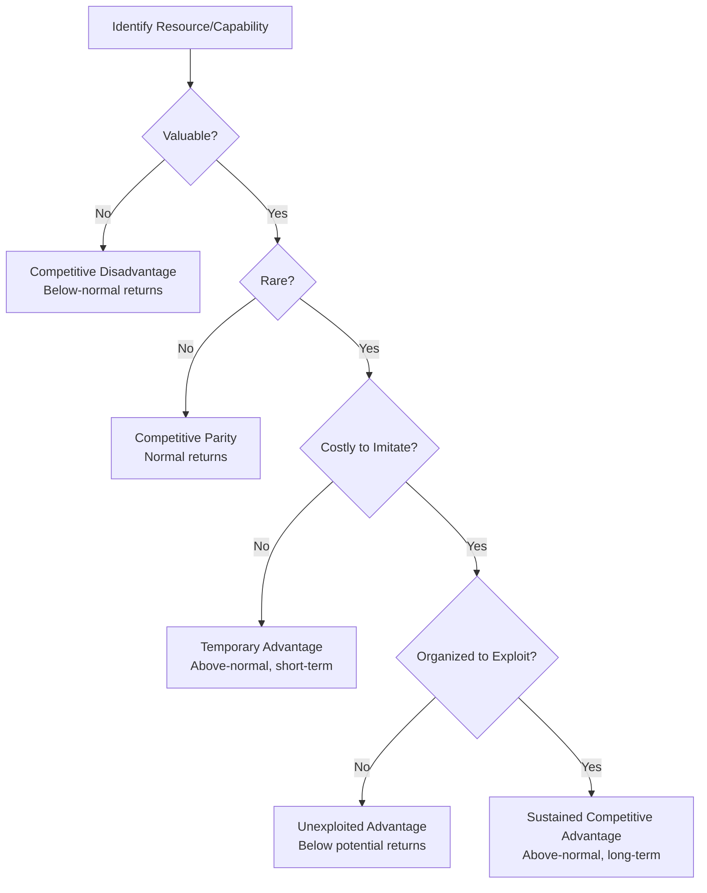

## VRIO Framework for Resource Analysis

### Definition and Conceptual Foundation

The VRIO framework is a diagnostic tool used within the Resource-Based View (RBV) of the firm to assess whether a specific internal resource or capability can serve as a source of competitive advantage. Developed by Jay Barney (formalized fully in his 1995 Academy of Management Executive article "Looking Inside for Competitive Advantage," building on his 1991 RBV work), VRIO operationalizes the abstract idea of "valuable resources" into a structured, sequential set of questions that management can apply to any specific resource or capability under evaluation.

VRIO is an acronym representing four sequential criteria:

- **V** – Value
- **R** – Rarity
- **I** – Imitability (costly to imitate)
- **O** – Organization

**Key Points**

- VRIO is applied resource-by-resource or capability-by-capability, not to the firm as a whole
- The four questions must be answered sequentially — failing an earlier question makes later questions strategically less relevant
- The framework produces a direct link between resource characteristics and expected competitive/financial outcomes
- It is the primary practical application of RBV theory in strategic auditing

### The Four VRIO Questions in Detail

#### 1. Value

**Central question**: Does the resource or capability allow the firm to exploit an environmental opportunity or neutralize an environmental threat?

Value is assessed relative to cost — a resource is valuable only if it increases revenues, decreases costs, or otherwise improves the firm's position relative to what would occur without it. Value must be evaluated in the context of an evolving external environment; a resource that was once valuable can become obsolete if market conditions or customer preferences shift.

*Analytical test*: Does using this resource increase perceived customer value or reduce net costs relative to competitors?

#### 2. Rarity

**Central question**: Is the resource currently controlled by only a small number of competing firms?

A resource can be valuable yet common (e.g., electricity access, basic IT infrastructure), in which case it supports **competitive parity** rather than advantage — necessary to compete, but not differentiating.

*Analytical test*: How many competitors currently possess a comparable resource or capability at similar quality/scale?

#### 3. Imitability (Costly to Imitate)

**Central question**: Do firms without the resource face a significant cost disadvantage in obtaining or developing it, compared to firms that already possess it?

This is typically the most analytically rich step. Barney identifies four primary mechanisms that make a resource costly to imitate:

| Mechanism | Description | Example |
| --- | --- | --- |
| Unique historical conditions | Resource arose from a specific, non-repeatable path of firm history | Early-mover brand equity established decades ago |
| Causal ambiguity | The precise causal link between the resource and the resulting advantage is unclear, even internally | A firm's distinctive culture whose exact contribution to performance can't be isolated |
| Social complexity | Resource is embedded in complex interpersonal or organizational phenomena | Trust-based supplier relationships, organizational culture |
| Patents (legal protection) | Legal barriers prevent direct replication | Pharmaceutical compound patents |

[Inference] Legal protections such as patents are often considered the *weakest* of the four imitation barriers in practice, since they are time-limited, subject to invalidation challenges, and can sometimes be legally "invented around" by competitors — whereas social complexity and causal ambiguity can persist indefinitely.

#### 4. Organization

**Central question**: Is the firm organized — through management systems, reporting structures, formal/informal control systems, and compensation policies — to fully exploit the resource's competitive potential?

This is the only criterion that is a property of the *firm as a whole* rather than the resource itself. A firm can possess a resource that satisfies V, R, and I, yet fail to capture its full value due to poor organizational alignment (e.g., misaligned incentive systems, siloed reporting structures, or insufficient managerial attention).

*Analytical test*: Do the firm's formal structure, control systems, and compensation policies support exploitation of this specific resource?

### The VRIO Decision Table

| Value | Rarity | Costly to Imitate | Organized to Capture Value | Competitive Implication | Economic Performance |
| --- | --- | --- | --- | --- | --- |
| No | — | — | No | Competitive disadvantage | Below normal |
| Yes | No | — | Yes (partial) | Competitive parity | Normal |
| Yes | Yes | No | Yes (partial) | Temporary competitive advantage | Above normal (short-term) |
| Yes | Yes | Yes | No | Unexploited competitive advantage | Below potential |
| Yes | Yes | Yes | Yes | Sustained competitive advantage | Above normal (long-term) |

### Step-by-Step Application Process

#### 1. Inventory Resources and Capabilities

Compile a comprehensive list of the firm's tangible resources (physical, financial), intangible resources (brand, reputation, IP), and capabilities (routines, processes, organizational competencies).

#### 2. Filter for Strategic Relevance

Not all resources warrant full VRIO analysis. Prioritize resources plausibly tied to current or potential competitive positioning (e.g., skip commodity office supplies; focus on proprietary processes, key relationships, unique talent).

#### 3. Apply the Four Questions Sequentially

For each shortlisted resource, work through Value → Rarity → Imitability → Organization, documenting evidence and reasoning at each stage rather than jumping to a conclusion.

#### 4. Classify the Competitive Implication

Map the resource to one of the five rows in the decision table above.

#### 5. Translate into Strategic Action

- **Competitive disadvantage** resources: divest, outsource, or remediate
- **Parity** resources: maintain at minimum viable level; do not over-invest
- **Temporary advantage** resources: exploit quickly, monitor for competitor imitation, plan succession advantage
- **Unexploited advantage** resources: invest in organizational alignment (restructuring, incentive redesign) to capture latent value
- **Sustained advantage** resources: protect, reinforce, and build strategy around these as the firm's core differentiators

### Practical Example

**Example**

A regional airline conducting a VRIO audit of several resources:

| Resource | Value? | Rare? | Costly to Imitate? | Organized? | Classification |
| --- | --- | --- | --- | --- | --- |
| Fleet of aircraft | Yes | No | No | Yes | Competitive parity |
| Slot allocations at a congested hub airport | Yes | Yes | Yes (regulatory scarcity, historical allocation) | Yes | Sustained competitive advantage |
| Customer loyalty program | Yes | Yes (mid-tier) | No (easily replicated program mechanics) | Yes | Temporary competitive advantage |
| Highly experienced maintenance workforce with low turnover | Yes | Yes | Yes (social complexity, tacit knowledge) | No (currently under-leveraged due to siloed operations) | Unexploited competitive advantage |

This example demonstrates the practical output of VRIO: it directs management attention toward protecting slot allocations, restructuring operations to better leverage the maintenance workforce's tacit expertise, and recognizing that the loyalty program alone will not sustain differentiation once imitated.

### Common Pitfalls in VRIO Application

- **Analyzing at too aggregate a level**: Applying VRIO to broad categories ("our people" or "our technology") rather than specific, well-defined resources produces vague, non-actionable conclusions.
- **Confusing resources with capabilities**: A resource (e.g., a patent) and a capability (e.g., the organizational routine for commercializing patents) require distinct analysis, since possessing a resource does not guarantee capability to exploit it — this distinction is precisely what the "O" criterion is designed to surface.
- **Static, one-time analysis**: [Inference] Since value and rarity can shift with environmental and competitive change, VRIO conclusions drawn at a single point in time can become outdated; periodic reassessment is generally advisable, particularly in fast-moving industries.
- **Circular reasoning risk**: As with RBV generally, there is a risk of defining "valuable" resources retroactively based on observed firm success, rather than through independent ex-ante criteria — a criticism raised by Priem & Butler (2001) regarding the broader RBV/VRIO logic.

### VRIO vs. Related Internal Analysis Tools

| Tool | Primary Focus | Relationship to VRIO |
| --- | --- | --- |
| SWOT Analysis | Broad internal/external scan | VRIO provides analytical rigor for classifying "Strengths" identified in SWOT |
| Value Chain Analysis (Porter) | Activity-level cost/differentiation sources | Value chain identifies candidate resources/activities; VRIO evaluates their strategic quality |
| Core Competence Framework (Prahalad & Hamel) | Cross-business unit capabilities | Core competencies are typically capabilities that pass all four VRIO criteria at a corporate level |
| Dynamic Capabilities | Capability renewal over time | Addresses VRIO's static limitation by adding a temporal, reconfiguration dimension |

### Related Topics

- Resource-Based View (RBV) of the Firm
- Dynamic Capabilities Framework
- SWOT Analysis and Internal Audits
- Value Chain Analysis (Porter)
- Core Competencies (Prahalad & Hamel)
- Causal Ambiguity and Tacit Knowledge
- Sustained vs. Temporary Competitive Advantage