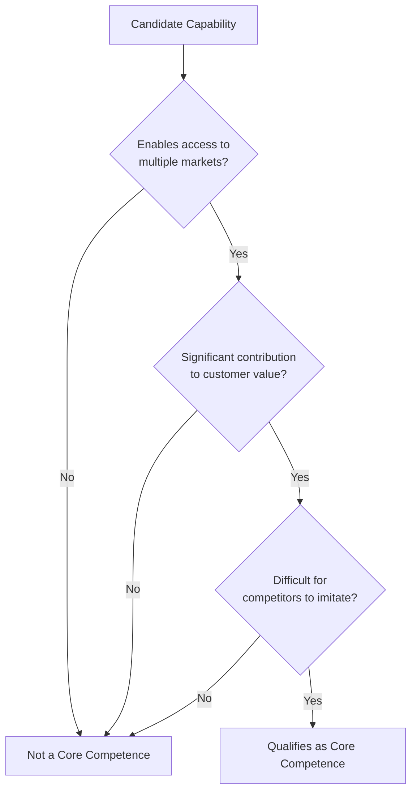

## Core Competencies and Distinctive Capabilities

### Definition and Conceptual Foundation

Core competencies refer to the bundles of skills, knowledge, and technologies that a firm integrates across business units to produce a disproportionate contribution to customer value, and which are difficult for competitors to replicate. The concept was introduced by C.K. Prahalad and Gary Hamel in their influential 1990 Harvard Business Review article "The Core Competence of the Corporation."

Distinctive capabilities is a closely related but distinct concept, popularized in the UK strategy literature (notably by Kay, 1993), referring to organizational capabilities that a firm possesses uniquely relative to competitors and that underpin its competitive advantage. While the terms are often used interchangeably in practice, core competence emphasizes cross-business-unit integration and technological/skill roots, whereas distinctive capability more broadly captures any firm-specific organizational strength (relationships, reputation, innovation processes).

**Key Points**

- Core competencies operate at the corporate level, cutting across multiple business units and products
- They represent collective organizational learning, not isolated individual skills or single technologies
- Distinguished from products: a core competence is the "root" that enables multiple product "fruits"
- Both concepts are extensions of the Resource-Based View, applied specifically to capabilities rather than static resources

### The Three Tests of a Core Competence

Prahalad and Hamel proposed three tests to determine whether a capability qualifies as a genuine core competence:

#### 1. Provides Potential Access to a Wide Variety of Markets

A true core competence should enable the firm to enter multiple, sometimes seemingly unrelated, markets by leveraging the same underlying capability.

#### 2. Makes a Significant Contribution to Perceived Customer Benefits

The competence must materially affect the value customers perceive in the end product, not merely be an internally efficient process with no visible customer impact.

#### 3. Difficult for Competitors to Imitate

The competence should be a complex harmonization of individual technologies and production skills, making it hard to replicate through simple resource acquisition — echoing the "costly to imitate" criterion from VRIO/RBV analysis.

### The Tree Metaphor

Prahalad and Hamel's original article used an organic metaphor to explain the relationship between competencies and products:

- **Root system** = Core competencies (the underlying capabilities, often invisible to customers)
- **Trunk and major limbs** = Core products (intermediate outputs embodying the competencies, often components or subsystems sold to other manufacturers)
- **Smaller branches** = Business units
- **Leaves, flowers, fruit** = End products that customers actually purchase

This metaphor illustrates a key strategic insight: competitors can copy end products relatively easily, but the underlying root-level competence that generates a continuous stream of new products is far harder to replicate.

**Example**

Honda's core competence in small internal combustion engines and powertrains underlies an unusually diverse product portfolio — automobiles, motorcycles, lawn mowers, generators, marine engines, and outdoor power equipment. A competitor could reverse-engineer a single Honda product, but replicating the integrated engineering knowledge and organizational learning behind Honda's engine competence across this range is far more difficult.

### Core Competencies vs. Core Products vs. End Products

| Level | Description | Visibility to Customer | Example (3M) |
| --- | --- | --- | --- |
| Core competence | Underlying integrated skill/technology | Invisible | Adhesives and substrates technology |
| Core product | Intermediate component embodying the competence | Low/indirect | Coated abrasives, adhesive tape base materials |
| End product | Final good sold to consumers | High/direct | Post-it Notes, Scotch Tape, masking tape |

[Inference] The core-competence framework implies that firms which compete primarily at the end-product level, without cultivating the underlying root competencies, are more vulnerable to being outpaced by rivals who possess deeper competence-level capabilities, even if their current end products appear comparable.

### Distinctive Capabilities: The Kay Framework

John Kay's distinctive capabilities framework (from *Foundations of Corporate Success*, 1993) identifies three primary categories through which firms can develop capabilities that are genuinely distinctive relative to competitors:

#### 1. Architecture

The network of relationships and contracts a firm has — internally (with employees), externally (with suppliers and customers), and among firms in a network. Strong architecture facilitates organizational knowledge, flexible response, and cooperative behavior that is difficult to replicate because it develops over time through repeated interaction.

#### 2. Reputation

The most direct mechanism by which firms communicate information to customers, often more efficient than costly direct verification of product quality. Reputation is built slowly and can be destroyed quickly, making it a valuable but fragile distinctive capability.

#### 3. Innovation

The capacity to successfully develop and commercialize new products or processes. Kay notes that innovation alone is often not sustainable as a distinctive capability unless it is supported by complementary architecture or reputation, since successful innovations are frequently imitated once revealed.

Kay also identifies **strategic assets** (e.g., natural monopolies, sunk cost barriers, regulatory licenses) as a further, though less common, basis for distinctive capability, differing from the three organizational-capability categories above in that they arise more from market position than internal organizational learning.

### Identifying Core Competencies: Practical Approach

**Key Points**

- Conduct a competence audit across business units to identify skills/technologies used repeatedly across seemingly distinct product lines
- Ask: "If this capability disappeared, which products/markets would be affected?" — a true core competence will show wide-reaching impact
- Distinguish competence from mere organizational scale or market share, which are outcomes rather than root causes
- Map current competencies against the three tests systematically rather than assuming existing strengths automatically qualify

### Strategic Implications and Applications

#### Resource Allocation

Corporate strategy should prioritize investment in and protection of identified core competencies over investment in individual business units viewed in isolation, since competence-level investment generates returns across multiple product lines simultaneously.

#### Organizational Structure

Prahalad and Hamel argued that the "strategic business unit" (SBU) structure common in diversified conglomerates can inadvertently fragment core competencies by treating each business unit as an independent profit center, discouraging the cross-unit resource sharing needed to build and exploit competencies fully.

#### Competitive Strategy: "Competing for the Future"

Firms should aim to build competence positions that create future market opportunities rather than only optimizing current product-market positioning — a forward-looking orientation elaborated further in Hamel and Prahalad's follow-up book *Competing for the Future* (1994).

#### Outsourcing Decisions

The framework provides guidance for outsourcing: activities and components outside the firm's core competencies are reasonable candidates for outsourcing, while core-competence-related activities should generally be retained and protected internally to avoid eroding the firm's long-term differentiation.

### Criticisms and Limitations

- **Identification difficulty**: In practice, distinguishing a genuine core competence from a merely successful current capability is analytically challenging, and firms may retrospectively label whatever led to past success as a "core competence," risking circular reasoning similar to broader RBV critiques.
- **Static risk over time**: [Inference] A competence that was core and valuable at one point can become a competency trap or core rigidity (Dorothy Leonard-Barton's term) if the firm over-relies on it as markets and technologies shift, since deeply embedded competencies can also constrain adaptability.
- **Difficulty in diversified conglomerates**: Applying the framework across highly unrelated business portfolios can be less useful, since genuinely shared, integrable competencies may not exist across dissimilar industries.
- **Overlap with other RBV constructs**: The boundary between "core competence," "dynamic capability," and "distinctive capability" is not always sharply drawn in the literature, and different scholars use overlapping terminology with subtly different emphases. [Unverified] There is no fully unified consensus terminology across the strategic management literature on these related constructs.

### Related Frameworks Comparison

| Framework | Level of Analysis | Primary Emphasis |
| --- | --- | --- |
| Core Competence (Prahalad & Hamel) | Corporate, cross-business-unit | Integrated skills/technology enabling multiple markets |
| Distinctive Capabilities (Kay) | Firm-level | Architecture, reputation, innovation as advantage sources |
| VRIO (Barney) | Individual resource/capability | Sequential evaluation criteria for any given resource |
| Dynamic Capabilities (Teece et al.) | Firm-level, over time | Sensing, seizing, and reconfiguring capabilities for change |
| Core Rigidities (Leonard-Barton) | Firm-level | The dark side of core competencies becoming a constraint |

### Related Topics

- Resource-Based View (RBV) of the Firm
- VRIO Framework for Resource Analysis
- Dynamic Capabilities Framework
- Core Rigidities and Competency Traps (Leonard-Barton)
- Diversification Strategy and Related vs. Unrelated Diversification
- Outsourcing and Make-vs-Buy Strategic Decisions
- Competing for the Future (Hamel & Prahalad)
- Organizational Architecture and Reputation Effects (Kay)