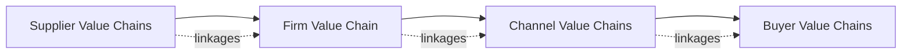

## Value Chain Analysis

### Definition and Conceptual Foundation

Value Chain Analysis is a strategic management framework used to examine the internal activities of a firm to understand how each activity contributes to competitive advantage and overall value creation. The concept was introduced by Michael Porter in his 1985 book *Competitive Advantage*, positioning the firm as a series of sequential and supporting activities that transform inputs into outputs valued by customers.

The core premise is that competitive advantage cannot be understood by looking at a firm as a whole; it stems from the many discrete activities a firm performs in designing, producing, marketing, delivering, and supporting its product. Each activity can contribute to a firm's relative cost position and create a basis for differentiation.

**Key Points**

- The value chain disaggregates a firm into strategically relevant activities
- Value is measured by the amount buyers are willing to pay for a product or service, not by cost alone
- Margin represents the difference between total value generated and the collective cost of performing value activities
- Activities are interconnected through linkages, and optimizing these linkages is itself a source of advantage

### The Two Categories of Activities

Porter's model divides firm activities into two broad categories: primary activities and support activities.

#### Primary Activities

Primary activities are directly involved in creating, selling, delivering, and servicing a product.

1. **Inbound Logistics** — Receiving, storing, and distributing inputs internally (e.g., material handling, warehousing, inventory control, transportation scheduling)
2. **Operations** — Transforming inputs into finished products (e.g., machining, assembly, packaging, equipment maintenance, testing)
3. **Outbound Logistics** — Collecting, storing, and physically distributing the product to buyers (e.g., finished goods warehousing, order processing, delivery scheduling)
4. **Marketing and Sales** — Activities associated with providing a means by which buyers can purchase the product and inducing them to do so (e.g., advertising, promotion, sales force, channel selection, pricing)
5. **Service** — Activities associated with maintaining or enhancing product value after sale (e.g., installation, repair, training, spare parts supply)

#### Support Activities

Support activities underpin the primary activities by providing purchased inputs, technology, human resources, and firm-wide functions.

1. **Firm Infrastructure** — General management, planning, finance, accounting, legal, quality management, government affairs
2. **Human Resource Management** — Recruiting, hiring, training, development, and compensation of personnel across all activities
3. **Technology Development** — Know-how, procedures, and technological inputs embedded in every value activity, including R&D, process automation, and product design
4. **Procurement** — The function of purchasing inputs used anywhere in the value chain, not just raw materials, but also machinery, lab equipment, and office supplies

**Key Points**

- Support activities are typically associated with specific primary activities but also support the entire chain
- Firm infrastructure is unique in that it usually supports the entire chain rather than individual activities
- Technology development and procurement can be linked to specific primary activities or serve the whole firm

### Structural Diagram of the Value Chain

<svg xmlns="http://www.w3.org/2000/svg" viewBox="0 0 900 460" font-family="Arial, sans-serif">
<text x="450" y="30" text-anchor="middle" font-size="18" font-weight="bold" fill="#1a1a1a">Porter's Generic Value Chain (svg_diagram)</text>

<rect x="60" y="60" width="740" height="220" fill="#e8eef7" stroke="#4a6fa5" stroke-width="1.5" />
<rect x="60" y="60" width="740" height="40" fill="#4a6fa5" />
<text x="430" y="86" text-anchor="middle" font-size="14" fill="#ffffff" font-weight="bold">Firm Infrastructure</text>
<rect x="60" y="100" width="740" height="45" fill="#c9d7ec" stroke="#4a6fa5" stroke-width="1" />
<text x="430" y="127" text-anchor="middle" font-size="13" fill="#1a1a1a" font-weight="bold">Human Resource Management</text>
<rect x="60" y="145" width="740" height="45" fill="#c9d7ec" stroke="#4a6fa5" stroke-width="1" />
<text x="430" y="172" text-anchor="middle" font-size="13" fill="#1a1a1a" font-weight="bold">Technology Development</text>
<rect x="60" y="190" width="740" height="45" fill="#c9d7ec" stroke="#4a6fa5" stroke-width="1" />
<text x="430" y="217" text-anchor="middle" font-size="13" fill="#1a1a1a" font-weight="bold">Procurement</text>

<text x="30" y="175" text-anchor="middle" font-size="12" fill="`#4a6fa5`" font-weight="bold" transform="rotate(-90 30 175)">SUPPORT</text>

<rect x="60" y="280" width="148" height="100" fill="#f4b183" stroke="#c55a11" stroke-width="1.5" />
<text x="134" y="325" text-anchor="middle" font-size="12" font-weight="bold" fill="#1a1a1a">Inbound</text>
<text x="134" y="341" text-anchor="middle" font-size="12" font-weight="bold" fill="#1a1a1a">Logistics</text>
<rect x="208" y="280" width="148" height="100" fill="#f4b183" stroke="#c55a11" stroke-width="1.5" />
<text x="282" y="333" text-anchor="middle" font-size="12" font-weight="bold" fill="#1a1a1a">Operations</text>
<rect x="356" y="280" width="148" height="100" fill="#f4b183" stroke="#c55a11" stroke-width="1.5" />
<text x="430" y="325" text-anchor="middle" font-size="12" font-weight="bold" fill="#1a1a1a">Outbound</text>
<text x="430" y="341" text-anchor="middle" font-size="12" font-weight="bold" fill="#1a1a1a">Logistics</text>
<rect x="504" y="280" width="148" height="100" fill="#f4b183" stroke="#c55a11" stroke-width="1.5" />
<text x="578" y="325" text-anchor="middle" font-size="12" font-weight="bold" fill="#1a1a1a">Marketing</text>
<text x="578" y="341" text-anchor="middle" font-size="12" font-weight="bold" fill="#1a1a1a">and Sales</text>
<rect x="652" y="280" width="148" height="100" fill="#f4b183" stroke="#c55a11" stroke-width="1.5" />
<text x="726" y="333" text-anchor="middle" font-size="12" font-weight="bold" fill="#1a1a1a">Service</text>

<text x="30" y="335" text-anchor="middle" font-size="12" fill="`#c55a11`" font-weight="bold" transform="rotate(-90 30 335)">PRIMARY</text>

<polygon points="800,60 860,280 860,380 800,380" fill="#a9d18e" stroke="#548235" stroke-width="1.5" />
<text x="825" y="230" text-anchor="middle" font-size="13" font-weight="bold" fill="#1a1a1a" transform="rotate(90 825 230)">Margin</text>

<text x="450" y="420" text-anchor="middle" font-size="12" fill="`#555555`">Value = Total revenue buyers are willing to pay; Margin = Value − Cost of performing value activities</text>

</svg>

### The Concept of Value and Margin

- **Value** is defined from the buyer's perspective, as the amount buyers are willing to pay for what a firm provides
- **Cost** is the total expenditure incurred in performing all value activities
- **Margin** is the difference between total value and the collective cost of performing the value activities; this margin is the source of profitability

A firm is profitable if the value it creates exceeds the cost of performing the value activities. Strategic advantage is achieved either by:

1. Performing activities at a lower cost than competitors (cost leadership), or
2. Performing activities in a way that creates differentiation buyers are willing to pay a premium for

### Linkages Within the Value Chain

Linkages are relationships between the way one value activity is performed and the cost or performance of another. They are a critical but often overlooked source of competitive advantage.

- **Optimization linkages**: Coordinating activities to reduce total cost (e.g., more expensive quality inspection reducing after-sales service costs)
- **Coordination linkages**: Aligning timing and information flow across activities (e.g., just-in-time inventory requiring tight coordination between procurement, inbound logistics, and operations)
- Linkages often require trade-offs across organizational boundaries and are difficult for competitors to imitate because they require cross-functional information systems and cultural coordination, not just discrete activity improvements

[Inference] Because linkages typically span organizational silos and require sustained cross-functional coordination, they are frequently cited in strategy literature as more difficult to replicate than any single discrete activity, though the degree of imitability varies by industry and organizational maturity.

### The Value System (Extended Value Chain)

A firm's value chain is embedded in a larger stream of activities called the **value system**, which includes:

- **Supplier value chains** — create and deliver inputs used in the firm's chain
- **Channel value chains** — activities of distributors and retailers
- **Buyer value chains** — the product's role in the buyer's own value chain

Competitive advantage increasingly depends on managing linkages not just within the firm, but across this entire system, including supplier relationships and channel/buyer relationships.

### Methodology: Conducting a Value Chain Analysis

1. **Identify Value Activities** — Disaggregate the firm into discrete primary and support activities relevant to the industry
2. **Assign Costs and Assets** — Allocate operating costs and assets to each activity to understand cost drivers
3. **Identify Cost Drivers** — Determine the structural factors influencing cost in each activity (e.g., scale, learning, capacity utilization, linkages, timing, policy choices, location, institutional factors)
4. **Identify Differentiation Sources** — Determine which activities create uniqueness valued by buyers (e.g., product features, delivery reliability, brand-building marketing)
5. **Examine Linkages** — Analyze how activities interact, both within the firm and across the value system
6. **Benchmark Against Competitors** — Compare cost and value performance activity-by-activity against rivals
7. **Identify Strategic Options** — Determine where to reconfigure, outsource, integrate, or invest based on relative strengths and weaknesses in each activity

**Example**

A mid-sized furniture retailer conducts value chain analysis and finds:

- **Inbound Logistics**: High costs due to fragmented supplier base; consolidating to fewer suppliers could unlock volume discounts
- **Operations**: Assembly performed in-store adds cost but enables customization, a differentiation source
- **Outbound Logistics**: Direct-to-consumer delivery network is a cost disadvantage relative to competitors using third-party logistics
- **Marketing and Sales**: Strong local brand recognition, a key differentiation asset
- **Service**: Underdeveloped after-sales repair service, an area of relative weakness

Based on this, the firm might pursue a strategy of investing further in customization and local brand equity while outsourcing outbound logistics to reduce cost disadvantage.

### Value Chain Analysis and Generic Strategies

Value Chain Analysis directly supports Porter's generic competitive strategies:

- **Cost Leadership**: Achieved by controlling cost drivers across activities better than rivals, or by reconfiguring the value chain (e.g., eliminating unnecessary activities, using different technology, or relocating activities)
- **Differentiation**: Achieved by performing activities in unique ways that create buyer value, often through linkages between activities such as R&D and marketing, or through superior coordination that improves product reliability
- **Focus**: Achieved by tailoring the value chain narrowly to serve the needs of a specific segment better than broadly-targeted competitors

### Relationship to Other Internal Analysis Frameworks

- **VRIO/Resource-Based View**: Value chain activities are often the location where valuable, rare, inimitable, and organized (VRIO) resources and capabilities are deployed; value chain analysis helps identify *where* in the firm such resources operate
- **Core Competencies**: A core competence typically manifests as a set of skills spanning multiple linked value chain activities rather than a single activity
- **SWOT Analysis**: Value chain analysis provides a structured method for identifying internal strengths and weaknesses with more granularity than a generic SWOT exercise
- **Activity System Maps**: An extension of value chain thinking, mapping how a firm's activities reinforce one another (associated with Porter's later work on strategic fit)

### Applications Beyond Manufacturing

While originally developed with manufacturing firms in mind, the framework has been adapted for:

- **Service industries**: Activities reconfigured around service delivery, customer interaction points, and back-office support
- **Digital/platform businesses**: Value chains often reconceptualized as value networks or value shops, given non-linear activity flows (e.g., problem-identification and solution-design activities in professional services, or network-building activities in platform businesses)
- **Nonprofit and public sector organizations**: Value redefined in terms of mission outcomes rather than purely economic margin

[Inference] Adaptations for service and digital contexts are widely discussed in strategy literature as necessary because the original linear, sequential structure of the value chain does not map cleanly onto activities such as network effects or knowledge-intensive problem solving; the specific reconfigured models (e.g., value shop, value network) vary across scholarly treatments.

### Limitations and Critiques

- **Static Snapshot**: The framework provides a point-in-time view and does not inherently capture how activities should evolve dynamically
- **Linear Assumption**: The sequential primary-activity structure may not fit non-linear business models such as platforms or knowledge-intensive services
- **Internal Focus**: Primarily internally oriented; must be paired with external frameworks (e.g., PESTEL, Five Forces) for a complete strategic picture
- **Cost Allocation Difficulty**: Assigning precise costs and assets to discrete activities can be methodologically challenging, particularly for shared or joint costs
- **Boundary Ambiguity**: Determining where one activity ends and another begins is often subjective and industry-specific

### Strategic Implications and Use Cases

- **Outsourcing/Make-vs-Buy Decisions**: Identifying which activities are sources of competitive advantage (retain in-house) versus commodity activities (candidates for outsourcing)
- **Mergers and Acquisitions**: Evaluating value chain complementarity between acquirer and target
- **Vertical Integration Decisions**: Assessing whether integrating upstream or downstream activities would create additional margin or strategic control
- **Digital Transformation Planning**: Identifying which activities can be automated, digitized, or redesigned using new technology
- **Sustainability and ESG Analysis**: Mapping environmental and social impacts activity-by-activity across the value chain and value system

**Next Steps**

- Five Forces Analysis (industry-level complement to internal value chain analysis)
- VRIO Framework and Resource-Based View
- Core Competence Analysis
- Activity System Mapping and Strategic Fit
- Generic Competitive Strategies (Cost Leadership, Differentiation, Focus)
- Vertical Integration and Outsourcing Strategy
- Value Networks and Value Shops (service/digital adaptations)
- SWOT Analysis Integration