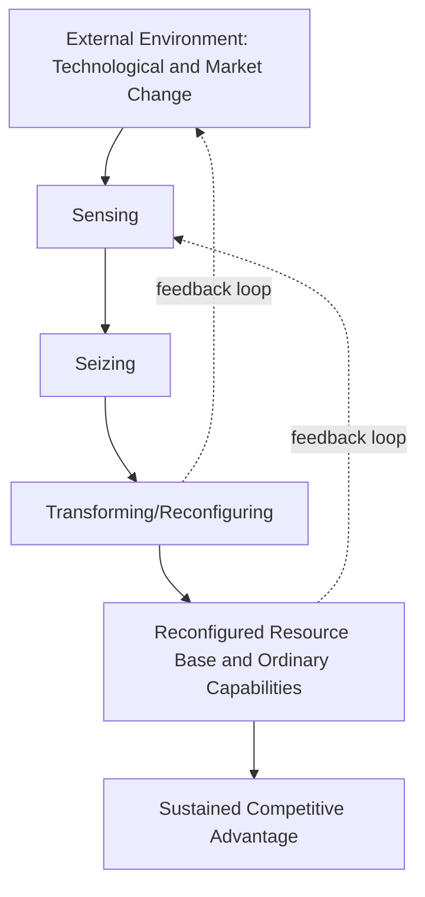

## Dynamic Capabilities Theory

### Definition and Conceptual Foundation

Dynamic Capabilities Theory is a strategic management framework explaining how firms achieve and sustain competitive advantage in rapidly changing environments by continuously renewing, reconfiguring, and redeploying their resources and competencies. The theory was formally introduced by David Teece, Gary Pisano, and Amy Shuen in their seminal 1997 article "Dynamic Capabilities and Strategic Management," extending the Resource-Based View (RBV) to address environments characterized by rapid technological and market change.

Teece et al. define dynamic capabilities as **"the firm's ability to integrate, build, and reconfigure internal and external competences to address rapidly changing environments."** The theory addresses a core limitation of the static RBV: possessing valuable resources at a point in time does not guarantee sustained advantage if a firm cannot adapt those resources as conditions change.

**Key Points**

- Dynamic capabilities are higher-order capabilities that act upon and transform a firm's ordinary (operational) capabilities and resource base
- The theory is most relevant in "Schumpeterian" environments marked by rapid technological change, competitive disruption, and market uncertainty
- Sustained advantage depends not on the resources a firm holds, but on its capacity to sense opportunities, seize them, and continuously transform the organization

### Ordinary Capabilities vs. Dynamic Capabilities

A critical distinction in the literature, further developed by Teece (2007) and later refined in subsequent work, separates two capability tiers:

| Dimension | Ordinary Capabilities | Dynamic Capabilities |
| --- | --- | --- |
| Purpose | Technical efficiency in current business functions | Adapting, integrating, and reconfiguring resources |
| Orientation | "Doing things right" | "Doing the right things" |
| Time Horizon | Operational, near-term | Strategic, long-term |
| Nature | Zero-order/first-order; replicable | Higher-order; often idiosyncratic and firm-specific |
| Outcome | Maintains current competitive position | Creates, extends, or modifies the resource base |

[Inference] The "doing things right" versus "doing the right things" framing is a widely used pedagogical shorthand in strategy teaching materials to distinguish these tiers, though Teece's original texts describe the distinction in more technical terms of resource configuration versus resource allocation efficiency.

### The Three Core Clusters: Sensing, Seizing, Transforming

Teece's most cited framework decomposes dynamic capabilities into three interrelated capacities:

#### 1. Sensing

The capacity to identify and assess opportunities and threats in the external environment.

- Scanning, creation, learning, and interpretive activities
- Investment in R&D and monitoring of customer needs, technological trajectories, and supplier/complementor developments
- Requires analytical systems and individual capacities to learn and sense, filter, and calibrate opportunities

#### 2. Seizing

The capacity to mobilize resources to address an identified opportunity and capture value from it.

- Selecting the appropriate business model to commercialize an innovation
- Delineating decision-making protocols and enterprise boundaries
- Committing resources to specific opportunities while managing investment risk
- Building loyalty and commitment within the organization to support the chosen direction

#### 3. Transforming (Reconfiguring)

The capacity to continuously renew, combine, and reconfigure assets and organizational structures as the firm grows and as markets and technologies evolve.

- Achieving and maintaining "evolutionary fitness" through continuous alignment and realignment of tangible and intangible assets
- Decentralization and near-decomposability of organizational structure to enable adaptation
- Knowledge management, governance, and co-specialization of assets

### Microfoundations of Dynamic Capabilities

Teece (2007) elaborated the "microfoundations" underlying each cluster, specifying the organizational and managerial processes, procedures, and skills that constitute each capacity:

**Sensing microfoundations**

- Processes to direct internal R&D and select new technologies
- Processes to tap supplier and complementor innovation
- Processes to tap developments in exogenous science and technology
- Processes to identify target market segments and shifting customer needs

**Seizing microfoundations**

- Delineating the customer solution and business model
- Selecting decision-making protocols
- Selecting enterprise boundaries to manage complements and control platforms
- Building loyalty and commitment through leadership

**Transforming microfoundations**

- Decentralization and decomposability
- Cospecialization of complementary assets
- Governance mechanisms
- Knowledge management: knowledge transfer, integration, and protection (including intellectual property strategy)

### Relationship to the Resource-Based View (RBV)

Dynamic Capabilities Theory is often described as an extension of, and response to, the RBV rather than a wholesale replacement.

- **RBV limitation addressed**: The RBV explains why firms with VRIN/VRIO resources earn rents in a given period but is largely static and does not explain how firms adapt their resource base over time
- **Complementary relationship**: Dynamic capabilities operate *on* the resource base; ordinary resources and capabilities remain the object being sensed, seized, and transformed
- **VRIN applied recursively**: For dynamic capabilities themselves to be a source of sustained advantage, they too should ideally be valuable, rare, and difficult to imitate, although scholars (notably Eisenhardt and Martin, 2000) have debated whether dynamic capabilities can be a durable source of advantage or are instead "best practices" that become more homogeneous and imitable over time

### Key Theoretical Debates and Alternative Perspectives

**Teece, Pisano, and Shuen (1997) — Original Formulation**

Emphasizes dynamic capabilities as firm-specific, path-dependent, and difficult to imitate, rooted in the firm's unique history and asset positions.

**Eisenhardt and Martin (2000) — "Simple Rules" Perspective**

Argue that dynamic capabilities, particularly in moderately dynamic markets, can take the form of specific, identifiable, learnable processes (e.g., product development routines, alliance/acquisition routines) that exhibit commonalities across effective firms — described as "simple, highly experiential, unstable processes." In this view, competitive advantage stems from the specific configuration of resources dynamic capabilities create, not from the dynamic capabilities themselves being rare.

**Zollo and Winter (2002) — Learning-Based Perspective**

Define dynamic capabilities as learned and stable patterns of collective activity through which the organization systematically generates and modifies its operating routines, emphasizing the role of experience accumulation, knowledge articulation, and knowledge codification in capability evolution.

**Winter (2003) — Cost and Hierarchy Critique**

Cautions that developing dynamic capabilities is costly and not always the appropriate response, introducing the notion that ad hoc problem-solving can sometimes substitute for a formal dynamic capability, especially when environmental change is infrequent.

[Inference] The degree of tension between Teece's and Eisenhardt/Martin's formulations is characterized differently across secondary strategy literature; some texts frame them as complementary views operating at different levels of environmental dynamism (moderately dynamic vs. high-velocity markets), while others present them as a more substantive theoretical disagreement about whether dynamic capabilities can be sources of sustained heterogeneity.

### Dynamic Capabilities and Evolutionary Fitness

Teece distinguishes between two forms of fitness a firm's dynamic capabilities help achieve:

- **Technical fitness**: How effectively a capability performs its intended function, regardless of market results
- **Evolutionary fitness**: How well a capability enables the firm to earn a competitive return in the marketplace, judged by market/customer response

A firm can possess technically excellent capabilities that fail to achieve evolutionary fitness if they are misaligned with market demands, competitive dynamics, or the broader business ecosystem.

### Illustrative Structural Diagram

<svg xmlns="http://www.w3.org/2000/svg" viewBox="0 0 900 400" font-family="Arial, sans-serif">
<text x="450" y="28" text-anchor="middle" font-size="18" font-weight="bold" fill="#1a1a1a">Dynamic Capabilities Framework (svg_diagram)</text>
<rect x="40" y="60" width="230" height="140" rx="8" fill="#d9e8f5" stroke="#2e5f8a" stroke-width="1.5" />
<text x="155" y="90" text-anchor="middle" font-size="14" font-weight="bold" fill="#1a1a1a">SENSING</text>
<text x="155" y="115" text-anchor="middle" font-size="11" fill="#333333">R&amp;D scanning</text>
<text x="155" y="133" text-anchor="middle" font-size="11" fill="#333333">Customer/market intel</text>
<text x="155" y="151" text-anchor="middle" font-size="11" fill="#333333">Tech trajectory tracking</text>
<text x="155" y="169" text-anchor="middle" font-size="11" fill="#333333">Complementor monitoring</text>
<rect x="335" y="60" width="230" height="140" rx="8" fill="#fde3c8" stroke="#b5651d" stroke-width="1.5" />
<text x="450" y="90" text-anchor="middle" font-size="14" font-weight="bold" fill="#1a1a1a">SEIZING</text>
<text x="450" y="115" text-anchor="middle" font-size="11" fill="#333333">Business model selection</text>
<text x="450" y="133" text-anchor="middle" font-size="11" fill="#333333">Investment decisions</text>
<text x="450" y="151" text-anchor="middle" font-size="11" fill="#333333">Governance protocols</text>
<text x="450" y="169" text-anchor="middle" font-size="11" fill="#333333">Commitment building</text>
<rect x="630" y="60" width="230" height="140" rx="8" fill="#dcead0" stroke="#4a7a2a" stroke-width="1.5" />
<text x="745" y="90" text-anchor="middle" font-size="14" font-weight="bold" fill="#1a1a1a">TRANSFORMING</text>
<text x="745" y="115" text-anchor="middle" font-size="11" fill="#333333">Asset reconfiguration</text>
<text x="745" y="133" text-anchor="middle" font-size="11" fill="#333333">Decentralization</text>
<text x="745" y="151" text-anchor="middle" font-size="11" fill="#333333">Knowledge management</text>
<text x="745" y="169" text-anchor="middle" font-size="11" fill="#333333">Cospecialization</text>
<line x1="270" y1="130" x2="335" y2="130" stroke="#555555" stroke-width="2" marker-end="url(#arrow)" />
<line x1="565" y1="130" x2="630" y2="130" stroke="#555555" stroke-width="2" marker-end="url(#arrow)" />
<rect x="200" y="250" width="500" height="90" rx="8" fill="#f0e6f5" stroke="#7a3f9d" stroke-width="1.5" />
<text x="450" y="280" text-anchor="middle" font-size="13" font-weight="bold" fill="#1a1a1a">Reconfigured Ordinary Capabilities</text>
<text x="450" y="300" text-anchor="middle" font-size="12" fill="#333333">Operational routines, resources, and processes realigned</text>
<text x="450" y="318" text-anchor="middle" font-size="12" fill="#333333">to current competitive conditions (Technical + Evolutionary Fitness)</text>
<line x1="450" y1="200" x2="450" y2="250" stroke="#555555" stroke-width="2" marker-end="url(#arrow)" />
</svg>

### Practical Application Framework

**Example**

A legacy consumer electronics firm facing disruption from software-driven competitors applies dynamic capabilities logic:

- **Sensing**: Establishes a dedicated market-intelligence unit tracking software/AI trends and competitor product launches; runs quarterly customer discovery interviews to detect shifting preferences toward connected devices
- **Seizing**: Commits capital to a new business unit for smart-device software rather than incrementally upgrading legacy hardware; restructures decision rights so the new unit has autonomy from the legacy hardware division's budget cycle
- **Transforming**: Reorganizes engineering teams from hardware-centric silos to cross-functional product teams; renegotiates supplier relationships to cospecialize around software-compatible components; builds internal knowledge-transfer processes so lessons from the new unit propagate to legacy operations

**Output**: Over several product cycles, the firm's ordinary capabilities (e.g., manufacturing routines, service processes) are incrementally reconfigured, shifting the firm's resource base toward software-enabled products while retaining core manufacturing scale advantages.

### Measurement and Empirical Challenges

- **Tautology critique**: Early critiques (e.g., Priem and Butler, 2001, directed at RBV logic more broadly, extended to dynamic capabilities) noted the risk of circular reasoning — defining dynamic capabilities partly by their outcome (adaptation success), making the construct difficult to falsify
- **Operationalization difficulty**: Because dynamic capabilities are process-based and often tacit, they are challenging to measure directly; empirical studies frequently use proxies such as R&D intensity, patent activity, new product introduction rates, or alliance formation frequency
- **Case-study dominance**: Much of the foundational evidence base relies on qualitative case studies (e.g., studies of firms navigating technological transitions), which strengthens contextual richness but limits generalizability

[Inference] The tautology critique and proxy-measurement challenges are widely acknowledged limitations discussed across dynamic capabilities literature; the specific proxies used (R&D intensity, patent counts, new product rates) vary by study and are not a standardized measurement protocol endorsed by the theory's originators.

### Strategic Implications for Practice

- **Organizational design**: Favor structures with sufficient decentralization to sense distributed signals while retaining enough coordination capacity to seize and transform at scale
- **Resource allocation processes**: Build explicit governance mechanisms for evaluating and committing to emerging opportunities distinct from routine capital budgeting
- **Leadership role**: Senior management plays an outsized role in orchestrating asset reconfiguration, given the coordination and political challenges of redeploying resources across business units
- **Ecosystem orientation**: Because seizing and transforming often involve complementary assets held by suppliers, partners, or complementors, firms must manage capabilities that extend beyond formal organizational boundaries
- **Continuous process, not project**: Dynamic capabilities are conceived as ongoing organizational routines rather than one-time strategic initiatives, implying sustained investment rather than episodic transformation programs

### Limitations and Critiques

- **Vagueness and definitional inconsistency**: Different scholars (Teece, Eisenhardt and Martin, Zollo and Winter, Helfat) have offered materially different definitions, complicating cumulative theory-building
- **Cost of dynamic capabilities**: Building and maintaining sensing, seizing, and transforming capacity consumes resources; in stable environments, this investment may reduce efficiency without a corresponding strategic payoff (Winter's critique)
- **Survivorship bias in case evidence**: Much of the foundational qualitative evidence draws on successful firms observed after the fact, raising the possibility that similar processes existed in firms that failed, understating the true causal contribution of the capabilities identified
- **Boundary with ordinary capabilities**: The line between "ordinary" adaptive routines and "dynamic" capabilities is not always sharply distinguishable in practice, especially in moderately dynamic environments

### Relationship to Other Strategic Frameworks

- **Resource-Based View (RBV)**: Foundational precursor; dynamic capabilities theory explains the *evolution* of the RBV's static resource stock
- **Organizational Learning Theory**: Zollo and Winter's formulation draws heavily on learning theory, particularly the role of experience accumulation and knowledge codification
- **Absorptive Capacity (Cohen and Levinthal)**: Closely related construct describing a firm's ability to recognize, assimilate, and apply external knowledge; often treated as a component or precursor of sensing capability
- **Ambidexterity Theory**: Complementary literature on balancing exploitation of existing capabilities with exploration of new ones, conceptually overlapping with the transforming cluster
- **Blue Ocean Strategy / Innovation Strategy**: Dynamic capabilities provide the internal organizational mechanism by which firms can execute strategic repositioning identified through market-opportunity frameworks

**Next Steps**

- Resource-Based View (RBV) and VRIO Framework
- Absorptive Capacity Theory
- Organizational Ambidexterity (Exploration vs. Exploitation)
- Organizational Learning and Knowledge Management
- Innovation Strategy and Business Model Innovation
- Core Competence Theory
- Value Chain Analysis (as the object dynamic capabilities reconfigure)
- Strategic Change Management and Organizational Design