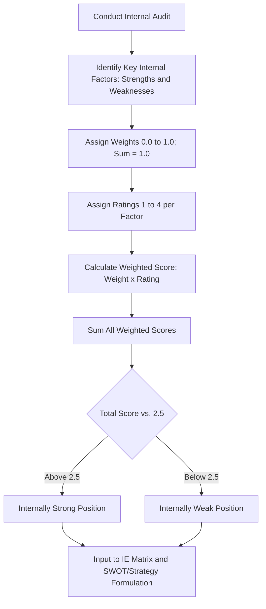
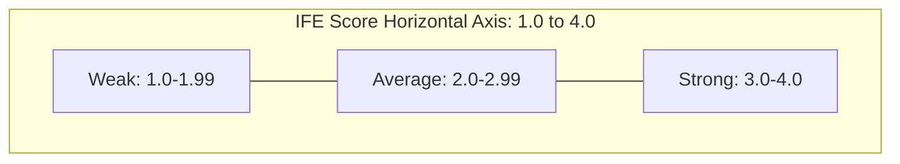

## Internal Factor Evaluation Matrix

### Definition and Conceptual Foundation

The Internal Factor Evaluation (IFE) Matrix is a strategic management tool used to summarize and evaluate the major strengths and weaknesses within the functional areas of a business, providing a quantified basis for assessing a firm's internal strategic position. The tool was developed and popularized by Fred R. David as part of a broader strategic-management toolkit that pairs internal analysis with external analysis through the complementary External Factor Evaluation (EFE) Matrix.

The IFE Matrix condenses internal audit findings — drawn from functional areas such as management, marketing, finance/accounting, production/operations, research and development, and management information systems — into a single weighted score representing the organization's overall internal strategic strength.

**Key Points**

- The IFE Matrix is an audit and scoring tool, not a resource-based theoretical model; it operationalizes internal analysis into a comparable numeric output
- It is most useful when paired with the EFE Matrix as inputs into the Internal-External (IE) Matrix and the broader Strategy Formulation Framework (input, matching, decision stages)
- The matrix requires identification of specific, measurable internal factors rather than broad generalizations

### The Five-Step Construction Process

1. **List Key Internal Factors**
   - Identify 10–20 internal factors, including both strengths and weaknesses, derived from an internal audit (functional area analysis, financial ratio analysis, value chain review, benchmarking)
   - Use specific, quantified statements where possible (e.g., "Employee turnover is 22%, above the industry average of 15%" rather than "high turnover")
   - List strengths first, followed by weaknesses, for clarity
2. **Assign Weights**
   - Assign a weight ranging from 0.0 (not important) to 1.0 (very important) to each factor
   - The weight indicates the relative importance of that factor to success in the industry, regardless of whether the factor is a strength or weakness internally
   - The sum of all weights assigned to all factors must equal 1.0
3. **Assign Ratings**
   - Assign a rating from 1 to 4 to each factor, indicating how effectively the firm's current strategy responds to that factor:
     - 1 = Major weakness
     - 2 = Minor weakness
     - 3 = Minor strength
     - 4 = Major strength
   - Ratings are company-based (how the firm is performing on that factor), while weights are industry-based (how important that factor is within the industry)
4. **Calculate Weighted Scores**
   - Multiply each factor's weight by its rating to obtain a weighted score for each factor
5. **Sum Weighted Scores**
   - Total all weighted scores to obtain the organization's overall weighted score

**Key Points**

- Strengths must receive ratings of 3 or 4; weaknesses must receive ratings of 1 or 2 — a factor should never be rated inconsistently with its classification
- Weights are consistent across competing firms in the same industry analysis (they reflect industry importance), whereas ratings vary firm to firm
- The number of factors has no effect on the total weighted score range, since weights are normalized to sum to 1.0

### Scoring Interpretation

The total weighted score ranges from 1.0 to 4.0, with an average of 2.5:

| Score Range | Interpretation |
| --- | --- |
| Below 2.5 | Organization is internally weak |
| Above 2.5 | Organization is internally strong |
| Near 4.0 | Organization has significant internal strengths relative to weaknesses |
| Near 1.0 | Organization has significant internal weaknesses relative to strengths |

[Inference] The 2.5 midpoint is the standard reference value used across Fred David's textbook treatment of the IFE Matrix; interpretation of scores close to this midpoint (e.g., 2.4 vs 2.6) should be treated cautiously given the inherent subjectivity in weight and rating assignment, rather than as a precise threshold.

### Worked Example

Assume a mid-sized retail company conducts an internal audit and identifies the following factors:

| Internal Factor | Weight | Rating | Weighted Score |
| --- | --- | --- | --- |
| **Strengths** |  |  |  |
| Strong brand recognition in core market | 0.10 | 4 | 0.40 |
| Efficient inventory management system | 0.08 | 4 | 0.32 |
| Experienced senior leadership team | 0.06 | 3 | 0.18 |
| High customer loyalty (repeat purchase rate 65%) | 0.12 | 4 | 0.48 |
| Strong e-commerce platform | 0.09 | 3 | 0.27 |
| **Weaknesses** |  |  |  |
| High employee turnover (22% vs. 15% industry avg.) | 0.10 | 1 | 0.10 |
| Limited international presence | 0.08 | 2 | 0.16 |
| Aging store infrastructure in key locations | 0.09 | 1 | 0.09 |
| Weak R&D investment relative to competitors | 0.07 | 2 | 0.14 |
| High debt-to-equity ratio | 0.11 | 1 | 0.11 |
| Inconsistent supply chain reliability | 0.10 | 2 | 0.20 |
| **Total** | **1.00** |  | **2.45** |

**Output**

The total weighted score of 2.45 is slightly below the 2.5 midpoint, indicating the firm's internal position is marginally weak overall. This suggests that while the firm holds notable strengths in brand equity and customer loyalty, weaknesses in financial structure, turnover, and supply chain reliability are pulling down its overall internal strategic strength, warranting attention in strategy formulation.

### Structural Diagram of the IFE Process

### Relationship to the Broader Strategy Formulation Framework

The IFE Matrix belongs to **Stage 1: The Input Stage** of Fred David's three-stage strategy-formulation framework:

1. **Input Stage**: IFE Matrix, EFE Matrix, and Competitive Profile Matrix (CPM) — summarizes basic input information
2. **Matching Stage**: SWOT Matrix, Strategic Position and Action Evaluation (SPACE) Matrix, Boston Consulting Group (BCG) Matrix, Internal-External (IE) Matrix, Grand Strategy Matrix — generates feasible alternative strategies by matching internal and external factors
3. **Decision Stage**: Quantitative Strategic Planning Matrix (QSPM) — objectively evaluates and ranks alternative strategies

The IFE score, combined with the EFE score, is plotted on the **Internal-External (IE) Matrix**, a nine-cell grid that classifies the firm into one of three major strategy regions: Grow and Build, Hold and Maintain, or Harvest and Divest.

### The IE Matrix Positioning (Direct Application)

- The IFE total weighted score forms the horizontal axis of the IE Matrix (ranges: 1.0–1.99 weak, 2.0–2.99 average, 3.0–4.0 strong)
- The EFE total weighted score forms the vertical axis
- The intersecting cell indicates the appropriate strategic posture (e.g., aggressive growth strategies for cells I, II, IV; stability strategies for cells III, V, VII; retrenchment/divestiture for cells VI, VIII, IX)

### Common Pitfalls in Application

- **Vague factor statements**: Using generic language ("good management," "strong culture") instead of specific, measurable statements reduces analytical rigor and comparability
- **Rating strengths as weaknesses or vice versa**: A factor listed as a strength must receive a rating of 3 or 4; assigning a 1 or 2 to a factor labeled a strength is an internal logical inconsistency
- **Weight sum error**: Failing to ensure weights sum exactly to 1.0 invalidates the comparability of the final score
- **Confusing weight with rating**: Weight reflects industry-level importance of the factor (independent of firm performance), while rating reflects firm-specific performance on that factor; conflating the two undermines the tool's analytical logic
- **Overloading with too many factors**: Including an excessive number of low-impact factors can dilute the significance of the truly critical strengths and weaknesses

[Inference] These pitfalls are commonly cited in applied strategic-management coursework and textbook guidance surrounding the IFE Matrix; the specific severity ranking of each pitfall may vary depending on the instructor or textbook edition referenced.

### Strengths of the Tool

- Provides a simple, structured, and replicable method for translating qualitative internal-audit findings into a quantifiable score
- Facilitates direct comparison across time periods (tracking whether internal position improves or weakens) or, cautiously, across competing firms using consistent factor weights
- Serves as a clear input into subsequent matching-stage tools (SWOT, IE Matrix, SPACE Matrix) and the QSPM decision-stage tool
- Forces discipline in internal-audit rigor, since factors must be specific and measurable rather than impressionistic

### Limitations and Critiques

- **Subjectivity**: Both weight and rating assignments are inherently judgmental; different analysts examining the same firm may arrive at materially different scores
- **False precision**: The numeric output (e.g., 2.45) can create an impression of analytical precision that overstates the reliability of the underlying qualitative judgments
- **Static snapshot**: Like many audit-based tools, the IFE Matrix reflects a point-in-time assessment and does not inherently model how internal capabilities evolve dynamically (a limitation better addressed by frameworks such as Dynamic Capabilities Theory)
- **No causal insight**: The matrix identifies and scores factors but does not by itself explain the underlying drivers or interdependencies among factors (a limitation partially addressed by Value Chain Analysis or root-cause tools)
- **Weight consistency across firms**: While weights are theoretically industry-based and constant across competitors for comparability, achieving genuine analyst consensus on those weights in practice is difficult

### Relationship to Other Frameworks

- **EFE Matrix**: The external-analysis counterpart to the IFE Matrix, following an identical weight-times-rating methodology applied to opportunities and threats
- **SWOT Analysis**: The IFE Matrix's strengths and weaknesses list typically forms the internal half of the SWOT framework, providing more rigor than an unweighted SWOT list
- **Competitive Profile Matrix (CPM)**: A related weighted-scoring tool that benchmarks a firm directly against named competitors on critical success factors
- **Value Chain Analysis**: Often used as a source of granular internal-audit detail feeding into the IFE Matrix's factor list
- **Resource-Based View / VRIO**: Provides theoretical grounding for why certain internal factors (e.g., brand equity, proprietary technology) merit higher importance weights
- **QSPM (Quantitative Strategic Planning Matrix)**: Uses IFE-identified factors directly as one of its key inputs when scoring alternative strategies

**Next Steps**

- External Factor Evaluation (EFE) Matrix
- Competitive Profile Matrix (CPM)
- SWOT Analysis
- Internal-External (IE) Matrix
- SPACE Matrix (Strategic Position and Action Evaluation)
- Quantitative Strategic Planning Matrix (QSPM)
- Value Chain Analysis
- VRIO Framework / Resource-Based View