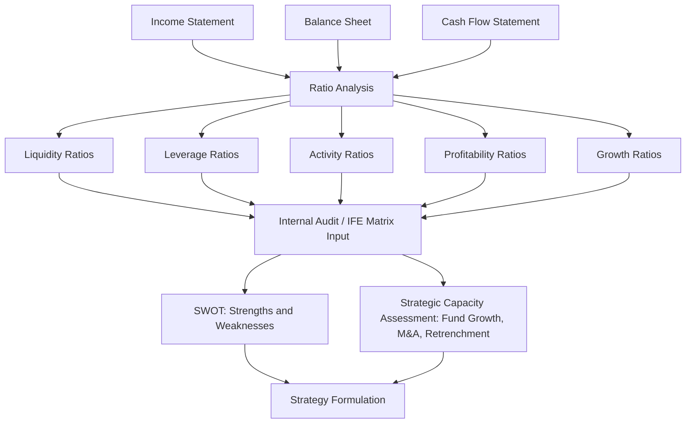

## Financial Statement Analysis for Strategy

### Definition and Conceptual Foundation

Financial Statement Analysis for Strategy is the application of financial accounting data — the income statement, balance sheet, cash flow statement, and associated ratios — to inform strategic decision-making, rather than purely for external financial reporting or investment-valuation purposes. Within strategic management, financial analysis serves as a critical input for internal audits, resource assessment, competitive benchmarking, and the evaluation of strategic alternatives.

Unlike financial analysis conducted for investor or creditor purposes, strategic financial analysis emphasizes identifying underlying drivers of competitive position: cost structure relative to rivals, capital allocation efficiency, resource slack available for strategic initiatives, and financial capacity to sustain a chosen strategy (e.g., aggressive growth, retrenchment, diversification).

**Key Points**

- Financial ratios function as internal-audit inputs to frameworks such as the IFE Matrix and SWOT Analysis
- Strategic financial analysis is comparative by nature: ratios are interpreted relative to industry averages, historical trends, and direct competitors, not in isolation
- Financial statement analysis reveals the *outcomes* of past strategic choices and constrains the *feasibility* of future strategic options (e.g., available capital for expansion, debt capacity for acquisitions)

### The Three Core Financial Statements

1. **Income Statement (Profit and Loss Statement)**
   - Reports revenues, costs, and profitability over a period
   - Reveals strategic cost structure, gross margin trends, and operating leverage
2. **Balance Sheet (Statement of Financial Position)**
   - Reports assets, liabilities, and equity at a point in time
   - Reveals capital structure, asset intensity, and liquidity position
3. **Cash Flow Statement**
   - Reports cash generated and used across operating, investing, and financing activities
   - Reveals the firm's capacity to self-fund strategic initiatives versus reliance on external financing

### Major Ratio Categories for Strategic Analysis

#### 1. Liquidity Ratios

Assess short-term financial flexibility to fund strategic initiatives or withstand shocks.

$$\text{Current Ratio} = \frac{\text{Current Assets}}{\text{Current Liabilities}}$$

$$\text{Quick Ratio} = \frac{\text{Current Assets} - \text{Inventory}}{\text{Current Liabilities}}$$

#### 2. Leverage (Solvency) Ratios

Assess capital structure and capacity to finance strategic moves such as acquisitions or capacity expansion through debt.

$$\text{Debt-to-Equity Ratio} = \frac{\text{Total Liabilities}}{\text{Shareholders' Equity}}$$

$$\text{Interest Coverage Ratio} = \frac{\text{EBIT}}{\text{Interest Expense}}$$

#### 3. Activity (Efficiency) Ratios

Assess how effectively assets are deployed, directly relevant to operational strategy and value chain efficiency.

$$\text{Inventory Turnover} = \frac{\text{Cost of Goods Sold}}{\text{Average Inventory}}$$

$$\text{Total Asset Turnover} = \frac{\text{Sales}}{\text{Total Assets}}$$

#### 4. Profitability Ratios

Assess the effectiveness of the firm's overall strategy in generating returns.

$$\text{Gross Profit Margin} = \frac{\text{Sales} - \text{COGS}}{\text{Sales}}$$

$$\text{Return on Assets (ROA)} = \frac{\text{Net Income}}{\text{Total Assets}}$$

$$\text{Return on Equity (ROE)} = \frac{\text{Net Income}}{\text{Shareholders' Equity}}$$

#### 5. Growth Ratios

Assess momentum relevant to evaluating growth-oriented strategic alternatives.

$$\text{Revenue Growth Rate} = \frac{\text{Revenue}_t - \text{Revenue}_{t-1}}{\text{Revenue}_{t-1}}$$

**Key Points**

- No single ratio should be interpreted in isolation; strategic conclusions emerge from patterns across categories (e.g., high ROE driven by high leverage rather than genuine operating efficiency signals financial risk, not strategic strength)
- Ratios must be benchmarked against industry norms, since capital intensity and margin structures vary substantially across industries
- Trend analysis (3–5 year horizon) is generally more strategically informative than a single-period snapshot

### DuPont Analysis: Decomposing ROE for Strategic Diagnosis

The DuPont framework decomposes Return on Equity into three components, allowing strategists to diagnose *why* a firm's returns are high or low, and whether that performance is strategically sustainable.

$$\text{ROE} = \underbrace{\frac{\text{Net Income}}{\text{Sales}}}_{\text{Net Profit Margin}} \times \underbrace{\frac{\text{Sales}}{\text{Total Assets}}}_{\text{Asset Turnover}} \times \underbrace{\frac{\text{Total Assets}}{\text{Shareholders' Equity}}}_{\text{Financial Leverage}}$$

- **Net Profit Margin**: Reflects cost control and differentiation/pricing power (linked to Porter's generic strategies)
- **Asset Turnover**: Reflects operational efficiency and asset utilization (linked to value chain effectiveness)
- **Financial Leverage**: Reflects capital structure decisions and financial risk appetite

**Example**

Two competing firms both report ROE of 18%:

| Component | Firm A | Firm B |
| --- | --- | --- |
| Net Profit Margin | 12% | 4% |
| Asset Turnover | 0.5x | 1.5x |
| Financial Leverage | 3.0x | 3.0x |
| **ROE** | **18%** | **18%** |

**Output**

Although both firms report identical ROE, DuPont decomposition reveals fundamentally different strategic profiles: Firm A pursues a differentiation-oriented strategy generating high margins on lower asset turnover (consistent with a premium or specialized positioning), while Firm B pursues a cost-leadership/high-volume strategy generating thinner margins offset by rapid asset utilization (consistent with a scale-driven, efficiency-focused positioning). This distinction has direct implications for evaluating the sustainability and risk profile of each firm's strategy going forward.

### Diagram: Financial Analysis Feeding Strategic Decisions

### Free Cash Flow and Strategic Capacity

Free Cash Flow (FCF) is particularly critical in strategic analysis because it represents discretionary capital available for strategic initiatives without relying on external financing.

$$\text{Free Cash Flow} = \text{Operating Cash Flow} - \text{Capital Expenditures}$$

- **High, stable FCF**: Indicates capacity to self-fund acquisitions, R&D investment, share buybacks, or dividend strategies without diluting equity or increasing leverage
- **Negative or volatile FCF**: May signal a firm in a heavy investment phase (common in growth strategies) or, alternatively, financial distress; strategic interpretation depends on context (e.g., paired with revenue growth rate and industry lifecycle stage)

[Inference] Whether negative FCF should be interpreted as a positive growth signal or a warning sign depends heavily on industry context and the accompanying trend in revenue and margin metrics; this judgment call is a standard element of applied strategic financial analysis rather than a strictly defined rule.

### Financial Analysis in Competitive Benchmarking

Strategic financial analysis is frequently applied comparatively across an industry to identify a firm's relative competitive position:

- **Cost position benchmarking**: Comparing COGS-to-sales ratios and SG&A ratios against competitors to assess relative cost leadership potential
- **Capital intensity benchmarking**: Comparing asset turnover and capital expenditure ratios to assess operational efficiency
- **Financial risk benchmarking**: Comparing leverage ratios to assess relative vulnerability to economic downturns or interest rate shocks
- **Working capital benchmarking**: Comparing cash conversion cycle length (days inventory + days receivable − days payable) to assess operational and negotiating efficiency within the value chain

### Financial Analysis and Strategic Alternatives Evaluation

Financial statement analysis directly supports evaluation of the strategic alternatives generated in the matching stage of strategy formulation (e.g., inputs into the Quantitative Strategic Planning Matrix):

- **Growth/Expansion strategies**: Require assessment of available capital (FCF, unused debt capacity) and return thresholds (ROA/ROE hurdle rates)
- **Diversification (related or unrelated)**: Requires assessment of whether financial synergies (e.g., internal capital market efficiency, tax benefits, risk pooling) justify the strategic move
- **Retrenchment/Turnaround strategies**: Triggered by deteriorating liquidity, leverage, or profitability trends identified through ratio analysis
- **Mergers and Acquisitions**: Require detailed financial due diligence, including quality-of-earnings analysis and pro forma combined-entity ratio projections

### Common Pitfalls in Strategic Financial Analysis

- **Ratio analysis without context**: Interpreting ratios without industry or trend benchmarks can produce misleading strategic conclusions
- **Ignoring accounting policy differences**: Comparing firms using different depreciation methods, inventory valuation (FIFO vs. LIFO), or lease accounting treatments without adjustment can distort comparability
- **Overreliance on a single metric**: Focusing narrowly on one ratio (e.g., ROE) without decomposition (e.g., via DuPont analysis) risks conflating operational strength with financial engineering
- **Neglecting non-financial strategic factors**: Financial statements reflect past performance and cannot by themselves capture intangible strategic assets such as brand equity, organizational culture, or emerging technological capability (better captured through frameworks like VRIO or the Value Chain)
- **Currency and inflation distortions**: For multinational strategic comparisons, failing to adjust for currency translation effects or inflation can misrepresent underlying performance trends

### Limitations and Critiques

- **Backward-looking nature**: Financial statements report historical performance and do not directly forecast future strategic potential, particularly for firms in the midst of transformation
- **Accounting discretion**: Management judgment in revenue recognition, asset valuation, and expense capitalization can introduce variability that complicates cross-firm comparison
- **Intangible asset underrepresentation**: Traditional financial statements often understate the value of intangible strategic assets (brand, intellectual property, human capital), particularly relevant for knowledge-intensive or platform-based firms
- **Short-termism risk**: Overemphasis on quarterly or annual financial ratios in strategic decision-making can bias firms toward strategies that optimize near-term metrics at the expense of long-term competitive positioning

### Relationship to Other Strategic Frameworks

- **IFE Matrix**: Financial ratio findings are a primary source of specific, measurable factors used in constructing the internal-factor list
- **SWOT Analysis**: Profitability, liquidity, and leverage findings typically populate the internal strengths/weaknesses quadrant
- **Value Chain Analysis**: Financial ratios (e.g., COGS ratios, SG&A ratios) can be mapped to specific value chain activities to pinpoint the source of cost advantages or disadvantages
- **BCG Matrix / Portfolio Analysis**: Cash flow generation and market growth/share data derived from financial analysis inform business unit classification (Stars, Cash Cows, Question Marks, Dogs)
- **QSPM**: Financial capacity assessments (available capital, debt capacity) constrain and inform the feasibility scoring of alternative strategies

**Next Steps**

- Internal Factor Evaluation (IFE) Matrix
- Value Chain Analysis
- BCG Growth-Share Matrix / Portfolio Analysis
- SWOT Analysis
- Quantitative Strategic Planning Matrix (QSPM)
- Mergers and Acquisitions Strategy
- Corporate Diversification Strategy
- Dynamic Capabilities Theory