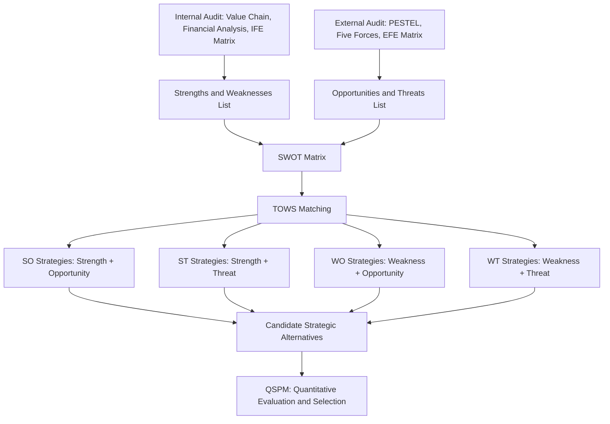

## SWOT Analysis and Strategic Synthesis

### Definition and Conceptual Foundation

SWOT Analysis is a strategic management framework used to systematically identify and organize an organization's internal **Strengths** and **Weaknesses** alongside external **Opportunities** and **Threats**, producing a structured basis for strategy formulation. While the tool's precise origin is debated in management history — commonly associated with research at the Stanford Research Institute in the 1960s (attributed variably to Albert Humphrey and colleagues) — it has become one of the most widely used frameworks in strategic planning due to its simplicity and intuitive structure.

SWOT Analysis functions as a **synthesis tool** in the strategy-formulation process: it does not generate new data on its own but organizes findings from internal audits (value chain analysis, financial statement analysis, IFE Matrix) and external audits (PESTEL analysis, Five Forces analysis, EFE Matrix) into a common framework from which strategic alternatives can be derived.

**Key Points**

- Strengths and Weaknesses are internal factors, within the organization's control
- Opportunities and Threats are external factors, arising from the environment, outside the organization's direct control
- SWOT belongs to the "matching stage" of strategy formulation, following the input-stage tools (IFE, EFE, CPM) and preceding the decision stage (QSPM)
- The analytical value of SWOT lies not in the listing itself but in the **matching** of internal and external factors to generate actionable strategic options

### The Four Quadrants

#### Strengths (Internal, Positive)

Internal capabilities, resources, or attributes that give the organization an advantage over competitors.

- Examples: strong brand equity, proprietary technology, efficient cost structure, skilled workforce, strong distribution network

#### Weaknesses (Internal, Negative)

Internal limitations or deficiencies that place the organization at a disadvantage relative to competitors.

- Examples: outdated technology, weak financial position, high employee turnover, limited product range, poor geographic coverage

#### Opportunities (External, Positive)

External conditions that the organization could potentially exploit to its advantage.

- Examples: emerging markets, favorable regulatory change, technological shifts, changing consumer preferences, weakening competitor position

#### Threats (External, Negative)

External conditions that could damage the organization's performance or strategic position.

- Examples: new market entrants, substitute products, adverse regulation, economic downturn, shifting consumer preferences away from the firm's offering

### Diagram: The SWOT Grid

<svg xmlns="http://www.w3.org/2000/svg" viewBox="0 0 800 420" font-family="Arial, sans-serif">
<text x="400" y="28" text-anchor="middle" font-size="18" font-weight="bold" fill="#1a1a1a">SWOT Analysis Grid (svg_diagram)</text>

<text x="200" y="55" text-anchor="middle" font-size="13" font-weight="bold" fill="`#333333`">Helpful</text>

<text x="600" y="55" text-anchor="middle" font-size="13" font-weight="bold" fill="`#333333`">Harmful</text>

<text x="30" y="150" text-anchor="middle" font-size="13" font-weight="bold" fill="`#333333`" transform="rotate(-90 30 150)">Internal</text>

<text x="30" y="330" text-anchor="middle" font-size="13" font-weight="bold" fill="`#333333`" transform="rotate(-90 30 330)">External</text>

<rect x="60" y="70" width="340" height="160" fill="#dcead0" stroke="#4a7a2a" stroke-width="1.5" />
<text x="230" y="95" text-anchor="middle" font-size="14" font-weight="bold" fill="#1a1a1a">STRENGTHS</text>
<text x="80" y="118" font-size="11" fill="#333333">• Brand equity</text>
<text x="80" y="136" font-size="11" fill="#333333">• Proprietary technology</text>
<text x="80" y="154" font-size="11" fill="#333333">• Cost efficiency</text>
<text x="80" y="172" font-size="11" fill="#333333">• Skilled workforce</text>
<rect x="400" y="70" width="340" height="160" fill="#f5d5d5" stroke="#a83c3c" stroke-width="1.5" />
<text x="570" y="95" text-anchor="middle" font-size="14" font-weight="bold" fill="#1a1a1a">WEAKNESSES</text>
<text x="420" y="118" font-size="11" fill="#333333">• Outdated technology</text>
<text x="420" y="136" font-size="11" fill="#333333">• High turnover</text>
<text x="420" y="154" font-size="11" fill="#333333">• Weak financials</text>
<text x="420" y="172" font-size="11" fill="#333333">• Limited product range</text>
<rect x="60" y="240" width="340" height="160" fill="#d9e8f5" stroke="#2e5f8a" stroke-width="1.5" />
<text x="230" y="265" text-anchor="middle" font-size="14" font-weight="bold" fill="#1a1a1a">OPPORTUNITIES</text>
<text x="80" y="288" font-size="11" fill="#333333">• Emerging markets</text>
<text x="80" y="306" font-size="11" fill="#333333">• Favorable regulation</text>
<text x="80" y="324" font-size="11" fill="#333333">• Technology shifts</text>
<text x="80" y="342" font-size="11" fill="#333333">• Competitor weakness</text>
<rect x="400" y="240" width="340" height="160" fill="#fde3c8" stroke="#b5651d" stroke-width="1.5" />
<text x="570" y="265" text-anchor="middle" font-size="14" font-weight="bold" fill="#1a1a1a">THREATS</text>
<text x="420" y="288" font-size="11" fill="#333333">• New entrants</text>
<text x="420" y="306" font-size="11" fill="#333333">• Substitute products</text>
<text x="420" y="324" font-size="11" fill="#333333">• Adverse regulation</text>
<text x="420" y="342" font-size="11" fill="#333333">• Economic downturn</text>
</svg>

### The TOWS Matrix: From Listing to Strategic Synthesis

While SWOT identifies factors, the **TOWS Matrix** (a complementary and often interchangeably referenced tool, formalized by Heinz Weihrich in 1982) provides the explicit matching methodology that converts SWOT listings into actionable strategic alternatives by systematically pairing internal and external factors.

|  | **Opportunities (O)** | **Threats (T)** |
| --- | --- | --- |
| **Strengths (S)** | **SO Strategies**: Use strengths to capitalize on opportunities (aggressive/growth strategies) | **ST Strategies**: Use strengths to avoid or mitigate threats (diversification strategies) |
| **Weaknesses (W)** | **WO Strategies**: Overcome weaknesses by exploiting opportunities (turnaround strategies) | **WT Strategies**: Minimize weaknesses and avoid threats (defensive/retrenchment strategies) |

**Key Points**

- SO strategies are generally the most desirable, as organizations prefer positioning strengths to capture opportunities directly
- WT strategies are typically defensive in nature, aimed at survival or damage limitation rather than growth
- The matching logic forces specific, actionable strategy statements rather than vague aspirational goals

### Worked Example: TOWS Strategic Matching

A regional coffee retailer conducts SWOT analysis with the following key factors:

**Strengths**: Strong local brand loyalty; skilled baristas; prime urban locations

**Weaknesses**: Limited digital ordering capability; high real estate lease costs

**Opportunities**: Growing demand for mobile ordering/delivery; expansion into suburban markets

**Threats**: Aggressive discounting by large chain competitors; rising commodity coffee prices

**Example**

- **SO Strategy**: Leverage strong brand loyalty and prime urban locations to launch a premium loyalty-based mobile ordering app, capturing the growing mobile-ordering trend while reinforcing brand differentiation
- **ST Strategy**: Use skilled barista expertise and brand loyalty to differentiate on experience and quality rather than competing on price against discounting chains, insulating the firm from a price war
- **WO Strategy**: Address the digital ordering weakness by partnering with an established third-party delivery platform to quickly capture suburban and mobile-ordering opportunities without heavy upfront technology investment
- **WT Strategy**: Renegotiate lease terms or consolidate underperforming high-cost locations to reduce fixed-cost exposure, defending against margin pressure from both rising commodity prices and competitor discounting

**Output**

The TOWS matching process transforms four independent SWOT lists into four distinct, actionable strategic directions, illustrating how the same underlying SWOT factors can generate meaningfully different strategic responses depending on which internal and external factors are paired.

### Diagram: SWOT-to-Strategy Synthesis Process

### Best Practices for Rigorous SWOT Construction

- **Specificity over generality**: Factors should be specific and, where possible, quantified (e.g., "22% employee turnover vs. 15% industry average" rather than "high turnover"), consistent with rigorous internal/external audit practice
- **Evidence-based factors**: Each SWOT entry should be traceable to underlying analysis (value chain review, financial ratios, PESTEL findings, Five Forces assessment) rather than unsubstantiated opinion
- **Prioritization**: Not all factors carry equal strategic weight; ranking or weighting factors (as in the IFE/EFE Matrix methodology) prevents minor factors from diluting focus on critical ones
- **Time-bound relevance**: Opportunities and threats are often time-sensitive; noting the expected window of relevance improves strategic responsiveness
- **Cross-functional input**: Effective SWOT construction typically draws on perspectives from multiple functional areas (marketing, operations, finance, R&D) to avoid single-department bias

### Common Pitfalls

- **List without synthesis**: Producing a SWOT list without proceeding to TOWS-style matching results in a descriptive exercise with limited strategic actionability
- **Internal/external misclassification**: Misplacing an external factor (e.g., "increasing raw material costs") as an internal weakness, or vice versa, undermines the logical structure of the framework
- **Overgeneralization**: Vague statements ("good reputation," "strong competition") reduce the framework's diagnostic value compared to specific, evidenced factors
- **Confirmation bias**: Strategists may unconsciously emphasize factors that support a strategy they already favor, rather than conducting a genuinely objective audit
- **Treating SWOT as exhaustive**: SWOT organizes existing audit findings; it is not itself a data-generation tool and should be preceded by rigorous internal and external analysis

[Inference] The critique that SWOT is frequently used descriptively without proceeding to structured matching (e.g., via TOWS) is a commonly cited practical limitation in applied strategy literature and business education; the prevalence of this pitfall in actual organizational practice is not something that can be precisely quantified here.

### Limitations and Critiques

- **Subjectivity**: Classification of factors as strengths/weaknesses/opportunities/threats often involves judgment calls, and reasonable analysts may disagree (e.g., is "large firm size" a strength or, in a fast-changing market, a weakness limiting agility?)
- **Static snapshot**: Like the IFE/EFE Matrices, SWOT reflects a point-in-time assessment, limiting its ability to capture how internal capabilities and external conditions evolve dynamically (a gap addressed by Dynamic Capabilities Theory)
- **No inherent weighting**: The basic SWOT format does not indicate the relative importance or magnitude of listed factors unless deliberately supplemented (e.g., with IFE/EFE-style weighting)
- **Risk of superficiality**: Because the framework is simple and widely taught, it is often applied with insufficient analytical rigor, producing generic lists rather than genuinely diagnostic insight
- **Boundary ambiguity between internal and external**: Some factors (e.g., a key supplier relationship) can be argued to sit at the boundary of internal and external classification, requiring careful judgment

### Relationship to Other Strategic Frameworks

- **IFE and EFE Matrices**: Provide the weighted, quantified factor lists that can feed directly into a more rigorous SWOT construction
- **PESTEL and Five Forces Analysis**: Primary sources for the Opportunities and Threats quadrants
- **Value Chain Analysis**: Primary source for granular, activity-level Strengths and Weaknesses
- **TOWS Matrix**: The direct matching extension of SWOT that generates actionable strategy statements
- **QSPM**: Uses SWOT/TOWS-generated strategic alternatives as candidate strategies for quantitative evaluation and ranking
- **Dynamic Capabilities Theory**: Offers a dynamic complement to SWOT's static internal assessment, addressing how strengths and weaknesses evolve over time

**Next Steps**

- TOWS Matrix (detailed strategic matching methodology)
- PESTEL Analysis
- Porter's Five Forces
- Quantitative Strategic Planning Matrix (QSPM)
- Internal Factor Evaluation (IFE) Matrix
- External Factor Evaluation (EFE) Matrix
- Grand Strategy Matrix
- SPACE Matrix (Strategic Position and Action Evaluation)