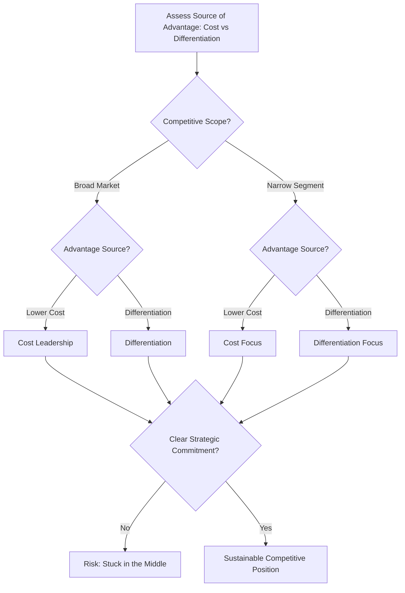

## Porter's Generic Competitive Strategies

### Definition and Conceptual Foundation

Porter's Generic Competitive Strategies is a framework developed by Michael Porter in his 1980 book *Competitive Strategy* that identifies the fundamental strategic approaches a firm can pursue to achieve and sustain competitive advantage within an industry. The framework rests on the premise that a firm's performance above or below the industry average ultimately depends on its ability to establish a defensible competitive position, and that this position can be built along one of a limited number of generic paths.

Porter argues that a firm's competitive strategy is defined along two dimensions: the **source of competitive advantage** (lower cost or differentiation) and the **competitive scope** (broad, industry-wide target or narrow, focused segment target). Combining these dimensions yields four generic strategies, with Porter cautioning that firms attempting to straddle multiple approaches simultaneously without a clear commitment risk becoming "stuck in the middle."

**Key Points**

- The framework assumes competitive advantage fundamentally arises from either lower relative cost or meaningful differentiation, not from firm size or market share alone
- Scope refers to the breadth of the market segment targeted: broad (industry-wide) or narrow (a specific niche)
- The strategies are termed "generic" because they are applicable across virtually any industry or firm type, in contrast to firm-specific tactical choices

### The Four Generic Strategies Matrix

|  | **Lower Cost** | **Differentiation** |
| --- | --- | --- |
| **Broad Target** | Cost Leadership | Differentiation |
| **Narrow Target** | Cost Focus | Differentiation Focus |

#### 1. Cost Leadership

Pursuing the lowest cost position in the industry while offering a product acceptable to a broad customer base, enabling above-average returns through cost advantage even at industry-average prices, or capturing volume-driven share advantages through competitive pricing.

**Key mechanisms**:

- Economies of scale in production and procurement
- Proprietary technology or process innovation reducing unit costs
- Tight cost control across overhead, R&D, and SG&A
- Preferential access to raw materials or favorable input pricing
- Learning-curve effects from accumulated production experience

#### 2. Differentiation

Offering unique attributes valued broadly by customers across the industry, allowing the firm to command a price premium that exceeds the added cost of creating that uniqueness.

**Key mechanisms**:

- Superior product design, features, or quality
- Strong brand identity and customer loyalty
- Proprietary technology or patented features
- Superior customer service or support network
- Distribution channel exclusivity or reach

#### 3. Cost Focus

Pursuing the lowest cost position within a narrowly defined segment or niche, exploiting differences in cost behavior within that segment that broad-based cost leaders overlook or cannot efficiently serve.

#### 4. Differentiation Focus

Pursuing differentiation within a narrowly defined segment, exploiting the special needs of buyers in that segment more effectively than broadly-targeted competitors.

**Key Points**

- Focus strategies (Cost Focus and Differentiation Focus) rest on the premise that a narrow segment can be served more effectively or efficiently than the broad market, because broadly-targeted competitors are optimizing for the average buyer, not the niche
- A successful focus strategy requires that the target segment have buyers with distinctive needs, or that the production/delivery system serving that segment differ from other segments

### Diagram: The Four Generic Strategies

<svg xmlns="http://www.w3.org/2000/svg" viewBox="0 0 800 420" font-family="Arial, sans-serif">
<text x="400" y="28" text-anchor="middle" font-size="18" font-weight="bold" fill="#1a1a1a">Porter's Generic Strategies Matrix (svg_diagram)</text>

<text x="230" y="55" text-anchor="middle" font-size="13" font-weight="bold" fill="`#333333`">Lower Cost</text>

<text x="580" y="55" text-anchor="middle" font-size="13" font-weight="bold" fill="`#333333`">Differentiation</text>

<text x="30" y="150" text-anchor="middle" font-size="13" font-weight="bold" fill="`#333333`" transform="rotate(-90 30 150)">Broad Target</text>

<text x="30" y="330" text-anchor="middle" font-size="13" font-weight="bold" fill="`#333333`" transform="rotate(-90 30 330)">Narrow Target</text>

<rect x="60" y="70" width="340" height="160" fill="#d9e8f5" stroke="#2e5f8a" stroke-width="1.5" />
<text x="230" y="120" text-anchor="middle" font-size="15" font-weight="bold" fill="#1a1a1a">COST LEADERSHIP</text>
<text x="230" y="145" text-anchor="middle" font-size="11" fill="#333333">Lowest cost, industry-wide</text>
<text x="230" y="163" text-anchor="middle" font-size="11" fill="#333333">Scale, process efficiency</text>
<rect x="400" y="70" width="340" height="160" fill="#dcead0" stroke="#4a7a2a" stroke-width="1.5" />
<text x="570" y="120" text-anchor="middle" font-size="15" font-weight="bold" fill="#1a1a1a">DIFFERENTIATION</text>
<text x="570" y="145" text-anchor="middle" font-size="11" fill="#333333">Unique value, industry-wide</text>
<text x="570" y="163" text-anchor="middle" font-size="11" fill="#333333">Brand, quality, features</text>
<rect x="60" y="240" width="340" height="160" fill="#fde3c8" stroke="#b5651d" stroke-width="1.5" />
<text x="230" y="290" text-anchor="middle" font-size="15" font-weight="bold" fill="#1a1a1a">COST FOCUS</text>
<text x="230" y="315" text-anchor="middle" font-size="11" fill="#333333">Lowest cost, narrow segment</text>
<text x="230" y="333" text-anchor="middle" font-size="11" fill="#333333">Niche cost advantage</text>
<rect x="400" y="240" width="340" height="160" fill="#f0e6f5" stroke="#7a3f9d" stroke-width="1.5" />
<text x="570" y="290" text-anchor="middle" font-size="15" font-weight="bold" fill="#1a1a1a">DIFFERENTIATION FOCUS</text>
<text x="570" y="315" text-anchor="middle" font-size="11" fill="#333333">Unique value, narrow segment</text>
<text x="570" y="333" text-anchor="middle" font-size="11" fill="#333333">Tailored niche positioning</text>
</svg>

### The "Stuck in the Middle" Concept

Porter argues that a firm failing to commit clearly to one of the generic strategies — attempting to be simultaneously low-cost and highly differentiated across a broad market without a clear priority — risks ending up "stuck in the middle," characterized by:

- Below-average profitability compared to firms with clear strategic commitment
- Lack of a coherent basis for competitive advantage
- Organizational and cultural contradictions (e.g., a cost-minimizing culture conflicting with a premium, innovation-driven culture)
- Vulnerability to being outcompeted on cost by focused cost leaders and outcompeted on differentiation by focused differentiators simultaneously

[Inference] The "stuck in the middle" thesis has been a subject of ongoing academic debate; some scholars (particularly in later empirical work) have argued that certain firms successfully combine elements of cost efficiency and differentiation (sometimes termed "hybrid" strategies) without suffering the performance penalty Porter's original framework predicted, though this remains a contested area rather than settled consensus.

### Requirements and Risks of Each Strategy

#### Cost Leadership — Requirements and Risks

- **Requirements**: Sustained capital investment in efficient-scale facilities, aggressive pursuit of cost reductions from experience, tight cost and overhead control, avoidance of marginal customer accounts
- **Risks**: Technological change that nullifies past investments or learning; new entrants or followers imitating the cost position through newer technology; loss of cost focus due to a need to diversify; erosion of the cost advantage as inflation narrows the firm's ability to maintain price differentials

#### Differentiation — Requirements and Risks

- **Requirements**: Strong marketing and product engineering capabilities, creative flair, strong capability in basic research, corporate reputation for quality or technological leadership, strong coordination among R&D, product development, and marketing functions
- **Risks**: The cost differential between low-cost competitors and the differentiated firm becomes too large for buyers to justify the premium; buyer need for the differentiating factor diminishes over time; imitation narrows perceived differentiation as the industry matures

#### Focus — Requirements and Risks

- **Requirements**: A combination of the capabilities above, directed at a specific strategic target segment
- **Risks**: The cost differential between broad-range competitors and the focused firm widens, eliminating the cost advantages of serving a narrow target; differences in desired products/services between the strategic target and the market as a whole narrow; competitors find sub-segments within the strategic target and out-focus the focuser

### Worked Example: Applying the Framework

**Example**

Consider the airline industry:

- **Cost Leadership**: A low-cost carrier operates a single aircraft type to reduce maintenance and training costs, uses secondary airports to reduce landing fees, and eliminates complimentary services, competing broadly on price across many routes
- **Differentiation**: A full-service international carrier invests in premium cabin experience, extensive route networks, loyalty programs, and superior in-flight service, competing broadly on the basis of perceived quality and convenience
- **Cost Focus**: A regional carrier serves a narrow set of short-haul routes underserved by major carriers, achieving lower costs specifically suited to that route profile (e.g., avoiding hub-and-spoke overhead)
- **Differentiation Focus**: A boutique charter airline serves a narrow segment of ultra-premium business travelers with highly customized scheduling and service, differentiated specifically for that niche rather than the broad market

**Output**

Each strategy can coexist profitably within the same industry because each is built on a distinct source of advantage and targets a distinct scope; firms attempting to blend a low-cost operating model with a full-service premium positioning across the broad market (without a clear organizational commitment to one) illustrate the "stuck in the middle" risk Porter describes.

### Diagram: Decision Logic for Generic Strategy Selection

### Organizational Implications of Each Strategy

Each generic strategy typically demands a distinct organizational structure, control system, and incentive scheme:

- **Cost Leadership organizations**: Tend toward tight cost controls, frequent detailed control reports, structured organization and responsibilities, and incentives based on meeting strict quantitative targets
- **Differentiation organizations**: Tend toward strong coordination among R&D, product development, and marketing, qualitative measurement and incentives rather than strictly quantitative, and amenities to attract highly skilled labor, scientists, or creative talent
- **Focus organizations**: Combine elements of the above, applied at a scale and intensity calibrated to their narrower target segment, often with greater organizational flexibility than broad-scope competitors

### Extensions and Later Refinements

- **Blue Ocean Strategy (Kim and Mauborgne, 2005)**: Directly challenges the strict cost-versus-differentiation trade-off, proposing that firms can pursue "value innovation" — simultaneously reducing cost and increasing differentiation — by reconstructing market boundaries rather than competing within existing generic-strategy trade-offs
- **Hybrid strategy research**: Subsequent empirical strategy research has explored conditions (e.g., certain manufacturing flexibility technologies, digital platforms) under which cost and differentiation advantages may be pursued more simultaneously than Porter's original framework suggested
- **Resource-Based View integration**: Later scholarship has connected generic strategy choice to the underlying VRIN/VRIO resource base required to sustain each position, framing the generic strategies as strategic outcomes of resource configuration rather than freestanding choices

[Inference] The relationship between Blue Ocean Strategy and Porter's framework is often presented in business literature as a direct challenge to the strict trade-off assumption; however, the extent to which "value innovation" genuinely escapes cost-differentiation trade-offs versus achieving a favorable balance between them remains debated among strategy scholars.

### Limitations and Critiques

- **Rigid dichotomy assumption**: Critics argue the framework's binary treatment of cost versus differentiation understates the possibility of hybrid strategies, particularly enabled by modern flexible manufacturing, digital technology, and mass customization capabilities
- **Static industry view**: The framework provides less guidance on how firms should navigate strategy transitions during periods of industry disruption or technological change
- **Underspecified focus strategy boundaries**: Determining what constitutes a sufficiently "narrow" segment for a viable focus strategy is not precisely defined and requires substantial managerial judgment
- **Limited attention to capability-building process**: The framework describes strategic positions but says relatively little about the dynamic organizational processes (addressed by Dynamic Capabilities Theory) required to build and sustain them over time
- **Industry structure dependency**: The framework's prescriptions are most directly applicable within Porter's broader Five Forces view of industry structure and may require adaptation in platform-based, network-effect-driven, or rapidly digitizing industries

### Relationship to Other Strategic Frameworks

- **Porter's Five Forces**: Provides the industry-structure context within which generic strategies are selected; each generic strategy represents a distinct approach to defending against the five competitive forces
- **Value Chain Analysis**: Provides the activity-level detail for how a firm actually implements cost leadership (activity cost minimization) or differentiation (activity-level uniqueness) in practice
- **VRIO / Resource-Based View**: Explains what underlying resources and capabilities are required to sustain a chosen generic strategy over time
- **Blue Ocean Strategy**: A direct conceptual extension/challenge, proposing value innovation as an alternative to the cost-differentiation trade-off
- **SWOT/TOWS Matrix**: Generic strategy choice is often one of the candidate strategic directions generated through SO/ST/WO/WT matching

**Next Steps**

- Porter's Five Forces Framework
- Blue Ocean Strategy and Value Innovation
- Value Chain Analysis
- VRIO Framework and Resource-Based View
- Hybrid and Best-Cost Strategies
- Industry Life Cycle and Strategy Adaptation
- Competitive Dynamics and Strategic Positioning
- Corporate-Level Diversification Strategy