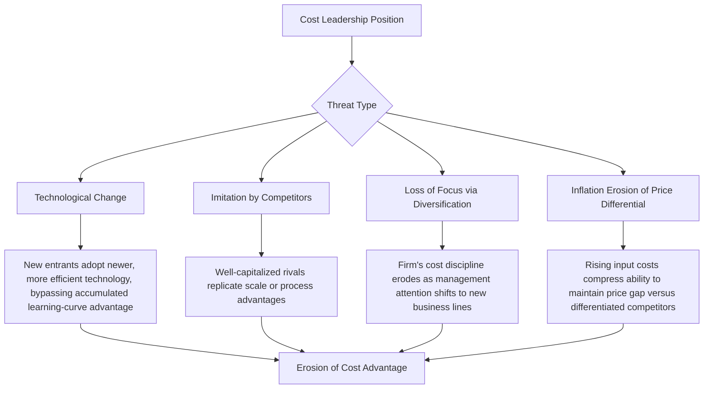

## Cost Leadership Strategy

### Definition and Conceptual Foundation

Cost Leadership Strategy is a business-level generic strategy, defined within Michael Porter's framework, in which a firm aims to become the lowest-cost producer in its industry for a broadly defined market, offering products or services that are acceptable to buyers while systematically outperforming competitors on total cost structure. The cost leader translates its cost advantage into superior profitability either by matching industry-average prices (capturing higher margins) or by pricing below competitors to capture greater market share and volume, while still earning acceptable returns.

Achieving cost leadership requires that the firm establish a durable, structural cost advantage across its value chain — not merely a temporary price reduction — since a sustainable position depends on the cost advantage being difficult for rivals to replicate quickly.

**Key Points**

- Cost leadership does not mean offering the cheapest product at the lowest possible quality; the product must remain acceptable and comparable to competitors on features valued by the broad market
- The advantage must be structural (rooted in scale, process design, or proprietary efficiency), not merely a short-term promotional discount
- A true cost leader typically earns above-average industry returns even when charging prices at or near the industry average, because its cost base is lower than competitors'

### Sources of Cost Advantage

Cost advantages typically arise from structural cost drivers embedded in a firm's value chain activities. Common sources include:

1. **Economies of Scale** — Spreading fixed costs (facilities, R&D, overhead) over a larger volume of output, reducing per-unit cost
2. **Learning and Experience Curve Effects** — Cumulative production experience driving down labor time, defect rates, and process inefficiencies over time
3. **Capacity Utilization** — Operating production facilities closer to full capacity reduces the fixed-cost burden per unit
4. **Linkages Among Activities** — Coordinating activities (e.g., tight integration between procurement and inventory management) to reduce total system cost
5. **Process Innovation and Proprietary Technology** — Developing or adopting production technology that lowers unit costs relative to competitors using conventional methods
6. **Input Cost Advantages** — Preferential access to raw materials, favorable supplier contracts, or advantageous geographic location relative to input sources
7. **Vertical Integration Choices** — Selectively integrating or outsourcing activities based on which configuration minimizes total system cost
8. **Policy Choices** — Deliberate choices to eliminate non-essential features, services, or variety that add cost without proportionate value to the target buyer segment
9. **Institutional Factors** — Favorable regulation, labor costs, or tax treatment specific to the firm's operating locations

**Key Points**

- No single source of cost advantage is typically sufficient on its own; sustainable cost leadership usually results from the cumulative effect of several reinforcing cost drivers across multiple value chain activities
- Some cost drivers (e.g., scale) are more easily imitated by competitors with sufficient capital, while others (e.g., proprietary process technology or deeply embedded organizational routines) are more durable

### Diagram: Cost Drivers Mapped to the Value Chain

<svg xmlns="http://www.w3.org/2000/svg" viewBox="0 0 900 380" font-family="Arial, sans-serif">
<text x="450" y="28" text-anchor="middle" font-size="17" font-weight="bold" fill="#1a1a1a">Cost Drivers Across Value Chain Activities (svg_diagram)</text>
<rect x="60" y="60" width="150" height="90" fill="#f4b183" stroke="#c55a11" stroke-width="1.5" />
<text x="135" y="85" text-anchor="middle" font-size="12" font-weight="bold" fill="#1a1a1a">Inbound Logistics</text>
<text x="135" y="108" text-anchor="middle" font-size="10" fill="#333333">Supplier consolidation</text>
<text x="135" y="124" text-anchor="middle" font-size="10" fill="#333333">Bulk purchasing</text>
<rect x="225" y="60" width="150" height="90" fill="#f4b183" stroke="#c55a11" stroke-width="1.5" />
<text x="300" y="85" text-anchor="middle" font-size="12" font-weight="bold" fill="#1a1a1a">Operations</text>
<text x="300" y="108" text-anchor="middle" font-size="10" fill="#333333">Scale, automation</text>
<text x="300" y="124" text-anchor="middle" font-size="10" fill="#333333">Learning curve</text>
<rect x="390" y="60" width="150" height="90" fill="#f4b183" stroke="#c55a11" stroke-width="1.5" />
<text x="465" y="85" text-anchor="middle" font-size="12" font-weight="bold" fill="#1a1a1a">Outbound Logistics</text>
<text x="465" y="108" text-anchor="middle" font-size="10" fill="#333333">Route optimization</text>
<text x="465" y="124" text-anchor="middle" font-size="10" fill="#333333">Centralized warehousing</text>
<rect x="555" y="60" width="150" height="90" fill="#f4b183" stroke="#c55a11" stroke-width="1.5" />
<text x="630" y="85" text-anchor="middle" font-size="12" font-weight="bold" fill="#1a1a1a">Marketing/Sales</text>
<text x="630" y="108" text-anchor="middle" font-size="10" fill="#333333">Minimal advertising spend</text>
<text x="630" y="124" text-anchor="middle" font-size="10" fill="#333333">Standardized offerings</text>
<rect x="720" y="60" width="120" height="90" fill="#f4b183" stroke="#c55a11" stroke-width="1.5" />
<text x="780" y="85" text-anchor="middle" font-size="12" font-weight="bold" fill="#1a1a1a">Service</text>
<text x="780" y="108" text-anchor="middle" font-size="10" fill="#333333">Limited-service model</text>
<rect x="60" y="180" width="780" height="70" fill="#c9d7ec" stroke="#4a6fa5" stroke-width="1.5" />
<text x="450" y="210" text-anchor="middle" font-size="12" font-weight="bold" fill="#1a1a1a">Support Activities: Lean firm infrastructure, standardized HR practices,</text>
<text x="450" y="228" text-anchor="middle" font-size="12" font-weight="bold" fill="#1a1a1a">process-focused technology development, consolidated procurement</text>
<rect x="200" y="280" width="500" height="70" fill="#dcead0" stroke="#4a7a2a" stroke-width="1.5" />
<text x="450" y="310" text-anchor="middle" font-size="13" font-weight="bold" fill="#1a1a1a">Cumulative Structural Cost Advantage</text>
<text x="450" y="330" text-anchor="middle" font-size="11" fill="#333333">Enables price competitiveness or superior margin at industry prices</text>
<line x1="450" y1="150" x2="450" y2="180" stroke="#555555" stroke-width="2" />
<line x1="450" y1="250" x2="450" y2="280" stroke="#555555" stroke-width="2" />
</svg>

### Requirements for Successful Implementation

**Organizational and Managerial Requirements**:

- Sustained access to capital for investment in efficient-scale facilities and process technology
- Strong process engineering and industrial engineering skills
- Frequent, detailed management control reports focused on cost metrics
- Tight organizational discipline, clearly defined responsibilities, and cost-focused incentive structures
- A culture oriented toward continuous cost reduction and operational discipline across all levels

**Structural Requirements**:

- Sufficient market share or volume to realize scale economies
- Standardized or simplified product/service design that avoids unnecessary cost-adding complexity
- Efficient distribution to minimize per-unit logistics cost

### Worked Example

**Example**

A discount retail chain implements cost leadership through several coordinated actions:

- **Operations**: Uses a small number of large-format "big box" stores rather than many smaller stores, spreading fixed overhead over higher sales volume per location
- **Inbound Logistics**: Negotiates large-volume purchasing contracts directly with manufacturers, bypassing wholesalers to reduce input costs
- **Marketing**: Minimizes advertising expenditure, relying on everyday-low-price positioning rather than promotional campaigns
- **Firm Infrastructure**: Maintains a lean corporate overhead structure with centralized decision-making to avoid duplicated administrative costs across regions

**Output**

The cumulative effect of these coordinated choices allows the retailer to offer prices below competitors while still maintaining acceptable margins, because its total cost-to-serve is structurally lower across nearly every value chain activity, not the result of a single isolated initiative.

### Sustainability and Threats to Cost Leadership

- **Technological disruption**: A structural cost advantage built on a particular production technology can be nullified if a new technology emerges that is more efficient, particularly if the firm's capital is sunk in the older technology
- **Imitation by well-resourced rivals**: Competitors with sufficient capital can replicate scale-based or process-based advantages over time, particularly in industries with low technological barriers
- **Diversification-driven loss of focus**: As firms diversify into new lines of business, management attention and cost discipline focused on the original core business can erode
- **Inflation and input cost volatility**: Rising costs (labor, materials, energy) can compress the absolute price gap between a cost leader and differentiated competitors, potentially narrowing the strategic rationale for buyers to choose the lower-cost option

[Inference] The relative severity of each threat category (technological disruption versus imitation versus inflation) varies substantially by industry; no universal ranking of which threat is "most likely" to undermine a cost leadership position can be stated as a general rule, and assessment requires industry-specific analysis.

### Cost Leadership and the Five Forces

Cost leadership provides structural defenses against each of Porter's five competitive forces:

- **Rivalry**: A lower cost position allows the firm to withstand price competition better than rivals, since it retains margin even at prices that would erode competitors' profitability
- **Buyer Power**: Cost leadership provides a cushion against powerful buyers' demands for price reductions
- **Supplier Power**: Greater flexibility to absorb input cost increases compared to competitors with thinner margins
- **New Entrants**: Scale-based cost advantages and accumulated learning-curve effects act as entry barriers, since new entrants typically cannot immediately match the incumbent's cost structure
- **Substitutes**: Lower prices increase the relative value proposition against substitute products, raising the threshold at which buyers would switch

### Risks and Limitations

- **Risk of price wars eroding industry profitability**: If multiple firms pursue cost leadership simultaneously without a clear winner, the resulting price competition can depress industry-wide profitability, including for the eventual leader
- **Neglect of differentiation entirely**: An excessive focus on cost minimization can lead to underinvestment in product features or service quality that buyers begin to value, creating vulnerability to differentiated competitors
- **Vulnerability at the low end**: Focused cost competitors targeting a narrower segment may achieve even lower costs within that segment than the broad-based cost leader, eroding volume in specific sub-markets
- **Capital intensity risk**: Heavy investment in scale-efficient facilities creates high fixed costs and potential overcapacity risk if demand growth slows or shifts

### Relationship to Other Strategic Frameworks

- **Porter's Generic Competitive Strategies**: Cost leadership is one of the four generic strategies, distinguished from cost focus by its broad (industry-wide) competitive scope
- **Value Chain Analysis**: Provides the activity-level lens through which cost leadership is actually implemented and diagnosed
- **Porter's Five Forces**: Cost leadership functions as a structural defense mechanism against each of the five forces
- **Experience Curve and Economies of Scale theory**: Provide the underlying economic logic for several key cost-advantage sources
- **Dynamic Capabilities Theory**: Explains how a firm sustains and adapts its cost leadership position as technology and market conditions evolve over time
- **Blue Ocean Strategy**: Offers an alternative perspective suggesting cost reduction can sometimes be pursued jointly with differentiation through value innovation, challenging the strict trade-off assumption underlying pure cost leadership

**Next Steps**

- Differentiation Strategy
- Focus Strategy (Cost Focus and Differentiation Focus)
- Porter's Five Forces Framework
- Value Chain Analysis
- Economies of Scale and Experience Curve Effects
- Blue Ocean Strategy and Value Innovation
- Operational Excellence and Process Improvement Strategy
- Industry Life Cycle and Cost Structure Evolution