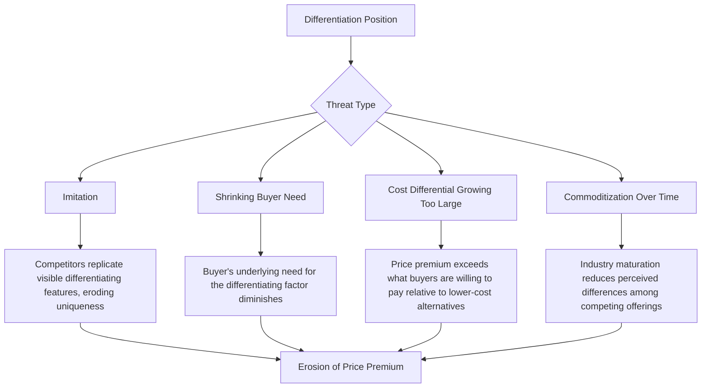

## Differentiation Strategy

### Definition and Conceptual Foundation

Differentiation Strategy is a business-level generic strategy in which a firm seeks to be unique in its industry along dimensions widely valued by buyers, enabling it to command a premium price that exceeds the additional cost of creating that uniqueness. Unlike cost leadership, which competes on being the lowest-cost provider, differentiation competes on the basis of distinctive value — a firm selects one or more attributes that buyers perceive as important and positions itself uniquely to meet those needs, often allowing multiple differentiated firms to coexist profitably within the same industry by targeting different bases of uniqueness.

A firm pursuing differentiation is not indifferent to cost; rather, cost is not the primary strategic target — cost containment remains relevant, but it is secondary to sustaining and reinforcing the sources of uniqueness that justify the price premium.

**Key Points**

- Differentiation is measured relative to buyer perception, not merely engineering or design uniqueness — a feature must be recognized and valued by buyers to generate strategic benefit
- The price premium the firm charges must exceed the incremental cost of providing the differentiating features for the strategy to be profitable
- Multiple firms can pursue differentiation simultaneously within one industry by choosing distinct bases for uniqueness (e.g., design versus reliability versus customer service)

### Bases for Differentiation

Differentiation can be built on virtually any point of the value chain where a firm can create buyer-perceived uniqueness. Common bases include:

1. **Product Features and Performance** — Superior functionality, design, durability, or technical performance
2. **Quality and Reliability** — Consistent, dependable performance and low defect rates
3. **Brand Image and Reputation** — Emotional or status-based value associated with the brand
4. **Customer Service and Support** — Superior pre-sale, sale, and post-sale service, including installation, training, and responsiveness
5. **Innovation** — Continuous introduction of novel features or technologies ahead of competitors
6. **Distribution and Availability** — Superior convenience, channel breadth, or delivery speed
7. **Customization** — Ability to tailor the product/service to individual buyer specifications
8. **Complementary Services or Ecosystem** — Bundled services, warranties, financing, or platform ecosystem advantages

**Key Points**

- Effective differentiation typically arises from a combination of several reinforcing bases rather than a single isolated feature, since a single differentiator is often easier for competitors to imitate
- Differentiation can occur at any point in the value chain — including activities not directly visible to the buyer (e.g., a superior order-processing system reducing lead time) — as long as it ultimately affects buyer-perceived value

### Diagram: Sources of Differentiation Across the Value Chain

<svg xmlns="http://www.w3.org/2000/svg" viewBox="0 0 900 380" font-family="Arial, sans-serif">
<text x="450" y="28" text-anchor="middle" font-size="17" font-weight="bold" fill="#1a1a1a">Differentiation Sources Across Value Chain Activities (svg_diagram)</text>
<rect x="60" y="60" width="150" height="90" fill="#dcead0" stroke="#4a7a2a" stroke-width="1.5" />
<text x="135" y="85" text-anchor="middle" font-size="12" font-weight="bold" fill="#1a1a1a">Inbound Logistics</text>
<text x="135" y="108" text-anchor="middle" font-size="10" fill="#333333">Premium input sourcing</text>
<text x="135" y="124" text-anchor="middle" font-size="10" fill="#333333">Traceability/quality assurance</text>
<rect x="225" y="60" width="150" height="90" fill="#dcead0" stroke="#4a7a2a" stroke-width="1.5" />
<text x="300" y="85" text-anchor="middle" font-size="12" font-weight="bold" fill="#1a1a1a">Operations</text>
<text x="300" y="108" text-anchor="middle" font-size="10" fill="#333333">Craftsmanship</text>
<text x="300" y="124" text-anchor="middle" font-size="10" fill="#333333">Precision, low defect rate</text>
<rect x="390" y="60" width="150" height="90" fill="#dcead0" stroke="#4a7a2a" stroke-width="1.5" />
<text x="465" y="85" text-anchor="middle" font-size="12" font-weight="bold" fill="#1a1a1a">Outbound Logistics</text>
<text x="465" y="108" text-anchor="middle" font-size="10" fill="#333333">Fast, reliable delivery</text>
<text x="465" y="124" text-anchor="middle" font-size="10" fill="#333333">Order accuracy</text>
<rect x="555" y="60" width="150" height="90" fill="#dcead0" stroke="#4a7a2a" stroke-width="1.5" />
<text x="630" y="85" text-anchor="middle" font-size="12" font-weight="bold" fill="#1a1a1a">Marketing/Sales</text>
<text x="630" y="108" text-anchor="middle" font-size="10" fill="#333333">Brand-building</text>
<text x="630" y="124" text-anchor="middle" font-size="10" fill="#333333">Sales expertise</text>
<rect x="720" y="60" width="120" height="90" fill="#dcead0" stroke="#4a7a2a" stroke-width="1.5" />
<text x="780" y="85" text-anchor="middle" font-size="12" font-weight="bold" fill="#1a1a1a">Service</text>
<text x="780" y="108" text-anchor="middle" font-size="10" fill="#333333">Responsive support</text>
<rect x="60" y="180" width="780" height="70" fill="#f0e6f5" stroke="#7a3f9d" stroke-width="1.5" />
<text x="450" y="210" text-anchor="middle" font-size="12" font-weight="bold" fill="#1a1a1a">Support Activities: Strong R&amp;D and design capability, technology development</text>
<text x="450" y="228" text-anchor="middle" font-size="12" font-weight="bold" fill="#1a1a1a">for innovation, talent-focused HR practices, quality-oriented procurement</text>
<rect x="200" y="280" width="500" height="70" fill="#fde3c8" stroke="#b5651d" stroke-width="1.5" />
<text x="450" y="310" text-anchor="middle" font-size="13" font-weight="bold" fill="#1a1a1a">Perceived Uniqueness Enabling Price Premium</text>
<text x="450" y="330" text-anchor="middle" font-size="11" fill="#333333">Premium must exceed incremental cost of differentiation</text>
<line x1="450" y1="150" x2="450" y2="180" stroke="#555555" stroke-width="2" />
<line x1="450" y1="250" x2="450" y2="280" stroke="#555555" stroke-width="2" />
</svg>

### Requirements for Successful Implementation

**Organizational and Managerial Requirements**:

- Strong marketing capabilities and deep understanding of buyer needs and perceptions
- Product engineering and creative/design talent
- Strong capability in basic and applied research
- Corporate reputation for quality, innovation, or technological leadership
- Strong cross-functional coordination among R&D, product development, and marketing
- Subjective, qualitative measurement systems and incentives rather than purely quantitative cost-based metrics, to avoid discouraging creativity and quality investment

**Structural Requirements**:

- Willingness to accept some cost position trade-off in exchange for uniqueness, though costs should not be entirely ignored
- Amenities to attract highly skilled labor, scientists, or creative personnel
- Sustained investment in the specific differentiating capabilities chosen (e.g., ongoing R&D spend to maintain a technology-based differentiation claim)

### Worked Example

**Example**

A premium kitchen appliance manufacturer implements differentiation through coordinated value chain choices:

- **Operations**: Uses higher-grade materials and stricter quality control tolerances than mass-market competitors, resulting in a longer product lifespan
- **R&D/Technology Development**: Invests heavily in proprietary temperature-control technology marketed as a signature feature
- **Marketing and Sales**: Builds a premium brand narrative around craftsmanship and culinary performance, using high-end retail partnerships and professional chef endorsements
- **Service**: Offers an extended warranty and dedicated concierge support line for premium customers

**Output**

Customers are willing to pay a substantial price premium over mass-market alternatives because the combination of perceived quality, proprietary technology, brand prestige, and superior support creates a bundle of value that competitors would need to replicate across multiple activities simultaneously to erode — making imitation costly and slow.

### Sustainability and Threats to Differentiation

- **Imitation by competitors**: If differentiating features can be observed and replicated without matching cost or capability barriers, rivals can erode the uniqueness over time
- **Diminishing buyer need for differentiation**: As buyers become more sophisticated or price-sensitive, or as the differentiating attribute becomes less relevant to their needs, the willingness to pay a premium can decline
- **Growing cost-price differential**: If the cost gap between the differentiated firm and cost-focused competitors widens too far, buyers may conclude the premium is no longer justified
- **Industry maturation and commoditization**: As industries mature, product standardization and buyer familiarity often reduce the perceived differences among competing offerings, compressing the achievable premium

[Inference] The relative speed at which imitation, commoditization, or shifting buyer needs erode a differentiation position varies significantly by industry (e.g., technology-based differentiation often erodes faster than brand-based differentiation); no single universal timeline applies across industries.

### Differentiation and the Five Forces

- **Rivalry**: Differentiation reduces direct price-based competition by creating brand loyalty and reducing buyers' sensitivity to price differences between rivals
- **Buyer Power**: Unique, valued features reduce buyers' ability to easily switch to alternatives, weakening their negotiating leverage
- **Supplier Power**: Differentiated firms may have somewhat greater ability to pass on input cost increases through premium pricing, though this is not unlimited
- **New Entrants**: Brand loyalty and the difficulty of quickly replicating perceived uniqueness act as barriers to entry
- **Substitutes**: A strong differentiation position, particularly brand loyalty, reduces buyers' propensity to switch to substitute products even when those substitutes are cheaper

### Risks and Limitations

- **Over-differentiation**: Investing in features or attributes buyers do not sufficiently value can raise costs without generating a corresponding price premium, eroding profitability
- **Price premium ceiling**: There is a limit to how much price premium buyers will tolerate regardless of perceived uniqueness, particularly during economic downturns or when lower-cost substitutes improve in quality
- **Imitation risk in mature industries**: As markets mature and technology diffuses, differentiating features become easier and cheaper for competitors to replicate
- **Narrow target risk**: Broad differentiation strategies risk being outcompeted within specific sub-segments by differentiation-focus competitors offering more tailored value propositions

### Relationship to Other Strategic Frameworks

- **Porter's Generic Competitive Strategies**: Differentiation is one of the four generic strategies, distinguished from differentiation focus by its broad (industry-wide) competitive scope
- **Value Chain Analysis**: Provides the activity-level lens for identifying and implementing specific sources of differentiation
- **Porter's Five Forces**: Differentiation functions as a structural defense mechanism, particularly against buyer power and substitute threats
- **VRIO / Resource-Based View**: Differentiation advantages are sustainable only when the underlying resources and capabilities (e.g., proprietary R&D talent, brand equity) meet VRIO criteria
- **Dynamic Capabilities Theory**: Explains how a firm continuously renews its differentiation basis as buyer preferences and competitive imitation evolve
- **Blue Ocean Strategy**: Suggests differentiation can sometimes be pursued jointly with cost reduction through value innovation, challenging the strict trade-off assumption underlying pure differentiation strategy

**Next Steps**

- Cost Leadership Strategy
- Focus Strategy (Cost Focus and Differentiation Focus)
- Porter's Five Forces Framework
- Value Chain Analysis
- Brand Equity and Brand Management Strategy
- VRIO Framework and Resource-Based View
- Blue Ocean Strategy and Value Innovation
- Product Innovation and R&D Strategy