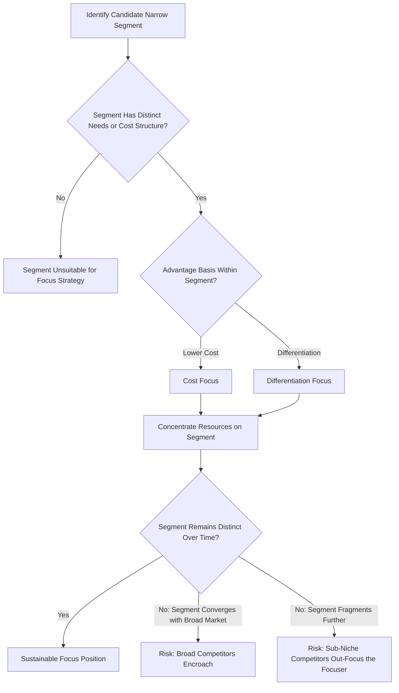

## Focus and Niche Strategies

### Definition and Conceptual Foundation

Focus Strategy, within Porter's generic competitive strategies framework, is a business-level strategy in which a firm concentrates its efforts on serving a narrowly defined competitive scope — a specific buyer segment, product line, or geographic market — rather than competing across the broad industry. The strategic logic rests on the premise that a firm targeting a narrow segment can serve that segment's distinctive needs more effectively or efficiently than broadly-targeted competitors optimizing for the average buyer across the entire market.

Focus strategy is not a standalone source of advantage in itself; it must be combined with either a cost or differentiation orientation applied specifically to the chosen segment, yielding the two focus variants: **Cost Focus** and **Differentiation Focus**. "Niche strategy" is often used interchangeably with focus strategy in practitioner and academic literature, though "niche" sometimes carries an additional connotation of an especially small or specialized segment.

**Key Points**

- Focus strategy requires that the target segment either have buyers with distinctive needs unmet by broad-market competitors, or that the production/delivery system optimal for that segment differ meaningfully from the systems serving other segments
- A focuser achieves competitive advantage within its chosen segment even though it may lack competitive advantage across the industry as a whole
- Selecting an appropriate segment — one with structurally different requirements — is the critical strategic decision underlying a successful focus strategy

### Cost Focus vs. Differentiation Focus

#### Cost Focus

Pursuing the lowest cost position specifically within a narrow target segment, exploiting cost differences that exist within that segment but may be overlooked or inefficient for broad-based competitors to address.

**Example basis**: A regional manufacturer serving a specific local market may achieve lower distribution costs than a national competitor whose logistics network is optimized for broad geographic coverage rather than local density.

#### Differentiation Focus

Pursuing differentiation specifically within a narrow target segment, exploiting the special needs of buyers in that segment that broadly-targeted competitors do not, or cannot efficiently, address.

**Example basis**: A specialty medical device manufacturer serving a narrow clinical application may develop features precisely tailored to that specialty's workflow, which a broad-line medical device company would find uneconomical to replicate given its need to serve many specialties simultaneously.

### Diagram: Focus Strategy Positioning Logic

<svg xmlns="http://www.w3.org/2000/svg" viewBox="0 0 900 400" font-family="Arial, sans-serif">
<text x="450" y="28" text-anchor="middle" font-size="17" font-weight="bold" fill="#1a1a1a">Focus Strategy: Segment Selection Logic (svg_diagram)</text>
<ellipse cx="450" cy="220" rx="380" ry="150" fill="#e8eef7" stroke="#4a6fa5" stroke-width="1.5" />
<text x="450" y="90" text-anchor="middle" font-size="13" font-weight="bold" fill="#333333">Broad Industry Market</text>
<ellipse cx="280" cy="220" rx="110" ry="90" fill="#fde3c8" stroke="#b5651d" stroke-width="1.5" />
<text x="280" y="200" text-anchor="middle" font-size="12" font-weight="bold" fill="#1a1a1a">Target Segment A</text>
<text x="280" y="220" text-anchor="middle" font-size="10" fill="#333333">Distinct cost structure</text>
<text x="280" y="236" text-anchor="middle" font-size="10" fill="#333333">→ Cost Focus</text>
<ellipse cx="600" cy="220" rx="110" ry="90" fill="#dcead0" stroke="#4a7a2a" stroke-width="1.5" />
<text x="600" y="200" text-anchor="middle" font-size="12" font-weight="bold" fill="#1a1a1a">Target Segment B</text>
<text x="600" y="220" text-anchor="middle" font-size="10" fill="#333333">Distinct buyer needs</text>
<text x="600" y="236" text-anchor="middle" font-size="10" fill="#333333">→ Differentiation Focus</text>

<text x="450" y="375" text-anchor="middle" font-size="11" fill="`#555555`">Broad-market competitors optimize for the average buyer, leaving segment-specific gaps for focusers to exploit</text>

</svg>

### Requirements for Successful Implementation

- **Segment selection discipline**: Identifying a segment with genuinely distinctive needs or a genuinely different optimal cost structure, not merely a smaller slice of the same broad market
- **Resource concentration**: Directing organizational resources, capabilities, and management attention specifically toward serving the chosen segment exceptionally well, rather than spreading effort across the broad market
- **Deep segment knowledge**: Developing specialized understanding of the target segment's needs, often exceeding what a broad-market competitor can economically justify acquiring
- **Scalable discipline**: Maintaining focus discipline even as the firm grows, resisting the temptation to broaden scope prematurely in ways that dilute the segment-specific advantage

### Worked Example

**Example**

A specialty athletic footwear company applies differentiation focus by targeting competitive trail runners specifically, rather than the broad athletic footwear market:

- **Product Design**: Develops footwear with highly specific traction patterns, weight optimization, and durability characteristics tailored to technical trail conditions, features broad-line athletic brands would find uneconomical to develop for a narrow customer base
- **Marketing**: Builds credibility through sponsorship of competitive trail-running athletes and partnerships with trail-running events, rather than broad mass-market advertising
- **Distribution**: Sells primarily through specialty running retailers with knowledgeable staff, rather than broad big-box sporting goods distribution

**Output**

By concentrating resources on a narrowly defined segment with genuinely distinctive technical requirements, the firm achieves a level of product specialization and brand credibility within that segment that a broad-line athletic footwear company — which must balance investment across running, basketball, training, and casual wear — cannot easily match, even though the broad-line competitor possesses far greater overall scale.

### Diagram: Focus Strategy Decision and Risk Flow

### Sustainability and Risks

- **Segment convergence with the broad market**: If differences between the target segment and the broad market narrow over time (e.g., due to changing buyer preferences or technology standardization), the focuser's specialized advantage erodes, and broad-market competitors can serve the segment adequately without dedicated investment
- **Cost differential widening**: If the cost gap between broad-range competitors and the focuser widens too much, the cost advantages of serving a narrow segment may be eliminated, particularly if broad-market competitors achieve significant scale economies that outweigh the focuser's specialization benefits
- **Sub-segmentation by rival focusers**: Competitors may identify even narrower sub-segments within the focuser's target market and out-focus the original focuser, a phenomenon sometimes termed "niche within a niche" competition
- **Growth ceiling**: By design, focus strategies target a limited addressable market, constraining the scale of growth achievable without expanding scope (which risks diluting the focused advantage)

[Inference] The risk of "niche within a niche" competition eroding an established focuser's position is a commonly discussed pattern in strategy literature, though the frequency and speed with which this occurs varies substantially by industry structure, entry barriers, and the minimum efficient scale required to serve sub-segments profitably.

### Focus Strategy and the Five Forces

- **Rivalry**: Reduces direct competition with broad-market players by operating in a segment they do not prioritize, though rivalry with other focusers targeting the same segment can be intense
- **Buyer Power**: Deep segment specialization can reduce buyer power by making the focuser's offering difficult to substitute for buyers with those specific needs
- **Supplier Power**: Smaller scale relative to broad-market competitors can sometimes result in weaker bargaining leverage with suppliers, a potential structural disadvantage of the focus strategy
- **New Entrants**: Specialized knowledge and segment-specific reputation can act as a barrier to entry within the niche, even though barriers to the broad industry may be low
- **Substitutes**: Segment-specific tailoring can reduce the appeal of generic substitutes that do not address the segment's particular needs as precisely

### Relationship to Other Strategic Frameworks

- **Porter's Generic Competitive Strategies**: Focus (Cost Focus and Differentiation Focus) constitutes two of the four generic strategies, distinguished from Cost Leadership and Differentiation by narrow rather than broad competitive scope
- **Cost Leadership Strategy**: Cost Focus applies the same underlying cost-driver logic (scale, learning curve, process efficiency) but scoped to a specific segment
- **Differentiation Strategy**: Differentiation Focus applies the same underlying uniqueness logic but scoped to a specific segment's distinctive needs
- **Market Segmentation Theory** (marketing discipline): Provides the analytical basis for identifying viable, distinctive segments suitable for a focus strategy
- **Blue Ocean Strategy**: Related in spirit, as both emphasize identifying underserved market spaces, though Blue Ocean Strategy emphasizes creating new demand rather than serving an existing narrow segment more effectively
- **VRIO / Resource-Based View**: Explains why deep, segment-specific knowledge and relationships can constitute a durable, difficult-to-imitate resource sustaining the focus position

**Next Steps**

- Porter's Generic Competitive Strategies (overview)
- Cost Leadership Strategy
- Differentiation Strategy
- Market Segmentation and Target Market Selection
- Blue Ocean Strategy and Value Innovation
- Porter's Five Forces Framework
- VRIO Framework and Resource-Based View
- Niche Market Entry and Growth Strategy