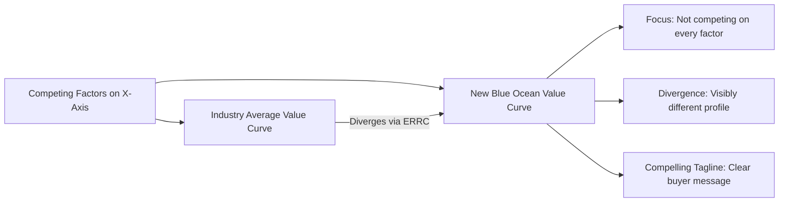

## Blue Ocean Strategy and Value Innovation

### Definition and Conceptual Foundation

Blue Ocean Strategy is a strategic management framework developed by W. Chan Kim and Renée Mauborgne, formalized in their 2005 book *Blue Ocean Strategy: How to Create Uncontested Market Space and Make the Competition Irrelevant*. The framework proposes that sustainable high growth and profit come not from battling competitors within existing industry boundaries ("red oceans," characterized by bloody competition over shrinking profit pools) but from creating new, uncontested market space ("blue oceans") where competition is rendered largely irrelevant.

The central mechanism underlying Blue Ocean Strategy is **value innovation** — the simultaneous pursuit of differentiation and low cost, challenging the conventional strategic assumption (embedded in Porter's generic strategies framework) that firms must choose between a cost-based or differentiation-based value proposition. Value innovation is achieved by fundamentally reconstructing market boundaries and redefining the factors an industry competes on, rather than benchmarking against existing competitors.

**Key Points**

- "Red oceans" represent existing, known market space where industry boundaries are defined and competitive rules are understood; "blue oceans" represent new market space created through value innovation
- Value innovation occurs only when a firm aligns innovation with utility, price, and cost positions simultaneously — innovation alone (without corresponding value to buyers) is not value innovation
- The framework explicitly departs from a competitor-focused orientation, instead emphasizing non-customers and unmet or unarticulated needs as sources of new demand

### Red Ocean vs. Blue Ocean: Comparative Framework

| Dimension | Red Ocean Strategy | Blue Ocean Strategy |
| --- | --- | --- |
| Market Space | Compete in existing market space | Create uncontested market space |
| Competition | Beat the competition | Make competition irrelevant |
| Demand | Exploit existing demand | Create and capture new demand |
| Value-Cost Trade-off | Accept the value-cost trade-off (choose cost OR differentiation) | Break the value-cost trade-off (pursue both simultaneously) |
| Strategic Orientation | Align the whole system of a firm's activities with a chosen strategic choice of cost leadership or differentiation | Align the whole system of a firm's activities in pursuit of differentiation AND low cost |

### The Four Actions Framework (ERRC Grid)

The core analytical tool for achieving value innovation asks four fundamental questions to reconstruct the value curve relative to existing industry norms:

1. **Eliminate** — Which factors that the industry has long competed on should be eliminated entirely?
2. **Reduce** — Which factors should be reduced well below the industry's standard?
3. **Raise** — Which factors should be raised well above the industry's standard?
4. **Create** — Which factors should be created that the industry has never offered?

The Eliminate and Reduce actions provide insight into how to reduce the firm's cost structure relative to competitors; the Raise and Create actions provide insight into how to lift buyer value and generate new demand.

### Diagram: The Four Actions (ERRC) Grid

<svg xmlns="http://www.w3.org/2000/svg" viewBox="0 0 800 400" font-family="Arial, sans-serif">
<text x="400" y="28" text-anchor="middle" font-size="17" font-weight="bold" fill="#1a1a1a">Four Actions Framework: ERRC Grid (svg_diagram)</text>
<rect x="60" y="60" width="330" height="150" fill="#f5d5d5" stroke="#a83c3c" stroke-width="1.5" />
<text x="225" y="90" text-anchor="middle" font-size="15" font-weight="bold" fill="#1a1a1a">ELIMINATE</text>
<text x="225" y="115" text-anchor="middle" font-size="11" fill="#333333">Factors the industry takes</text>
<text x="225" y="132" text-anchor="middle" font-size="11" fill="#333333">for granted but add little value</text>
<text x="225" y="155" text-anchor="middle" font-size="10" fill="#555555">→ Drives cost down</text>
<rect x="410" y="60" width="330" height="150" fill="#fde3c8" stroke="#b5651d" stroke-width="1.5" />
<text x="575" y="90" text-anchor="middle" font-size="15" font-weight="bold" fill="#1a1a1a">REDUCE</text>
<text x="575" y="115" text-anchor="middle" font-size="11" fill="#333333">Factors over-engineered</text>
<text x="575" y="132" text-anchor="middle" font-size="11" fill="#333333">relative to buyer need</text>
<text x="575" y="155" text-anchor="middle" font-size="10" fill="#555555">→ Drives cost down</text>
<rect x="60" y="230" width="330" height="150" fill="#dcead0" stroke="#4a7a2a" stroke-width="1.5" />
<text x="225" y="260" text-anchor="middle" font-size="15" font-weight="bold" fill="#1a1a1a">RAISE</text>
<text x="225" y="285" text-anchor="middle" font-size="11" fill="#333333">Factors below industry</text>
<text x="225" y="302" text-anchor="middle" font-size="11" fill="#333333">standard that buyers value</text>
<text x="225" y="325" text-anchor="middle" font-size="10" fill="#555555">→ Lifts buyer value</text>
<rect x="410" y="230" width="330" height="150" fill="#d9e8f5" stroke="#2e5f8a" stroke-width="1.5" />
<text x="575" y="260" text-anchor="middle" font-size="15" font-weight="bold" fill="#1a1a1a">CREATE</text>
<text x="575" y="285" text-anchor="middle" font-size="11" fill="#333333">Entirely new sources of</text>
<text x="575" y="302" text-anchor="middle" font-size="11" fill="#333333">value never offered before</text>
<text x="575" y="325" text-anchor="middle" font-size="10" fill="#555555">→ Lifts buyer value</text>
</svg>

### The Strategy Canvas and Value Curve

The **Strategy Canvas** is a diagnostic and action framework that captures the current state of the known market space, plotting the industry's key competing factors on the horizontal axis and the offering level buyers receive across those factors on the vertical axis. The resulting **value curve** graphically depicts a firm's relative performance across the factors of competition, compared against industry rivals.

A successful blue ocean value curve typically exhibits three characteristics:

- **Focus**: The firm does not diffuse efforts across all factors of competition
- **Divergence**: The value curve should look visibly different from the average industry value curve, reflecting the ERRC actions taken
- **Compelling tagline**: The strategy should be capable of expression in a clear, honest, and compelling message that speaks directly to buyers

### Worked Example: Applying the Four Actions Framework

**Example**

Consider a well-known illustrative case frequently discussed in blue ocean strategy literature: a circus-format entertainment company repositioning away from traditional circus competition.

- **Eliminate**: Animal acts (high cost, ethical/regulatory concerns) and multiple-ring format (diffuses audience attention)
- **Reduce**: Star performer costs (moving away from expensive celebrity headliners) and fun/humor elements retained but reduced in emphasis relative to traditional circus format
- **Raise**: Unique venue experience and production quality relative to traditional circus standards
- **Create**: Theatrical storyline, artistic music and dance, sophisticated theme and narrative — elements borrowed from theater and opera rather than traditional circus

**Output**

By simultaneously eliminating and reducing high-cost, declining-value elements of the traditional circus format while raising and creating new sources of value drawn from theater and dance, the firm reduced its overall cost structure relative to traditional circuses while simultaneously creating a differentiated experience that attracted a new buyer group (adult, corporate, and theater-going audiences) who had previously been non-customers of circus entertainment — the defining characteristic of successful value innovation.

### The Three Tiers of Non-Customers

A central analytical device in Blue Ocean Strategy for identifying new demand is examining **non-customers** of the industry, categorized into three tiers:

1. **First-tier ("soon-to-be") non-customers**: Buyers who minimally use the industry's current offerings out of necessity but would readily switch given a better alternative
2. **Second-tier ("refusing") non-customers**: Buyers who have consciously chosen against the industry's offerings, considering them unacceptable or beyond their means
3. **Third-tier ("unexplored") non-customers**: Buyers who have never considered the industry's offerings as a viable option, typically because they associate the industry with a different market entirely

[Inference] The three-tier non-customer framework is presented in Kim and Mauborgne's original work as a systematic method for expanding demand; the specific degree to which each tier represents a realistically capturable market varies by industry and requires empirical market research rather than being determinable from the framework alone.

### Value Innovation vs. Traditional Competitive Strategy

Blue Ocean Strategy explicitly positions itself as distinct from — though not entirely incompatible with — Porter's generic strategies:

- Porter's framework assumes a structural trade-off between cost and differentiation within a given, fixed industry structure
- Blue Ocean Strategy argues industry structure itself is not fixed and can be reshaped through value innovation, potentially escaping the trade-off by expanding the market rather than competing within existing boundaries
- Value innovation targets **demand-side** expansion (growing the overall market and pool of buyers) rather than solely **supply-side** efficiency or uniqueness within an existing demand pool

[Inference] The claim that value innovation fully "breaks" the cost-differentiation trade-off, rather than achieving a favorable balance within a redefined market, is a matter of ongoing scholarly discussion; some strategy researchers view blue ocean outcomes as still subject to underlying economic trade-offs once the new market matures and attracts imitators.

### Sustainability of Blue Ocean Positions

- **First-mover advantages**: Early blue ocean creators often benefit from brand association with the new category and accumulated learning before competitors recognize the opportunity
- **Imitation barriers**: Sustainability depends on factors such as brand strength built during the uncontested period, economies of scale achieved early, network effects, legal protections (patents, trademarks), or cognitive/organizational barriers preventing incumbents from imitating (e.g., internal resistance to cannibalizing an existing red-ocean business model)
- **Eventual "reddening"**: Over time, successful blue oceans typically attract imitators and gradually convert into red oceans as the new market space becomes established and competitive, implying that value innovation should be viewed as an ongoing strategic process rather than a one-time event

### Common Pitfalls in Application

- **Confusing value innovation with technology innovation**: Genuine value innovation is not synonymous with cutting-edge technology; many blue ocean examples rely on the reconfiguration of existing, familiar elements rather than novel technology
- **Insufficient cost discipline**: Firms may successfully raise/create value but fail to adequately eliminate/reduce cost drivers, undermining the low-cost side of the value innovation equation
- **Benchmarking against competitors instead of redefining the market**: A common execution failure is applying the ERRC framework while still implicitly anchoring analysis to existing competitors' offerings rather than genuinely reconsidering industry boundaries and non-customer needs
- **Underestimating execution complexity**: Identifying a blue ocean opportunity analytically is distinct from the organizational, operational, and cultural challenge of executing the reconfigured business model

### Limitations and Critiques

- **Retrospective case selection bias**: Much of the framework's foundational evidence draws on successful historical examples identified after the fact, raising questions about whether the same analytical process reliably predicts success prospectively, as opposed to explaining success post hoc
- **Underspecified execution guidance**: Critics note the framework provides strong tools for identifying opportunity spaces (ERRC grid, strategy canvas) but comparatively less detailed guidance on the organizational and operational challenges of executing a value innovation strategy at scale
- **Trade-off skepticism**: Some strategy scholars question whether the value-cost trade-off is genuinely "broken" or merely temporarily favorable until competitive imitation and market maturation reassert conventional trade-off dynamics
- **Limited applicability in highly regulated or capital-intensive industries**: Industries with high structural barriers (e.g., heavy regulation, extreme capital intensity) may offer more limited scope for the kind of business-model reconstruction the framework envisions

### Relationship to Other Strategic Frameworks

- **Porter's Generic Competitive Strategies**: Blue Ocean Strategy directly challenges the strict cost-differentiation trade-off assumption underlying the generic strategies framework
- **Value Chain Analysis**: The ERRC grid can be applied activity-by-activity across the value chain to identify specific candidates for elimination, reduction, raising, or creation
- **SWOT/TOWS Matrix**: Blue ocean opportunities often emerge from careful analysis of external opportunities combined with internal strengths reconfigured in novel combinations
- **Business Model Innovation frameworks** (e.g., Business Model Canvas): Closely related, as value innovation frequently requires reconfiguring the broader business model, not merely the product offering
- **Disruptive Innovation Theory (Clayton Christensen)**: A related but distinct concept; disruptive innovation emphasizes technology or business-model shifts that initially underperform on mainstream metrics but appeal to overlooked segments, overlapping conceptually with Blue Ocean's non-customer analysis while differing in theoretical mechanism and origin

**Next Steps**

- Porter's Generic Competitive Strategies
- Value Chain Analysis
- Disruptive Innovation Theory
- Business Model Innovation and the Business Model Canvas
- SWOT and TOWS Matrix
- Market Segmentation and Non-Customer Analysis
- Strategic Group Mapping
- First-Mover Advantage and Strategic Timing