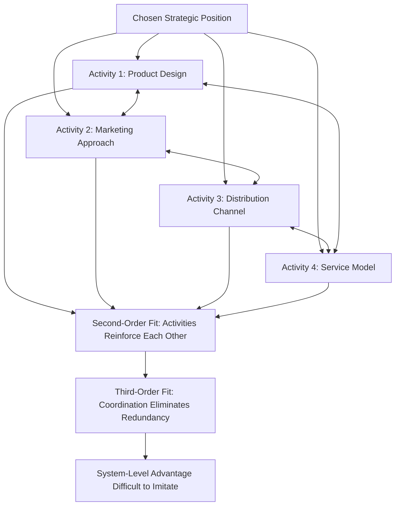

## Strategic Positioning and Trade-offs

### Definition and Conceptual Foundation

Strategic Positioning and Trade-offs is a foundational concept in business-level strategy, most rigorously articulated by Michael Porter in his 1996 *Harvard Business Review* article "What Is Strategy?" The framework distinguishes strategy from **operational effectiveness** and argues that sustainable competitive advantage arises from performing different activities than rivals, or performing similar activities in different ways — a concept Porter terms **strategic positioning**. Central to this view is the claim that a genuine strategic position requires **trade-offs**: choosing what *not* to do is as strategically important as choosing what to do.

Porter's core argument is that operational effectiveness — performing similar activities better than rivals (e.g., faster cycle times, fewer defects, higher productivity) — is necessary but not sufficient for superior profitability, because competitors can typically imitate best practices, causing convergence toward similar operating frontiers and driving competition down to price, which erodes industry profitability for all participants (a phenomenon Porter terms "competitive convergence").

**Key Points**

- Operational effectiveness (OE) and strategy are distinct: OE means performing similar activities better; strategy means performing different activities, or similar activities differently, in a way competitors cannot easily replicate
- OE is subject to constant imitation and diffusion of best practices, meaning it alone cannot sustain above-average profitability over time
- Trade-offs — the explicit choice to forgo certain activities or features in order to excel at others — are what make a strategic position defensible against imitation

### Three Sources of Strategic Positions

Porter identifies three distinct bases from which a strategic position can emerge, which are not mutually exclusive but represent different starting points for defining a distinctive position:

1. **Variety-Based Positioning** — Producing a subset of an industry's products or services based on product/service variety rather than customer segments; the firm can serve a wide range of customers but only for a narrow set of their needs
2. **Needs-Based Positioning** — Serving most or all of the needs of a particular group of customers, arising from differences in customer needs
3. **Access-Based Positioning** — Segmenting customers who are accessible in different ways, even though their needs are similar to other customers, due to differences in geography, scale, or channel requirements that call for different configurations of activities

**Key Points**

- Variety-based positioning targets a set of products/services rather than a customer segment
- Needs-based positioning most closely resembles traditional segmentation by customer group
- Access-based positioning is driven by differences in the best way to reach a customer group, even when underlying needs are similar to other segments

### Diagram: Three Bases of Strategic Positioning

<svg xmlns="http://www.w3.org/2000/svg" viewBox="0 0 900 380" font-family="Arial, sans-serif">
<text x="450" y="28" text-anchor="middle" font-size="17" font-weight="bold" fill="#1a1a1a">Three Sources of Strategic Positioning (svg_diagram)</text>
<rect x="60" y="70" width="240" height="170" fill="#d9e8f5" stroke="#2e5f8a" stroke-width="1.5" />
<text x="180" y="100" text-anchor="middle" font-size="14" font-weight="bold" fill="#1a1a1a">VARIETY-BASED</text>
<text x="180" y="130" text-anchor="middle" font-size="11" fill="#333333">Narrow set of products/</text>
<text x="180" y="147" text-anchor="middle" font-size="11" fill="#333333">services, broad customer base</text>
<text x="180" y="180" text-anchor="middle" font-size="10" fill="#555555">e.g., a specialty</text>
<text x="180" y="196" text-anchor="middle" font-size="10" fill="#555555">product-line producer</text>
<rect x="330" y="70" width="240" height="170" fill="#dcead0" stroke="#4a7a2a" stroke-width="1.5" />
<text x="450" y="100" text-anchor="middle" font-size="14" font-weight="bold" fill="#1a1a1a">NEEDS-BASED</text>
<text x="450" y="130" text-anchor="middle" font-size="11" fill="#333333">Broad set of needs for a</text>
<text x="450" y="147" text-anchor="middle" font-size="11" fill="#333333">particular customer group</text>
<text x="450" y="180" text-anchor="middle" font-size="10" fill="#555555">e.g., a full-service</text>
<text x="450" y="196" text-anchor="middle" font-size="10" fill="#555555">provider for one segment</text>
<rect x="600" y="70" width="240" height="170" fill="#fde3c8" stroke="#b5651d" stroke-width="1.5" />
<text x="720" y="100" text-anchor="middle" font-size="14" font-weight="bold" fill="#1a1a1a">ACCESS-BASED</text>
<text x="720" y="130" text-anchor="middle" font-size="11" fill="#333333">Similar needs, different</text>
<text x="720" y="147" text-anchor="middle" font-size="11" fill="#333333">geography/scale/channel</text>
<text x="720" y="180" text-anchor="middle" font-size="10" fill="#555555">e.g., rural vs. urban</text>
<text x="720" y="196" text-anchor="middle" font-size="10" fill="#555555">distribution configuration</text>

<text x="450" y="290" text-anchor="middle" font-size="12" fill="`#333333`">All three require a distinct, tailored configuration of activities to serve effectively</text>

</svg>

### The Three Types of Trade-offs

Porter identifies three distinct sources of trade-offs that reinforce a strategic position and make it defensible against imitation:

1. **Inconsistencies in Image or Reputation** — Offering conflicting value propositions simultaneously (e.g., being both a premium and a discount provider) can damage credibility and confuse the brand's meaning with buyers
2. **Trade-offs Arising from Activities Themselves** — Different positions require different activity configurations (e.g., product design suited for variety versus product design suited for low cost); trying to deliver both requires suboptimal compromises in equipment, employee behavior, or systems that reduce effectiveness in serving either position well
3. **Limits on Internal Coordination and Control** — Choosing clear trade-offs simplifies organizational focus, communicates priorities clearly, and clarifies what the organization does and does not do, making it easier to align management and operational decisions around a consistent direction

**Key Points**

- Trade-offs are not incidental costs of strategy; they are essential to strategy, because without them, competitors could easily reposition to straddle both value propositions
- Trying to be "all things to all customers" — avoiding trade-offs — nearly guarantees that a firm lacks any distinctive advantage, since a broadly hedged position can be replicated without requiring rivals to make hard choices themselves

### The Concept of "Fit" Among Activities

Beyond a single distinctive position, Porter argues sustainable competitive advantage depends on **strategic fit** — how a firm's activities interact and reinforce one another. Fit operates at three progressively more powerful levels:

1. **First-Order Fit (Simple Consistency)** — Each activity is aligned with the overall strategy
2. **Second-Order Fit (Reinforcing Activities)** — Activities are reinforcing, such that the value of one activity is enhanced by others (e.g., strong brand reputation combined with rigorous quality control mutually reinforce each other)
3. **Third-Order Fit (Optimization of Effort)** — Coordination and information exchange across activities to eliminate redundancy and minimize wasted effort, extending beyond the firm's own activities to coordination with channels and suppliers

**Key Points**

- Higher-order fit makes a strategic position progressively more difficult for competitors to imitate, since imitating an entire reinforcing system of activities is much harder than replicating a single feature or activity
- Competitors seeking to imitate a firm with strong activity fit must replicate the entire interlocking system, not merely individual practices, because a single copied practice without the surrounding reinforcing activities delivers little benefit

### Diagram: Activity System Map (Illustrative)

### Worked Example: Positioning, Trade-offs, and Fit in Practice

**Example**

Consider a discount furniture retailer positioned around affordable, self-assembly, ready-to-collect furniture (an illustrative composite drawn from well-known industry patterns of large-format flat-pack furniture retailing):

- **Chosen Position**: Needs-based positioning targeting cost-conscious, style-aware buyers furnishing an entire home
- **Trade-off 1 (Activities)**: Flat-pack, self-assembly design trades off customer convenience for substantially lower shipping, storage, and manufacturing costs — a trade-off a full-service, assembled-furniture retailer would not accept
- **Trade-off 2 (Image)**: Consistently communicating a value-oriented, design-conscious brand image, avoiding the inconsistency of simultaneously trying to project ultra-premium craftsmanship positioning
- **Fit**: In-store showroom design (activity) reinforces self-service browsing (activity), which reinforces warehouse-attached retail format (activity), which reinforces flat-pack packaging (activity) — each activity choice mutually reinforces the others around the low-cost, self-assembly position

**Output**

A competitor attempting to imitate a single element (e.g., copying the showroom layout) without replicating the entire reinforcing system of flat-pack design, warehouse-attached retail, and self-service logistics would fail to replicate the underlying cost and experience advantages, illustrating how activity-system fit — not any single activity — constitutes the durable source of advantage.

### Strategic Positioning vs. Growth Trap Pitfalls

Porter identifies several common managerial pitfalls that erode strategic positioning over time, often under the pressure to pursue growth:

- **Straddling**: Attempting to match a competitor's activities or offer a competing value proposition while retaining the firm's existing position, resulting in compromised activity configurations that serve neither position well
- **Growth trap**: Pursuing incremental customers, product line extensions, or new segments in ways that erode the firm's original distinctive position, gradually diluting fit and consistency
- **Overestimating universal appeal**: Assuming a successful position with one customer group will translate seamlessly to broader markets without accounting for trade-offs required to genuinely serve that broader market

[Inference] The framing of "growth trap" dynamics as a leading cause of strategic erosion is a central argument in Porter's 1996 article and widely referenced in strategy pedagogy; the empirical frequency with which growth-driven straddling specifically (as opposed to other causes such as external disruption) leads to competitive decline varies across industries and is not quantified within the framework itself.

### Limitations and Critiques

- **Industry dynamism**: Critics note the framework's emphasis on stable trade-offs may be less applicable in rapidly evolving or digitally-enabled industries, where technology can sometimes reduce the cost of straddling multiple positions simultaneously (e.g., mass customization technologies)
- **Difficulty of ex-ante trade-off identification**: While Porter argues trade-offs are essential, identifying precisely which trade-offs will prove strategically durable, as opposed to merely operationally costly, requires substantial managerial judgment
- **Tension with Blue Ocean Strategy**: The strict trade-off logic in this framework stands in direct tension with Blue Ocean Strategy's claim that value innovation can simultaneously pursue low cost and differentiation, representing one of the more actively debated tensions in business strategy literature
- **Underemphasis on dynamic capability-building**: The framework describes what a strong static position and fit look like but offers comparatively less guidance on the organizational processes required to build and adapt such positions over time (a gap addressed by Dynamic Capabilities Theory)

### Relationship to Other Strategic Frameworks

- **Porter's Generic Competitive Strategies**: Strategic positioning and trade-offs provide the deeper theoretical justification for why cost leadership and differentiation require distinct, non-overlapping activity systems rather than being freely combinable
- **Value Chain Analysis**: Activity-system fit is a direct extension of value chain thinking, examining not just individual activities but the reinforcing relationships (linkages) among them
- **Blue Ocean Strategy**: Represents a direct theoretical counterpoint, challenging the necessity of strict trade-offs under conditions of genuine value innovation
- **Dynamic Capabilities Theory**: Complements this largely static framework by explaining how firms adapt their activity systems and trade-offs as competitive and technological conditions evolve
- **VRIO / Resource-Based View**: Activity-system fit, particularly third-order fit, is often cited as a source of causal ambiguity and social complexity that makes a position difficult for competitors to imitate, aligning with VRIO's inimitability criterion

**Next Steps**

- Porter's Generic Competitive Strategies
- Value Chain Analysis
- Blue Ocean Strategy and Value Innovation
- VRIO Framework and Resource-Based View
- Dynamic Capabilities Theory
- Activity System Mapping (extended application)
- Operational Effectiveness vs. Strategy
- Corporate Growth Strategy and Diversification Risk