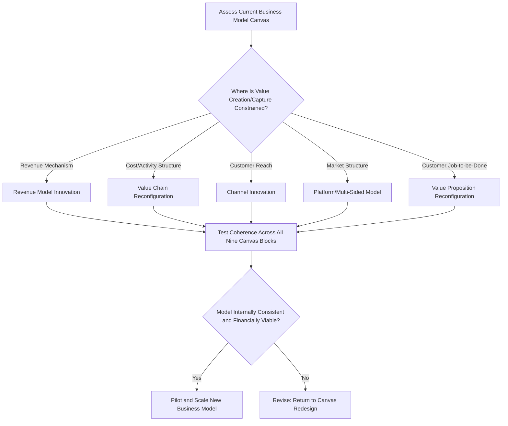

## Business Model Design and Innovation

### Definition and Conceptual Foundation

Business Model Design and Innovation is a strategic management domain concerned with how a firm creates, delivers, and captures value — distinct from, but closely related to, competitive strategy. While competitive strategy (as in Porter's frameworks) primarily addresses how a firm positions itself relative to rivals within a given industry structure, business model design addresses the more fundamental architecture of how the firm converts inputs and activities into economic value for itself and its customers.

A widely cited definition, from Osterwalder and Pigneur's *Business Model Generation* (2010), describes a business model as **"the rationale of how an organization creates, delivers, and captures value."** Business model innovation refers to the deliberate reconfiguration of this underlying architecture — not merely incremental product or process improvement — often creating new sources of competitive advantage that traditional activity-based or positioning-based strategy frameworks do not fully capture.

**Key Points**

- A business model is distinct from strategy: strategy addresses competitive positioning and choices about how to win against rivals, while a business model addresses the value creation, delivery, and capture architecture that makes the strategy economically viable
- Business model innovation can be a source of competitive advantage independent of, or in combination with, generic competitive strategies (cost leadership, differentiation, focus)
- Effective business model innovation typically requires coherence among its components — value proposition, revenue mechanism, and cost structure must align consistently

### The Business Model Canvas: Nine Building Blocks

Osterwalder and Pigneur's Business Model Canvas is the most widely adopted structured tool for business model design, organizing a firm's model into nine interlocking building blocks:

1. **Customer Segments** — The distinct groups of people or organizations the firm aims to reach and serve
2. **Value Propositions** — The bundle of products and services that create value for a specific customer segment
3. **Channels** — How the firm communicates with and reaches customer segments to deliver a value proposition
4. **Customer Relationships** — The types of relationships a firm establishes with specific customer segments
5. **Revenue Streams** — The cash a firm generates from each customer segment
6. **Key Resources** — The most important assets required to make the business model work
7. **Key Activities** — The most important actions a firm must take to operate successfully
8. **Key Partnerships** — The network of suppliers and partners that make the business model work
9. **Cost Structure** — All costs incurred to operate the business model

**Key Points**

- The canvas is deliberately organized so the right-hand side (customer segments, value propositions, channels, relationships, revenue) addresses the "value" and customer-facing dimension, while the left-hand side (key resources, activities, partnerships, cost structure) addresses the "efficiency" and internal dimension
- Revenue streams and cost structure sit at the base of the canvas, representing the financial viability test of the overall model

### Diagram: Business Model Canvas Structure

<svg xmlns="http://www.w3.org/2000/svg" viewBox="0 0 900 480" font-family="Arial, sans-serif">
<text x="450" y="26" text-anchor="middle" font-size="17" font-weight="bold" fill="#1a1a1a">Business Model Canvas — Nine Building Blocks (svg_diagram)</text>
<rect x="40" y="50" width="140" height="100" fill="#dcead0" stroke="#4a7a2a" stroke-width="1.5" />
<text x="110" y="75" text-anchor="middle" font-size="11" font-weight="bold" fill="#1a1a1a">Key Partners</text>
<rect x="190" y="50" width="140" height="100" fill="#dcead0" stroke="#4a7a2a" stroke-width="1.5" />
<text x="260" y="75" text-anchor="middle" font-size="11" font-weight="bold" fill="#1a1a1a">Key Activities</text>
<rect x="190" y="160" width="140" height="90" fill="#dcead0" stroke="#4a7a2a" stroke-width="1.5" />
<text x="260" y="185" text-anchor="middle" font-size="11" font-weight="bold" fill="#1a1a1a">Key Resources</text>
<rect x="340" y="50" width="180" height="200" fill="#fde3c8" stroke="#b5651d" stroke-width="1.5" />
<text x="430" y="80" text-anchor="middle" font-size="13" font-weight="bold" fill="#1a1a1a">Value Propositions</text>
<rect x="530" y="50" width="140" height="100" fill="#d9e8f5" stroke="#2e5f8a" stroke-width="1.5" />
<text x="600" y="75" text-anchor="middle" font-size="11" font-weight="bold" fill="#1a1a1a">Customer Relationships</text>
<rect x="680" y="50" width="180" height="100" fill="#d9e8f5" stroke="#2e5f8a" stroke-width="1.5" />
<text x="770" y="75" text-anchor="middle" font-size="11" font-weight="bold" fill="#1a1a1a">Customer Segments</text>
<rect x="530" y="160" width="140" height="90" fill="#d9e8f5" stroke="#2e5f8a" stroke-width="1.5" />
<text x="600" y="185" text-anchor="middle" font-size="11" font-weight="bold" fill="#1a1a1a">Channels</text>
<rect x="40" y="270" width="410" height="90" fill="#f5d5d5" stroke="#a83c3c" stroke-width="1.5" />
<text x="245" y="295" text-anchor="middle" font-size="12" font-weight="bold" fill="#1a1a1a">Cost Structure</text>
<rect x="460" y="270" width="400" height="90" fill="#f0e6f5" stroke="#7a3f9d" stroke-width="1.5" />
<text x="660" y="295" text-anchor="middle" font-size="12" font-weight="bold" fill="#1a1a1a">Revenue Streams</text>

<text x="450" y="400" text-anchor="middle" font-size="12" fill="`#555555`">Left side: efficiency/internal focus | Right side: value/customer focus</text>

</svg>

### Categories of Business Model Innovation

Business model innovation can occur through reconfiguration of one or more of the nine canvas elements, but common patterns identified across strategy literature include:

1. **Revenue Model Innovation** — Changing how the firm captures value (e.g., shifting from one-time purchase to subscription, from unit-based pricing to usage-based pricing, or from direct sale to freemium models)
2. **Value Chain/Activity Reconfiguration** — Changing key activities or resources to fundamentally alter cost structure or capability requirements (e.g., outsourcing manufacturing to shift from asset-heavy to asset-light operations)
3. **Channel Innovation** — Changing how the firm reaches customers (e.g., shifting from wholesale/retail distribution to direct-to-consumer digital channels)
4. **Platform and Multi-Sided Market Models** — Creating value by facilitating exchange between two or more distinct customer groups (e.g., connecting buyers and sellers, or advertisers and content consumers), capturing value through transaction fees, subscriptions, or advertising
5. **Value Proposition Reconfiguration** — Fundamentally redefining what job the product or service performs for the customer, often expanding from a product to an integrated solution or service

**Key Points**

- Business model innovation is frequently, though not exclusively, enabled by digital technology, which can substantially reduce the marginal cost of reaching new customer segments, personalizing offerings, or coordinating multi-sided platforms
- Different innovation types are not mutually exclusive; the most defensible business model innovations often combine reconfiguration across multiple canvas elements simultaneously (e.g., pairing a subscription revenue model with a direct-to-consumer channel shift)

### Worked Example: Business Model Innovation Analysis

**Example**

Consider a traditional industrial equipment manufacturer transitioning from a product-sale business model to an "equipment-as-a-service" model:

- **Original Model**: Customer Segment: Manufacturing plants; Value Proposition: Durable industrial equipment; Revenue Stream: One-time equipment sale; Cost Structure: Manufacturing and distribution costs; Key Activities: Production, sales
- **Innovated Model**: Customer Segment: Same manufacturing plants; Value Proposition: Guaranteed equipment uptime and performance (a service outcome, not just a physical product); Revenue Stream: Recurring subscription/usage-based fees tied to equipment uptime; Key Activities: Added remote monitoring, predictive maintenance, and data analytics; Key Resources: Added IoT sensor technology and data infrastructure; Key Partnerships: Added telecom/cloud infrastructure providers

**Output**

By reconfiguring the value proposition from "sell a durable machine" to "guarantee operational uptime," and correspondingly shifting the revenue stream to recurring, usage-based fees, the manufacturer transforms customer relationships from transactional to ongoing, captures more predictable recurring revenue, and creates switching costs through embedded monitoring infrastructure — outcomes that a pure product-differentiation strategy applied to the original business model would not achieve on its own.

### Diagram: Business Model Innovation Decision Flow

### Business Model Viability: Coherence and Testing

A proposed business model innovation should be evaluated for coherence across all nine canvas building blocks before scaling:

- **Value-cost coherence**: Does the value proposition justify the revenue mechanism chosen, and does the cost structure allow for viable margins at the proposed price/revenue model?
- **Resource-activity alignment**: Do the key resources and activities specified actually enable delivery of the stated value proposition?
- **Partnership dependency risk**: Does the model rely on key partnerships that introduce strategic vulnerability (e.g., dependence on a platform or supplier that could capture disproportionate value)?
- **Scalability**: Does the cost structure scale favorably as customer segments grow, or does it introduce diseconomies that limit growth?

[Inference] The degree of emphasis strategy practitioners place on formal, staged testing (e.g., minimum viable business model experiments) before full-scale rollout varies by organizational context and industry; the general principle of validating coherence before scaling is widely endorsed in business model literature, though specific testing methodologies differ across practitioner traditions (e.g., lean startup methodology versus traditional stage-gate processes).

### Business Model Innovation and Competitive Advantage

- **Imitation resistance**: A well-designed business model innovation can be more difficult to imitate than a single product feature, because imitation requires replicating an entire interlocking system of resources, activities, partnerships, and revenue mechanisms, not just a visible output
- **New demand creation**: Business model innovation can expand the addressable market by making a value proposition accessible to previously underserved or non-consuming segments (e.g., subscription models lowering the upfront cost barrier to access)
- **Value capture repositioning**: Even without changing the underlying product, reconfiguring how value is captured (e.g., razor-and-blade pricing, freemium-to-premium conversion) can significantly alter a firm's profitability without requiring product-level differentiation

### Common Pitfalls

- **Value proposition without viable capture mechanism**: Designing an innovative and appealing value proposition without a correspondingly viable revenue and cost structure to sustain it
- **Underestimating channel conflict**: Introducing a new channel (e.g., direct-to-consumer) without addressing conflict with existing channel partners (e.g., traditional retailers or distributors)
- **Platform chicken-and-egg problem**: For multi-sided platform models, failing to solve the challenge of attracting both sides of the market simultaneously, since each side's participation depends on the presence of the other
- **Cannibalization resistance**: Internal organizational resistance to a new business model that risks cannibalizing an existing, established revenue stream, particularly in incumbent firms

### Limitations and Critiques

- **Descriptive rather than prescriptive**: The Business Model Canvas is primarily a structuring and communication tool; it describes the components of a business model comprehensively but offers comparatively limited guidance on which specific innovation path is likely to succeed in a given context
- **Static representation**: Like several other strategy tools, the canvas represents a business model at a point in time and does not inherently capture how a model should evolve dynamically as market conditions change (a gap partially addressed by Dynamic Capabilities Theory)
- **Overlap with strategy tools**: Critics note conceptual overlap between business model design and other strategy frameworks (e.g., value chain analysis, generic competitive strategies), raising questions about the framework's distinct theoretical contribution versus its practical utility as an organizing and communication tool
- **Execution risk understated**: As with Blue Ocean Strategy, the analytical clarity of business model design tools can understate the organizational, cultural, and operational difficulty of actually executing a business model transition, particularly for incumbent firms

### Relationship to Other Strategic Frameworks

- **Porter's Generic Competitive Strategies**: Business model design addresses value creation and capture architecture, complementing (rather than replacing) the competitive positioning choices addressed by generic strategies
- **Value Chain Analysis**: Key Activities, Key Resources, and Cost Structure blocks of the canvas draw directly on value chain logic
- **Blue Ocean Strategy**: Business model innovation is frequently the practical mechanism through which value innovation (simultaneous cost reduction and differentiation) is operationalized
- **Dynamic Capabilities Theory**: Explains the organizational capacity required to sense the need for business model innovation, seize the opportunity, and transform the firm's resource base accordingly
- **Strategic Positioning and Trade-offs**: Business model choices should ideally exhibit the same activity-system fit and coherence Porter describes, applied at the broader business-model level rather than only the competitive-activity level

**Next Steps**

- Blue Ocean Strategy and Value Innovation
- Value Chain Analysis
- Platform Strategy and Multi-Sided Markets
- Disruptive Innovation Theory
- Dynamic Capabilities Theory
- Digital Transformation Strategy
- Lean Startup Methodology and Business Model Testing
- Revenue Model Design (Subscription, Freemium, Usage-Based Pricing)