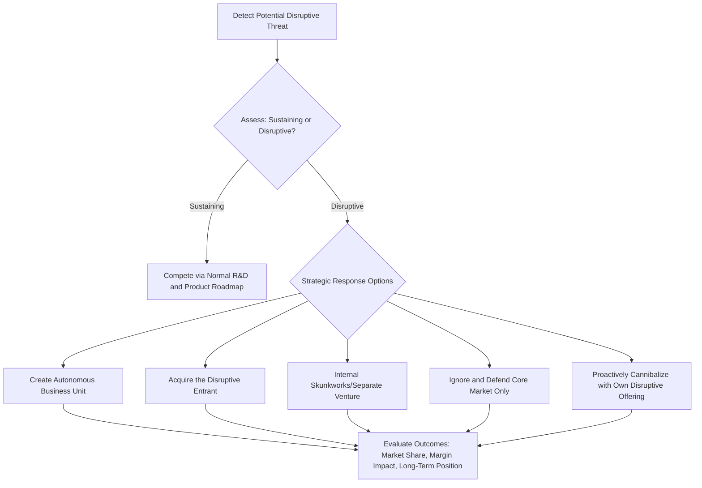

## Responding to Competitive Disruption

### Definition and Conceptual Foundation

Responding to Competitive Disruption addresses how incumbent firms strategically react when confronted with disruptive innovation — new entrants or business models that initially target overlooked or overserved segments with a simpler, cheaper, or more accessible offering, before progressively moving upmarket and displacing established competitors. The foundational theoretical grounding is Clayton Christensen's **Disruptive Innovation Theory**, first articulated in *The Innovator's Dilemma* (1997), which explains why well-managed incumbent firms, applying sound business judgment and listening closely to their best customers, often fail when confronted with disruptive threats.

Christensen's central insight is that incumbents typically fail against disruption not due to poor management, but because of a rational, systematic response to their existing customer base and resource allocation processes — a phenomenon he terms the **innovator's dilemma**: the very practices that make a firm successful in serving its current market (listening to customers, investing in sustaining innovations, prioritizing higher-margin opportunities) create structural blind spots toward disruptive threats.

**Key Points**

- Disruptive innovations typically underperform on the dimensions mainstream customers value most, but outperform on new dimensions valued by a different, often overlooked, customer segment (e.g., simplicity, convenience, affordability)
- Disruption is a process, not a single event — disruptive entrants typically improve over time along the trajectory mainstream customers value, eventually becoming "good enough" to capture the incumbent's core market
- Distinguishing disruptive innovation from purely sustaining innovation (improvements along the dimensions incumbents already compete on) is critical, since the appropriate strategic response differs substantially between the two

### Sustaining vs. Disruptive Innovation

| Dimension | Sustaining Innovation | Disruptive Innovation |
| --- | --- | --- |
| Target Customer | Existing mainstream customers | Overlooked, non-consuming, or low-end customers |
| Initial Performance | Improves on dimensions already valued by mainstream market | Underperforms on mainstream dimensions; wins on new dimensions (price, convenience, simplicity) |
| Incumbent Response | Well-suited to incumbent's existing resource allocation and customer-listening processes | Poorly suited to incumbent's existing processes; often ignored or dismissed initially |
| Trajectory | Continues improving along established performance metrics | Improves over time and eventually satisfies mainstream performance requirements too |

### Two Forms of Disruption

1. **Low-End Disruption** — Entrants target the least profitable, most price-sensitive customers at the bottom of an existing market who are overserved by current offerings, then move upmarket as their technology or business model improves
2. **New-Market Disruption** — Entrants create a market where none existed before, competing against "non-consumption" by making a product or service more accessible (lower cost, more convenient) to a population that previously lacked the resources, skill, or access to participate in the category

[Inference] The examples used to illustrate low-end versus new-market disruption in business education vary across sources and time periods; while the underlying analytical distinction between the two forms is a well-established element of Christensen's framework, specific named case examples fall outside what can be treated as stable, non-time-sensitive fact and are therefore not cited by name here.

### Diagram: The Disruption Trajectory

<svg xmlns="http://www.w3.org/2000/svg" viewBox="0 0 900 420" font-family="Arial, sans-serif">
<text x="450" y="26" text-anchor="middle" font-size="17" font-weight="bold" fill="#1a1a1a">Disruptive Innovation Trajectory (svg_diagram)</text>
<line x1="80" y1="360" x2="850" y2="360" stroke="#333333" stroke-width="1.5" />
<line x1="80" y1="60" x2="80" y2="360" stroke="#333333" stroke-width="1.5" />
<text x="465" y="395" text-anchor="middle" font-size="12" fill="#333333">Time</text>
<text x="30" y="210" text-anchor="middle" font-size="12" fill="#333333" transform="rotate(-90 30 210)">Performance</text>
<path d="M 100 320 Q 400 250 800 100" fill="none" stroke="#2e5f8a" stroke-width="2.5" />
<text x="700" y="90" font-size="11" fill="#2e5f8a" font-weight="bold">Sustaining Innovation Trajectory</text>
<text x="700" y="105" font-size="10" fill="#2e5f8a">(Incumbent, high-end focus)</text>
<path d="M 100 340 Q 300 320 500 260 Q 650 210 800 150" fill="none" stroke="#c55a11" stroke-width="2.5" stroke-dasharray="6,3" />
<text x="550" y="300" font-size="11" fill="#c55a11" font-weight="bold">Disruptive Innovation Trajectory</text>
<text x="550" y="315" font-size="10" fill="#c55a11">(Entrant, low-end/new-market start)</text>
<line x1="80" y1="230" x2="850" y2="230" stroke="#888888" stroke-width="1" stroke-dasharray="4,4" />
<text x="860" y="234" font-size="10" fill="#888888">Mainstream performance threshold</text>

<text x="500" y="245" text-anchor="middle" font-size="10" fill="`#a83c3c`" font-weight="bold">Disruptor crosses threshold — captures mainstream market</text>

</svg>

### The Innovator's Dilemma: Why Incumbents Struggle to Respond

Christensen identifies several structural reasons well-managed incumbents rationally fail to respond effectively to disruptive threats:

1. **Resource Allocation Processes**: Capital allocation systems favor investments with clear, large markets and higher margins, systematically disadvantaging early-stage disruptive opportunities that appear small and low-margin
2. **Listening Too Closely to Existing Customers**: Mainstream customers, by definition, do not want the performance trade-offs disruptive innovations initially require, so customer feedback processes can actively discourage investment in disruptive technology
3. **Organizational Values and Cost Structure**: Established cost structures and organizational values calibrated to higher-margin, higher-volume opportunities make it difficult to profitably pursue initially small, low-margin disruptive markets
4. **Asymmetric Motivation**: Incumbents are typically motivated to flee down-market disruption (since it threatens core profitability) while entrants are strongly motivated to move up-market (since it represents growth), creating a structural asymmetry favoring the disruptor's advance

### Strategic Response Options for Incumbents

1. **Create an Autonomous Business Unit**: Spin off a separate organizational unit with its own resource allocation process, cost structure, and metrics, insulated from the core business's competing priorities and margin expectations — widely regarded as one of the most effective structural responses because it removes the disruptive opportunity from processes calibrated to sustaining innovation
2. **Acquire the Disruptive Entrant**: Purchase the disruptive competitor, gaining its technology, talent, and market position, though successful integration requires preserving (rather than absorbing into incumbent processes) the acquired unit's distinct operating model
3. **Internal Skunkworks or Separate Venture**: Establish a dedicated internal venture team operating with different metrics, timelines, and resource allocation rules than the core business
4. **Proactive Self-Disruption**: Deliberately launch a competing disruptive offering before an external entrant does, accepting short-term cannibalization of the core business to protect long-term competitive position
5. **Defend and Retreat Upmarket**: Focus on the highest-margin, most demanding customer segments where the disruptor cannot yet compete effectively, while monitoring the disruptor's trajectory — a viable short-to-medium-term response, though Christensen's framework suggests this is often ultimately a losing long-term strategy if the disruptor continues improving

**Key Points**

- Structural separation (autonomous units, skunkworks) is frequently emphasized as more effective than attempting to manage disruptive response within the existing organizational structure, because it removes the disruptive opportunity from resource allocation and customer-listening processes calibrated for sustaining innovation
- No single response is universally optimal; the appropriate choice depends on factors including the incumbent's capital position, the disruptor's rate of improvement, and the incumbent's organizational capacity for internal venture management

### Worked Example: Applying the Framework

**Example**

An established enterprise software company selling comprehensive, high-touch, high-price software suites to large corporate clients observes a new entrant offering a simplified, lower-cost, self-service version of similar functionality targeting small businesses previously unable to afford the incumbent's offering (a new-market disruption pattern, since small businesses represent non-consumption of the incumbent's category).

- **Initial Incumbent Temptation**: Dismiss the entrant, since its offering lacks features large enterprise clients demand and generates far lower revenue per customer than the incumbent's core business
- **Innovator's Dilemma Dynamic**: The incumbent's resource allocation process favors continued investment in enterprise features (sustaining innovation for its most profitable segment) over the initially small, low-margin small-business opportunity
- **Recommended Strategic Response**: Establish an autonomous business unit with independent pricing, product roadmap, and margin targets, explicitly permitted to underprice the core product and pursue a simplified feature set, insulated from the core sales organization's incentives and customer relationships

**Output**

By operating a structurally separate autonomous unit, the incumbent can compete on the disruptor's own terms — lower price, simplicity, self-service — without deploying resource allocation, sales incentive, or product-development processes optimized for the high-touch enterprise business, addressing the incumbent's dilemma directly rather than attempting to serve both markets with a single unified organizational structure.

### Distinguishing Genuine Disruption from Incremental Competitive Threats

A critical analytical step before selecting a response is correctly diagnosing whether a competitive threat is genuinely disruptive or merely a conventional competitive challenge:

- **Not every low-price competitor is disruptive**: A competitor offering lower prices on comparable performance (a sustaining or purely price-competitive threat) requires a different response (e.g., cost leadership repositioning) than a genuinely disruptive threat exploiting a new performance trajectory
- **Not every new technology is disruptive**: A new technology that improves performance along dimensions mainstream customers already value is sustaining, not disruptive, even if it originates from a new entrant
- **Trajectory matters more than current performance**: The critical diagnostic question is whether the entrant's performance trajectory, over time, is likely to intersect with and eventually exceed mainstream performance requirements — not merely whether its current offering is inferior

[Inference] Misapplication of "disruption" as a label to any new or lower-cost competitive entrant, regardless of whether it exhibits the specific performance-trajectory pattern Christensen describes, is a commonly cited critique in both academic and practitioner discussions of the theory; the prevalence of this terminological misapplication in business practice is not something precisely quantifiable here.

### Limitations and Critiques

- **Retrospective explanatory power vs. predictive power**: Critics, including some empirical strategy researchers, have questioned whether the theory reliably predicts which innovations will prove disruptive in advance, as opposed to explaining disruption persuasively after the fact
- **Overly broad application of "disruption" terminology**: The term has become widely used in business and popular discourse in ways that diverge from Christensen's precise technical definition, diluting its analytical usefulness
- **Structural separation is not a guaranteed solution**: Even firms that adopt autonomous business units or acquisitions face substantial execution risk, including cultural integration challenges and the risk that the core organization eventually reabsorbs and constrains the autonomous unit
- **Industry-specific applicability**: The theory's core dynamics were developed primarily from technology and manufacturing industry cases; applicability to heavily regulated industries, network-effect-driven platforms, or industries with different competitive dynamics may require adaptation

### Relationship to Other Strategic Frameworks

- **Blue Ocean Strategy**: Conceptually overlapping in its attention to non-consumers and overlooked market segments, though Blue Ocean Strategy emphasizes deliberate value innovation while Disruptive Innovation Theory emphasizes the trajectory dynamics of entrant-versus-incumbent competition
- **Dynamic Capabilities Theory**: The sensing, seizing, and transforming capabilities described in dynamic capabilities theory directly address the organizational capacity incumbents need to detect and respond to disruptive threats effectively
- **Business Model Design and Innovation**: Effective disruptive responses frequently require business model innovation (not merely product innovation), particularly given disruptive entrants often compete via fundamentally different revenue models or cost structures
- **Porter's Generic Competitive Strategies**: Disruptive entrants frequently begin with what resembles a cost-focus or differentiation-focus position targeting an overlooked segment, later expanding scope as their offering improves
- **Strategic Positioning and Trade-offs**: The organizational difficulty incumbents face in serving both their core high-end position and a disruptive low-end opportunity simultaneously reflects the trade-off logic central to strategic positioning theory

**Next Steps**

- Dynamic Capabilities Theory
- Blue Ocean Strategy and Value Innovation
- Business Model Design and Innovation
- Corporate Venturing and Innovation Management
- Mergers and Acquisitions Strategy
- Strategic Positioning and Trade-offs
- Technology Adoption Life Cycle
- Organizational Ambidexterity (Exploration vs. Exploitation)