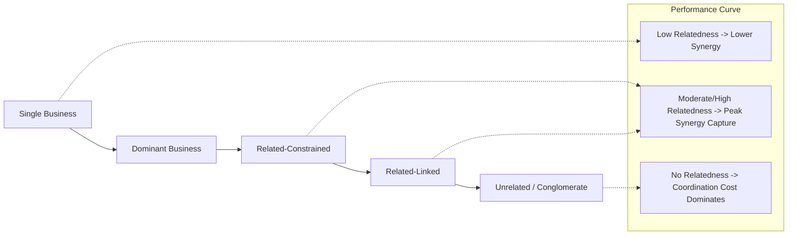
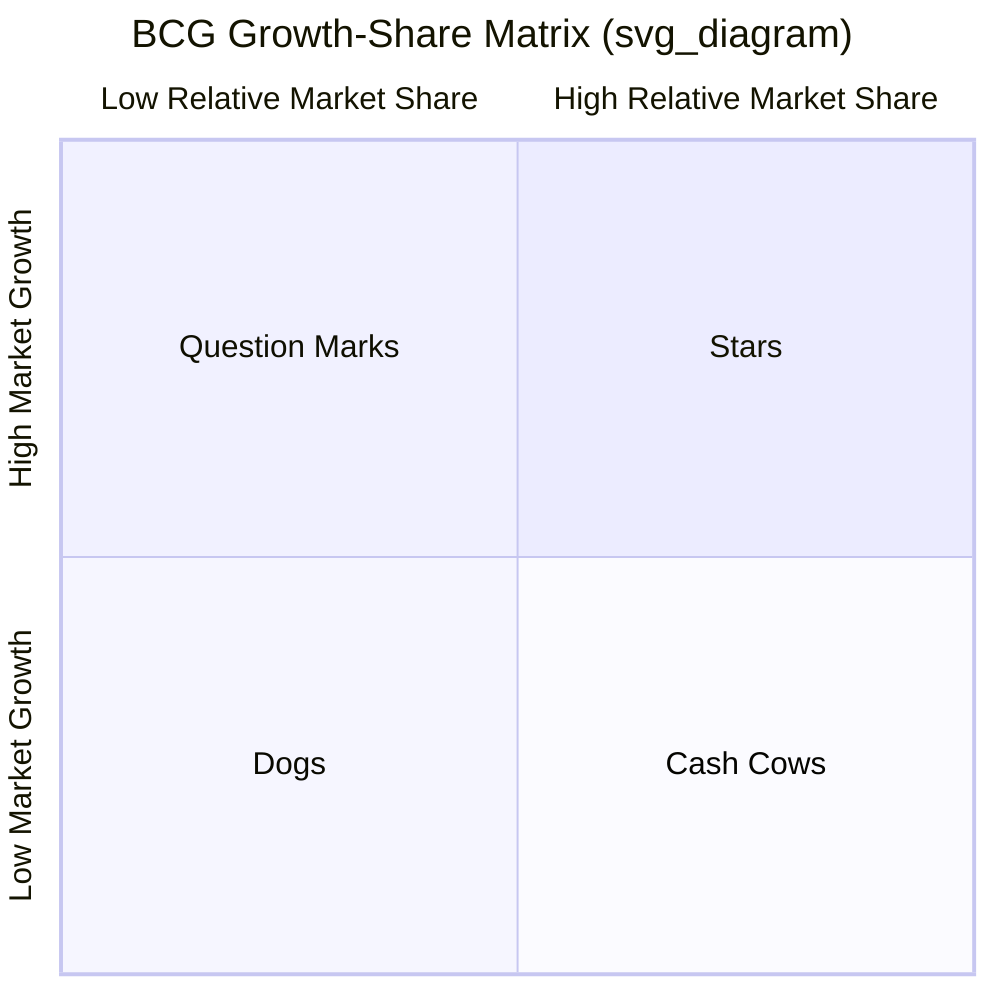

## Corporate Strategy in Multi-Business Firms

### Definition and Scope

Corporate strategy is the set of decisions and actions a firm's top management takes to determine which businesses the firm competes in, how those businesses are structured relative to one another, and how the corporate parent creates value across the portfolio as a whole. It answers a fundamentally different question than business-level (competitive) strategy. Business-level strategy asks "how do we compete in this industry?" Corporate strategy asks "what businesses should we be in, and how should the corporate center add value to them?"

In a multi-business firm — sometimes called a diversified firm, multi-divisional firm, or conglomerate depending on the degree and nature of diversification — corporate strategy governs three interrelated domains:

1. **Scope decisions**: which industries, markets, and value chain activities the firm participates in (horizontal scope, vertical scope, geographic scope).
2. **Portfolio structuring**: how business units are configured, resourced, and prioritized relative to one another.
3. **Value creation logic**: the specific mechanism by which the corporate parent makes the sum of its businesses worth more than they would be as independent, stand-alone entities.

### The Central Question: The "Better-Off" Test

The foundational test for any multi-business firm is whether the corporate parent is creating more value than the businesses would generate independently, or whether the corporate structure is actually destroying value (the "conglomerate discount"). This is often decomposed into three tests, originally articulated by Michael Porter:

- **The Attractiveness Test**: Is the industry the firm is entering (or already in) structurally attractive, or can it be made attractive?
- **The Cost-of-Entry Test**: Does the cost of entering a new business (via acquisition, startup, or internal venture) capitalize all future profits, leaving nothing for shareholders?
- **The Better-Off Test**: Will the new business gain competitive advantage from its link to the corporation, or vice versa?

A corporate strategy that fails the better-off test — where a business unit would simply perform as well or better as an independent firm — signals that diversification is not creating value, and the multi-business structure is likely destroying shareholder value relative to the alternative of divestiture or spin-off.

### Rationales for Multi-Business Diversification

**Economies of Scope**

Unlike economies of scale (spreading fixed costs over more units of a single product), economies of scope arise when the cost of producing two or more products jointly, within one firm, is lower than producing them separately in two firms. This typically stems from shared, underutilized resources — a brand name, a distribution network, R&D capabilities, or specialized knowledge — that can be redeployed across businesses at low marginal cost.

**Market Power and Multipoint Competition**

Diversified firms that meet the same rivals across multiple markets can develop "mutual forbearance" — an implicit understanding not to compete aggressively in any single market, since aggression in one market invites retaliation in another. This is a market-power rationale distinct from efficiency-based rationales.

**Internal Capital Markets**

In theory, a diversified firm's corporate headquarters can allocate capital across divisions more efficiently than external capital markets would, because headquarters has better information about each division's prospects and can move cash without the transaction costs, signaling costs, or asymmetric-information discounts of external financing. [Inference: this benefit is contested] — much of the empirical corporate finance literature finds internal capital markets in practice suffer from "socialist" cross-subsidization and rent-seeking, in which weaker divisions overinvest and stronger divisions underinvest, potentially reversing the theoretical benefit.

**Risk Reduction (Coinsurance)**

Combining businesses with imperfectly correlated cash flows can reduce the volatility of consolidated earnings, lowering the probability of financial distress and possibly reducing the cost of debt. However, this rationale is heavily criticized on the grounds that shareholders can diversify their own portfolios more cheaply than the firm can diversify its operations, making corporate-level risk reduction of limited value to well-diversified investors.

**Transferring Core Competencies**

Firms diversify into related businesses to exploit valuable capabilities — technical know-how, marketing skills, management processes — that are difficult to trade in factor markets (due to tacitness, causal ambiguity, or specificity) but can be transferred internally at lower cost than through licensing or acquisition of that capability alone.

**Managerial Rationales (Agency-Based)**

Not all diversification is value-creating. Diversification can also serve managers' interests rather than shareholders': empire-building increases managerial compensation and status (both frequently tied to firm size), diversification reduces managers' personal employment risk by reducing firm-level risk, and free cash flow may be invested in unrelated acquisitions rather than returned to shareholders. This is formalized in agency theory and free-cash-flow theory (Jensen, 1986).

### Types of Corporate Diversification Strategy

**Single Business**

Over 95% of revenue from one core business. Minimal diversification.

**Dominant Business**

Between 70–95% of revenue from one business, with limited diversification into a small number of other areas.

**Related Diversification**

Less than 70% of revenue from a single business, with business units linked by common strategic assets, shared value-chain activities, or transferable core competencies. Related diversification is further divided into:

- **Related-constrained**: businesses share numerous, tightly linked resources (e.g., a common raw material and common distribution channel).
- **Related-linked (mixed)**: businesses share only a few links, or the linkages differ across pairs of businesses in the portfolio.

**Unrelated Diversification (Conglomerate)**

Less than 70% of revenue from a single business, with little or no operational relatedness between units. Value creation, if it exists, comes primarily from financial and administrative mechanisms (internal capital allocation, portfolio restructuring, general management discipline) rather than operational synergy.

**Empirical Performance Pattern**

The classic finding in this literature (Rumelt, 1974, and replicated extensively since) is an inverted-U relationship between relatedness and performance:

$$Performance = f(-\beta \cdot Relatedness^2 + \alpha \cdot Relatedness)$$

Related diversifiers, on average, outperform both single-business firms (which forgo scope economies) and unrelated diversifiers (which incur the coordination and information costs of managing unrelated businesses without offsetting synergy benefits). [Inference/Unverified: the precise magnitude and even the direction of this relationship varies significantly by study, time period, country of study, and how "relatedness" is operationalized (SIC-code-based versus resource-based measures); later work, e.g. by Palich, Cardinal, and Miller (2000), broadly confirms the curvilinear shape but the effect size is sensitive to methodology.]

### Modes of Corporate Expansion

Corporate strategy must also specify *how* the firm enters new businesses or scope. The three principal modes are:

**Internal (Organic) Development**

Building new capabilities and market positions from within, using existing corporate resources. Slower and lower-risk in terms of integration, but slower to generate market presence and exposes the firm to the risk that a competitor moves first.

**Mergers and Acquisitions (M&A)**

Acquiring an existing firm with the desired assets, capabilities, or market position already in place. Faster than internal development but carries substantial integration risk, frequently overpays due to winner's-curse dynamics in competitive bidding, and empirically has a mixed-to-poor track record of value creation for the acquiring firm's shareholders (value more consistently accrues to the target firm's shareholders via the acquisition premium).

**Strategic Alliances and Joint Ventures**

Cooperative arrangements that allow the firm to access capabilities or markets without full ownership, useful when full acquisition is politically, financially, or regulatorily infeasible, or when the firm wants to hedge uncertainty before committing fully.

### The Corporate Parent's Value-Creation Roles

Building on Goold, Campbell, and Alexander's (1994) framework, the corporate parent can create (or destroy) value through several distinct mechanisms:

**Stand-Alone Influence**

The parent improves the performance of each business unit considered on its own — through target-setting, performance management discipline, capital budgeting rigor, and executive appointment/replacement.

**Linkage Influence**

The parent creates value by fostering synergies between business units that the units would not create on their own — for example, mandating shared services, cross-selling, or joint procurement.

**Central Functions and Services**

The parent provides functions more efficiently on a shared basis than each business could alone (legal, HR, IT infrastructure, treasury).

**Corporate Development**

The parent actively manages the portfolio's composition through acquisitions, divestitures, and new business creation, reallocating the firm's overall resource base toward higher-return opportunities.

**Parenting styles** vary systematically. Goold and Campbell identify three canonical archetypes:

- **Strategic Planning**: Corporate center is heavily involved in business-unit strategy formulation; high central influence, high coordination, common in firms with strong relatedness.
- **Financial Control**: Corporate center sets tight financial targets and controls capital allocation but leaves strategy formulation to business units; common in unrelated/conglomerate diversifiers.
- **Strategic Control**: A hybrid — the center reviews and approves business-unit strategies and monitors both strategic and financial milestones, without directly formulating strategy.

### Portfolio Management Tools

Corporate strategists historically relied on portfolio matrices to allocate resources across multiple business units. The best known is the **BCG Growth-Share Matrix**, which plots business units on two dimensions: relative market share (x-axis, often log-scaled) and market growth rate (y-axis).

- **Stars**: high growth, high share — require heavy investment but generate strong returns; cash flow is often roughly neutral.
- **Cash Cows**: low growth, high share — generate more cash than they need for reinvestment; fund other units.
- **Question Marks**: high growth, low share — require significant cash to build share; uncertain future (may become Stars or be divested).
- **Dogs**: low growth, low share — typically candidates for divestiture or harvesting.

The strategic logic is that a balanced portfolio uses cash generated by Cash Cows to fund promising Question Marks and sustain Stars, while divesting or harvesting Dogs.

Other portfolio frameworks in the same tradition include the **GE/McKinsey Nine-Box Matrix** (industry attractiveness × business unit strength, using multi-factor composite scores rather than single-variable axes) and the **Ashridge Portfolio Display** (plots business units by fit with parenting capabilities vs. intrinsic attractiveness to the parent, directly operationalizing the parenting-advantage concept above).

[Inference: portfolio matrices are widely taught as historically foundational, but their prescriptive use in practice has declined] — critics note the matrices oversimplify competitive dynamics to two variables, treat business units as independent when interdependencies often dominate value creation, and can produce self-fulfilling underinvestment in "Dog" units that might otherwise be repositioned.

### Restructuring and Refocusing

Since the 1980s, a persistent empirical and strategic trend has been corporate refocusing — the reversal of prior unrelated diversification through divestitures, spin-offs, and carve-outs, driven by:

- The rise of active shareholders and private equity applying pressure for "conglomerate discount" unlocking.
- Improved external capital market efficiency, reducing the relative advantage of internal capital markets.
- Empirical evidence (e.g., Comment and Jarrell, 1995; Berger and Ofek, 1995) that highly diversified, unrelated conglomerates tend to trade at a valuation discount relative to a hypothetical portfolio of stand-alone comparable firms — the so-called "diversification discount."

**Key Points**

- Corporate strategy determines the scope of the firm (what businesses to be in) and how the parent adds value across a portfolio; business-level strategy determines how to compete within a given business.
- The Better-Off Test is the central diagnostic: diversification only creates value if the businesses perform better together, under one corporate parent, than they would independently.
- The empirical relationship between relatedness and performance is curvilinear (inverted-U): moderate/high relatedness generally outperforms both no diversification and unrelated diversification, though effect sizes are sensitive to measurement approach.
- Not all diversification serves shareholders; agency-based motives (empire-building, risk reduction for managers, free-cash-flow absorption) can drive value-destroying diversification.
- Parenting style (strategic planning, financial control, strategic control) shapes how much value the corporate center adds versus how much autonomy business units retain.
- Portfolio matrices (BCG, GE/McKinsey, Ashridge) remain useful heuristics for resource allocation but are subject to well-documented oversimplification critiques.

**Example**

A firm operating hospital chains, a pharmacy benefits manager, and a health insurance arm under one corporate parent may justify the combination through related diversification: the businesses share customer data, a common brand reputation with payers and patients, and a common core competency in healthcare-cost management. Under the Better-Off Test, corporate strategy would ask whether integrated care coordination and shared data infrastructure genuinely lower costs or improve pricing power relative to those three businesses operating as separate, independent companies — and whether that advantage is large enough to offset the added coordination complexity of managing three distinct regulatory and competitive environments under one roof.

**Next Steps**

- Related vs. Unrelated Diversification: Deep-Dive on Resource-Based Rationale
- Mergers, Acquisitions, and Post-Merger Integration
- Divestiture, Spin-Offs, and Corporate Restructuring
- Vertical Integration vs. Outsourcing Decisions
- Corporate Parenting Advantage and Parenting-Fit Frameworks (Ashridge Matrix)
- Diversification Discount: Empirical Evidence and Critiques
- International Corporate Strategy and Global Portfolio Configuration
- Agency Theory and Managerial Motives in Corporate Diversification