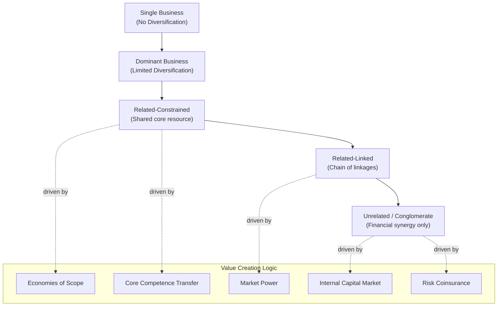

## Related and Unrelated Diversification

### Definition and Core Distinction

Diversification is a corporate-level strategy in which a firm expands beyond its original business into new products, markets, or industries. The critical analytical distinction is between **related diversification**, where the new business shares meaningful strategic assets, resources, or value-chain activities with the firm's existing businesses, and **unrelated diversification**, where the new business has little or no operational connection to the firm's existing portfolio and is managed primarily as a financial investment.

This distinction is not binary in practice but a matter of degree, and it is typically operationalized using measures such as the Rumelt classification scheme (based on the specialization ratio, related-ratio, and vertical ratio) or SIC/NAICS-code overlap between business segments.

### Related Diversification

**Definition**: The firm enters new businesses that share one or more of the following with existing businesses: customers, distribution channels, technology, production processes, brand equity, or managerial know-how.

**Value-Creation Mechanism**: Related diversification creates value primarily through the exploitation of **economies of scope** — the ability to leverage a resource or capability across multiple businesses at a marginal cost lower than the cost of developing that same resource separately in each business, or lower than the cost of two independent firms coordinating through the market.

**Sub-Types (per the Rumelt framework)**:

- **Related-Constrained**: All business units draw from a common, central pool of resources or competencies. Diversification moves outward from a core skill, and virtually every business unit relates directly to that core (e.g., a firm whose every business leverages a single, dominant brand and a shared retail distribution network).
- **Related-Linked**: Business units are connected through a chain of relationships, but not every pair of businesses shares the same links. Business A and Business B might share manufacturing technology, while Business B and Business C share a distribution channel, without A and C sharing anything directly.

**Mechanisms for Realizing Relatedness**:

1. **Sharing activities** (Porter's value-chain-based synergy): joint use of physical value-chain activities such as a shared sales force, shared manufacturing facilities, or shared R&D labs.
2. **Transferring core competencies**: moving intangible skills, expertise, or best practices from one business unit to another (e.g., a firm's brand-management expertise developed in one consumer product category applied to a newly acquired category).
3. **Market power effects**: pooled negotiating leverage with suppliers or buyers across businesses (pooled negotiating power), and multipoint competition against common rivals across several markets simultaneously.
4. **Corporate-level distinctive competence**: a general management or administrative capability (e.g., superior post-acquisition integration skill) that raises the performance of all businesses in the portfolio.

**Prerequisites for Related Diversification to Succeed** [Inference: synthesized from resource-based-view literature, specifically Barney's VRIO framework applied to diversification]:

- The shared resource must be genuinely valuable in the new context, not merely present.
- The resource must be difficult for the new business's competitors to imitate or acquire independently.
- The cost of coordinating the shared resource across business units must not exceed the value the sharing creates (coordination costs are non-trivial and frequently underestimated in practice).

### Unrelated Diversification

**Definition**: The firm enters businesses with no significant operational, technological, or market overlap with existing businesses. The corporate parent's role is confined largely to financial oversight, capital allocation, and general management discipline rather than operational synergy.

**Value-Creation Mechanism**: Unrelated diversification, when it creates value at all, does so through financial and administrative mechanisms rather than operating synergy:

1. **Internal Capital Market Efficiency**: the corporate center allocates capital across an unrelated portfolio, theoretically more efficiently than external capital markets, because internal information about divisional prospects is richer and internal transfers avoid the transaction costs and information asymmetries of external financing. [Inference: this benefit is heavily contested empirically] — extensive corporate finance research (e.g., Lamont, 1997; Scharfstein and Stein, 2000) finds internal capital markets often function as "socialist" allocation mechanisms, cross-subsidizing weaker divisions at the expense of stronger ones, which can destroy rather than create value.
2. **Risk Reduction / Coinsurance**: combining cash flows from businesses with low or negative correlation reduces the volatility of consolidated corporate earnings, which can lower the cost of debt and reduce bankruptcy risk. This rationale is criticized on the grounds that shareholders can diversify unsystematic risk in their own portfolios more cheaply (via holding a diversified basket of stocks) than the firm can diversify its own operations, making corporate-level risk pooling of limited incremental value to diversified investors.
3. **Superior General Management**: applying disciplined performance management, capital budgeting rigor, and executive talent development uniformly across otherwise unconnected businesses — the logic underpinning classic "financial control" conglomerates.
4. **Buying Undervalued Assets**: acquiring businesses that are undervalued by external capital markets (due to poor management, temporary distress, or market inefficiency) and improving them through better governance, without requiring any operating relatedness to the acquirer's existing businesses.

### Comparative Performance: The Curvilinear Relationship

A long-standing empirical finding, originating with Rumelt (1974) and replicated across decades of subsequent research, is that the relationship between the degree of relatedness and firm performance is curvilinear — an inverted U shape:

$$Performance = -\beta \cdot (Relatedness)^2 + \alpha \cdot (Relatedness) + c$$

- **Single-business firms** forgo the benefits of scope economies and risk diversification.
- **Moderately-to-highly related diversifiers** tend to outperform, on average, because they capture scope economies without incurring excessive coordination complexity.
- **Highly unrelated diversifiers (conglomerates)** tend to underperform relative to related diversifiers, on average, because coordination and information costs of managing dissimilar businesses outweigh the limited financial-synergy benefits, and because internal capital markets frequently misallocate capital.

[Inference/Unverified: the magnitude of this relationship, and even its statistical robustness, varies considerably by study design]. Palich, Cardinal, and Miller's (2000) meta-analysis broadly confirmed the curvilinear pattern across dozens of prior studies but noted substantial sensitivity to how "relatedness" is measured (categorical Rumelt-style classification versus continuous entropy measures versus resource-based qualitative assessment) and to the country and time period studied.

### Comparison Table: Related vs. Unrelated Diversification

| Dimension | Related Diversification | Unrelated Diversification |
| --- | --- | --- |
| Primary value driver | Economies of scope, competence transfer | Internal capital allocation, risk coinsurance |
| Corporate parent's role | Active operational involvement, resource sharing | Financial oversight, portfolio management |
| Typical parenting style | Strategic Planning or Strategic Control | Financial Control |
| Coordination cost | Higher (requires cross-unit integration) | Lower (business units operate autonomously) |
| Information requirements at HQ | High (needs industry-specific knowledge) | Lower (needs financial/general management skill) |
| Risk to firm from over-diversifying | Diseconomies of scope, integration failure | Diversification discount, agency costs |
| Typical organizational structure | Cooperative multidivisional (M-form with lateral linkages) | Competitive/holding-company multidivisional (M-form with autonomous divisions) |

### Agency-Theoretic Critique (Applies to Both, More Acutely to Unrelated)

Not all diversification decisions serve shareholder interests. Agency theory (Jensen, 1986; Amihud and Lev, 1981) identifies managerial motives that can drive value-destroying diversification regardless of relatedness:

- **Empire-building**: managerial compensation and prestige are frequently correlated with firm size, incentivizing growth-through-diversification even absent a sound value-creation logic.
- **Managerial risk reduction**: diversifying the firm reduces the manager's personal employment risk (a poorly performing single-business firm is more likely to fail or be acquired than a diversified one), even though shareholders may not want this risk reduction.
- **Free cash flow absorption**: rather than returning excess cash to shareholders (via dividends or buybacks), managers may reinvest it in unrelated acquisitions to grow the asset base under their control.

### The Diversification Discount

Empirical corporate finance research (notably Berger and Ofek, 1995; Comment and Jarrell, 1995; Lang and Stulz, 1994) has documented that firms with high degrees of unrelated diversification frequently trade in public equity markets at a valuation discount relative to a hypothetical portfolio of comparable stand-alone (pure-play) firms in the same industries — commonly cited historical estimates fall in the range of roughly 13–15% of imputed value, though this magnitude and even its causal interpretation remain debated in the literature. [Speculation/Unverified: subsequent methodological critiques, e.g. Campa and Kedia (2002) and Graham, Lemmon, and Wolf (2002), argue that some or much of the measured "discount" may reflect selection bias — firms that diversify may already have been lower-quality or lower-growth businesses before diversifying — rather than diversification itself destroying value. The true causal magnitude of the discount, net of selection effects, remains an open empirical question.]

This discount is a major driver of the corporate refocusing and conglomerate-breakup trend observed since the 1980s, in which activist investors, private equity firms, and boards pursue divestitures, spin-offs, and carve-outs to "unlock" the difference between a conglomerate's market valuation and the sum of its parts.

**Key Points**

- Related diversification creates value chiefly through economies of scope, resource/competence transfer, and market power; unrelated diversification creates value (if at all) chiefly through internal capital market efficiency, risk coinsurance, and general management discipline.
- The empirical relationship between relatedness and firm performance is curvilinear (inverted-U): moderate-to-high relatedness tends to outperform both no diversification and high unrelatedness, though effect sizes are sensitive to how relatedness is measured.
- Coordination costs rise with the degree of integration required to realize relatedness benefits; if coordination costs exceed the value of the shared resource, related diversification can destroy value just as readily as unrelated diversification.
- Agency-theoretic motives (empire-building, managerial risk reduction, free-cash-flow absorption) can drive diversification that serves managers rather than shareholders, independent of the relatedness type.
- The diversification discount is a well-documented empirical pattern in unrelated/conglomerate structures, though its causal interpretation (destruction of value versus pre-existing selection bias) remains contested.

**Example**

A consumer packaged-goods company that already sells shampoo diversifying into body wash and conditioner is pursuing related-constrained diversification: all three product lines draw on the same brand equity, the same retail relationships, and overlapping formulation/R&D expertise. The same company acquiring an unrelated industrial-equipment manufacturer would be pursuing unrelated diversification — there is no meaningful sharing of brand, distribution, or technical competence, and the acquisition's value-creation logic would need to rest on financial grounds (e.g., the target was undervalued, or its cash flows diversify the parent's earnings volatility) rather than operational synergy.

**Next Steps**

- Economies of Scope vs. Economies of Scale
- Core Competence Transfer and the Resource-Based View of Diversification
- Corporate Parenting Styles: Strategic Planning, Strategic Control, Financial Control
- Mergers and Acquisitions as a Diversification Vehicle
- Diversification Discount: Measurement Methodologies and Critiques
- Corporate Refocusing, Divestitures, and Spin-Offs
- Multipoint Competition and Mutual Forbearance
- Agency Theory and Free Cash Flow in Corporate Diversification Decisions