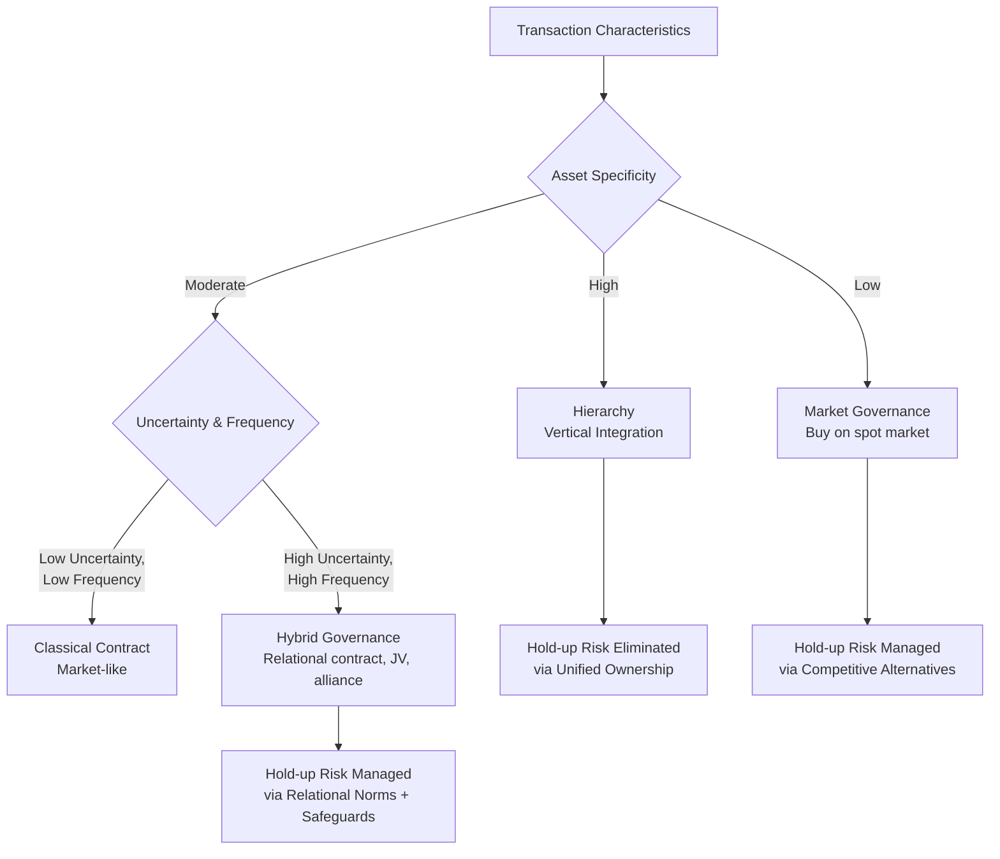

## Vertical Integration and Transaction Cost Economics

### Definition and Scope

Vertical integration is a corporate-level strategy in which a firm expands its ownership and control across successive stages of a vertical value chain — moving toward the source of raw materials/inputs (**backward** or **upstream integration**) or toward the end consumer (**forward** or **downstream integration**). It is a decision about the firm's **vertical scope**: which value-chain activities the firm performs internally, using its own hierarchy and employees, versus which activities it procures externally through market transactions with independent suppliers or distributors.

Transaction cost economics (TCE), developed principally by Ronald Coase (1937) and formalized by Oliver Williamson (1975, 1985), provides the dominant theoretical framework for explaining when firms should integrate vertically versus rely on market contracting. TCE reframes the vertical integration decision as a **make-or-buy** problem: the firm should choose whichever governance structure — market, hybrid (contract/alliance), or hierarchy (internal ownership) — minimizes the sum of production costs and transaction costs for a given exchange.

### The Coasean Foundation

Coase's foundational insight was that firms exist because using the market is not costless. Every market transaction incurs costs beyond the price paid: costs of searching for a trading partner, negotiating terms, drafting and enforcing contracts, and monitoring the counterparty's compliance. When these transaction costs exceed the administrative costs of coordinating the same activity through internal hierarchy, the firm will internalize the transaction — that is, it will vertically integrate.

$$\text{Integrate if: } TC_{market} + P_{market} > TC_{hierarchy} + P_{hierarchy}$$

where $TC$ represents transaction costs and $P$ represents production costs under each governance mode.

### Williamson's Key Behavioral Assumptions

Williamson's elaboration of TCE rests on two behavioral assumptions about economic actors:

1. **Bounded rationality**: decision-makers have limited cognitive capacity and cannot write complete contracts that anticipate every possible future contingency. Contracts are therefore inherently incomplete, leaving gaps that must be filled either by trust, renegotiation, or the exercise of hierarchical authority.
2. **Opportunism**: economic actors will, when profitable to do so, act in self-interest with guile — including strategic misrepresentation, withholding effort, or reneging on informal understandings when circumstances change and doing so is advantageous.

Given these assumptions, the central hazard TCE analyzes is not simple market friction but the risk that a trading partner will behave opportunistically once the exchange relationship has created **asset specificity** and a resulting condition of "small numbers bargaining."

### Asset Specificity: The Central Construct

Asset specificity is the degree to which an investment made to support a particular transaction has a lower value in its next-best alternative use. Higher specificity means the investing party's assets have fewer valuable outside options if the relationship ends, which increases vulnerability to opportunistic renegotiation ("hold-up") by the trading partner. Williamson identifies several types:

- **Site specificity**: successive production stages are located in immediate physical proximity to economize on transportation/inventory costs (e.g., a power plant built adjacent to a coal mine).
- **Physical asset specificity**: specialized equipment or tooling is required to produce a component that has limited use outside the specific transaction (e.g., a custom die used to stamp a part for one automaker).
- **Human asset specificity**: employees develop specialized knowledge, skills, or relationships through learning-by-doing within a particular exchange relationship that would not transfer fully to another employer or buyer.
- **Dedicated assets**: a supplier makes a discrete investment in general-purpose capacity specifically to serve a particular customer's demand, an investment that would not have been made "but for" that customer's business.
- **Brand-name capital specificity**: reputational investments tied to a specific relationship or franchise arrangement.
- **Temporal specificity**: the value of a transaction depends critically on timing (e.g., perishable goods, just-in-time delivery), making delay costly and creating vulnerability analogous to physical asset specificity.

### The Hold-Up Problem

When one party makes a relationship-specific investment, that investment becomes effectively "sunk" — its value outside the relationship is much lower than inside it. This creates a **bilateral dependency**, or "fundamental transformation": what began as a competitive, large-numbers bidding situation (many potential suppliers before the investment) transforms, after the specific investment is made, into a small-numbers bargaining situation (effectively one supplier and one buyer locked into each other, since switching partners now means abandoning sunk, relationship-specific value).

Once this transformation occurs, the party who did *not* make the specific investment gains bargaining leverage and may attempt to **hold up** the investing party — renegotiating terms post hoc to capture a larger share of the transaction's surplus, knowing the investing party's outside options are now poor. Anticipating this risk, rational actors will underinvest in relationship-specific assets under market governance, even when the investment would be jointly efficient — a form of market failure that vertical integration is designed to solve, because bringing both stages under common ownership eliminates the need to negotiate the division of surplus between formally separate parties (fiat / unified ownership resolves disputes through managerial authority rather than renegotiation).

### The Three Key Transaction Dimensions

Williamson identifies three dimensions along which transactions vary, jointly determining the efficient governance structure:

1. **Asset specificity** (discussed above) — the primary driver of the make-or-buy decision.
2. **Uncertainty**: the degree to which future contingencies cannot be anticipated or verified. Higher uncertainty, combined with bounded rationality, increases the incompleteness of contracts and the frequency of costly renegotiation, making hierarchy relatively more attractive as specificity rises. Uncertainty alone, absent asset specificity, does not strongly favor integration.
3. **Frequency**: how often the transaction recurs. Frequent transactions allow the fixed costs of establishing specialized governance structures (including hierarchy) to be amortized over many exchanges, making integration more economical for recurring transactions than for one-off exchanges, holding specificity constant.

### The Governance Continuum: Market, Hybrid, Hierarchy

TCE does not present a strict binary choice. It describes a continuum of governance structures:

- **Market (Spot Contracting)**: appropriate for low-specificity, low-uncertainty, low-frequency transactions. Prices and competition among many alternative trading partners provide sufficient discipline against opportunism.
- **Hybrid Governance**: covers a wide range of intermediate arrangements — long-term contracts, franchising, strategic alliances, joint ventures, relational contracting — appropriate for moderate specificity, where some safeguards against opportunism are needed but full ownership integration is not (yet) justified by the transaction costs involved. Hybrids often use contractual safeguards such as:
  - **Credible commitments / hostages**: mutual, offsetting investments that make both parties vulnerable, deterring unilateral opportunism.
  - **Reputation effects** in repeated-game settings.
  - **Relational norms** of trust and reciprocity that develop over a long-term relationship.
- **Hierarchy (Vertical Integration)**: appropriate for high-specificity, high-uncertainty, high-frequency transactions, where market contracting's hold-up risk and contracting costs exceed the bureaucratic and incentive costs of internal ownership.

### Costs and Limits of Vertical Integration

TCE and complementary literatures identify significant offsetting costs to vertical integration, meaning that internalization is not costless and is not always the efficient solution even under high asset specificity:

- **Bureaucratic costs**: internal hierarchies incur their own administrative and coordination costs, and large integrated firms can suffer from reduced high-powered incentives relative to market contracting (the "selective intervention" problem identified by Williamson — a firm can, in principle, replicate any market outcome internally, but often cannot credibly commit not to intervene, undermining internal high-powered incentives).
- **Loss of scale economies**: an internal division serving only the parent firm typically cannot achieve the scale economies of an independent supplier serving many customers across the market.
- **Reduced flexibility**: vertical integration commits the firm to a particular technology or supplier relationship, which can be costly to unwind if technology or market conditions change (a form of strategic inflexibility).
- **Increased organizational complexity**: managing a more vertically extended firm increases spans of control, information-processing demands, and coordination costs across the corporate hierarchy.
- **Weakened incentive intensity**: internal divisions, insulated from direct market competition and price discipline, may face weaker incentives for cost control and innovation than would an arm's-length independent supplier subject to competitive pressure ("incentive intensity principle").

**Degree and Form of Integration**: Firms need not choose full ownership integration versus pure market exchange as the only options. **Tapered integration** — partially integrating (owning some capacity internally while also sourcing from external market suppliers) — allows a firm to retain some benchmarking information and competitive discipline from the external market while capturing some of integration's benefits, and provides a hedge against demand volatility.

### Complementary and Alternative Theoretical Lenses

- **Property Rights Theory** (Grossman and Hart, 1986; Hart and Moore, 1990): reframes the integration decision around the allocation of residual control rights (decision rights over uses of an asset not explicitly specified in a contract) rather than transaction costs per se; ownership should be allocated to the party whose relationship-specific investment is more important to total surplus.
- **Resource-Based View**: vertical integration can also be analyzed as a make-or-buy decision based on whether the firm possesses a valuable, rare, difficult-to-imitate capability at a given value-chain stage — integration is favored when the firm has (or can develop) superior capability at that stage relative to external suppliers.
- **Capabilities/Knowledge-Based View**: emphasizes that vertical integration decisions are also shaped by the firm's need to access and coordinate dispersed, tacit knowledge across stages, not solely to mitigate contracting hazards.

### Practical Diagnostic Framework

**Key Points**

- Vertical integration is a make-or-buy decision governed by the comparative transaction costs and production costs of market, hybrid, and hierarchical governance.
- Asset specificity is the single most important transaction attribute driving the integration decision; it creates the hold-up risk that vertical integration is designed to eliminate through unified ownership.
- Uncertainty and frequency interact with asset specificity: transactions must generally be both frequent and characterized by meaningful specificity for hierarchy to dominate market or hybrid governance.
- Bounded rationality and opportunism are the two behavioral assumptions underlying the entire TCE framework; without either assumption, complete contracts could resolve all contracting hazards and governance choice would not matter.
- Vertical integration is not costless: bureaucratic costs, loss of scale economies, reduced flexibility, and weakened high-powered incentives all work against integration and must be weighed against the hold-up risks it eliminates.
- Tapered integration is a common intermediate solution that captures some benefits of both ownership and market discipline.

**Example**

Consider an automaker deciding whether to manufacture a specialized engine component in-house or purchase it from an independent parts supplier. If the component requires a highly customized die and tooling usable only for that automaker's specific engine design (high physical asset specificity), and the automaker requires ongoing, large-volume delivery over many years (high frequency), TCE predicts vertical integration is likely efficient: once the supplier sinks the cost of the customized die, the automaker could threaten to switch suppliers to extract price concessions (hold-up), and the supplier, anticipating this, would either underinvest in the specialized tooling or demand contractual protections that themselves are costly to negotiate and enforce. Bringing production in-house (or into a wholly owned subsidiary) eliminates the hold-up risk by removing the need to negotiate the division of surplus between two separate legal entities. Conversely, if the component were a generic, standardized bolt available from many qualified suppliers (low asset specificity), TCE predicts market procurement remains efficient, since competition among many alternative suppliers already disciplines opportunism without requiring the bureaucratic costs of ownership.

**Next Steps**

- Property Rights Theory of the Firm (Grossman-Hart-Moore)
- Tapered Integration and Strategic Outsourcing
- Hybrid Governance: Strategic Alliances, Franchising, and Relational Contracts
- Resource-Based View Applications to Vertical Scope Decisions
- Make-or-Buy Decision Frameworks in Supply Chain Strategy
- Real Options Reasoning Applied to Vertical Integration Under Uncertainty
- Global Value Chains and Vertical Disintegration Trends
- Incentive Intensity and the Selective Intervention Problem (Williamson)