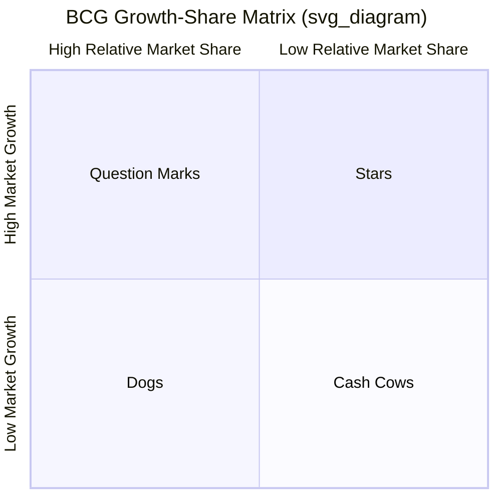

## The BCG Growth-Share Matrix

### Origin and Purpose

The Growth-Share Matrix was developed by Bruce Henderson, founder of the Boston Consulting Group (BCG), in 1970. It is a portfolio-planning tool designed to help diversified, multi-business firms allocate financial resources across their various business units (or product lines) by classifying each unit along two dimensions and visualizing the whole portfolio as a single, comparable set of investment decisions. Its core purpose is to help corporate management decide which businesses to invest in, which to maintain, and which to divest or harvest, based on each business's cash-generation potential and cash-consumption needs.

### The Two Axes

**Vertical Axis: Market Growth Rate**

Represents the annual growth rate of the industry or market in which the business unit competes, typically expressed as a percentage. It serves as a proxy for industry attractiveness and, critically, for the *cash required* to sustain or grow a position in that market — high-growth markets typically demand heavy ongoing investment in capacity, marketing, and working capital just to maintain relative position.

**Horizontal Axis: Relative Market Share**

Represents the business unit's market share relative to its largest competitor, typically calculated as:

$$Relative\ Market\ Share = \frac{Business\ Unit's\ Market\ Share}{Largest\ Competitor's\ Market\ Share}$$

The axis is conventionally plotted on a logarithmic scale, with the midpoint (dividing "high" from "low" relative share) set at 1.0×, meaning the business unit is exactly tied with the market leader. A relative share above 1.0 means the unit *is* the market leader; below 1.0 means it trails the leader. This axis is a proxy for competitive strength and, via the experience curve effect, for relative cost position and cash-generation capacity.

### The Experience Curve: Theoretical Foundation

The matrix's underlying economic logic rests on BCG's **experience curve** concept (distinct from, but related to, the learning curve): unit costs decline by a predictable percentage — commonly cited as 20–30%, though empirically variable by industry — every time a firm's cumulative production volume doubles, due to accumulated learning, process improvements, scale economies, and specialization.

$$C_n = C_1 \cdot n^{-a}$$

where $C_n$ is the cost of the $n^{th}$ unit produced, $C_1$ is the cost of the first unit, and $a$ is a constant reflecting the experience-curve slope (the rate of cost decline per doubling of cumulative volume).

The strategic implication BCG drew from this is that the firm with the highest cumulative volume — typically the market share leader — should have the lowest unit costs, and therefore the highest margins and cash generation, at any given price point. This is why relative market share (not absolute share or sales volume) is used as the axis: it captures the firm's cost position *relative to its most significant competitor*, which is what determines relative profitability under experience-curve logic.

### The Four Quadrants

**Stars (High Growth, High Relative Share)**

Market leaders in fast-growing industries. Stars generate substantial revenue and have strong margins due to their leading cost position, but require heavy reinvestment (in capacity, marketing, working capital) to keep pace with rapid market growth and defend their leading position against competitors. Net cash flow from Stars is often approximately neutral — cash generated roughly offsets cash reinvested. Prescription: invest to maintain or extend market leadership; today's Stars are expected to become tomorrow's Cash Cows once market growth naturally decelerates.

**Cash Cows (Low Growth, High Relative Share)**

Market leaders in mature, slow-growing industries. Because the market is no longer growing rapidly, reinvestment needs are low, while the unit's leading cost position (per the experience curve) continues to generate strong margins. Cash Cows are the portfolio's primary source of surplus cash — cash generated substantially exceeds what is needed to defend the unit's position. Prescription: "milk" the business — invest only enough to maintain its position and defend market share, and redirect the surplus cash generated to fund Stars and promising Question Marks elsewhere in the portfolio.

**Question Marks (High Growth, Low Relative Share)**

Also called "Problem Children" or "Wildcats." Compete in attractive, fast-growing markets but hold a weak relative competitive position. They consume large amounts of cash to fund growth (matching the market's expansion) without yet generating strong returns, because their cost position is inferior to the market leader's. Prescription: this is the pivotal strategic decision in the matrix — management must selectively decide which Question Marks have realistic potential to be built into Stars (via focused, aggressive investment intended to gain share) and which should be divested or allowed to decline, since a firm cannot afford to fund every Question Mark in its portfolio to Star status simultaneously.

**Dogs (Low Growth, Low Relative Share)**

Weak competitive position in an unattractive, slow-growing (or declining) market. Dogs typically generate low profits or losses and tie up capital and management attention without offering meaningful growth or cash-generation upside. Prescription: divest, liquidate, or harvest (minimize further investment and extract remaining cash value) unless the business serves a necessary strategic function elsewhere in the portfolio (e.g., completing a product line, blocking a competitor).

### Portfolio Balance Logic

The strategic prescription of the matrix as a whole is a **cash-flow balancing exercise across the portfolio**: a well-managed diversified firm should generate enough surplus cash from its Cash Cows to fund the reinvestment needs of its Stars and to selectively build the most promising Question Marks into future Stars, while divesting or harvesting Dogs that consume resources without adequate return. The matrix reframes portfolio management from a series of independent, business-unit-level investment decisions into a single, integrated capital-allocation problem managed by the corporate center, using each unit's cash flow characteristics — not just its stand-alone profitability — as the basis for resource allocation.

### Formal Decision Rules (as Originally Prescribed by BCG)

| Quadrant | Cash Generation | Cash Requirement | Net Cash Flow | Strategic Prescription |
| --- | --- | --- | --- | --- |
| Star | High | High | ~Neutral | Invest to hold/build share |
| Cash Cow | High | Low | Strongly Positive | Harvest/hold; fund other units |
| Question Mark | Low | High | Strongly Negative | Selectively build (invest) or divest |
| Dog | Low | Low | ~Neutral to slightly negative | Divest, harvest, or liquidate |

### Limitations and Critiques

The Growth-Share Matrix has been extensively critiqued in the strategy literature since the 1980s, and its prescriptive use in corporate practice has substantially declined relative to its historical peak. Key criticisms include:

- **Oversimplification to two variables**: Market growth rate and relative market share are treated as the sole determinants of industry attractiveness and competitive strength, respectively, ignoring numerous other relevant factors (barriers to entry, regulatory environment, technological change, brand strength, customer switching costs) that materially affect a business's true attractiveness and competitive position.
- **Market share as a flawed proxy for cost position**: The experience-curve logic underlying the horizontal axis does not hold uniformly across all industries; in many industries, cost advantages derive from factors other than cumulative volume (e.g., proprietary technology, favorable input access, superior processes), meaning relative market share is an unreliable proxy for relative cost or profitability in those contexts. [Inference: this is now a widely accepted critique across strategy scholarship, though the experience curve concept retains explanatory validity in specific industries, such as certain manufacturing and semiconductor contexts, where cumulative-volume-driven learning is empirically well documented.]
- **Market growth rate as an incomplete measure of attractiveness**: high-growth markets are not always more profitable or attractive than low-growth markets; some slow-growth or declining markets remain highly profitable due to reduced competitive intensity or high barriers to exit for rivals.
- **Static, single-period snapshot**: the matrix does not naturally incorporate the dynamic evolution of business units over time, industry life-cycle transitions, or interdependencies between units — it treats each business as if it were an independent, freestanding investment, which understates cross-business synergies (a central concern of related diversification, in tension with this matrix's independence assumption).
- **Self-fulfilling underinvestment risk**: labeling a unit a "Dog" and starving it of investment can itself cause the unit's decline, even where a different competitive strategy or repositioning might have revived its prospects.
- **Difficulty of measurement in practice**: precisely defining the "relevant market" for calculating market share and growth rate is often ambiguous and can be manipulated to produce a more favorable quadrant classification for a given business unit.

### Successor and Alternative Frameworks

Several later portfolio frameworks were developed partly in response to these critiques, using multi-factor composite dimensions rather than single-variable axes:

- **GE/McKinsey Nine-Box Matrix**: replaces the two single variables with composite, multi-factor indices for "industry attractiveness" and "business unit strength," each incorporating multiple weighted criteria rather than one proxy variable.
- **Ashridge Portfolio Display (Parenting Matrix)**: plots business units by fit with the parent's specific parenting capabilities against the unit's intrinsic attractiveness, directly addressing the Growth-Share Matrix's silence on whether the corporate parent is actually well suited to own and manage a given business.
- **Life-Cycle/Product Portfolio Matrix (Arthur D. Little)**: incorporates industry maturity stage explicitly, addressing the static-snapshot critique.

**Key Points**

- The matrix classifies business units along two axes — market growth rate (proxy for cash need and industry attractiveness) and relative market share (proxy for cost position and cash generation, via the experience curve).
- The four quadrants — Stars, Cash Cows, Question Marks, and Dogs — each imply a distinct cash-flow profile and strategic prescription.
- The matrix's central strategic value is reframing capital allocation as a portfolio-wide cash-balancing exercise, using Cash Cows to fund Stars and selected Question Marks.
- The matrix has been extensively critiqued for oversimplifying industry attractiveness and competitive strength to single variables, for its static nature, and for the risk of self-fulfilling divestment of "Dog" units.
- Successor frameworks (GE/McKinsey Nine-Box, Ashridge Parenting Matrix) use multi-factor composite measures to address these limitations.

**Example**

A diversified consumer electronics firm might classify a mature, category-leading television line as a Cash Cow (low market growth, high relative share) generating substantial surplus cash with minimal reinvestment needs; a newly launched leading position in a fast-growing wearables category as a Star requiring continued heavy investment; a smaller, trailing position in a fast-growing smart-home category as a Question Mark requiring a deliberate decision on whether to fund an aggressive share-building push; and a declining, low-share legacy audio product line as a Dog considered for divestiture. The firm would use surplus cash generated by the television Cash Cow to fund continued investment in the wearables Star and a selective push in the smart-home Question Mark, while planning an exit from the audio Dog.

**Next Steps**

- GE/McKinsey Nine-Box Matrix
- Ashridge Portfolio Display and Parenting-Fit Analysis
- Experience Curve and Learning Curve Effects in Cost Strategy
- Industry Life-Cycle Analysis and Portfolio Timing
- Corporate Cash-Flow Allocation and Internal Capital Markets
- Product Portfolio Rebalancing and Divestiture Decision-Making
- Critiques of Portfolio Planning Tools in Modern Strategic Practice