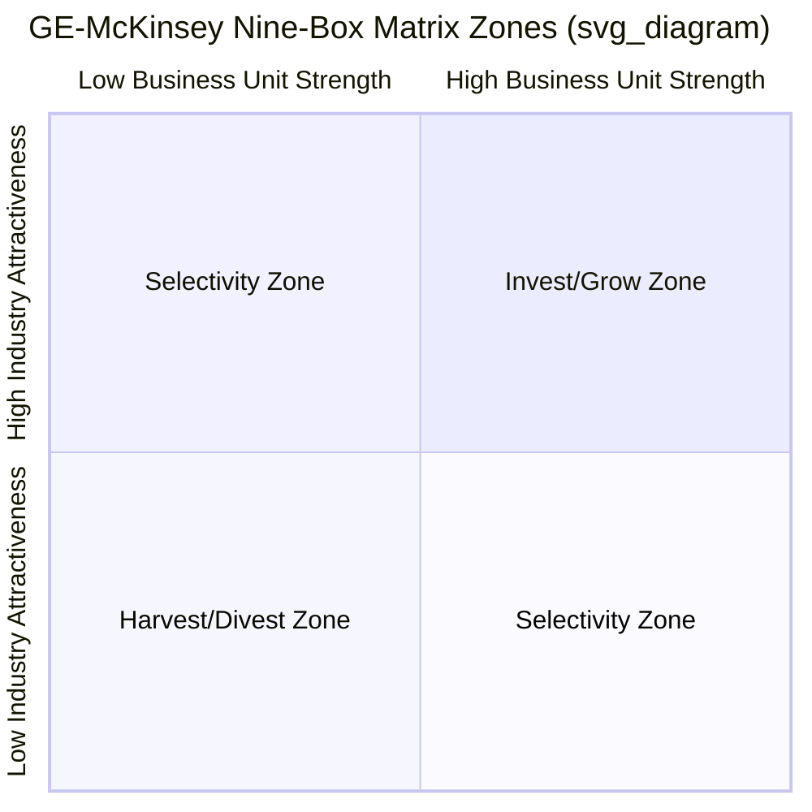

## The GE-McKinsey Nine-Box Matrix

### Origin and Purpose

The Nine-Box Matrix was developed jointly by General Electric and the consulting firm McKinsey & Company in the early 1970s, explicitly as a response to the perceived limitations of BCG's Growth-Share Matrix. Where the BCG matrix classifies business units using two single proxy variables (market growth rate and relative market share), the Nine-Box Matrix uses two composite, multi-factor indices — **Industry Attractiveness** and **Business Unit (Competitive) Strength** — each built from a weighted combination of several underlying criteria selected to fit the specific industry and firm context. Its purpose remains the same as the BCG matrix's: to help a diversified corporate parent visualize its portfolio of business units on a common basis and allocate investment resources accordingly, but with a richer, more customizable, and less mechanistic assessment of each dimension.

### The Two Composite Axes

**Vertical Axis: Industry Attractiveness**

A weighted composite score reflecting how favorable the industry environment is for any competitor operating in it, independent of the specific business unit's own competitive position. Commonly included criteria:

- Market size and growth rate
- Industry profitability (average margins, return on invested capital)
- Competitive intensity (concentration, rivalry, price pressure)
- Barriers to entry and exit
- Cyclicality and demand volatility
- Regulatory environment and government influence
- Technological change and disruption risk
- Capital intensity

**Horizontal Axis: Business Unit Strength (Competitive Position)**

A weighted composite score reflecting how well-positioned the specific business unit is to compete and win within its industry. Commonly included criteria:

- Relative market share
- Brand strength and reputation
- Cost position relative to competitors
- Product/service quality and differentiation
- Access to distribution channels
- Technological capability and proprietary know-how
- Management quality and organizational capability
- Customer loyalty and switching costs

### Constructing the Composite Scores

The construction methodology, generally attributed to McKinsey's original approach, follows a structured, multi-step scoring process:

1. **Select relevant criteria** for each axis, tailored to the specific industry and strategic context (the criteria list is not fixed or universal — this customizability is a deliberate design feature distinguishing this matrix from BCG's fixed single-variable axes).
2. **Assign a weight** to each criterion, reflecting its relative importance to overall attractiveness or strength (weights across all criteria on a given axis typically sum to 1.0 or 100%).
3. **Rate the business unit or industry** on each criterion, typically on a numerical scale (e.g., 1–5 or 1–10).
4. **Calculate the weighted composite score** for each axis:

$$Composite\ Score = \sum_{i=1}^{n} (Weight_i \times Rating_i)$$

5. **Plot the business unit** on the resulting 2-dimensional grid using its two composite scores.
6. **Represent portfolio scale visually**: business units are typically plotted as circles, where circle size represents total market size, and a pie-slice within each circle represents the business unit's own market share — adding a third and fourth dimension of information to the two-dimensional plot.

### The Nine Cells and Three Zones

Unlike the BCG matrix's 2×2 grid, the Nine-Box Matrix divides each axis into three levels (High/Medium/Low), producing nine cells. These nine cells are typically grouped into three broad strategic zones:

**Zone 1: Invest/Grow (High Attractiveness + High-to-Medium Strength; also High Strength + Medium Attractiveness)**

Business units in these cells (the top-left three cells in the traditional orientation) represent the strongest overall combination of an attractive industry and a strong competitive position. Prescription: invest aggressively to grow, protect the leading position, and prioritize these units for capital allocation ahead of the rest of the portfolio.

**Zone 2: Selectivity / Selective Earnings (the diagonal band running from top-right to bottom-left — high attractiveness/low strength, medium/medium, and low attractiveness/high strength)**

Business units in these cells present a mixed or ambiguous picture — either strong in a weak industry, weak in a strong industry, or moderate on both dimensions. Prescription: no single prescription applies uniformly; management must exercise judgment on a case-by-case basis, potentially investing selectively where a plausible path exists to improve competitive position or where attractiveness is likely to improve, while limiting further investment where the path to a stronger position is unclear.

**Zone 3: Harvest/Divest (Low Attractiveness + Low-to-Medium Strength; also Low Strength + Medium Attractiveness)**

Business units in these cells (the bottom-right three cells) represent the weakest overall combination of an unattractive industry and a weak competitive position. Prescription: minimize further investment, manage for cash generation ("harvest"), or divest outright, redirecting the freed capital and management attention to stronger units elsewhere in the portfolio.

### Comparison with the BCG Growth-Share Matrix

| Dimension | BCG Growth-Share Matrix | GE-McKinsey Nine-Box Matrix |
| --- | --- | --- |
| Number of cells | 4 | 9 |
| Vertical axis | Market growth rate (single variable) | Industry attractiveness (multi-factor composite) |
| Horizontal axis | Relative market share (single variable) | Business unit strength (multi-factor composite) |
| Underlying theory | Experience curve | No single unifying theory; explicitly customizable and judgment-based |
| Objectivity | More mechanistic, less subject to managerial judgment | More flexible, but more subjective (criteria selection and weighting require judgment calls) |
| Cash-flow logic | Explicit (Stars/Cash Cows/Question Marks/Dogs cash-flow roles) | Implicit; prescriptions are more general (invest/hold/harvest) |
| Customizability across industries | Low (fixed axes) | High (criteria tailored per industry/context) |

### Advantages Relative to the BCG Matrix

- **Richer, more realistic assessment**: incorporating multiple weighted criteria per axis captures a more nuanced and industry-appropriate picture of both attractiveness and competitive strength than a single proxy variable can.
- **Reduced mechanistic bias**: because criteria and weights are chosen deliberately for the specific context, the tool is less prone to misclassifying a business unit based on a single, potentially unrepresentative metric (e.g., a business could have low relative market share yet strong profitability due to a defensible niche position — a nuance the composite strength score can capture that the BCG matrix's single share variable cannot).
- **Additional information encoding**: the use of circle size (market size) and pie slices (market share within the circle) adds two further dimensions of portfolio information beyond the two axes.

### Limitations and Critiques

- **Subjectivity in criteria selection and weighting**: the choice of which criteria to include and how heavily to weight each one is inherently judgment-driven, meaning two analysts (or the same analyst under different incentives) could plausibly arrive at materially different placements for the same business unit — this reduces the tool's reproducibility and opens it to manipulation, whether intentional (to justify a predetermined investment decision) or unintentional.
- **Complexity and resource intensity**: constructing well-grounded composite scores across multiple criteria for every business unit in a portfolio is considerably more time- and data-intensive than BCG's simpler two-variable approach, which can limit practical usability for very large or fast-moving portfolios.
- **Still a static, single-period snapshot**: like the BCG matrix, the Nine-Box framework does not natively incorporate the dynamic evolution of industries or business units over time, nor does it explicitly address cross-business synergies within the portfolio.
- **Ambiguous "Selectivity" zone prescriptions**: the diagonal band of cells intentionally lacks a clear-cut, formulaic prescription (unlike BCG's explicit quadrant rules), which some practitioners view as a strength (appropriately reflecting genuine strategic ambiguity) and others view as a weakness (the tool provides less actionable guidance exactly where guidance is most needed).
- **Risk of false precision**: reducing complex, qualitative judgments about industry structure and competitive position to a single weighted numerical score can create an unwarranted appearance of rigor and objectivity, obscuring the subjective judgment calls embedded in the underlying weights and ratings. [Inference: this is a widely voiced practitioner and academic critique of weighted-scoring tools generally, not specific to empirical studies of the Nine-Box Matrix in particular.]

**Key Points**

- The Nine-Box Matrix classifies business units on two composite, multi-factor axes — industry attractiveness and business unit strength — each built from criteria and weights customized to the specific industry context.
- It was developed to overcome the BCG matrix's reliance on two single proxy variables, offering a richer but more subjective and resource-intensive assessment.
- The nine cells are grouped into three zones — Invest/Grow, Selectivity, and Harvest/Divest — with the Selectivity zone deliberately lacking a single formulaic prescription.
- Circle size and pie-slice conventions in the visual display add market-size and market-share information beyond the two composite axes.
- Its principal weaknesses are the inherent subjectivity of criteria selection and weighting, greater implementation complexity than the BCG matrix, and a continuing static, single-period view of the portfolio.

**Example**

A diversified industrial conglomerate assessing its portfolio might score a business unit in a highly regulated but stable and profitable specialty-chemicals segment as having Medium-to-High industry attractiveness (weighing regulatory barriers to entry positively, cyclicality negatively, and profitability positively) and High business unit strength (owing to proprietary process technology and long-standing customer relationships), placing it in the Invest/Grow zone despite the segment not being classically "high growth" in the way BCG's matrix would require for Star or Question Mark classification. This illustrates the Nine-Box Matrix's capacity to capture attractive-but-slow-growing industry contexts that a growth-rate-only axis would understate.

**Next Steps**

- BCG Growth-Share Matrix: Comparative Deep-Dive
- Ashridge Portfolio Display and Parenting-Fit Analysis
- Multi-Criteria Decision Analysis (MCDA) Methods in Strategic Planning
- Industry Attractiveness Analysis via Porter's Five Forces
- Resource-Based View Assessment of Competitive Strength
- Portfolio Rebalancing and Capital Allocation Frameworks
- Critiques of Weighted-Scoring Tools in Strategic Management