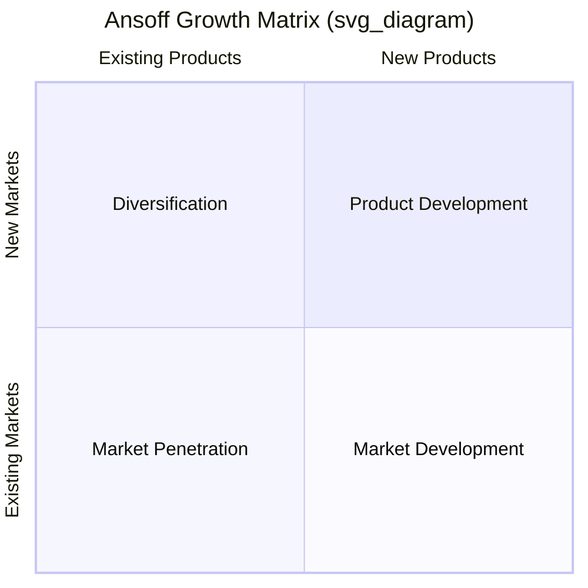

## The Ansoff Growth Matrix

### Origin and Purpose

The Ansoff Matrix, also known as the Product-Market Growth Matrix or Product-Market Expansion Grid, was introduced by Igor Ansoff in his 1957 Harvard Business Review article "Strategies for Diversification." It is one of the earliest formal frameworks in strategic management and predates both the BCG and GE-McKinsey portfolio matrices by over a decade. Unlike those two tools, which are primarily used for *evaluating an existing portfolio* of business units, the Ansoff Matrix is a **growth-direction planning tool**: it helps a firm identify and categorize the strategic options available for growing revenue, by mapping the combination of products (existing or new) against markets (existing or new).

### The Two Axes and Four Quadrants

**Horizontal Axis: Products** — existing products versus new products

**Vertical Axis: Markets** — existing markets versus new markets

### Market Penetration (Existing Products, Existing Markets)

**Definition**: Growing revenue by selling more of the firm's current products to its current market, without changing either the product or the market served.

**Mechanisms**:

- Increasing market share by winning customers from competitors (aggressive pricing, promotion, improved distribution)
- Increasing usage frequency or volume among existing customers (loyalty programs, bundling, larger pack sizes)
- Attracting non-users within the existing market segment to begin purchasing

**Risk Profile**: This is the **lowest-risk** quadrant of the matrix, since the firm is operating with the deepest existing knowledge of both its product and its customers, requiring no new capability development. It is generally the first growth avenue firms pursue, as its lower risk and lower resource requirements make it the natural default before venturing into unfamiliar products or markets.

**Illustrative Approach**: A soft-drink company increasing its advertising spend and running a price promotion to grow volume within its existing, mature domestic market.

### Market Development (Existing Products, New Markets)

**Definition**: Growing revenue by taking the firm's current products into markets it does not currently serve.

**Mechanisms**:

- **Geographic expansion**: entering new countries, regions, or cities with the existing product line.
- **New customer segments**: targeting a different demographic, industry vertical, or use-case segment with the same core product.
- **New distribution channels**: reaching existing types of customers through a channel not previously used (e.g., moving from wholesale-only to direct-to-consumer e-commerce).

**Risk Profile**: **Moderate risk**. The firm leverages its existing product expertise (a known variable) but faces uncertainty regarding unfamiliar customer preferences, competitive dynamics, regulatory environments, or channel economics in the new market.

**Illustrative Approach**: A domestic fast-food chain expanding its existing menu and format into a new international market.

### Product Development (New Products, Existing Markets)

**Definition**: Growing revenue by introducing new products or significantly modified/extended products to the firm's current, already-understood market and customer base.

**Mechanisms**:

- Launching new product variants, line extensions, or complementary products to existing customers.
- Investing in R&D to create genuinely new offerings that meet additional needs of the existing customer base.
- Bundling new services around an existing physical product (a case of servitization).

**Risk Profile**: **Moderate risk**, generally comparable to or somewhat higher than market development, since the firm faces genuine product/technology development risk (the new offering may fail to meet customer needs or may face execution/technical challenges) but benefits from deep, existing knowledge of the target customer base's preferences and buying behavior.

**Illustrative Approach**: A smartphone manufacturer launching a new wearables product line targeted at its existing customer base.

### Diversification (New Products, New Markets)

**Definition**: Growing revenue by entering entirely new products into entirely new markets — the firm has neither prior product expertise nor prior market knowledge to draw upon.

**Risk Profile**: This is the **highest-risk** quadrant, since the firm simultaneously faces both product-development uncertainty and market-entry uncertainty, without an established base of relevant experience to reduce either risk. Ansoff himself explicitly flagged diversification as qualitatively different from and riskier than the other three quadrants.

**Sub-Types** (bridging directly into corporate-level diversification strategy, covered separately in this chapter):

- **Related diversification**: the new product/market combination shares meaningful strategic assets, technology, or competencies with the firm's existing business, partially mitigating the elevated risk of this quadrant.
- **Unrelated diversification**: the new product/market combination shares no meaningful connection with the firm's existing business, representing the purest and riskiest form of this quadrant, typically justified (if at all) on financial rather than operational grounds.

**Illustrative Approach**: A consumer electronics firm acquiring or launching an entirely unrelated business, such as a financial services or media venture, with no shared products or customer base relative to its core electronics operations.

### Risk Gradient Across the Matrix

A central pedagogical point of the Ansoff Matrix is that risk increases as a firm moves away from the "known" (existing products, existing markets) toward the "unknown" (new products, new markets):

$$Risk:\ Market\ Penetration < \{Market\ Development,\ Product\ Development\} < Diversification$$

Market Development and Product Development are generally treated as roughly comparable in risk level (both involve one "known" and one "unknown" variable), though the relative risk between them depends on firm-specific and industry-specific factors — a firm with strong R&D capability but limited international experience may find Product Development comparatively lower-risk than Market Development, and vice versa for a firm with strong distribution/internationalization capability but limited R&D depth. [Inference: this relative ordering between the two "adjacent" quadrants is a matter of firm-specific context rather than a fixed theoretical ranking within the original Ansoff framework.]

### Relationship to Corporate-Level Strategy

The Ansoff Matrix's Diversification quadrant is the direct conceptual entry point into the broader corporate-level diversification strategy covered elsewhere in this chapter (Related and Unrelated Diversification, Vertical Integration). Where the Ansoff Matrix simply flags diversification as the highest-risk growth direction, the fuller corporate strategy literature (economies of scope, the Better-Off Test, transaction cost economics) provides the analytical tools needed to evaluate *whether and how* a specific diversification move can be expected to create value, rather than merely categorizing it as a growth option.

### Practical Application Process

1. **Assess current position**: identify the firm's existing products and existing markets precisely, since ambiguous definitions of "existing" versus "new" can blur which quadrant a given growth initiative actually falls into.
2. **Generate growth options** systematically across all four quadrants, rather than defaulting only to the most familiar option.
3. **Evaluate resource and capability requirements** for each option, recognizing that quadrants further from the current position generally demand new capabilities the firm may not yet possess.
4. **Assess risk tolerance and strategic fit** against the firm's overall risk appetite, financial capacity to absorb potential losses, and time horizon.
5. **Sequence growth initiatives**, typically starting with lower-risk options (Market Penetration) to fund and de-risk more ambitious later moves into Market Development, Product Development, or Diversification.

**Key Points**

- The Ansoff Matrix maps four growth strategies along two axes — existing/new products and existing/new markets — Market Penetration, Market Development, Product Development, and Diversification.
- Risk increases systematically as a firm moves from Market Penetration (lowest risk) toward Diversification (highest risk), since moving into unfamiliar products or markets removes the firm's ability to rely on existing knowledge and capabilities.
- The Diversification quadrant is the conceptual bridge to the fuller corporate-level diversification strategy literature (related/unrelated diversification, the Better-Off Test), which provides deeper tools for evaluating whether a specific diversification move creates value.
- The matrix is a growth-planning and options-generation tool, distinct from BCG and GE-McKinsey matrices, which are primarily portfolio-evaluation tools for an already-existing set of business units.
- Practical application involves systematically generating options across all four quadrants and sequencing them according to the firm's risk tolerance and resource capacity, typically progressing from lower-risk to higher-risk quadrants over time.

**Example**

A regional coffee shop chain considering growth options might pursue Market Penetration by running loyalty promotions to increase visit frequency among its existing customers in its existing cities; pursue Market Development by opening new locations in cities it does not currently serve, using the same menu and format; pursue Product Development by launching a new packaged retail coffee product line sold to its existing customer base through its existing stores; and pursue Diversification by acquiring or launching an entirely unrelated business, such as a home goods retailer, sharing neither product expertise nor customer market knowledge with its core coffee shop business — the last option carrying materially higher risk than the first three.

**Next Steps**

- Related and Unrelated Diversification (Corporate-Level Strategy)
- Market Entry Strategies for International Expansion
- New Product Development Processes and Innovation Management
- Risk Assessment Frameworks for Strategic Growth Initiatives
- The Better-Off Test and Value Creation in Diversification
- Organic Growth vs. Mergers and Acquisitions as Expansion Vehicles
- Blue Ocean Strategy and Uncontested Market Space Creation