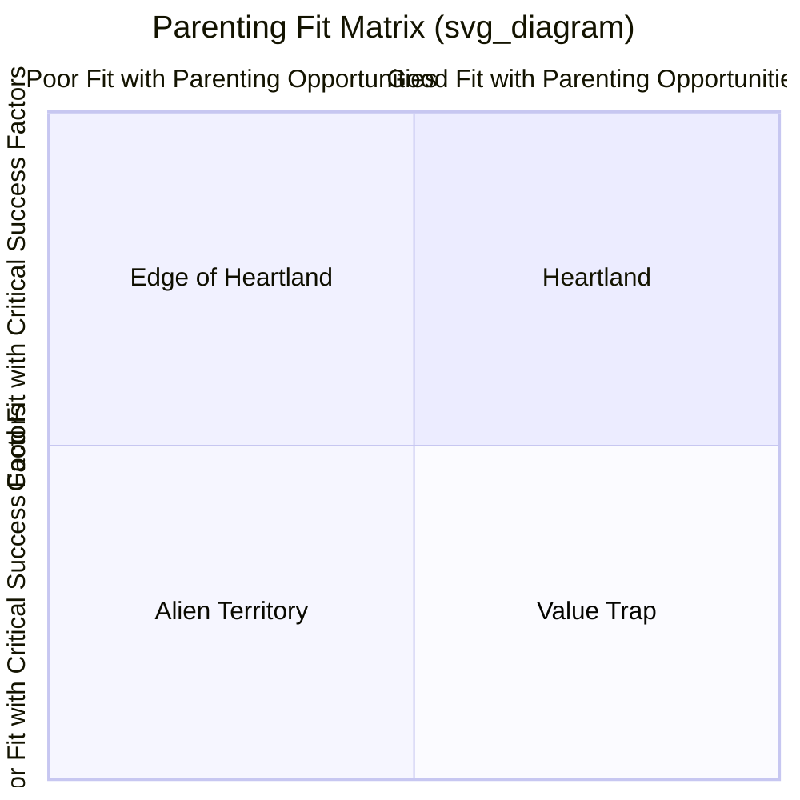

## Corporate Parenting Theory

### Definition and Origin

Corporate parenting theory examines how a corporate headquarters (the "parent") creates or destroys value in relation to the individual business units it owns (the "children" or "offspring"). It was developed principally by Andrew Campbell, Michael Goold, and Marcus Alexander, and articulated most fully in their 1994 book *Corporate-Level Strategy: Creating Value in the Multibusiness Company*. The theory's central reframing is to shift the fundamental question of corporate strategy away from "which businesses should we be in?" (the classical portfolio-planning question addressed by BCG/GE-McKinsey matrices) toward "**is this business better off under our ownership than under any plausible alternative owner, or as an independent, stand-alone firm?**"

This reframing directly operationalizes the Better-Off Test from the broader corporate strategy literature, but does so specifically from the standpoint of the parent's own distinctive capabilities and behaviors, rather than from generic synergy or diversification logic alone.

### The Central Analytical Shift: Parent-Fit, Not Just Portfolio-Fit

Classical portfolio matrices (BCG, GE-McKinsey) implicitly assume that any well-run corporate center can extract value from any attractively positioned business unit, as long as the unit occupies a favorable cell in the matrix. Corporate parenting theory challenges this assumption directly: it argues that a business unit's performance under a given parent depends critically on the **specific fit** between that parent's particular characteristics — its skills, resources, systems, and culture — and that particular business's **parenting opportunities** (the specific ways in which the business could benefit from a well-suited parent, and the specific ways it could be harmed by a poorly suited one).

A business unit that would be an attractive Star under the BCG framework, or would sit squarely in the Invest/Grow zone of the GE-McKinsey matrix, can nonetheless be *value-destroying* under a specific corporate parent if that parent's characteristics are mismatched to the business's actual needs — for example, a parent skilled at cost discipline and financial control attempting to own and manage a business unit whose success depends on rapid, autonomous, creative product innovation.

### Sources of Parenting Value Creation

Corporate parenting theory identifies several distinct mechanisms through which a parent can add value to its business units, elaborating on the general "linkage" and "stand-alone" influence categories found in the broader corporate strategy literature:

**Stand-Alone Influence**

The parent improves each business unit's performance considered independently, without reference to other units in the portfolio — for example, through superior target-setting and performance management discipline, rigorous capital budgeting processes, higher-quality executive selection and succession planning, or the imposition of management best practices developed elsewhere in the corporate group.

**Linkage Influence**

The parent creates value by fostering beneficial connections and synergies between business units that those units would not create on their own, absent central coordination — shared services, cross-selling arrangements, coordinated purchasing, or transferred technical knowledge between otherwise separately managed units.

**Functional and Central Services and Resources**

The parent provides centralized functions (legal, treasury, HR, IT, R&D infrastructure) more efficiently on a shared basis across the portfolio than each business unit could provide for itself independently.

**Corporate Development Activities**

The parent actively manages the composition of the portfolio itself — acquiring, divesting, or restructuring business units — reallocating the corporation's overall capital and management resources toward the highest-value configuration of businesses over time.

### Sources of Parenting Value Destruction

Critically, and distinctively relative to earlier portfolio frameworks, corporate parenting theory places equal emphasis on the mechanisms by which a mismatched parent can actively *destroy* value in a business unit it owns:

- **Excessive central overhead costs** imposed on business units without a commensurate benefit.
- **Inappropriate, one-size-fits-all planning and control systems** that fit some business units well but are poorly suited to others with different competitive dynamics, cycle times, or risk profiles.
- **Constraining central policies** (uniform HR policies, procurement mandates, brand guidelines) that prevent a business unit from responding optimally to its own specific competitive circumstances.
- **Diversion of management attention and talent** away from a business unit's specific needs, toward corporate-level priorities that may not serve that unit well.
- **Slower decision-making** imposed by corporate approval requirements, reducing a business unit's competitive responsiveness in a fast-moving market.

### The Three Core Diagnostic Frameworks

Campbell, Goold, and Alexander propose three interlocking frameworks to diagnose parenting fit for a given business or portfolio:

**1. Critical Success Factors**

For each business unit, identify the specific factors that most determine its competitive success (e.g., speed of innovation, cost leadership, regulatory relationship management, brand-building). The parent's fit is assessed by asking whether the parent's characteristics genuinely help the business unit perform strongly against these specific factors, or are neutral, or actively hinder it.

**2. Parenting Opportunities**

Identify the specific ways in which a business unit's performance *could* be improved by an appropriately skilled and resourced parent — for example, opportunities to professionalize a founder-led business's management systems, opportunities to provide access to capital or scale economies the business could not achieve independently, or opportunities to transfer a valuable capability from elsewhere in the portfolio.

**3. Parenting Characteristics**

Assess the corporate parent's own specific characteristics across five dimensions:

- Mental maps (the assumptions and mindset senior corporate management brings to how businesses should be run)
- Structures, systems, and processes
- Central functions and services
- Nature and quality of decentralization contracts
- The people and skills available at the corporate center

### The Heartland/Ballast/Alien/Value-Trap Matrix

The core diagnostic tool synthesizing the above analysis is a 2×2 matrix plotting **fit with parenting opportunities** (does the business have needs the parent's characteristics can address?) against **fit with critical success factors** (do the parent's characteristics help or hurt the business's specific competitive requirements?):

- **Heartland Businesses** (good fit on both dimensions): the parent understands the business deeply, its characteristics genuinely help the business succeed against its specific critical success factors, and there are clear opportunities for the parent to add further value. Prescription: retain and actively invest parenting resources; these are the core businesses the portfolio should be built around.
- **Edge-of-Heartland Businesses** (good fit on one dimension, moderate on the other): the parent adds some value but the fit is imperfect or the parenting opportunity is limited; these businesses may become Heartland businesses with adjustment, or may need to be managed with lighter-touch parenting.
- **Alien Territory Businesses** (poor fit on both dimensions): the parent's characteristics neither match the business's critical success factors nor address genuine parenting opportunities; the parent is likely to add cost and constraint without offsetting benefit. Prescription: divest, since the parent has essentially nothing useful to contribute and may actively be harming the business's performance.
- **Value-Trap Businesses** (attractive parenting opportunities exist, but the parent's characteristics are actually mismatched to — or in conflict with — the business's specific critical success factors): this is the most strategically dangerous quadrant, because the *superficial* attractiveness of the parenting opportunity (the business appears to need what the parent could offer) masks the deeper reality that the parent's actual characteristics would harm, rather than help, the business's ability to compete on its true critical success factors. Prescription: these require the most careful judgment; the superficial appeal of "we could help this business" often leads corporate management to retain and invest in Value-Trap businesses when divestiture (or a change in how the business is parented) would be the value-maximizing choice.

The **Value-Trap** category is widely regarded as the theory's most distinctive and practically important contribution, precisely because it identifies exactly the kind of diversification move (an apparently sensible-looking synergy or capability-transfer opportunity) that conventional portfolio analysis would tend to encourage, but that a deeper fit analysis reveals to be value-destroying.

### Relationship to Parenting Styles

Corporate parenting theory connects directly to the taxonomy of **parenting styles** developed in the same body of work (Goold and Campbell, 1987):

- **Strategic Planning Style**: high central involvement in business-unit strategy formulation; the corporate center acts almost as a co-architect of each business's strategy. Best suited to portfolios with substantial relatedness across units, where the center has genuine, deep industry-specific expertise to contribute.
- **Financial Control Style**: the center sets and monitors demanding financial targets and controls capital allocation tightly, but leaves strategy formulation almost entirely to business-unit management. Best suited to portfolios of largely unrelated businesses, where the center lacks (and does not attempt to develop) deep operational expertise in each specific industry.
- **Strategic Control Style**: a hybrid approach in which the center reviews, challenges, and approves business-unit strategies and monitors progress against both strategic and financial milestones, without directly formulating strategy itself.

The appropriate parenting style is itself a function of parenting fit: a parent whose style is mismatched to a given business unit's needs (e.g., imposing Strategic Planning-style central involvement on a business unit that would be better served by Financial Control-style autonomy) is itself a mechanism of value destruction as identified above.

### Practical Application: The Parenting Advantage Test

Corporate parenting theory generates a specific, three-part test (an elaboration of the general Better-Off Test) for evaluating any current or prospective addition to the portfolio:

1. Does the parent have a genuine, well-founded understanding of the critical success factors that determine this business's competitive success?
2. Does the parent possess characteristics (skills, resources, relationships, processes) that create a genuine, identifiable opportunity to improve this business's performance?
3. Is the parent's contribution likely to outweigh the parenting costs it imposes on the business (overhead charges, constraint on autonomy, diversion of management attention)?

Only when all three conditions hold does the parenting relationship pass the theory's test for value creation; failing any one condition, particularly the second (genuine parenting opportunity fit), signals candidacy for divestiture, restructuring of the parenting relationship, or a change in ownership.

**Key Points**

- Corporate parenting theory reframes the central corporate-strategy question from "which businesses should we be in?" toward "is this business better off under our specific ownership than under any alternative owner?"
- Parenting fit depends on the specific match between a parent's characteristics (mental maps, systems, central functions, decentralization contracts, people) and a business unit's critical success factors and genuine parenting opportunities.
- A mismatched parent can actively destroy value through excessive overhead, inappropriate uniform systems, constraining policies, diverted management attention, or slowed decision-making — not merely fail to add value.
- The Heartland/Edge-of-Heartland/Alien-Territory/Value-Trap matrix is the core diagnostic tool, with Value-Trap businesses (superficially attractive parenting opportunities masking a poor fit with critical success factors) identified as the most strategically dangerous and easily overlooked category.
- Parenting style (Strategic Planning, Financial Control, Strategic Control) should itself be matched to the specific fit characteristics of the business unit in question, rather than applied uniformly across a diversified portfolio.

**Example**

A large industrial conglomerate with deep expertise in manufacturing efficiency, capital discipline, and global supply-chain management acquires a small, founder-led creative software startup whose critical success factors are rapid product iteration, a flat and autonomous engineering culture, and speed of innovation. Even though the software business might occupy an attractive cell in a BCG or GE-McKinsey matrix (high growth, reasonable competitive position), corporate parenting analysis would likely classify it as Alien Territory or a Value Trap: the parent's characteristic strengths (manufacturing discipline, capital rigor, standardized global processes) do not address the software business's actual critical success factors, and imposing the parent's typical planning cycles, approval processes, and cultural norms on the acquired business risks actively degrading the innovation speed and autonomous culture that made the business valuable in the first place — even though, on paper, the parent has abundant capital and general management capability it could offer.

**Next Steps**

- The Better-Off Test and General Value-Creation Logic in Corporate Strategy
- Parenting Styles: Strategic Planning, Strategic Control, and Financial Control
- Post-Acquisition Integration and Cultural Fit
- Divestiture Decision-Making and Portfolio Restructuring
- Ashridge Portfolio Display (Direct Application of Parenting-Fit Analysis)
- Organizational Autonomy vs. Central Control in Multi-Business Firms
- Resource-Based View Applications to Corporate-Level Capability Transfer