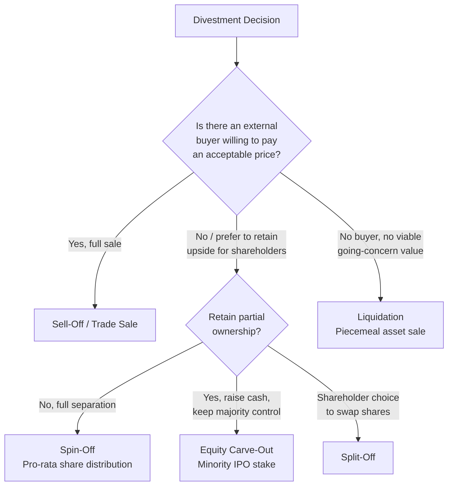

## Restructuring, Divestment, and Turnaround Strategy

### Definition and Scope

Restructuring, divestment, and turnaround strategies represent the corrective and reconfigurative branch of corporate-level strategy — the set of actions a firm takes to reverse underperformance, reshape an underperforming or misaligned portfolio, or exit businesses that no longer create value under current or any plausible ownership. Where growth-oriented corporate strategy (diversification, vertical integration, M&A) addresses "how should we expand our scope?", restructuring strategy addresses "**how should we reduce, reconfigure, or fix our current scope to restore or protect firm value?**" These strategies are frequently triggered by poor financial performance, a diversification discount, changed competitive conditions, activist investor pressure, or a corporate parenting mismatch (per the Alien Territory / Value Trap categories discussed in parenting theory).

### Restructuring: Definition and Types

**Restructuring** is the broadest of the three concepts — any fundamental change to a firm's asset composition, capital structure, or organizational structure aimed at improving its strategic and financial position.

**Portfolio (Asset) Restructuring**

Changing the composition of the firm's business portfolio through a combination of acquisitions, divestitures, and internal reallocation — reshaping *what businesses the firm is in*, per the corporate-scope logic covered elsewhere in this chapter.

**Financial Restructuring**

Changing the firm's capital structure — the mix of debt and equity, the maturity profile of obligations, or ownership structure — typically to reduce financial distress risk, lower the cost of capital, or realign management incentives with shareholder value (e.g., through a leveraged recapitalization, debt-for-equity exchange, or the introduction of concentrated ownership via a leveraged buyout).

**Organizational Restructuring**

Changing the firm's internal organizational architecture — headcount, layers of management, reporting structures, business unit boundaries — often to reduce overhead costs, speed decision-making, or better align organizational structure with a changed strategy (e.g., delayering, consolidating shared services, decentralizing decision rights).

### Divestment: Definition and Modes

**Divestment** (or divestiture) is the disposal of a business unit, product line, subsidiary, or set of assets that the corporate parent has determined no longer fits its strategic portfolio or fails the Better-Off Test / parenting-fit test. It is the primary mechanism through which portfolio restructuring is executed in practice.

**Sell-Off (Trade Sale)**

The outright sale of a business unit or subsidiary to another company (a strategic buyer) or to a financial buyer (private equity). This is typically the fastest way to realize cash proceeds and exit a business cleanly, though it depends on finding a willing buyer at an acceptable price.

**Spin-Off**

The corporate parent distributes shares of a business unit, converted into a newly independent, separately listed public company, to its existing shareholders on a pro-rata basis. No cash changes hands between the parent and the new entity; shareholders end up owning shares in two separate companies rather than one. Spin-offs are typically used to separate businesses with divergent strategic logics, capital needs, or investor bases, allowing each resulting entity to be valued, financed, and managed independently, without requiring the parent to find an external buyer.

**Carve-Out (Equity Carve-Out / IPO)**

The corporate parent sells a *minority* stake (typically 20% or less, though this varies) in a subsidiary to public investors via an initial public offering, while retaining majority ownership and control. This raises cash for the parent while establishing an independent market valuation for the subsidiary, and can be a precursor to a subsequent full spin-off or sale of the retained stake.

**Split-Off**

Existing shareholders are offered the choice to exchange their shares in the parent company for shares in the subsidiary being separated, rather than receiving subsidiary shares automatically and proportionally (as in a spin-off). This mechanism is often used for its differential tax treatment relative to a straight spin-off in certain jurisdictions. [Inference: specific tax treatment is jurisdiction- and transaction-structure-dependent and should not be assumed to generalize; this is a general structural description, not tax advice.]

**Liquidation**

The business unit or asset is shut down and its individual assets sold off piecemeal, typically when no going-concern buyer exists or when the business's assets are worth more disaggregated than as an operating whole.

### Rationales for Divestment

- **Poor Strategic Fit / Parenting Mismatch**: the business unit occupies Alien Territory or is a Value Trap under corporate parenting analysis — the parent's characteristics do not genuinely help the business compete, and may actively hinder it.
- **Diversification Discount Correction**: reducing unrelated diversification to eliminate the valuation discount markets apply to conglomerate structures, per the diversification-discount literature.
- **Refocusing on Core Competencies**: exiting non-core businesses to concentrate capital, management attention, and organizational focus on the firm's strongest, most differentiated capabilities.
- **Raising Capital**: generating cash proceeds to fund debt reduction, reinvestment in core businesses, or shareholder returns.
- **Regulatory or Antitrust Requirements**: divestment mandated as a condition of merger approval or in response to antitrust enforcement.
- **Activist Investor Pressure**: institutional or activist shareholders pushing for breakup of a perceived conglomerate discount to unlock shareholder value.
- **Business Unit in Structural Decline**: exiting an industry undergoing secular decline where continued investment cannot generate acceptable returns (a Dog in BCG terms, or a Harvest/Divest cell in GE-McKinsey terms).

### Turnaround Strategy: Definition and Triggers

**Turnaround strategy** is a distinct, more operationally focused concept: a set of actions taken to reverse the decline of an underperforming (but not necessarily divested) business — restoring it to acceptable profitability and competitive health rather than exiting it. Turnarounds are typically triggered by sustained financial underperformance, market share erosion, cash flow crises, or the threat of insolvency, and are distinguished from routine performance improvement by the severity and urgency of the underlying decline.

**Common Root Causes of Decline Requiring Turnaround** [Inference: synthesized from the turnaround management literature broadly, e.g. Slatter and Lovett]:

- Poor management (weak strategic direction, poor execution discipline, inadequate financial controls)
- Overexpansion or over-diversification beyond the firm's genuine capabilities
- High cost structure relative to competitors (loss of cost competitiveness)
- Failure to respond to a changed competitive or technological environment
- Excessive financial leverage constraining strategic flexibility
- Loss of a major customer, product failure, or a significant one-off adverse event

### The Two-Stage Turnaround Model

Turnaround strategy is commonly described in the literature as unfolding across two broad, sequential stages:

**Stage 1: Retrenchment (Stabilization)**

The immediate priority is to stop the bleeding — stabilize cash flow, halt the decline, and buy time for a more considered strategic response. Characteristic actions:

- **Cost-cutting**: reducing headcount, discretionary spending, and overhead to bring the cost base into line with a lower, more realistic revenue expectation.
- **Asset reduction**: selling non-core or underutilized assets to raise cash and reduce ongoing carrying costs.
- **Revenue generation measures**: aggressive short-term actions to stabilize or improve cash inflows, such as price adjustments, working-capital management (accelerating receivables collection, extending payables, reducing inventory), and renegotiating supplier or lender terms.
- **Leadership change**: bringing in new management, often with specific turnaround experience, both to signal change credibly to stakeholders and to bring an unbiased perspective unencumbered by prior strategic commitments.

**Stage 2: Recovery / Strategic Repositioning**

Once the immediate crisis is stabilized, the firm shifts to rebuilding a sustainable, competitively viable strategic position:

- **Strategic refocusing**: redefining the firm's core business, target markets, and competitive positioning based on a clear-eyed assessment of where genuine, defensible competitive advantage can be rebuilt.
- **Selective reinvestment**: channeling stabilized cash flow into the specific capabilities, products, or markets identified as the foundation of the recovered business, rather than spreading resources thinly.
- **Organizational and cultural renewal**: rebuilding organizational morale, restoring stakeholder (customer, supplier, lender, employee) confidence, and instituting improved management processes and controls to prevent recurrence of the conditions that caused the original decline.
- **Growth resumption**: once a stable, competitively sound base is re-established, resuming deliberate, disciplined growth initiatives.

### Distinguishing Divestment from Turnaround

| Dimension | Divestment | Turnaround |
| --- | --- | --- |
| Fundamental logic | Exit the business; it does not fit the portfolio or fails the parenting-fit test | Fix the business; it remains part of the portfolio |
| Typical trigger | Poor strategic fit, diversification discount, non-core status | Financial distress, competitive decline, operational failure |
| Time horizon | Often relatively fast (transaction-driven) | Often multi-year (stabilization then rebuilding) |
| Primary actor | Corporate M&A / corporate development function | Business unit management, often supplemented by turnaround specialists |
| Success metric | Achieving an acceptable sale/spin-off value; portfolio simplification | Restored profitability, competitive viability, and going-concern status |

In practice, the two are frequently sequential rather than mutually exclusive: a corporate parent may attempt a turnaround first, and if the turnaround fails to restore the business to an acceptable level of performance within a defined time horizon, proceed to divestment or liquidation as the fallback outcome.

### Barriers to Effective Restructuring and Turnaround

- **Managerial denial and sunk-cost bias**: incumbent management, particularly those who championed the original strategy that led to decline, often resist recognizing the severity of the problem or the need for painful corrective action (escalation of commitment).
- **Exit barriers**: specialized assets with low resale value, long-term contractual obligations, labor/union constraints, and emotional or reputational attachment to a business can all raise the effective cost of divestment or liquidation above what a purely economic analysis would suggest.
- **Stakeholder resistance**: employees, unions, local communities, and even customers or suppliers may resist restructuring actions that threaten jobs or disrupt established relationships, creating political and reputational costs alongside the economic ones.
- **Information asymmetry with buyers**: a business unit being divested because it is genuinely troubled may be difficult to sell at an acceptable price precisely because prospective buyers rationally suspect the seller possesses unfavorable private information about the unit (a form of adverse selection / "lemons problem").

**Key Points**

- Restructuring, divestment, and turnaround are related but distinct corrective corporate strategies: restructuring is the broad umbrella (portfolio, financial, or organizational change), divestment is the specific mechanism for exiting a business, and turnaround is the strategy for rehabilitating a business the firm intends to keep.
- Divestment can be executed through several distinct mechanisms — sell-off, spin-off, equity carve-out, split-off, or liquidation — each with different cash, control, and shareholder-value implications.
- Turnaround strategy typically unfolds in two sequential stages: retrenchment (stabilizing cash flow and halting decline) followed by recovery (rebuilding a sustainable, competitively viable strategic position).
- Divestment decisions are frequently driven by corporate parenting-fit analysis (Alien Territory / Value Trap classifications) and by efforts to correct the diversification discount associated with unrelated, unfocused portfolios.
- Managerial denial, exit barriers, and stakeholder resistance are persistent, well-documented obstacles to executing restructuring and turnaround decisions promptly, even when the economic case for action is clear.

**Example**

A diversified conglomerate facing sustained activist investor pressure over a persistent conglomerate discount might respond with a combination of these strategies: it could spin off an unrelated, slower-growth industrial division into an independently listed company (portfolio restructuring via spin-off, addressing the diversification discount and poor parenting fit), while simultaneously launching a turnaround at a struggling but strategically core retail division — first executing a retrenchment phase (store closures, headcount reduction, renegotiated supplier terms, new divisional leadership) to stabilize cash flow, followed by a recovery phase (repositioning the retail format, targeted reinvestment in e-commerce capability, and a rebuilt brand strategy) aimed at restoring the retail division to sustainable, competitive profitability rather than divesting it.

**Next Steps**

- Corporate Parenting Theory and the Alien Territory/Value Trap Diagnosis
- Mergers and Acquisitions: Valuation and Integration
- Diversification Discount: Empirical Evidence and Measurement
- Leveraged Buyouts and Financial Restructuring Mechanics
- Organizational Change Management and Delayering
- Activist Investors and Shareholder Value Campaigns
- Bankruptcy, Insolvency, and Chapter 11 Reorganization Processes
- Exit Barriers and Industry Decline Strategy