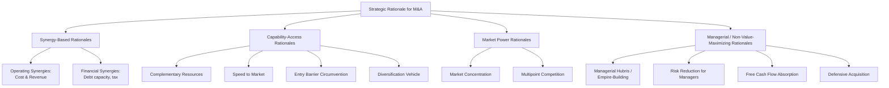

## Strategic Rationale for Mergers and Acquisitions

### Definition and Distinction: Mergers vs. Acquisitions

A **merger** is a combination of two firms in which the combining entities agree to unite as a single new (or continuing) organization, often structured as a "merger of equals" from a governance and narrative standpoint, even though true equals mergers are empirically rare (one party's management and culture typically dominates the combined entity in practice). An **acquisition** is the purchase of a controlling interest in one firm (the target) by another firm (the acquirer), in which the target's separate corporate identity may be absorbed, retained as a subsidiary, or eventually divested. In practice, the strategic rationale, valuation logic, and integration challenges are largely shared between the two forms, and the term M&A is used generically to cover both. This item addresses the *strategic* rationale for pursuing M&A as a mode of corporate expansion, distinct from the mechanics of valuation, deal structuring, or post-merger integration covered elsewhere in this chapter.

### M&A as a Mode of Corporate Expansion

M&A is one of three principal modes by which a firm can pursue corporate-level growth or diversification (alongside internal/organic development and strategic alliances). Relative to organic development, M&A offers **speed** — immediate access to an existing market position, customer base, technology, or capability — at the cost of **integration risk**, **acquisition premiums**, and typically higher capital outlay concentrated at a single point in time rather than spread over a longer investment horizon.

### Synergy-Based (Value-Creating) Rationales

**Operating Synergies**

The combined firm can achieve cost reductions or revenue enhancements unavailable to either firm independently.

- **Cost synergies**: economies of scale from combined production or purchasing volume, elimination of duplicate functions (administration, facilities, back-office systems), and improved capacity utilization.
- **Revenue synergies**: cross-selling opportunities across combined customer bases, expanded geographic or channel reach for existing products, and combined brand strength enabling premium pricing or expanded distribution.

**Financial Synergies**

- **Increased debt capacity**: combining firms with imperfectly correlated cash flows can lower the combined entity's earnings volatility, potentially supporting a higher sustainable debt load and lower cost of capital than either firm could support independently (a financial-synergy rationale closely related to the risk-coinsurance logic discussed under unrelated diversification).
- **Tax benefits**: in some jurisdictions and deal structures, acquisitions can enable the use of acquired net operating losses or more efficient capital structure, though such benefits are jurisdiction- and structure-specific and often subject to specific anti-abuse regulatory limitations. [Inference: tax treatment varies substantially by jurisdiction and transaction structure and should not be assumed to generalize; this is a general structural description, not tax advice.]

**Managerial/Capability Synergies**

Acquiring a target specifically to obtain superior management talent, organizational capabilities, or a proven operating model that can subsequently be applied to the acquirer's other businesses.

### Efficiency and Capability-Access Rationales

**Acquiring Complementary Resources**

Combining a target's resources or capabilities with the acquirer's own, where the combination is more valuable than either firm's standalone resource base — for example, an acquirer with strong distribution capability acquiring a target with strong proprietary technology but weak market access.

**Overcoming Barriers to Entry**

Acquisition can provide immediate access to a new geographic market or industry that would otherwise require substantial time and investment to enter organically, particularly where regulatory licensing, established distribution relationships, or brand recognition constitute significant entry barriers.

**Speed to Market**

Acquiring an existing capability or market position is typically faster than building the equivalent capability internally, which matters disproportionately in fast-moving or winner-take-most competitive contexts where being first (or early) to a market position carries a durable advantage.

**Reducing Cost and Risk of New-Product Development**

Acquiring a target that has already developed a technology, product, or capability transfers the associated technical and market risk that would otherwise be borne internally through organic R&D, in exchange for an acquisition premium reflecting that risk transfer.

**Increasing Diversification (Related or Unrelated)**

M&A is the dominant vehicle through which firms execute the related and unrelated diversification strategies covered elsewhere in this chapter; the strategic logic (economies of scope, competence transfer, risk coinsurance) is identical, with M&A simply being the *chosen mode* of pursuing that diversification rather than internal development.

**Reshaping the Firm's Competitive Scope**

Acquisitions can be used deliberately to reshape the boundaries of competition — for example, acquiring a competitor to consolidate a fragmented industry (a "roll-up" strategy), or acquiring a firm in an adjacent value-chain stage to pursue vertical integration.

### Market Power Rationales

**Increased Market Concentration**

Horizontal acquisitions (combining direct competitors) can increase the combined firm's market share and pricing power, though such deals are subject to antitrust/competition-law scrutiny in most major jurisdictions, and regulatory intervention (blocking, requiring divestitures as a condition of approval) is a material and increasingly significant risk factor in horizontal deal execution. [Inference: the intensity of antitrust scrutiny varies by jurisdiction, industry, and prevailing regulatory posture, and has generally increased in prominence in major markets in recent years relative to prior decades — but the precise regulatory environment at any given time should be verified against current guidance rather than assumed static.]

**Multipoint Competition**

Acquiring a presence in additional markets where the firm already competes against the same set of rivals in other markets, potentially fostering the mutual-forbearance dynamics discussed under corporate-level diversification strategy.

### Defensive and Managerial (Non-Value-Maximizing) Rationales

Not all M&A activity is driven by value-creating strategic logic. The academic literature identifies several rationales that can drive acquisitions serving managerial rather than shareholder interests:

- **Empire-building / managerial hubris**: Roll (1986) formalized the "hubris hypothesis" — acquiring managers may overestimate their ability to create value from a combination, leading systematically to overpayment, particularly in competitive bidding processes subject to a winner's-curse dynamic.
- **Managerial risk reduction**: diversifying acquisitions reduce the acquiring firm's (and by extension, its managers') exposure to single-industry risk, even where shareholders, who can diversify their own portfolios more cheaply, derive limited incremental benefit from this.
- **Free cash flow absorption**: per Jensen's (1986) free-cash-flow theory, managers with substantial discretionary cash flow and limited high-return internal reinvestment opportunities may pursue acquisitions to grow the asset base under their control rather than returning cash to shareholders.
- **Defensive acquisitions**: acquiring a firm primarily to prevent a competitor from acquiring it first, or to eliminate a competitive threat, even where the acquisition's standalone value-creation case is marginal.

### Empirical Performance Record

A persistent and well-replicated empirical finding in the M&A literature is that **acquisition target shareholders** capture most of the value created by M&A transactions, typically realizing significant positive abnormal returns around deal announcement (reflecting the acquisition premium paid), while **acquirer shareholders** on average experience returns close to zero or modestly negative around announcement, and a substantial proportion of acquisitions fail to deliver the anticipated synergies or strategic benefits over the post-acquisition integration period. [Inference/Unverified: precise magnitudes of acquirer underperformance vary considerably across studies, time periods, deal types (cash vs. stock financed), and market conditions; the general directional pattern — value accruing disproportionately to target shareholders — is robust across a large body of event-study literature, but specific percentage figures should not be treated as fixed constants and should be checked against current research for any application requiring precision.] This empirical pattern is central to why the Better-Off Test and rigorous evaluation of genuine, realizable synergy (rather than optimistic synergy estimates used to justify a deal) are emphasized so heavily in the strategic evaluation of any proposed acquisition.

### Applying the Better-Off Test to M&A Rationale Evaluation

Because M&A is simply a *mode* of pursuing corporate strategy (diversification, vertical integration, capability acquisition) rather than a distinct value-creation logic in itself, the same three-part evaluative test from general corporate strategy applies directly:

1. **Attractiveness Test**: Is the target's industry structurally attractive, or can it be made so?
2. **Cost-of-Entry Test**: Does the acquisition premium paid capitalize all of the target's future value, leaving nothing for the acquirer's shareholders? (This test is especially critical in M&A specifically, since competitive bidding processes frequently drive acquisition premiums toward or beyond the level that fully captures anticipated synergies.)
3. **Better-Off Test**: Will the combined firm perform better than the two firms would independently — i.e., are the claimed synergies genuine, realizable, and large enough to justify the premium paid net of integration costs and risk?

### Distinguishing Genuine Synergy from Optimistic Synergy Estimation

A recurring theme in the M&A rationale literature is the systematic tendency for deal proponents (acquiring management, investment bankers advising on the deal, or both) to overestimate achievable synergies during deal evaluation, driven by deal-completion incentives, managerial overconfidence, and the inherent difficulty of forecasting integration outcomes ex ante. Rigorous strategic evaluation of M&A rationale requires distinguishing:

- **Genuine, specific, quantifiable synergies** with a clear operational mechanism and realistic implementation timeline.
- **Generic, unquantified "synergy" claims** used primarily to justify a deal that may be driven by other (including managerial) motives.

**Key Points**

- The strategic rationale for M&A spans synergy-based rationales (operating and financial synergies), capability-access rationales (speed, complementary resources, entry-barrier circumvention), market-power rationales (concentration, multipoint competition), and managerial/non-value-maximizing rationales (hubris, empire-building, free cash flow absorption, defensive acquisition).
- M&A is best understood as a *mode* of pursuing corporate strategy (diversification, vertical integration, capability acquisition) rather than a distinct strategic logic; the same Better-Off Test framework applies to evaluating any proposed acquisition's rationale.
- A well-replicated empirical pattern shows target shareholders capturing most announcement-period value creation from M&A, while acquirer shareholder returns are frequently flat to negative, underscoring the risk that acquisition premiums fully capitalize (or overpay for) anticipated synergies.
- Distinguishing genuine, specific, quantifiable synergies from generic or overoptimistic synergy claims is central to rigorous evaluation of any proposed deal's strategic rationale.
- Defensive and managerial motives can drive acquisitions that do not serve shareholder value maximization, independent of the deal's stated strategic rationale.

**Example**

A mid-sized specialty pharmaceutical company considering the acquisition of a smaller biotech firm with a promising, late-stage drug candidate would evaluate the deal's strategic rationale along several dimensions: capability access (acquiring proven clinical development expertise and a specific drug asset faster than developing an equivalent asset internally), operating synergy (leveraging the acquirer's existing sales force and regulatory affairs infrastructure to commercialize the target's pipeline without duplicating that infrastructure), and risk transfer (the acquisition premium reflects a transfer of clinical and regulatory risk from the acquirer's internal R&D budget to a one-time, priced transaction). Applying the Better-Off Test, the acquirer would need to assess whether the acquisition price already reflects the full expected value of the drug candidate's commercial success (in which case the deal offers the acquirer little residual value even if the drug succeeds), and whether its own commercialization infrastructure genuinely adds probability-of-success or peak-sales upside that the target could not have achieved as an independent company negotiating its own commercialization partnership.

**Next Steps**

- M&A Valuation Methods and Synergy Quantification
- Post-Merger Integration Strategy and Cultural Fit
- The Hubris Hypothesis and Behavioral Biases in Acquisition Decisions
- Horizontal, Vertical, and Conglomerate Merger Types and Antitrust Considerations
- Strategic Alliances and Joint Ventures as Alternatives to Acquisition
- Deal Financing: Cash vs. Stock Transactions and Signaling Effects
- Empirical Evidence on Acquirer and Target Shareholder Returns
- Divestiture as the Reversal of Prior Acquisition Decisions