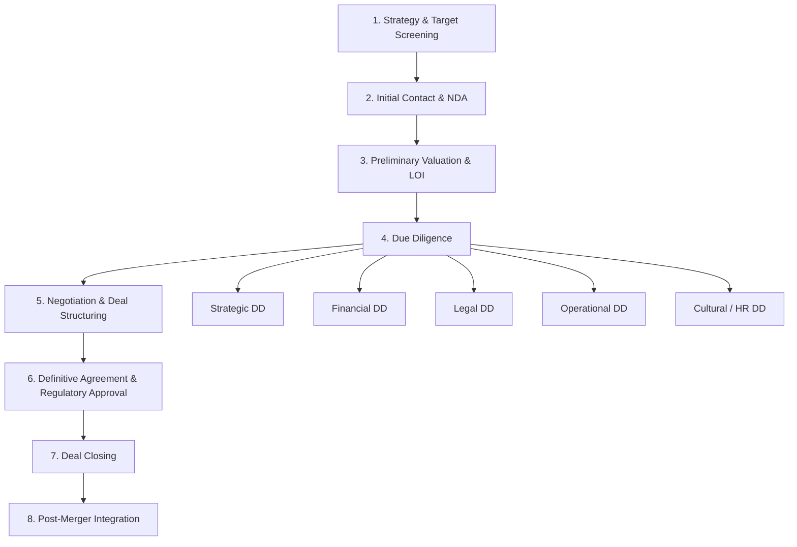

## M&A Process and Strategic Due Diligence

### Definition and Scope

The M&A process is the structured sequence of stages through which a firm identifies, evaluates, negotiates, executes, and integrates an acquisition or merger transaction. **Strategic due diligence** is the specific phase within this process devoted to rigorously testing whether the strategic rationale for the deal — the synergies, capability access, or market position the deal is expected to deliver — is well-founded, distinct from **financial, legal, and operational due diligence**, which focus respectively on the accuracy of financial statements, legal/regulatory exposure, and operational functioning. This item addresses the overall process architecture and the specific analytical content of strategic due diligence within it, complementing the general strategic rationale for M&A covered elsewhere in this chapter.

### The M&A Process: Sequential Stages

**1. Strategy Development and Target Screening**

Before any specific target is identified, the acquirer should articulate a clear corporate strategy rationale (per the diversification, vertical integration, or capability-access logic covered elsewhere in this chapter) and translate it into explicit acquisition criteria — target industry, size, geography, capability profile, and financial thresholds. Target screening then generates and filters a long list of candidates against these criteria, typically narrowing to a short list for initial approach.

**2. Initial Contact and Confidentiality**

Preliminary, often informal contact is made with the target (or its advisors), typically accompanied by a non-disclosure agreement (NDA) governing the exchange of sensitive information before any binding commitment is made by either party.

**3. Preliminary Valuation and Letter of Intent (LOI)**

The acquirer conducts an initial, high-level valuation based on publicly available and voluntarily shared information, and if interest is mutual, the parties typically execute a non-binding Letter of Intent (or term sheet) outlining the proposed structure, indicative price range, and key conditions, setting the stage for exclusive, deeper due diligence.

**4. Due Diligence**

The comprehensive investigation phase, addressed in detail below, in which the acquirer verifies the target's financial condition, legal standing, operations, and — critically for the strategic rationale — the genuine feasibility of anticipated synergies.

**5. Negotiation and Deal Structuring**

Findings from due diligence feed directly into final price negotiation, deal structure (asset purchase vs. stock purchase, cash vs. stock consideration, earn-outs, indemnification provisions), and risk allocation between buyer and seller (e.g., representations and warranties, escrow arrangements).

**6. Definitive Agreement and Regulatory Approval**

The parties execute a legally binding definitive purchase agreement, and the transaction proceeds through any required regulatory review (antitrust/competition authorities, sector-specific regulators, foreign investment screening where applicable) and shareholder approval processes.

**7. Deal Closing**

Legal transfer of ownership occurs upon satisfaction of all closing conditions specified in the definitive agreement.

**8. Post-Merger Integration**

The operational, organizational, and cultural work of combining the two firms to realize the value creation rationale that justified the deal — covered as a distinct topic elsewhere in this chapter, but whose planning should begin well before closing, ideally informed directly by findings from the due diligence phase.

### Strategic Due Diligence: Purpose and Distinctive Focus

While financial, legal, and operational due diligence ask "**is the target what it appears to be, and are there hidden risks or liabilities?**", strategic due diligence asks a fundamentally different and forward-looking question: "**will this combination actually create the value the deal thesis assumes, and is the price being paid consistent with realistic, verified synergy expectations?**" It is the direct evaluative mechanism for applying the Better-Off Test and Cost-of-Entry Test from general corporate strategy to a specific, concrete transaction.

### Core Components of Strategic Due Diligence

**1. Validating the Strategic Rationale**

Re-testing, with the benefit of confidential target information now available, whether the original strategic logic for pursuing the target (synergy type, capability gap being filled, market position sought) still holds once the acquirer has direct access to the target's internal data, rather than relying solely on public information and management's own characterization of its business.

**2. Synergy Identification and Quantification**

Moving from generic synergy claims (e.g., "cost savings from combined purchasing") to specific, quantified, and time-phased estimates, ideally validated against comparable prior transactions and cross-checked by functional experts (procurement, sales, manufacturing) who will be responsible for delivering the synergy post-close. Synergies are typically decomposed into:

- **Revenue synergies**: cross-selling potential, geographic/channel expansion, combined product bundling — generally regarded as harder to estimate reliably and slower to materialize than cost synergies, because they depend on customer behavior and competitive response rather than purely internal cost mechanics.
- **Cost synergies**: headcount reduction, facility consolidation, procurement scale, elimination of duplicate systems — generally regarded as more reliably estimable and faster to realize than revenue synergies.

**3. Competitive Position Assessment**

Independently assessing the target's actual competitive position (market share trends, customer concentration and retention, competitive threats, technology position) rather than relying solely on management's presentation, since target management (particularly if compensated based on deal completion or retained post-close) may have an incentive to present an overly favorable picture.

**4. Customer and Market Validation**

Where feasible and permissible, independently verifying customer relationships, contract terms, renewal rates, and customer satisfaction/loyalty, since customer attrition following a change of control is a common source of post-acquisition underperformance relative to the pre-deal projections used to justify the purchase price.

**5. Technology and Intellectual Property Assessment**

Evaluating the genuine quality, defensibility, and integration compatibility of the target's technology or IP assets — particularly relevant where the acquisition's rationale is specifically capability- or technology-access-driven, since a technology's paper specifications may not reflect its true competitive robustness or ease of integration with the acquirer's existing systems.

**6. Organizational and Cultural Due Diligence**

Assessing the target's organizational culture, management depth, key-person dependency risk, and likely cultural compatibility with the acquirer — a component increasingly recognized in the literature as critical to integration success, given the well-documented role of cultural clashes in derailing anticipated synergy realization, even where the underlying strategic logic was sound. [Inference: the specific weight given to cultural due diligence varies by deal type and practitioner, but its inclusion as a standard due diligence workstream is now broadly established practice in the M&A literature.]

**7. Stand-Alone Valuation Reality Check**

Independently valuing the target as a stand-alone entity (using discounted cash flow, comparable company, and precedent transaction methodologies) to establish a baseline against which the incremental value of claimed synergies can be assessed — this baseline is essential to the Cost-of-Entry Test, since without it, the acquirer cannot distinguish how much of the proposed price reflects the target's stand-alone value versus how much reflects a premium for synergies that may or may not be realized.

### Common Due Diligence Failures and Their Consequences

- **Confirmation bias in synergy estimation**: deal teams under pressure to justify a deal already in motion (particularly where significant transaction costs or reputational capital have already been committed) may systematically favor optimistic synergy assumptions and discount contrary evidence — a dynamic closely related to the managerial hubris and escalation-of-commitment issues discussed under M&A strategic rationale.
- **Underinvestment in cultural and organizational due diligence** relative to financial and legal due diligence, despite cultural incompatibility being a frequently cited cause of integration failure in post-merger retrospectives.
- **Time and access constraints**: competitive bidding processes, particularly auctions run by investment bankers on behalf of the seller, often compress the due diligence timeline and limit the acquirer's direct access to target management and data, increasing the risk that material issues are missed.
- **Reliance on seller-provided information without independent verification**, particularly for revenue synergy assumptions that are inherently harder to verify from data room documentation alone than cost-synergy assumptions.

### Deal Structuring Considerations Informed by Due Diligence

Findings from due diligence directly shape deal structure and risk allocation:

- **Representations and warranties**: contractual assurances from the seller about the accuracy of specific facts (financial statements, legal compliance, absence of undisclosed liabilities), with remedies (indemnification) if they prove false.
- **Earn-outs**: a portion of the purchase price is made contingent on the target achieving specified future performance targets post-close, used particularly where due diligence reveals genuine uncertainty about the target's forward performance or the seller's projections that the parties cannot fully resolve through negotiation alone.
- **Escrow arrangements**: a portion of the purchase price is held in escrow for a defined period to cover potential indemnification claims arising from issues discovered post-closing.
- **Price adjustment mechanisms**: mechanisms (e.g., working-capital adjustments) that true up the final purchase price based on the target's actual financial condition at closing versus the condition assumed at signing.

**Key Points**

- The M&A process runs sequentially from strategy development and target screening through due diligence, negotiation, definitive agreement, closing, and post-merger integration, with due diligence serving as the pivotal information-gathering and rationale-testing phase.
- Strategic due diligence is distinct from financial, legal, and operational due diligence: it specifically tests whether the deal's underlying strategic rationale and claimed synergies are genuine, quantifiable, and achievable, rather than verifying historical facts about the target.
- Cost synergies are generally regarded as more reliably estimable and faster to realize than revenue synergies, which depend on less controllable factors such as customer behavior and competitive response.
- A stand-alone valuation of the target, independent of synergy assumptions, is essential to applying the Cost-of-Entry Test and determining how much of the proposed price reflects a premium for synergies that may not materialize.
- Common due diligence failures — confirmation bias in synergy estimation, underinvestment in cultural due diligence, and compressed timelines in competitive auctions — are well-documented contributors to post-acquisition underperformance, even when the original strategic logic for the deal was sound.

**Example**

An enterprise software firm evaluating the acquisition of a smaller company with a complementary product line would conduct strategic due diligence by independently validating the target's customer retention and renewal rates (rather than relying solely on management's reported figures), assessing genuine technical compatibility between the two firms' software architectures (since claimed cross-selling synergy depends on the two products working well together, not merely being marketed together), and building a stand-alone discounted cash flow valuation of the target's existing business to isolate how much of the proposed purchase price is attributable to the target's current cash flows versus how much reflects a premium for revenue synergies (cross-selling to the combined customer base) that remain unproven until after the deal closes. If due diligence reveals that the target's key engineering talent is concentrated in one or two individuals with no retention agreements in place, the acquirer might structure the deal with a significant earn-out tied to post-close retention and product-integration milestones, directly allocating the risk uncovered during diligence rather than paying the full undiscounted price upfront.

**Next Steps**

- Post-Merger Integration Strategy and Execution
- M&A Valuation Methods: DCF, Comparables, and Precedent Transactions
- Deal Structuring: Cash vs. Stock, Earn-Outs, and Risk Allocation
- Cultural Due Diligence and Organizational Fit Assessment
- Regulatory and Antitrust Review Processes in M&A
- The Hubris Hypothesis and Behavioral Biases in Deal-Making
- Synergy Realization Tracking and Post-Close Performance Measurement