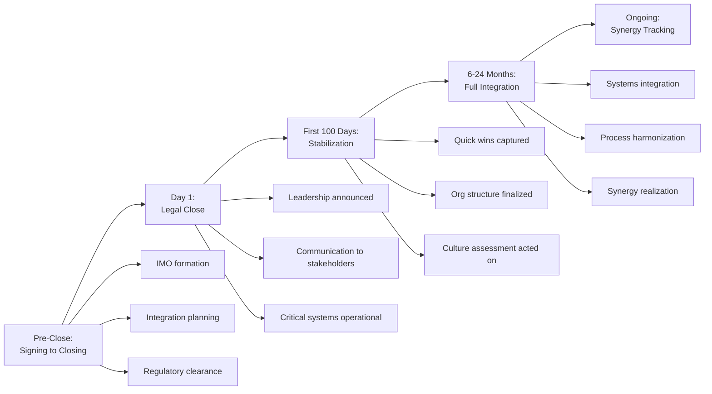
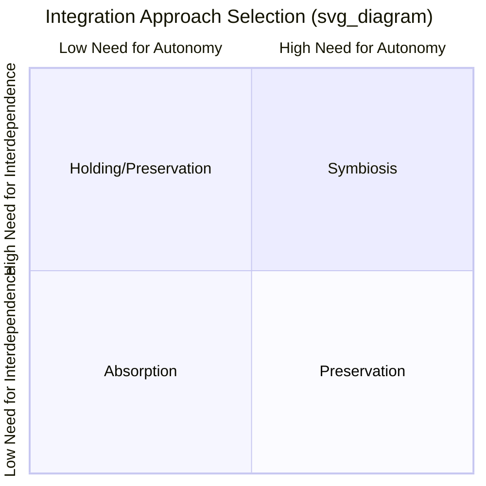

## Post-Merger Integration Strategy

### Definition and Importance

Post-merger integration (PMI) is the process of combining the operations, organizations, systems, and cultures of two previously separate firms following the close of an M&A transaction, with the explicit goal of realizing the synergies and strategic rationale that justified the deal's price. PMI is widely regarded in the strategic management literature as the phase most decisive for whether an acquisition ultimately creates or destroys value — a deal with an entirely sound strategic rationale and a fair purchase price can still fail if integration is poorly planned or executed, and conversely, disciplined integration can partially rescue a deal whose original rationale was only moderately compelling. Empirical estimates of M&A failure rates commonly attribute a substantial share of underperformance specifically to integration execution rather than to flawed deal rationale or overpayment. [Inference/Unverified: precise failure-rate percentages vary considerably across studies and definitions of "failure," and should not be treated as fixed, universally applicable constants.]

### The Integration Planning Imperative: Start Before Close

A central prescription in the PMI literature is that integration planning should begin well before deal closing — ideally informed directly by findings from strategic due diligence — rather than being addressed only once the transaction is legally complete. Firms with the strongest M&A track records typically establish a dedicated Integration Management Office (IMO) during the due diligence or signing-to-close period, tasked with developing the detailed Day-1 and first-100-days integration plan in parallel with deal execution, so that the combined organization is prepared to operate coherently from the moment of legal closing.

### The Integration Approach Continuum: Degree of Integration

Not all deals warrant the same depth of integration. The appropriate degree of integration should be driven by the specific strategic rationale for the deal — a critical link back to corporate parenting theory's emphasis on fit between the parent's approach and the acquired business's actual needs.

**Full Absorption**

The target is fully merged into the acquirer's existing organizational structure, systems, processes, and culture, with little or no operational independence retained. Appropriate when the deal rationale rests on capturing extensive operating synergies (cost consolidation, shared systems) and where the target's distinct capabilities are not highly dependent on preserving its separate identity or culture.

**Preservation (Hands-Off Integration)**

The target is retained as a largely autonomous, separately operating unit, with the acquirer providing capital, selective central services, and high-level oversight while deliberately avoiding disruption to the target's existing processes, culture, and decision-making autonomy. Appropriate when the deal rationale rests specifically on preserving a capability (e.g., innovation speed, entrepreneurial culture, specialized technical expertise) that would likely be damaged by imposing the acquirer's own systems and culture — directly echoing the corporate parenting theory concern that imposing a mismatched parenting style can destroy the very value the acquisition was meant to capture.

**Symbiosis (Selective/Best-of-Both Integration)**

A deliberate combination in which specific functions or processes are integrated (typically where clear synergy exists and integration will not damage the target's distinctive capabilities), while other functions are left autonomous (typically where the target's distinctiveness is precisely the source of value). This is generally the most operationally complex approach to execute well, since it requires case-by-case judgment about which specific activities to combine versus preserve, rather than applying a single uniform integration logic across the entire target.

**Holding Company Structure**

The target is retained as a distinct legal and operational entity with minimal integration beyond financial reporting and capital allocation, most typical of purely financially motivated (often unrelated-diversification) acquisitions where no meaningful operating synergy is anticipated or sought.

### Determinants of the Appropriate Integration Approach

The choice among these approaches should be driven primarily by two factors, per the influential framework developed by Haspeslagh and Jemison (1991):

1. **Need for Strategic Interdependence**: how much value depends on the two firms actually sharing resources, transferring capabilities, or combining operations (higher need for interdependence favors deeper integration).
2. **Need for Organizational Autonomy**: how much the target's ongoing performance depends on preserving its existing organizational boundaries, culture, and ways of working (higher need for autonomy favors lighter-touch integration).

### Key Workstreams in Integration Execution

**Leadership and Governance**

Rapidly clarifying the combined organization's leadership structure, reporting lines, and decision rights, since prolonged ambiguity about "who is in charge" is a well-documented source of talent attrition, decision paralysis, and organizational anxiety during integration.

**Communication**

Proactive, frequent, and consistent communication to all stakeholder groups (employees, customers, suppliers, investors) beginning at or before Day 1, addressing the uncertainty that a deal announcement inevitably creates and reducing the vacuum that, left unaddressed, tends to fill with rumor and anxiety-driven attrition.

**Cultural Integration**

Explicitly assessing and managing cultural differences between the combining organizations — differences in decision-making norms, risk tolerance, communication style, and management philosophy. Cultural clashes are one of the most frequently cited causes of integration failure in post-merger retrospectives, even in deals with a sound strategic and financial rationale, because unmanaged cultural friction directly undermines the retention of key talent and the effective collaboration needed to realize synergies.

**Talent Retention**

Identifying and proactively retaining key personnel — particularly in capability-driven acquisitions where the target's value is embodied substantially in specific individuals (technical experts, key client relationship holders, founder-executives) — since departure of key talent shortly after close is a common and severe threat to synergy realization, especially for technology or knowledge-intensive acquisitions.

**Systems and Process Integration**

Combining (or deliberately not combining) IT systems, financial reporting processes, HR systems, and operational processes, sequenced according to the chosen integration approach and prioritized to avoid disrupting business continuity during the transition.

**Customer and Supplier Continuity**

Proactively managing relationships with the target's (and acquirer's) customers and suppliers through the transition, since a change of control creates a natural moment of vulnerability in which customers may reconsider their loyalty and suppliers may seek to renegotiate terms.

**Synergy Capture and Tracking**

Establishing a formal, disciplined process for tracking realization of the specific synergies identified and quantified during strategic due diligence against a defined timeline, with clear accountability assigned to specific individuals or functions for delivering each synergy component — without this discipline, optimistic pre-deal synergy estimates frequently fail to convert into realized performance improvement.

### Common Sources of Integration Failure

- **Clash of organizational cultures**: fundamentally incompatible norms around decision-making speed, risk tolerance, or hierarchy that generate persistent friction and undermine collaboration.
- **Loss of key talent**: departure of critical personnel, particularly likely when integration is perceived as threatening autonomy, status, or job security, and particularly damaging in capability-driven deals.
- **Inadequate communication**: information vacuums that generate uncertainty, rumor, and reduced morale and productivity across both organizations during the transition period.
- **Mismatched integration approach and deal rationale**: applying a full-absorption approach to a deal whose value depended on preserving the target's autonomous culture (or vice versa, leaving a deal that required deep operational integration to realize cost synergies insufficiently integrated) — a direct manifestation of the corporate parenting fit problem applied at the integration-execution level.
- **Underestimating integration complexity and cost**: integration invariably consumes more management time, resources, and calendar time than anticipated at deal signing, diverting attention from ongoing business operations and customer service.
- **Loss of momentum after initial "quick wins"**: many integration efforts front-load easily achievable synergies (e.g., eliminating obviously duplicate corporate overhead) but lose organizational energy and discipline for the harder, longer-cycle synergies (e.g., deep systems integration, cultural change, revenue synergy realization) that require sustained multi-year effort.

**Key Points**

- Post-merger integration is widely regarded as the phase most decisive for whether an M&A transaction actually delivers the value creation its strategic rationale promised, independent of whether the deal price and rationale were themselves sound.
- Integration planning should begin before deal closing, ideally informed directly by strategic due diligence findings, rather than being addressed only after legal close.
- The appropriate integration approach — Absorption, Preservation, Symbiosis, or Holding Company structure — should be driven by the specific need for strategic interdependence versus organizational autonomy implied by the deal's actual rationale, directly echoing corporate parenting theory's emphasis on fit.
- Cultural integration and talent retention are among the most frequently cited causes of integration failure, even in deals with a fundamentally sound strategic and financial logic.
- Disciplined, accountable synergy tracking against the specific estimates developed during due diligence is essential to converting a deal's paper rationale into realized performance, since front-loaded "quick win" synergies alone are typically insufficient to justify the full acquisition premium paid.

**Example**

A large enterprise acquiring a smaller, founder-led technology startup specifically for its innovative product and engineering talent would be well advised to pursue a Preservation (or Symbiosis) integration approach rather than Full Absorption: imposing the acquirer's typical corporate bureaucracy, approval processes, and compensation structures onto the target's engineering team risks precipitating exactly the kind of key-talent attrition that would destroy the acquisition's core value proposition. The acquirer might integrate specific functions where clear synergy exists and autonomy risk is low (e.g., combining back-office finance and HR administration) while deliberately preserving the target's product development team's existing processes, reporting structure, and physical location, at least through an initial multi-year period, precisely the symbiosis logic Haspeslagh and Jemison's framework prescribes for a deal with high interdependence needs (the acquirer genuinely wants the technology integrated into its offering) combined with a high autonomy need (the technology's continued development depends on preserving the team's distinctive culture and working methods).

**Next Steps**

- Corporate Parenting Theory and Fit Between Parent and Acquired Business
- Organizational Culture Assessment and Cultural Due Diligence
- M&A Process and Strategic Due Diligence
- Talent Retention Strategies in Acquisitions
- Change Management Frameworks for Organizational Transitions
- Synergy Realization Tracking and Post-Close Performance Measurement
- Haspeslagh and Jemison's Acquisition Integration Approaches
- Strategic Alliances and Joint Ventures as Lower-Integration-Risk Alternatives