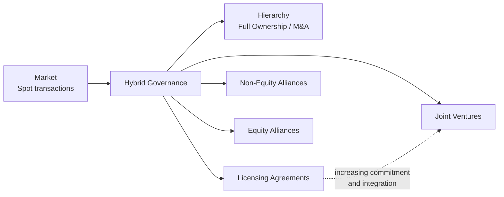

## Strategic Alliances and Joint Ventures

### Definition and Position Among Expansion Modes

A **strategic alliance** is a voluntary, cooperative arrangement between two or more independent firms that pool or exchange resources, capabilities, or knowledge to pursue mutually beneficial strategic objectives, while each partner remains a separate, independent legal entity. This distinguishes alliances sharply from M&A, in which one firm acquires ownership and control over another. A **joint venture (JV)** is a specific, more formal alliance structure in which two or more partner firms create a new, jointly owned legal entity to pursue a defined business purpose, with ownership, control, and resulting profits or losses typically shared according to negotiated equity stakes. Alliances and joint ventures occupy the middle ground on the **governance continuum** between arm's-length market transactions and full ownership integration (M&A) — directly connecting to the hybrid-governance category from transaction cost economics.

### Types of Strategic Alliances

**Non-Equity Alliances**

Cooperation governed purely by contract, with no exchange of equity ownership between partners. Includes licensing agreements, supply agreements, co-marketing arrangements, joint R&D contracts, and franchising. Generally the lowest-commitment, most flexible, and easiest-to-exit form of alliance, but also offers the weakest signal of long-term commitment and the least protection against opportunistic behavior by a partner (per transaction cost economics' hold-up logic).

**Equity Alliances**

One partner takes a minority equity stake in the other (or both partners take reciprocal minority stakes in each other), without forming a new jointly owned entity. The equity stake serves as a partial "credible commitment" or hostage mechanism, aligning partner incentives more closely than a pure contract and signaling a stronger degree of mutual commitment than a non-equity alliance.

**Joint Ventures**

The partners jointly create and co-own a new, legally distinct entity, contributing agreed resources (capital, technology, market access, personnel) in exchange for equity stakes in the new venture, with governance typically shared through a board structure reflecting the partners' relative ownership and negotiated control rights. Joint ventures represent the highest-commitment, most structurally formal alliance type, approaching (but stopping short of) full ownership integration.

### Strategic Rationale for Alliances (vs. M&A or Organic Development)

**Accessing Complementary Resources Without Full Commitment**

Alliances allow firms to combine complementary capabilities (e.g., one partner's technology with another's distribution network or local market knowledge) without either partner having to acquire the other outright, preserving each partner's independence and limiting capital commitment relative to a full acquisition.

**Market Entry, Especially International**

Joint ventures are a common vehicle for entering foreign markets, particularly where a local partner provides essential market knowledge, regulatory relationships, distribution access, or compliance with local ownership requirements (some jurisdictions historically require or favor local-partner joint ventures as a condition of market access, though this varies significantly by country and has evolved over time). [Inference: current specific regulatory requirements by jurisdiction should be verified rather than assumed static, as foreign investment rules evolve.]

**Risk and Cost Sharing**

Alliances allow partners to share the financial risk and cost of large, uncertain investments — particularly relevant for capital-intensive R&D, large-scale infrastructure projects, or ventures into highly uncertain new technologies or markets — where no single partner may wish to bear the full risk alone.

**Speed Relative to Organic Development, Flexibility Relative to M&A**

Alliances typically enable faster capability access than building the equivalent capability internally (similar to the speed rationale for M&A), while preserving substantially greater flexibility to exit or restructure the arrangement than a full acquisition would allow, since unwinding an alliance (particularly a non-equity or minority-equity alliance) is generally far less costly and complex than divesting a wholly owned, integrated business unit.

**Learning and Capability Transfer**

Alliances can serve as a vehicle for organizational learning — each partner gains exposure to the other's capabilities, processes, or technology, potentially building internal capability over time that could eventually substitute for continued reliance on the partner (a dynamic that can itself become a source of alliance instability, discussed below).

**Setting Industry Standards or Building Ecosystems**

Alliances among multiple firms (including, in some cases, direct competitors) can be used to establish common technical standards or build a broader ecosystem of complementary products, from which all alliance members benefit through expanded overall market size — a rationale less naturally served by unilateral M&A, given that establishing a standard typically requires cooperation across a broader set of industry participants than a single acquirer could practically absorb.

**Overcoming Regulatory or Political Barriers to Full Acquisition**

Where full foreign ownership or full horizontal combination between competitors would face regulatory or antitrust obstacles, an alliance or joint venture can achieve much of the strategic benefit of closer cooperation without triggering the same level of regulatory scrutiny as an outright merger or acquisition.

### Applying Transaction Cost Economics to the Alliance-vs-Integration Choice

Per the transaction cost economics framework covered under vertical integration, alliances (hybrid governance) are theoretically appropriate for transactions characterized by **moderate** asset specificity, uncertainty, and frequency — high enough that pure market contracting carries meaningful hold-up or coordination risk, but not so high that the hold-up risk can only be eliminated through full ownership integration. Alliance-specific governance mechanisms substitute for full ownership as safeguards against opportunism:

- **Credible commitments / mutual hostages**: reciprocal, offsetting investments (e.g., cross-equity stakes, co-located dedicated facilities) that make both partners simultaneously vulnerable, deterring unilateral defection.
- **Relational contracting and trust**: repeated interaction and the expectation of future cooperation (a repeated-game dynamic) substitute for formal ownership control in disciplining opportunistic behavior.
- **Contractual safeguards**: detailed governance provisions (decision rights, dispute resolution mechanisms, exit and buy-out clauses) negotiated explicitly into the alliance or JV agreement.

### Common Sources of Alliance Instability and Failure

Empirical research on alliance performance consistently documents high failure or instability rates, attributed to several recurring causes:

- **Divergent partner objectives over time**: partners' strategic priorities, negotiated at alliance formation, frequently diverge as each partner's own business evolves, undermining the original basis for cooperation.
- **Unequal or shifting bargaining power**: if one partner's relative contribution or dependence on the alliance changes over time (for example, one partner successfully absorbs the other's key capability through the learning process, reducing its future need for the partnership), the alliance's negotiated terms can become misaligned with the partners' actual relative value contribution, generating tension and eventual dissolution.
- **Cultural and organizational incompatibility**: similar to the cultural-fit challenges documented in post-merger integration, differences in decision-making style, risk tolerance, and organizational norms between allied firms can undermine effective collaboration, compounded in alliances by the absence of unified management authority to resolve disputes (unlike a wholly owned subsidiary, where the parent retains ultimate decision authority).
- **Opportunistic learning race / competitive tension between partners**: particularly acute where alliance partners are simultaneously current or potential future competitors — a partner may use the alliance principally to absorb the other's proprietary knowledge or capability with the intention of ultimately internalizing that capability and reducing dependence on (or even competing directly against) the original partner. This risk is directly related to Williamson's opportunism assumption from transaction cost economics.
- **Governance ambiguity and slow decision-making**: shared control structures, particularly in 50/50 joint ventures, can produce deadlock on important strategic decisions where the partners disagree, absent a pre-negotiated tie-breaking or dispute-resolution mechanism.
- **Absence of a clear exit mechanism**: alliances formed without clearly negotiated provisions for how the arrangement will be modified, wound down, or converted (e.g., into a full acquisition by one partner) if circumstances change can become difficult and contentious to unwind when the original rationale for cooperation weakens.

### Alliance Management Capability as a Distinct Organizational Competence

A significant strand of the alliance literature (e.g., Kale and Singh) emphasizes that firms which manage a substantial number of alliances over time can develop a distinct, transferable **alliance management capability** — dedicated processes, personnel, and organizational routines for alliance partner selection, negotiation, governance design, and ongoing relationship management — and that firms possessing this capability tend to achieve more consistent alliance success than firms treating each alliance as a one-off, ad hoc arrangement without accumulated organizational learning about how to structure and manage such relationships effectively.

### Comparison: Alliances/JVs vs. M&A vs. Organic Development

| Dimension | Organic Development | Strategic Alliance / JV | M&A |
| --- | --- | --- | --- |
| Speed | Slowest | Moderate to fast | Fastest |
| Capital commitment | Spread over time | Shared with partner(s) | Concentrated, often at a premium |
| Control | Full | Shared / negotiated | Full (post-close) |
| Flexibility to exit | High (can simply stop investing) | Moderate (can be complex, but generally less so than divestiture) | Low (divestiture is costly and complex) |
| Risk exposure | Borne entirely by firm | Shared with partner(s) | Borne entirely by acquirer, concentrated in premium paid |
| Integration/coordination cost | None (single firm) | Ongoing, cross-organizational | High during PMI, then typically resolved into unified structure |
| Appropriate under TCE when | Low asset specificity, or valuable proprietary capability best built internally | Moderate asset specificity, uncertainty, or frequency | High asset specificity, uncertainty, and frequency |

**Key Points**

- Strategic alliances and joint ventures occupy the hybrid-governance middle ground between arm's-length market transactions and full ownership integration via M&A, ranging from non-equity contractual alliances through equity alliances to fully co-owned joint ventures.
- Alliances are chosen over M&A or organic development specifically to access complementary resources, share risk and cost, enable faster and more flexible market entry (particularly international), or navigate regulatory constraints, while preserving each partner's independence and limiting capital commitment.
- Transaction cost economics predicts hybrid/alliance governance is appropriate for transactions with moderate (rather than very high or very low) asset specificity, uncertainty, and frequency, with credible commitments and relational contracting substituting for the hold-up protection full ownership would otherwise provide.
- Alliance instability is common and frequently traced to divergent partner objectives over time, shifting bargaining power (including opportunistic learning races between partner-competitors), cultural incompatibility, governance deadlock, and absence of clear exit mechanisms.
- Firms that manage many alliances over time can develop a distinct, transferable alliance management capability, associated with more consistent alliance success than treating each alliance as an isolated, one-off arrangement.

**Example**

An automaker seeking to enter electric vehicle battery manufacturing, a capital-intensive and technologically uncertain domain, might form a joint venture with a battery-technology specialist rather than acquiring the specialist outright or building battery manufacturing capability entirely from scratch. The joint venture allows the automaker to share the very large capital investment and technology risk with a partner possessing complementary, proprietary battery expertise it does not itself have, while the battery specialist gains access to the automaker's manufacturing scale, capital, and guaranteed demand. Because battery technology continues to evolve rapidly (creating moderate-to-high uncertainty) and the relationship requires some specialized, co-located investment (moderate asset specificity) but does not yet warrant the irreversible commitment of full acquisition, transaction cost economics would predict a joint venture (hybrid governance) as an appropriate structure — though the automaker should anticipate that as it accumulates its own battery expertise through the joint venture over time, the original bargaining balance between the two partners may shift, potentially setting up a future renegotiation, buyout, or dissolution of the arrangement once the automaker's dependence on the partner's proprietary knowledge diminishes.

**Next Steps**

- Transaction Cost Economics and the Governance Continuum
- International Market Entry Modes and Joint Venture Structures
- Alliance Governance Design and Contractual Safeguards
- Alliance Management Capability as an Organizational Competence
- Corporate Parenting Theory Applied to Joint Venture Fit
- Post-Merger Integration Strategy (Comparative Reference Point)
- Standard-Setting Consortia and Ecosystem Strategy
- Alliance Termination, Buyout, and Conversion to Acquisition