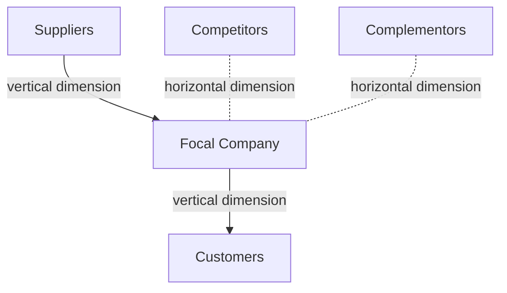

## Coopetition and the Value Net

### Definition and Origin

**Coopetition** is a portmanteau of "cooperation" and "competition," describing a strategic relationship in which two or more firms simultaneously cooperate in some dimensions of their relationship while competing in others. The term and its formal analytical framework were developed by Adam Brandenburger and Barry Nalebuff in their 1996 book *Co-opetition*, which applied game-theoretic reasoning to reframe strategic relationships between firms as neither purely competitive nor purely cooperative, but as containing elements of both simultaneously — a departure from the largely competition-centric framing of classical strategy tools such as Porter's Five Forces.

### The Core Insight: Business as a Non-Zero-Sum Game

Coopetition theory's foundational departure from purely competitive strategy frameworks is the recognition that **business is generally not a zero-sum game** — the total value available to be divided among market participants (customers, suppliers, competitors, complementors) is not fixed, but can be expanded through cooperation before being divided through competition. This leads to Brandenburger and Nalebuff's central prescriptive framing: firms should think of business strategy as involving two distinct kinds of games played simultaneously:

1. **The game of creating value** ("growing the pie") — often best played cooperatively, since expanding the total value available benefits multiple parties simultaneously.
2. **The game of capturing value** ("dividing the pie") — inherently competitive, since one party's larger share of a given pool of value typically comes at another party's expense.

### The Value Net: Structure and Purpose

The **Value Net** is Brandenburger and Nalebuff's core diagnostic map of a firm's full strategic relationship set, extending Porter's Five Forces framework by explicitly adding a category of player — the **complementor** — that Five Forces does not name as a distinct force.

**The Vertical Dimension: Customers and Suppliers**

Reflects the traditional value-chain relationships already central to Porter's Five Forces — the focal firm buys inputs from suppliers and sells outputs to customers, with bargaining power dynamics operating along this vertical axis exactly as in the classical framework.

**The Horizontal Dimension: Competitors and Complementors**

This is the Value Net's distinctive contribution. Both competitors and complementors are defined not by their formal industry classification, but functionally, by how they affect the *value a customer or supplier places on doing business with the focal firm*:

- **Competitors**: other players whose product or offering makes the focal firm's own product or offering **less** valuable to a customer, or whose presence makes it **less** attractive for a supplier to supply the focal firm (e.g., because the competitor bids up the price of the same scarce input).
- **Complementors**: other players whose product or offering makes the focal firm's own product or offering **more** valuable to a customer, or whose presence makes it **more** attractive for a supplier to supply the focal firm (e.g., because the complementor increases overall demand for the shared input, allowing the supplier to achieve favorable scale economies that benefit both).

### The Complementor Concept in Depth

**Definition via the "Test"**: Brandenburger and Nalebuff propose a direct diagnostic test — a player is a complementor to the focal firm from the customer's perspective if a customer values the focal firm's product **more** when they also have the other player's product, compared to having the focal firm's product alone. Symmetrically, a player is a complementor from the supplier's perspective if a supplier finds it **more** attractive to supply the focal firm when it also supplies the other player, than supplying the focal firm alone.

This functional definition means the same external party can be a competitor in one respect and a complementor in another, and indeed the same two firms can be simultaneously complementors and competitors with respect to different products, customer segments, or specific transactions — which is precisely the coopetitive relationship the framework is built to describe.

**Illustrative Structural Pattern** (a widely used generic example in the coopetition literature): hardware and software providers in a computing ecosystem are classic complementors — a customer values a given hardware platform more when high-quality software is available for it, and values a given piece of software more when it runs on capable hardware; neither party's product substitutes for the other's, and the value of each is enhanced by the other's presence and quality, distinguishing the relationship sharply from a competitive one.

### Strategic Implications and the PARTS Framework

Brandenburger and Nalebuff propose that a firm seeking to change the "game" it is playing — rather than simply optimizing its position within an existing, fixed set of rules and relationships — can act on five levers, summarized by the mnemonic **PARTS**:

- **Players**: who is in the game. A firm can change the game by adding new players (bringing in a complementor to expand the market, or inviting a new supplier to increase competitive pressure on existing suppliers) or by encouraging an existing player to exit.
- **Added Value**: what each player contributes to the game. A firm can increase its own added value (making itself more valuable/harder to replace) or seek to reduce a rival's added value.
- **Rules**: the formal or informal rules governing the game (contracts, industry norms, regulations, standards). Firms can act to shape or change these rules to their advantage.
- **Tactics**: perceptions and beliefs held by other players about the game, which can be actively shaped through the firm's own communications and actions (a dimension closely related to signaling and perception management in competitive strategy).
- **Scope**: the boundaries of the game itself — which markets, products, or relationships are linked together or treated as separate. Firms can expand or contract scope strategically (e.g., linking two previously separate negotiations to create leverage, or deliberately unbundling them).

### Distinguishing Coopetition from Pure Cooperation and Pure Competition

| Dimension | Pure Competition | Pure Cooperation | Coopetition |
| --- | --- | --- | --- |
| Value creation | Not the primary focus | Central focus | Central focus, pursued jointly with a specific partner |
| Value capture | Central focus (zero-sum framing) | Not the primary focus | Central focus, and often contested even between cooperating partners |
| Typical relationship structure | Rivals in the same market | Formal alliance or non-rival complementors | Simultaneous cooperation and competition with the same party |
| Analytical tool | Porter's Five Forces | Traditional alliance/partnership frameworks | Value Net + game-theoretic reasoning |

### Applications and Manifestations of Coopetition in Practice

**Standard-Setting and Ecosystem-Building**

Direct competitors frequently cooperate to establish common technical standards, since a shared standard can expand the total addressable market for all participants (value creation), even though the same firms compete vigorously for market share once the standard is established and adoption begins (value capture) — a coopetitive dynamic distinct from, but related to, the alliance-based rationale for standard-setting consortia discussed under strategic alliances.

**Shared Infrastructure or Supply Chain Cooperation**

Competing firms may jointly invest in shared infrastructure, logistics networks, or research consortia to reduce costs or accelerate technology development for the entire industry, while continuing to compete on branding, distribution, pricing, and downstream product differentiation.

**Platform Ecosystems**

Platform providers and the third-party developers or complementary product/service providers building on that platform exhibit a particularly clear and sustained coopetitive relationship: the platform benefits from a rich complementor ecosystem (increasing the platform's value to end customers), while the platform provider and its complementors simultaneously compete for a share of the total value the ecosystem generates (e.g., through platform fees, revenue-sharing terms, or the platform provider's own competing first-party offerings within the ecosystem it hosts).

### Risks and Tensions in Coopetitive Relationships

- **Value-creation and value-capture tension**: the same actions that expand the joint pie (e.g., sharing proprietary technical information to accelerate standard development) can simultaneously weaken a firm's ability to capture a favorable share of that expanded pie later, creating a persistent underlying tension throughout the relationship.
- **Trust and opportunism risk**: coopetitive relationships inherit the same opportunism concerns central to transaction cost economics and alliance theory — a partner-competitor may use cooperative information-sharing to advance its own competitive position disproportionately, particularly where the cooperative and competitive dimensions of the relationship are not clearly bounded or governed.
- **Ambiguity in relationship management**: managers and organizational structures accustomed to a purely competitive or purely cooperative mental model may struggle to manage a relationship that genuinely requires holding both orientations simultaneously, potentially defaulting inappropriately to one mode (excessive suspicion undermining genuine value-creation opportunities, or excessive trust creating vulnerability to opportunistic exploitation).

**Key Points**

- Coopetition describes relationships in which firms simultaneously cooperate to create value and compete to capture it, reframing business strategy as involving both a cooperative "create the pie" game and a competitive "divide the pie" game.
- The Value Net extends Porter's Five Forces by adding complementors as a distinct horizontal-dimension player alongside competitors, defined functionally by whether their presence increases (complementor) or decreases (competitor) the value customers or suppliers place on dealing with the focal firm.
- The same external party can be simultaneously a competitor and a complementor to a given firm, depending on the specific product, market, or relationship dimension being considered.
- The PARTS framework (Players, Added Value, Rules, Tactics, Scope) provides five levers through which a firm can deliberately change the strategic "game" it is playing, rather than simply optimizing within a fixed, given set of relationships.
- Coopetitive relationships carry an inherent tension between joint value creation and competitive value capture, and inherit the trust and opportunism risks familiar from transaction cost economics and alliance theory, requiring deliberate governance to manage successfully.

**Example**

Two competing consumer electronics manufacturers might jointly participate in an industry consortium to establish a common wireless charging standard, cooperating extensively on the underlying technical specification (value creation, since a widely adopted common standard expands the total addressable market for wireless-charging-capable devices and accessories for every participant, relative to a fragmented market with incompatible proprietary standards). Once the standard is established and adopted, however, the same two manufacturers compete vigorously against each other for market share in devices built on that now-shared standard (value capture) — and each additionally faces the coopetitive question of how to treat the broader ecosystem of third-party accessory makers building charging accessories compatible with the standard: those accessory makers are complementors (their presence increases the value of each manufacturer's devices to end customers), even though the manufacturers might also compete with some of those same accessory makers if they choose to sell their own first-party charging accessories.

**Next Steps**

- Porter's Five Forces Framework (Comparative Reference Point)
- Game Theory Applications in Competitive Strategy
- Platform Strategy and Ecosystem Management
- Standard-Setting Consortia and Industry Cooperation
- Strategic Alliances and Joint Ventures (Related Governance Forms)
- Transaction Cost Economics and Opportunism Risk in Cooperative Relationships
- Blue Ocean Strategy and Value Innovation