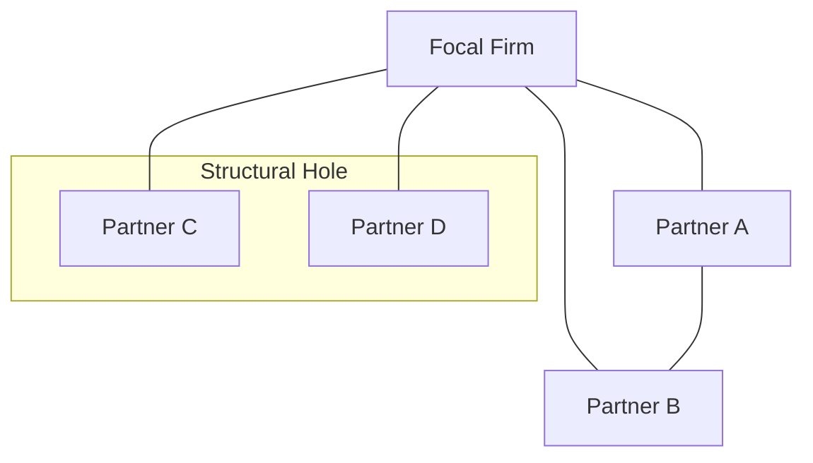

## Managing Alliance Portfolios and Networks

### Definition and Scope

Where the analysis of a single strategic alliance focuses on the formation, governance, and performance of one bilateral relationship, **alliance portfolio management** addresses a fundamentally different problem: how a firm should manage the **entire collection** of alliances it holds simultaneously, recognizing that the portfolio's value is not simply the sum of its individual alliances' values in isolation. A firm's **alliance network** extends this further, encompassing not just the firm's own direct (dyadic) alliance relationships but the broader web of interconnections among its partners and its partners' partners — recognizing that a firm's position within this wider network structure itself carries strategic value and risk, independent of the quality of any single relationship.

### Why the Portfolio-Level View Matters: Beyond Dyadic Analysis

A firm managing multiple alliances simultaneously faces interdependencies that a purely dyadic (one-alliance-at-a-time) analysis misses entirely:

- **Resource competition across alliances**: management attention, capital, and specialized alliance-management personnel are finite corporate resources that must be allocated across the entire portfolio, meaning the health of one alliance can directly affect the resources available to sustain others.
- **Portfolio composition and diversity**: the strategic value of the alliance portfolio depends on its overall mix — for example, a balance between exploration-oriented alliances (accessing genuinely new capabilities or markets, characterized by higher uncertainty) and exploitation-oriented alliances (leveraging and refining existing capabilities with established partners, characterized by lower uncertainty and more predictable returns).
- **Conflicts and overlaps between alliances**: a firm's alliance with one partner may create tension with a separate alliance held with a different (potentially competing) partner, particularly where information-sharing boundaries between the two relationships are not clearly managed.
- **Cumulative learning and capability development**: firms that manage many alliances over time can build a reusable **alliance management capability** — codified processes, dedicated organizational roles, and accumulated experience in partner selection, negotiation, and governance design — that raises the average success rate of the entire portfolio, rather than each alliance drawing on entirely ad hoc, one-off management approaches.

### Key Dimensions of Alliance Portfolio Design

**Portfolio Size**

The number of alliances a firm maintains simultaneously. Larger portfolios can provide greater access to diverse resources and reduce dependence on any single partner, but impose greater coordination and management-attention costs, and beyond some point may exceed the firm's alliance-management capacity, degrading the average quality of governance across the whole portfolio.

**Portfolio Diversity**

The heterogeneity of the portfolio across dimensions such as partner type (competitor, supplier, customer, unrelated firm), alliance governance form (non-equity, equity, joint venture), geographic scope, and strategic purpose (exploration versus exploitation). Greater diversity can provide access to a broader range of resources and reduce correlated risk (if one type of relationship or one industry segment underperforms, others may not), but also increases the internal coordination and capability-breadth demands placed on the firm's alliance-management function.

**Partner Diversity and Redundancy**

Whether alliance partners bring genuinely distinct resources and perspectives (non-redundant) or substantially overlapping ones (redundant). [Inference: synthesized from the social-network and alliance-portfolio literature broadly] — non-redundant partners tend to expand the range of resources and information accessible to the firm, while excessive redundancy across partners may indicate underutilized portfolio diversification, though some degree of redundancy can also provide valuable backup/resilience in case any single relationship deteriorates.

### The Network-Level View: Position and Structural Holes

Beyond managing the portfolio of its own direct relationships, a firm's strategic position is also shaped by the broader structure of the network within which it and its partners are embedded — a perspective drawn from social network theory as applied to inter-firm relationships.

**Network Centrality**

Firms occupying more central positions in an alliance network — connected to a larger number of other well-connected firms — tend to have greater access to information, resources, and reputational benefits flowing through the network, and may also have greater influence over emerging industry norms or standards.

**Structural Holes**

A concept developed by sociologist Ronald Burt, referring to gaps in a network where two other parties are not directly connected to each other but are both connected to the focal firm. A firm positioned as the connecting link across such a "structural hole" can potentially capture significant informational and brokerage advantages — accessing distinct, non-redundant information and resource flows from each side, and potentially exercising valuable influence over transactions or coordination between the two otherwise-unconnected parties. [Inference: application of structural-hole theory specifically to inter-firm alliance networks (rather than intra-organizational or individual social networks, where Burt's original research was concentrated) is an extension found in the broader strategic-alliance and network-strategy literature, and the magnitude of the brokerage advantage is context-dependent.]

*In this stylized illustration, Partners C and D are each connected only to the Focal Firm, with no direct connection between them — the Focal Firm occupies a brokerage position across this structural hole, potentially accessing distinct, non-redundant information or resource flows from each partner independently.*

### Portfolio-Level Governance Challenges

**Managing Coopetitive Tension Across the Portfolio**

Where a firm's alliance portfolio includes alliances with multiple partners who are themselves competitors of one another (or who compete with the focal firm in some domains while cooperating in others), the firm must actively manage information boundaries and avoid conflicts of interest between separate alliance relationships — directly connecting to the coopetition dynamics discussed elsewhere in this chapter, now operating at a portfolio-wide rather than single-relationship scale.

**Standardizing versus Customizing Alliance Governance**

Firms managing large alliance portfolios face a trade-off between developing standardized governance templates, contracts, and processes (reducing transaction costs and enabling scalable alliance management) and customizing governance to the specific needs of each individual relationship (better matching each alliance's specific risk profile and strategic purpose, per the transaction-cost-economics logic of matching governance structure to transaction characteristics, but at higher administrative cost).

**Building a Dedicated Alliance Management Function**

Firms with extensive alliance portfolios frequently establish a centralized or coordinating alliance-management office or function, tasked with: maintaining institutional knowledge and best practices across the portfolio, monitoring the health and performance of individual alliances against portfolio-wide standards, coordinating resource allocation and avoiding conflicts across the portfolio, and capturing and disseminating lessons learned from both successful and unsuccessful alliances to improve future alliance formation and governance decisions.

**Portfolio Rebalancing Over Time**

Analogous to corporate portfolio management of business units, an alliance portfolio requires active, ongoing rebalancing as individual alliances mature, as partners' strategic priorities shift, and as the firm's own strategic needs evolve — including deliberately terminating or restructuring underperforming or increasingly misaligned alliances to free management attention and resources for new or higher-priority relationships, rather than allowing the portfolio to accumulate legacy alliances indefinitely by default.

### Alliance Portfolio Performance Measurement

Evaluating alliance portfolio performance requires metrics beyond the financial performance of any single alliance in isolation:

- **Portfolio-level resource access and capability development**: the breadth and quality of external resources, knowledge, and capabilities the firm can access across its entire alliance network, not just any one relationship.
- **Innovation outcomes attributable to the portfolio as a whole**: many firms specifically track innovation metrics (new product introductions, patent outputs, time-to-market improvements) associated with alliance-sourced knowledge, since exploration-oriented alliances are frequently justified primarily on innovation grounds rather than direct near-term financial return.
- **Alliance survival and renewal rates across the portfolio**: aggregate measures of how many alliances are renewed, restructured, or terminated over a given period, used as a portfolio-level indicator of the firm's overall alliance-management effectiveness.
- **Network position metrics**: for firms with sophisticated alliance-management capability, formal network-analysis metrics (centrality, structural-hole occupancy) may be tracked as indicators of the firm's overall strategic position within its industry's broader alliance network, distinct from the performance of any individual relationship.

**Key Points**

- Alliance portfolio management addresses the interdependencies and resource-allocation challenges across a firm's entire collection of alliances, which a purely dyadic, one-relationship-at-a-time analysis does not capture.
- Portfolio design choices — size, diversity of partner types and governance forms, and the balance between exploration- and exploitation-oriented alliances — jointly determine the portfolio's overall strategic value and management complexity.
- Network-level concepts, particularly structural holes (positions bridging otherwise unconnected partners), extend the analysis beyond the firm's own direct relationships to its broader strategic position within the wider alliance network.
- Firms managing extensive alliance portfolios frequently benefit from a dedicated alliance-management function that standardizes best practices, monitors portfolio-wide health, and captures organizational learning across individual alliance experiences.
- Alliance portfolios require active, ongoing rebalancing — including deliberate termination of underperforming or misaligned alliances — rather than indefinite accumulation of legacy relationships.

**Example**

A pharmaceutical company managing a large portfolio of R&D alliances with biotech firms, academic research institutions, and contract manufacturing organizations would need to consider not just each alliance's individual merits, but the portfolio's overall composition: a portfolio composed entirely of exploitation-oriented manufacturing alliances with established partners might generate reliable near-term value but underinvest in the exploration-oriented biotech alliances needed to refresh the company's future drug pipeline. The company might also find itself occupying a valuable structural-hole position if it maintains relationships with two smaller, specialized biotech firms that possess complementary but non-overlapping technologies and are not themselves connected to each other — potentially allowing the pharmaceutical company to broker a mutually beneficial combination of the two technologies that neither biotech firm could arrange independently, provided the company's alliance-management function proactively identifies and acts on this brokerage opportunity rather than managing the two relationships in isolation from one another.

**Next Steps**

- Strategic Alliances and Joint Ventures (Foundational Dyadic Concepts)
- Coopetition and the Value Net (Multi-Party Strategic Relationships)
- Social Network Theory Applied to Inter-Firm Strategy
- Exploration vs. Exploitation in Organizational Learning
- Alliance Management Capability as an Organizational Competence
- Open Innovation and External Knowledge-Sourcing Strategies
- Ecosystem Strategy and Platform Governance