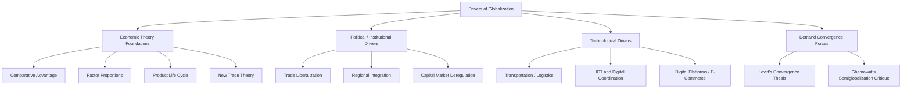

## Theories and Drivers of Globalization

### Definition and Scope

Globalization, in the strategic management context, refers to the increasing integration and interdependence of national economies, markets, and industries, driven by the growing flow of goods, services, capital, technology, and people across national borders. For corporate strategists, understanding globalization's theoretical foundations and specific drivers is prerequisite to formulating international strategy — the decisions about whether, where, and how a firm should compete across national boundaries, covered as a distinct set of topics elsewhere in this chapter.

### Classical Economic Theories Underlying Globalization

**Theory of Absolute Advantage (Adam Smith, 1776)**

The foundational trade theory holding that countries should specialize in producing goods they can produce more efficiently (using fewer resources) than other countries, and trade for goods that other countries produce more efficiently, generating mutual gains from trade relative to national self-sufficiency (autarky).

**Theory of Comparative Advantage (David Ricardo, 1817)**

A refinement demonstrating that mutually beneficial trade can occur even when one country is more efficient at producing *every* good than its trading partner (i.e., holds an absolute advantage in everything), as long as each country specializes in producing the good in which its *relative* efficiency advantage is greatest (its comparative advantage) and trades for the rest. This remains the core theoretical justification for the gains from international trade underlying much of contemporary international economic and business strategy.

**Factor Proportions Theory (Heckscher-Ohlin Model)**

Extends comparative advantage by explaining *why* countries have differing comparative advantages, based on their relative endowments of production factors (labor, capital, land, natural resources). Countries are predicted to specialize in and export goods that intensively use the production factors they hold in relative abundance, and import goods that intensively use factors they hold in relative scarcity.

**Product Life-Cycle Theory (Raymond Vernon, 1966)**

Explains patterns of international trade and production location dynamically, based on where a product sits in its life cycle. New products are typically developed and initially produced in advanced, high-income economies (where demand for innovative products is strongest and R&D capability is concentrated); as the product matures and becomes more standardized, production increasingly shifts to lower-cost locations, with the original innovating country potentially becoming a net importer of the now-standardized product it originally developed. [Inference: this theory was developed to explain mid-20th-century U.S. manufacturing trade patterns specifically, and its explanatory power for contemporary, more fragmented global value chains and digitally-enabled products is a subject of ongoing scholarly debate.]

**New Trade Theory (Paul Krugman and others)**

Addresses patterns of trade not well explained by comparative-advantage-based theories alone — particularly intra-industry trade between similar, developed economies (e.g., countries simultaneously exporting and importing similar categories of manufactured goods to and from each other) — by emphasizing the role of economies of scale, network effects, and first-mover advantages in shaping which country's firms come to dominate a given global industry, even absent an underlying difference in factor endowments.

### Political and Institutional Drivers of Globalization

**Trade Liberalization and Reduced Tariff Barriers**

Multilateral trade agreements and institutions (historically the General Agreement on Tariffs and Trade, succeeded by the World Trade Organization) and numerous regional and bilateral trade agreements have progressively reduced tariff and non-tariff barriers to cross-border trade over recent decades, directly lowering the cost of international commerce. [Inference: the direction and pace of trade liberalization is not monotonic or permanent — periods of increased protectionism and trade tension have recurred historically and remain an active, evolving feature of the current global policy environment; the specific state of any given trade relationship should be verified against current information rather than assumed static.]

**Regional Economic Integration**

Formal regional trading blocs and economic unions (reducing or eliminating internal trade barriers among member states while sometimes maintaining a common external trade policy) have created large, integrated regional markets that materially affect firms' international market-entry and production-location decisions.

**Deregulation of Capital Markets**

Progressive liberalization of controls on cross-border capital flows has enabled firms to raise capital, invest, and repatriate profits across borders with substantially reduced friction relative to earlier, more capital-controlled eras, facilitating foreign direct investment as a mode of international expansion.

**Privatization and Market-Oriented Economic Reform**

The shift of many national economies away from state-controlled or centrally planned economic models toward market-oriented systems has expanded the set of countries and industries genuinely open to foreign competition and investment.

### Technological Drivers of Globalization

**Advances in Transportation Technology and Logistics**

Containerization, larger and more efficient cargo vessels, and integrated global logistics and supply-chain management systems have dramatically reduced the cost and time required to move goods across long distances, making geographically dispersed, globally integrated production and distribution networks economically viable in ways not previously possible.

**Advances in Information and Communication Technology**

The proliferation of digital communication, the internet, and enterprise information systems has dramatically reduced the cost of coordinating activities across dispersed geographic locations, enabling firms to manage globally distributed operations, supply chains, and R&D activities with a degree of real-time coordination that would have been prohibitively costly or impossible in earlier eras.

**Digital Platforms and E-Commerce**

Digital platforms have lowered the effective barriers to reaching international customers directly, allowing even relatively small firms to access global markets without the traditional fixed-cost investment in physical international distribution infrastructure that historically limited international expansion to larger firms.

### Convergence Forces: Homogenization of Demand and Supply Conditions

**Theodore Levitt's "Globalization of Markets" Thesis (1983)**

Levitt argued influentially that technology was driving a powerful convergence of consumer preferences and tastes across national markets, creating opportunities for firms to sell globally standardized products, marketed with globally standardized approaches, and thereby capture substantial economies of scale unavailable to firms pursuing a more geographically customized (multidomestic) approach. [Inference: Levitt's thesis remains historically influential and pedagogically important but has been extensively debated and qualified in the subsequent international-business literature, which generally finds a more nuanced reality] — many industries and product categories continue to exhibit significant persistent variation in consumer preferences across countries, and the appropriate degree of global standardization versus local adaptation remains a central, unresolved strategic tension addressed directly in international strategy frameworks (such as the integration-responsiveness framework covered elsewhere in this chapter), rather than being resolved uniformly in favor of standardization as Levitt's original thesis suggested.

### Semiglobalization and the Limits of Globalization Theory

**Pankaj Ghemawat's Critique and the CAGE Framework**

Ghemawat has argued influentially against an overstated view of globalization, presenting empirical evidence that cross-border economic activity (trade, capital flows, information flows, and people flows), while substantial and growing, remains considerably smaller as a proportion of total economic activity than a fully "globalized," borderless world would imply — a condition he terms **semiglobalization**. Ghemawat's related CAGE framework (Cultural, Administrative/political, Geographic, and Economic distance) provides a structured way of assessing the specific distance between any two countries across these four dimensions, informing international strategy decisions about which markets to prioritize and how much local adaptation a given market is likely to require — directly relevant to, and covered in more operational depth under, international market-entry and country-selection topics elsewhere in this chapter.

### Implications for Corporate Strategy

The specific mix of these theoretical drivers operating in a given industry has direct strategic implications that connect forward to the international strategy frameworks covered elsewhere in this chapter:

- Industries where new trade theory dynamics (scale economies, network effects) dominate tend to favor global consolidation and a small number of globally scaled competitors.
- Industries where comparative-advantage and factor-proportions dynamics dominate tend to favor geographically dispersed value chains, with different value-chain stages located according to each country's specific factor endowments (directly connecting to global value chain configuration strategy).
- Industries where cultural, administrative, geographic, and economic distance (per Ghemawat's CAGE framework) remain high tend to require greater local adaptation and favor multidomestic strategic approaches over globally standardized ones (directly connecting to the integration-responsiveness framework).

**Key Points**

- Classical trade theories (absolute advantage, comparative advantage, factor proportions) explain *why* mutually beneficial international trade occurs, while product life-cycle theory and new trade theory extend the explanation to dynamic and scale-driven patterns of international trade and production location.
- Political and institutional drivers (trade liberalization, regional economic integration, capital market deregulation) and technological drivers (transportation, ICT, digital platforms) have jointly lowered the cost and friction of cross-border economic activity over recent decades, though this process is not monotonic and has experienced periods of reversal or tension.
- Levitt's globalization-of-markets thesis argued for converging global consumer preferences enabling standardized global strategies, but this view has been substantially qualified by subsequent research documenting persistent cross-country variation in preferences and conditions.
- Ghemawat's semiglobalization critique and CAGE framework provide an important corrective to overstated globalization narratives, emphasizing that cross-border economic integration, while substantial, remains far short of a fully borderless global economy, with material and measurable distance still separating national markets.
- The specific globalization drivers dominant in a given industry (scale/network effects, factor-endowment differences, or persistent cross-country distance) directly shape which international strategic approach — global standardization, geographically dispersed value-chain configuration, or multidomestic local adaptation — is likely to be most effective.

**Example**

A firm in the semiconductor industry operates in a context where new trade theory dynamics (very large fixed costs, steep economies of scale, and powerful learning-curve effects in chip fabrication) and factor-proportions dynamics (specific countries' concentrated capital, skilled-labor, and infrastructure advantages in advanced fabrication) jointly favor a small number of globally scaled, geographically concentrated production hubs serving a genuinely global customer base with highly standardized products — closely matching the conditions Levitt's convergence thesis anticipated. By contrast, a firm in the packaged food industry typically faces persistent, substantial cultural distance in taste preferences across countries (per Ghemawat's CAGE framework), meaning the same globalization-enabling technological and institutional drivers (efficient global logistics, liberalized trade) do not translate into the same strategic prescription — favoring a more geographically adapted, multidomestic approach to product formulation and marketing despite operating in the same broadly globalizing economic environment as the semiconductor industry.

**Next Steps**

- Ghemawat's CAGE Distance Framework in Depth
- The Integration-Responsiveness Framework (Global vs. Multidomestic Strategy)
- Global Value Chain Configuration and Location Decisions
- International Market Entry Modes
- Porter's Diamond Model of National Competitive Advantage
- Standardization vs. Adaptation in Global Marketing Strategy
- Political Risk Assessment in International Strategy