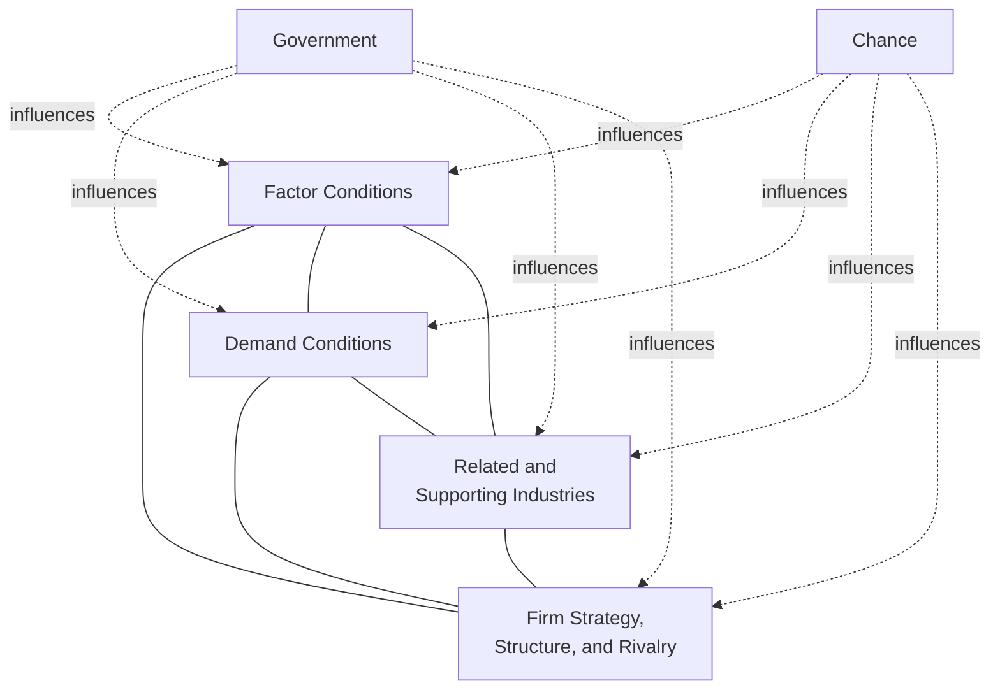

## Porter's Diamond Model of National Advantage

### Origin and Purpose

Porter's Diamond Model, introduced by Michael Porter in his 1990 book *The Competitive Advantage of Nations*, addresses a question distinct from classical trade theory: rather than explaining *why* countries trade based on differing factor endowments (per Heckscher-Ohlin), the Diamond Model explains why firms based in a **particular nation** (or, at a finer grain, a particular region within a nation) achieve and sustain international competitive success in a **particular industry**, while firms based elsewhere do not. Porter's central argument is that national competitive advantage in a given industry is not simply inherited from static factor endowments, but is actively **created and upgraded** through the dynamic interaction of four interrelated determinants, reinforced by the role of domestic rivalry and, in later refinements, government and chance.

### The Four Determinants of the Diamond

**Factor Conditions**

The nation's position in factors of production relevant to competing in a given industry. Porter's key departure from classical factor-endowment theory is distinguishing between:

- **Basic factors**: naturally inherited endowments — raw materials, climate, geographic location, unskilled and semi-skilled labor, and general-purpose infrastructure — which are becoming less significant as sources of sustained competitive advantage in advanced industries, since basic factors are increasingly available globally or can be sourced from elsewhere via global supply chains.
- **Advanced factors**: created, specialized factors — a skilled and specifically trained labor pool, dedicated research institutions and infrastructure, and specialized knowledge resources — which are more scarce, more difficult and time-consuming to imitate, and consequently more durable as a source of genuine competitive advantage.

Porter's related, somewhat counterintuitive argument is that **selective factor disadvantages** can, under the right conditions, actually spur innovation and upgrading (a firm facing scarce or expensive domestic inputs has a stronger incentive to innovate around that constraint than a firm with abundant, cheap access to the same input), whereas an abundance of basic factors can breed complacency and reduce the pressure for continuous upgrading.

**Demand Conditions**

The nature of home-market demand for the industry's product or service. Porter argues that the *composition* and *sophistication* of domestic demand matters more for competitive advantage than its sheer *size*:

- **Sophisticated and demanding domestic buyers** pressure domestic firms to innovate faster and to higher quality standards than they would face from a less demanding market, and this pressure-tested capability then transfers into an advantage when competing internationally against firms accustomed to less demanding home markets.
- **Early or anticipatory demand**: a domestic market that develops demand for a product ahead of other national markets (anticipating global trends) gives domestic firms an early-mover advantage in developing and refining the corresponding capability before foreign competitors face equivalent domestic pressure.

**Related and Supporting Industries**

The presence or absence, within the nation, of internationally competitive supplier industries and related industries. A strong domestic base of world-class suppliers and related industries provides several benefits beyond simple cost-efficient input sourcing: rapid and efficient exchange of ideas and innovation between the supplier and the industry it supports, ongoing pressure and opportunity for joint innovation, and often greater proximity-driven speed and flexibility in the supply relationship than would be available from foreign suppliers. This determinant closely parallels, at a national-industry-cluster level, the economies-of-scope and capability-transfer logic discussed under related diversification, but operating across firm boundaries within a geographic cluster rather than within a single diversified firm.

**Firm Strategy, Structure, and Rivalry**

The conditions in the nation governing how companies are created, organized, and managed, and the nature of domestic competitive rivalry. Porter's central and most distinctive claim within this determinant is that **vigorous domestic rivalry** is one of the single strongest drivers of sustained international competitive success: intense domestic competition pressures firms to continuously innovate, reduce costs, and improve quality, in a way that competing primarily against foreign rivals (with different competitive norms and often less direct proximity) typically does not replicate. Nations whose domestic industry structure tends toward comfortable oligopoly or state-protected monopoly, by contrast, tend to produce firms less prepared for vigorous international competition.

### The Two Reinforcing Variables: Government and Chance

**Government**

Government does not constitute a fifth determinant of the diamond in Porter's framework, but rather acts as an **influence** on all four core determinants — through policies affecting factor creation (education and research investment), demand conditions (regulatory standards that shape sophisticated domestic demand), related and supporting industries (antitrust policy affecting industry structure), and firm rivalry (competition policy, subsidies, or protectionist measures that can either stimulate or dampen genuine competitive intensity). Porter explicitly cautions against government policies that substitute for genuine competitive dynamics (e.g., protecting domestic firms from international competition, or subsidizing firms without demanding competitive performance in return), since such interventions tend to undermine, rather than strengthen, the diamond's self-reinforcing dynamics over the long run.

**Chance**

Unpredictable events outside the direct control of firms or government — major technological discoveries or discontinuities, geopolitical shocks, sudden shifts in input costs (such as major exchange-rate movements or oil price shocks), or unexpected surges or declines in foreign or domestic demand — can create or destroy competitive positions independent of any firm's or nation's underlying strategic choices, and can shift the relative competitive position between rival nations' industries in ways the diamond's core determinants alone would not predict.

### The Diamond as a Dynamic, Self-Reinforcing System

Porter's central theoretical claim is that these determinants function as an interdependent, mutually reinforcing **system**, not as a checklist of independent factors to be scored separately: sophisticated domestic demand pressures firms to innovate, which drives investment in advanced factor creation, which strengthens related and supporting industries, which in turn intensifies domestic rivalry, which further accelerates innovation and upgrading — a virtuous cycle that, once established, is difficult for foreign competitors (lacking the same domestic system) to replicate even if they can access similar factor inputs individually. This systemic, self-reinforcing quality is what Porter argues makes nationally clustered competitive advantage durable rather than easily transferable or arbitraged away.

### Industrial Clusters as the Empirical Manifestation of the Diamond

A closely related and highly influential extension of the Diamond Model is Porter's concept of the **industrial cluster** — a geographically concentrated group of interconnected companies, specialized suppliers, service providers, and associated institutions (universities, trade associations, standard-setting bodies) in a particular field, which compete but also cooperate. Porter argues that clusters are the geographic manifestation of the diamond's determinants operating in close physical and institutional proximity, and that firms located within a strong cluster benefit from the accumulated interaction of all four determinants in a way that geographically dispersed firms in the same industry cannot easily replicate, even with comparable individual factor access.

### Critiques and Limitations of the Diamond Model

- **Ambiguity regarding the appropriate unit of analysis ("nation")**: critics have noted that competitive advantage frequently clusters at a sub-national regional level (a specific city or region) rather than uniformly across an entire nation, raising questions about whether "nation" is always the most analytically appropriate unit, relative to the more geographically precise "cluster" concept Porter himself later emphasized.
- **Limited applicability to small, open economies**: the model was developed primarily based on the experience of larger, more economically self-contained nations, and its applicability to small economies that are, by necessity, deeply integrated into and dependent upon international trade and investment (and therefore cannot fully develop all four diamond determinants domestically) has been questioned in subsequent research. [Inference: this critique reflects a recurring theme in the international business literature applying and extending Porter's framework, rather than a single settled consensus finding.]
- **Underweighting of multinational corporate activity and global value chains**: the model's domestic-market-centric framing has been criticized for not fully accounting for the modern reality of geographically fragmented, multinational value chains, in which a firm's competitive advantage may derive substantially from its ability to coordinate dispersed activities across multiple countries' diamonds simultaneously, rather than from a single home-country diamond alone.
- **Difficulty of empirical testing and potential for post-hoc explanation**: the model's qualitative, systemic nature makes rigorous, falsifiable empirical testing challenging, and critics have noted a risk that the framework can be applied post-hoc to rationalize the success of virtually any given national industry, rather than offering strong ex-ante predictive power.

### Relationship to Firm-Level International Strategy

The Diamond Model operates primarily at the level of explaining *national or cluster-level* sources of competitive advantage, complementing rather than substituting for the firm-level international strategy frameworks covered elsewhere in this chapter (the integration-responsiveness framework, market entry mode choice). A firm's international strategy formulation should account for the diamond conditions of both its home country (as a potential source of firm-specific competitive advantage to leverage internationally) and of the countries it is considering entering (as a determinant of the intensity and nature of the local competitive rivalry the firm will face upon entry).

**Key Points**

- Porter's Diamond Model explains nationally (or regionally) clustered competitive advantage in specific industries through four interrelated determinants: factor conditions, demand conditions, related and supporting industries, and firm strategy/structure/rivalry, with government and chance as reinforcing (not independent) influences on these four.
- Advanced, created factors (specialized skills, dedicated research infrastructure) are a more durable source of competitive advantage than basic, inherited factors (raw materials, generic labor), and selective factor disadvantages can, counterintuitively, spur innovation rather than simply constrain it.
- Sophisticated and demanding domestic buyers, rather than sheer domestic market size, are the more important dimension of demand conditions for driving competitive upgrading.
- Vigorous domestic rivalry is identified as one of the single strongest drivers of sustained international competitive success, since it pressures firms toward continuous innovation and improvement in a way that protected or monopolistic domestic conditions do not replicate.
- The diamond's determinants function as a dynamic, mutually reinforcing system best observed empirically through geographically concentrated industrial clusters, though the model has been critiqued for ambiguity in defining the appropriate national/regional unit of analysis and for underweighting the modern reality of fragmented, multinational value chains.

**Example**

The historical concentration of world-leading automotive engineering and manufacturing firms in Germany illustrates the diamond's interdependent logic: sophisticated, demanding domestic buyers accustomed to high engineering standards and performance on unrestricted-speed highway infrastructure (demand conditions) pressured domestic manufacturers toward continuous engineering upgrading; a deep, internationally competitive base of specialized component suppliers and precision-engineering firms developed in close geographic proximity to the automakers (related and supporting industries); intense rivalry among multiple strong domestic automakers competing directly against one another on engineering and performance (firm strategy, structure, and rivalry) sustained continuous innovation pressure beyond what any single dominant national champion would have faced; and a strong national base of advanced technical and engineering education (factor conditions) supplied the specialized, skilled workforce this system required — with each determinant reinforcing the others in a mutually sustaining cycle that firms based in countries lacking this same interconnected system found difficult to replicate even when they could access individual inputs (skilled engineers, capital, component suppliers) through international markets.

**Next Steps**

- Industrial Clusters and Regional Competitive Advantage
- Theories and Drivers of Globalization (Comparative Theoretical Foundation)
- The Integration-Responsiveness Framework
- International Market Entry Modes and Location Decisions
- Global Value Chain Configuration and Multinational Coordination
- Government Industrial Policy and Competitive Advantage
- Resource-Based View Applied at the National/Regional Level