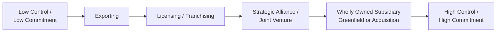

## Modes of International Market Entry

### Definition and Central Trade-Off

International market entry mode choice is the decision a firm makes regarding the specific organizational and contractual vehicle through which it will enter and operate in a foreign market. This decision sits at the intersection of several frameworks covered elsewhere in this chapter: it is, in effect, the international-context application of the general make-or-buy/governance-mode logic from transaction cost economics, informed by the country-specific distance considerations from Ghemawat's CAGE framework, and constrained by the firm's chosen position on the integration-responsiveness framework. The central trade-off across nearly all entry mode choices is between **control** (the degree of ownership and managerial authority the firm retains over foreign operations) and **resource commitment/risk** (the capital, managerial attention, and exposure to loss the firm accepts) on one side, versus **flexibility and speed** on the other — modes offering greater control and ownership typically require greater resource commitment and are harder to reverse, while modes requiring lower commitment typically offer less control and lower potential returns.

### Exporting

**Definition**: Producing goods in the home country (or a third country) and selling them into the foreign target market, without establishing a substantial physical operating presence there.

**Direct Exporting**: the firm sells directly to foreign customers or distributors, retaining control over marketing, pricing, and the export process itself.

**Indirect Exporting**: the firm sells through domestic-based export intermediaries (export management companies, trading companies) that handle the complexities of the foreign transaction on the firm's behalf, in exchange for a fee or margin.

**Advantages**: Lowest capital commitment and risk exposure among entry modes; fastest to implement; avoids the complexities of establishing foreign legal, regulatory, and operational presence; preserves maximum flexibility to exit the market with minimal sunk cost.

**Disadvantages**: Exposure to trade barriers (tariffs, quotas, non-tariff barriers); transportation and logistics costs, which can be substantial for bulky, low-value, or perishable goods; limited ability to adapt products or marketing to local preferences; limited control over how the product is ultimately marketed and positioned when using indirect exporting or foreign distributors; potential exposure to exchange-rate fluctuations affecting realized revenue.

### Licensing

**Definition**: The firm (licensor) grants a foreign firm (licensee) the right to use its intellectual property — patents, trademarks, brand names, proprietary technology, or production processes — in exchange for a fee or royalty, typically calculated as a percentage of the licensee's sales.

**Advantages**: Very low capital commitment and risk exposure; enables market presence in countries where direct investment may be politically difficult, heavily restricted, or where the firm lacks sufficient local market knowledge; the licensee typically bears the capital investment and assumes local market and regulatory risk.

**Disadvantages**: Limited control over how the licensed asset is used, and over the quality and marketing of the resulting product, creating brand and reputational risk if the licensee performs poorly; limited profit potential relative to modes involving direct ownership of foreign operations; and — most significantly from a strategic standpoint — meaningful risk of **facilitating the creation of a future competitor**, since the licensee gains direct exposure to the licensed technology or process and may develop the capability to compete independently, including potentially in third-country markets, once the licensing agreement concludes or even while it remains active.

### Franchising

**Definition**: A specialized form of licensing, most common in service industries, in which the franchisor grants a foreign franchisee the right to use its complete business format — brand, operating systems, processes, and typically ongoing training and support — in exchange for fees and/or royalties, with the franchisor typically exercising tighter, more continuous quality-control oversight over the franchisee's operations than is typical in a standard licensing arrangement.

**Advantages**: Rapid, capital-efficient international expansion, since the franchisee bears most of the local capital investment; access to the franchisee's local market knowledge and relationships; greater brand-consistency control than standard licensing, due to the franchisor's typically more extensive operating standards and oversight mechanisms.

**Disadvantages**: Still carries meaningful brand and quality-control risk if franchisee oversight is inadequate; profit-sharing with the franchisee limits the franchisor's total capture of value generated in the market; coordinating and enforcing consistent standards across many independently owned foreign franchisees presents an ongoing governance and monitoring challenge.

### Strategic Alliances and International Joint Ventures

**Definition**: As covered in depth elsewhere in this chapter, alliances and joint ventures with a local partner are a particularly common entry mode for international expansion specifically, since a local partner can provide market knowledge, regulatory relationships, distribution access, and — in some jurisdictions — satisfy local ownership requirements that would otherwise restrict full foreign ownership.

**Advantages**: Shares capital investment and market-entry risk with a local partner; provides faster access to local market knowledge, relationships, and distribution than the firm could develop independently; can navigate regulatory or political constraints on full foreign ownership; per transaction cost economics, appropriate where moderate asset specificity, uncertainty, and coordination needs do not yet justify the cost and irreversibility of full ownership.

**Disadvantages**: Shared control can create decision-making friction or deadlock, particularly in equally-shared joint ventures; carries the alliance instability risks discussed elsewhere in this chapter (divergent objectives over time, shifting bargaining power, opportunistic learning by the local partner); potential dilution of proprietary knowledge or technology shared with the local partner as part of the venture.

### Wholly Owned Subsidiary: Greenfield Investment

**Definition**: The firm establishes an entirely new, wholly owned operating entity in the foreign market, built from the ground up ("green field") rather than through acquisition of an existing local firm.

**Advantages**: Maximum control over operations, brand, quality, and strategic direction; full capture of profits generated (no revenue-sharing with a local partner or licensee); ability to build organizational culture, processes, and systems from scratch, exactly aligned with the parent firm's preferred approach, without inheriting a legacy organization's existing culture or practices; avoids potential post-acquisition integration challenges entirely.

**Disadvantages**: Highest capital commitment, slowest speed to market (since operations, relationships, and local market presence must be built from scratch), highest overall risk exposure given the large sunk investment; requires the firm to develop local market knowledge and regulatory navigation capability largely independently, absent an existing local partner.

### Wholly Owned Subsidiary: Acquisition Entry

**Definition**: The firm establishes a wholly owned foreign presence by acquiring an existing local firm, rather than building new operations from scratch.

**Advantages**: Substantially faster market entry than greenfield investment, since the acquired firm already possesses local market presence, an existing customer base, established relationships with local suppliers/distributors/regulators, and operational infrastructure already in place; can provide immediate market share and competitive position, avoiding the slower, more gradual market-share-building process greenfield entry requires.

**Disadvantages**: Requires identifying and successfully negotiating acquisition of a suitable target, and paying an acquisition premium; inherits all the post-merger integration challenges discussed elsewhere in this chapter, now compounded by cross-border cultural distance (per Ghemawat's CAGE framework) between the acquirer's and target's national business cultures, in addition to ordinary organizational cultural differences; may inherit legacy liabilities, systems, or organizational practices misaligned with the acquirer's preferred approach, which greenfield entry avoids entirely.

### Determinants of Entry Mode Choice

Drawing together the frameworks referenced above, the appropriate entry mode for a given firm and market depends on several interacting factors:

**CAGE Distance (per Ghemawat)**: Greater cultural, administrative, geographic, and economic distance between the home and target country generally increases the risk and complexity of higher-commitment modes (wholly owned subsidiaries), favoring lower-commitment modes (exporting, licensing) or a local-partner alliance/joint venture that can help bridge the distance, at least until the firm accumulates sufficient direct local market experience to justify greater commitment.

**Asset Specificity and Proprietary Knowledge Protection (per transaction cost economics)**: Where the firm's competitive advantage rests on highly proprietary, difficult-to-protect knowledge or technology, wholly owned modes (greenfield or acquisition) are generally favored over licensing or joint ventures, since sharing proprietary knowledge with a licensee or local partner creates meaningful risk of that knowledge being appropriated or used to build a future competitor.

**Country Risk and Political/Regulatory Environment**: Higher political risk, regulatory uncertainty, or explicit local-ownership restrictions favor lower-commitment modes or joint ventures with local partners over full ownership, all else equal, since lower-commitment modes limit the firm's exposure to loss in the event of adverse political or regulatory developments.

**Firm's International Experience**: Firms with limited prior international experience in a given region often begin with lower-commitment modes (exporting, licensing) as a way of building market knowledge and reducing risk exposure, progressively escalating commitment (a pattern closely associated with the Uppsala internationalization process model) as direct market experience accumulates and uncertainty is resolved, though firms with substantial prior international experience elsewhere, or with a global strategic imperative for rapid, high-control expansion, may bypass this gradual escalation and enter directly through higher-commitment modes.

**Strategic Rationale for International Expansion**: A firm pursuing international expansion primarily for market-seeking reasons (accessing new customer demand) may prioritize modes that provide the fastest, most extensive market access appropriate to the specific market's risk profile, while a firm pursuing efficiency-seeking or resource-seeking international expansion (accessing lower-cost inputs or specific natural resources) may prioritize modes that ensure tight operational control over the specific process or resource being accessed.

**Need for Global Integration versus Local Responsiveness**: Consistent with the integration-responsiveness framework covered elsewhere in this chapter, firms pursuing a globally integrated strategy requiring tight cross-border coordination of operations generally favor wholly owned modes providing full control, while firms pursuing a multidomestic strategy requiring extensive local adaptation may find a local joint-venture partner's market knowledge more valuable relative to the coordination benefits of full ownership.

### Comparative Summary Table

| Entry Mode | Capital Commitment | Control | Speed | Risk Exposure | IP Protection |
| --- | --- | --- | --- | --- | --- |
| Exporting | Lowest | Low | Fastest | Lowest | Moderate (limited direct local exposure) |
| Licensing | Very Low | Low | Fast | Low | Weak (direct IP exposure to licensee) |
| Franchising | Low | Moderate | Fast | Low-Moderate | Moderate (tighter format control than licensing) |
| Alliance / Joint Venture | Moderate | Shared | Moderate | Shared | Moderate (exposure to partner) |
| Greenfield Wholly Owned | Highest | Full | Slowest | High | Strong |
| Acquisition Wholly Owned | High | Full | Fast | High | Strong |

**Key Points**

- International entry mode choice trades off control and profit potential (favoring wholly owned modes) against resource commitment, risk, and speed (favoring exporting, licensing, and alliance-based modes), directly paralleling the general market-hierarchy governance continuum from transaction cost economics applied to the international context.
- Licensing and franchising offer capital-efficient, fast international expansion but carry meaningful risk of enabling a local licensee or franchisee to become a future competitor, particularly where the licensed asset involves genuinely proprietary technology or know-how.
- International joint ventures and alliances share risk and provide local market knowledge but introduce shared-control friction and the alliance-instability risks (divergent objectives, shifting bargaining power, opportunistic learning) discussed elsewhere in this chapter.
- Wholly owned subsidiaries maximize control and profit capture but require the largest capital commitment; greenfield entry avoids inherited legacy issues but is slower, while acquisition entry is faster but inherits cross-border post-merger integration challenges.
- CAGE distance, asset specificity/IP protection needs, country risk, the firm's accumulated international experience, and the firm's position on the integration-responsiveness spectrum jointly determine which entry mode is most appropriate for a specific firm-market combination.

**Example**

A specialty food manufacturer with a distinctive, hard-to-replicate proprietary production process considering expansion into a geographically and culturally distant market with meaningful political and regulatory uncertainty (high CAGE distance, elevated country risk) and limited prior international experience in the region might reasonably begin with direct exporting to build initial market knowledge and test demand at minimal risk, rather than immediately committing to a wholly owned subsidiary. If demand proves strong and the firm accumulates sufficient local market understanding over time, it might then progress to a joint venture with a local distribution partner to build deeper market presence and navigate local regulatory requirements, reserving full greenfield or acquisition-based wholly owned entry for a later stage once uncertainty has been substantially reduced and the firm judges that its highly proprietary production process (which it would be reluctant to expose to a licensee or joint-venture partner, given the appropriation risk) can be protected while establishing full local production capability.

**Next Steps**

- Ghemawat's CAGE Distance Framework in Depth
- The Integration-Responsiveness Framework
- Transaction Cost Economics and the Governance Continuum
- The Uppsala Internationalization Process Model
- Strategic Alliances and Joint Ventures (Governance Mechanics)
- Post-Merger Integration Strategy in Cross-Border Acquisitions
- Political Risk Assessment in International Strategy
- Intellectual Property Protection in International Licensing Arrangements