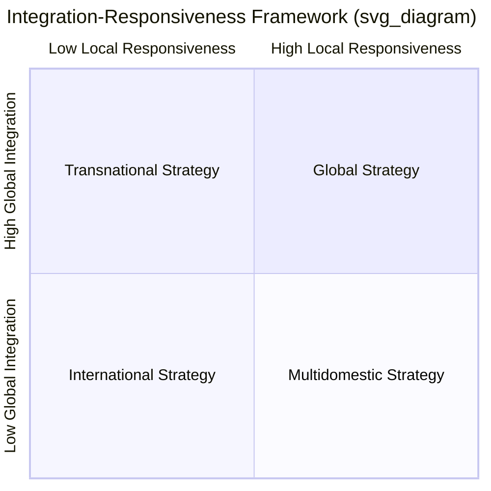
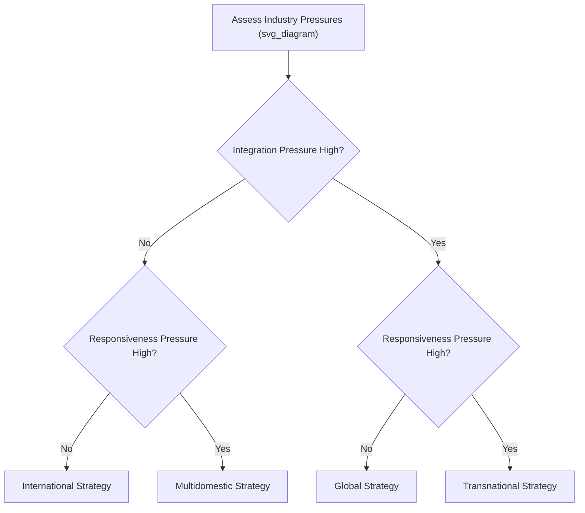

## The Integration-Responsiveness Framework

### Overview

The Integration-Responsiveness (IR) Framework is a strategic model used to analyze how multinational companies (MNCs) balance two competing pressures when operating across borders: the pressure for **global integration** (achieving efficiency through standardization and coordination) and the pressure for **local responsiveness** (adapting to differences in national markets). Developed and popularized by scholars including Christopher Bartlett and Sumantra Ghoshal, the framework helps managers determine which international strategy best fits their industry conditions and organizational capabilities.

### The Two Core Pressures

#### Pressure for Global Integration (Cost Reduction)

This pressure pushes firms toward standardizing products, centralizing operations, and achieving economies of scale across countries. It is strong when:

- **Universal needs** exist (customers worldwide want essentially the same product)
- **Competitors are global**, forcing firms to match cost efficiency internationally
- **Capital intensity** is high, rewarding centralized, large-scale production
- **Trade barriers are low**, making cross-border coordination easier
- Access to **raw materials and low-cost inputs** favors concentrated production hubs

Industries with historically strong integration pressures include semiconductors, commercial aircraft, and consumer electronics.

#### Pressure for Local Responsiveness

This pressure pushes firms to adapt products, marketing, and operations to fit local tastes, regulations, and conditions. It is strong when:

- **Consumer tastes and preferences differ** significantly by country
- **Local regulations and standards** vary (technical, safety, or legal requirements)
- **Distribution channel structures** differ across markets
- **Host government demands** require local production, sourcing, or employment
- **Cultural and linguistic differences** affect product usability or marketing

Industries with historically strong responsiveness pressures include processed foods, retailing, and some consumer packaged goods.

### The Four Generic Strategies

Plotting these two pressures on a matrix (low/high integration on one axis, low/high responsiveness on the other) produces four strategic archetypes.

#### 1. International Strategy (Low Integration, Low Responsiveness)

Firms centralize core competencies (especially R&D and product development) at home and export relatively standardized products with minimal local adaptation. This is typically a starting point for firms with a strong home-grown innovation advantage and limited competitive or local pressure.

- **Structure**: Centralized product development; subsidiaries mainly handle sales and distribution
- **Coordination**: Moderate; headquarters retains control over core knowledge
- **Example**: Early-stage multinational expansion, such as a firm exporting a proprietary technology product with little modification (e.g., early Xerox photocopiers sold internationally largely unchanged)
- **Risk**: Vulnerable to local competitors who adapt better, and to global competitors who achieve lower costs

#### 2. Multidomestic Strategy (Low Integration, High Responsiveness)

Firms treat each national market as distinct, granting significant autonomy to local subsidiaries to customize products, marketing, and operations. Value chain activities are duplicated across countries.

- **Structure**: Decentralized; subsidiaries operate largely independently ("multidomestic" = many domestic businesses)
- **Coordination**: Low; limited knowledge sharing across units
- **Example**: Consumer goods firms historically adapting formulations, packaging, and advertising per country
- **Trade-off**: High responsiveness but sacrifices scale economies and cross-border learning; can lead to duplicated costs

#### 3. Global Strategy (High Integration, Low Responsiveness)

Firms treat the world market as a single, integrated entity, producing standardized products at centralized, large-scale locations to maximize efficiency. Local adaptation is minimized.

- **Structure**: Centralized production and decision-making; subsidiaries execute headquarters strategy
- **Coordination**: High; tight central control
- **Example**: Firms in commodity-like or component-driven industries where cost leadership dominates
- **Trade-off**: Maximizes efficiency and scale but risks missing local market needs and provoking host-government resistance

#### 4. Transnational Strategy (High Integration, High Responsiveness)

The most demanding and, per Bartlett and Ghoshal, the ideal strategy for many contemporary global industries: firms attempt to simultaneously achieve global efficiency and local responsiveness, while also fostering worldwide learning and knowledge transfer.

- **Structure**: An "integrated network" — dispersed, interdependent, and specialized assets and capabilities across subsidiaries, rather than pure centralization or decentralization
- **Coordination**: Very high; requires sophisticated organizational mechanisms (cross-unit teams, shared values, flexible processes) rather than pure hierarchy
- **Example**: Firms that source components globally for efficiency while tailoring final products and marketing to regional tastes, and transferring innovations developed in one subsidiary to others
- **Trade-off**: Highest strategic fit for high-pressure industries but hardest to execute organizationally; requires significant investment in coordination systems and culture

### Comparative Summary Table

| Strategy | Integration Pressure | Responsiveness Pressure | Control Structure | Key Advantage | Key Risk |
| --- | --- | --- | --- | --- | --- |
| International | Low | Low | Centralized core competence | Simplicity; leverages home advantage | Weak against local/global rivals |
| Multidomestic | Low | High | Decentralized, autonomous units | Strong local fit | Duplication; lost scale economies |
| Global | High | Low | Centralized, standardized | Cost efficiency, scale | Poor local fit; political risk |
| Transnational | High | High | Integrated network | Efficiency + responsiveness + learning | Organizational complexity |

### Diagram: Strategic Fit Logic

### Organizational Implications

Bartlett and Ghoshal emphasized that strategy and organizational structure must co-evolve. Key implications include:

- **International strategy** relies on a coordinated federation-like structure: important resources and decisions are centralized at headquarters, with subsidiaries adapting minimally.
- **Multidomestic strategy** relies on a decentralized federation: subsidiaries function almost like independent local companies, each optimized for its own market.
- **Global strategy** relies on a centralized hub: headquarters retains tight control, and subsidiaries act mainly as implementation channels (often called a "hub-and-spoke" model).
- **Transnational strategy** requires an integrated network: capabilities are distributed based on comparative advantage (not simply centralized or decentralized), knowledge flows in multiple directions (not just headquarters-to-subsidiary), and management relies heavily on shared vision, informal networks, and cross-unit collaboration rather than formal hierarchy alone.

[Inference] Because the transnational model demands simultaneous efficiency, responsiveness, and learning, it is generally regarded in the strategic management literature as more aspirational than fully achievable in practice; most real-world firms approximate rather than perfectly realize it.

### Worked Example

**Example**: Consider a global fast-food chain expanding internationally.

- If it emphasizes a **single global menu and brand identity** with centralized supply chains, it leans toward a **global strategy**.
- If it lets each country's franchise **fully customize menu items, pricing, and store design** independently, it leans toward a **multidomestic strategy**.
- If it **standardizes core operational processes and sources key inputs globally for efficiency**, while also **adapting menu items to local tastes** (e.g., region-specific products) and sharing successful local innovations across markets, it is pursuing a **transnational strategy**.
- If it primarily **exports its home-market format largely unchanged**, relying on the strength of its original brand and operating model, it reflects an **international strategy**.

### Applying the Framework: Analytical Steps

1. **Identify industry-level pressures**: Assess whether the industry's economics favor standardization (integration) or local adaptation (responsiveness), using factors such as cost structure, regulatory diversity, and consumer heterogeneity.
2. **Map the firm's current position**: Determine which quadrant best describes the firm's current international operations.
3. **Evaluate strategic fit**: Assess whether the current strategy matches the industry's pressure profile, or whether misalignment exists (e.g., a firm pursuing global strategy in an industry with high responsiveness needs).
4. **Assess organizational capability**: Determine whether the firm's structure, systems, and culture support the desired strategy — particularly important for firms aspiring to transnational strategy, which requires substantial coordination capacity.
5. **Recommend strategic adjustments**: Propose shifts in structure, resource allocation, or coordination mechanisms to close any gap between the desired strategic quadrant and current organizational reality.

### Common Pitfalls and Critiques

- **Over-simplification**: The four-quadrant model presents discrete categories, but in reality, firms often occupy a continuum or blend strategies across different business units or value chain activities (e.g., standardized R&D but localized marketing).
- **Static snapshot**: Industry pressures shift over time due to trade policy changes, technological disruption, or shifting consumer preferences, requiring firms to periodically reassess their positioning.
- **Underestimating transnational complexity**: [Inference] Firms sometimes adopt transnational strategy rhetoric without building the underlying organizational mechanisms (knowledge-sharing systems, cross-border teams, dual reporting structures) needed to execute it, leading to a gap between strategic intent and actual capability.
- **Value chain granularity**: Applying the framework at the level of the whole firm can obscure important differences; it is often more useful to apply integration-responsiveness analysis separately to each value chain activity (R&D, manufacturing, marketing, sales) since pressures can differ by function.

### Relationship to Other Frameworks

- **Porter's Global Strategy framework**: Complements the IR framework by focusing on configuration (where activities are located) and coordination (how activities are managed across locations) of the value chain.
- **CAGE Distance Framework**: Helps explain *why* responsiveness pressures exist by identifying Cultural, Administrative, Geographic, and Economic distances between countries.
- **Yip's Globalization Drivers**: Offers a complementary lens (market, cost, government, and competitive drivers) for assessing the degree of globalization pressure in an industry.

**Related Topics**:

- Porter's Diamond Model of National Competitive Advantage
- Modes of Foreign Market Entry (exporting, licensing, joint ventures, wholly owned subsidiaries)
- The CAGE Distance Framework
- Global Value Chain Configuration and Coordination
- Bartlett and Ghoshal's Organizational Models (Multinational, International, Global, Transnational firms)
- Regional Strategy and the Semiglobalization Concept
- Political Risk Management in International Strategy