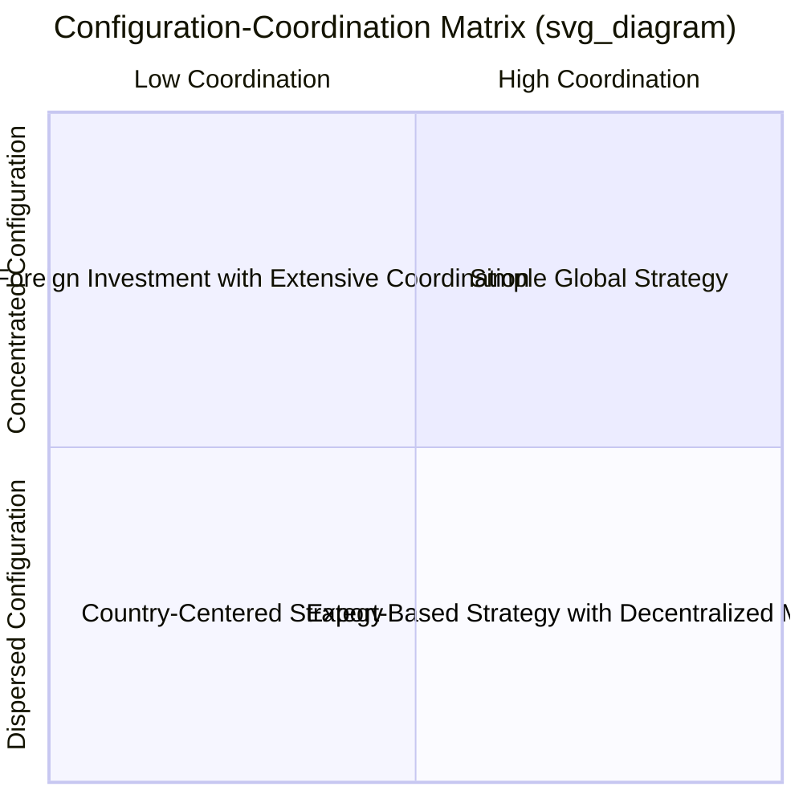
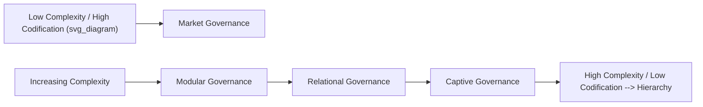

## Global Value Chain Configuration

### Overview

Global Value Chain (GVC) Configuration refers to the strategic decisions multinational firms make about **where** to locate each value-creating activity — R&D, component manufacturing, assembly, marketing, and after-sales service — across the world. Unlike the Integration-Responsiveness Framework, which addresses *whether* to standardize or adapt, GVC Configuration addresses the *geographic and organizational architecture* of how a firm's activities are dispersed or concentrated globally. This concept is closely associated with Michael Porter's work on competitive advantage in global industries, which distinguishes **configuration** (location of activities) from **coordination** (how those dispersed activities are managed together).

### Core Concepts

#### Configuration Defined

Configuration is the answer to the question: *In how many locations, and where, should each activity in the value chain be performed?* Configuration choices range along a spectrum:

- **Concentrated configuration**: An activity is performed in one or a few locations and serves the entire world (e.g., a single global R&D center, one or two mega-factories).
- **Dispersed configuration**: An activity is performed in many countries, often close to end customers or resource endowments (e.g., localized assembly plants, in-country sales and service networks).

#### Coordination Defined

Coordination is the answer to the question: *How are dispersed or concentrated activities managed and integrated across borders?* Coordination can range from low (each subsidiary acts autonomously) to high (activities are tightly synchronized through shared systems, standards, and information flows).

Configuration and coordination are **independent dimensions** — a firm can be geographically dispersed but tightly coordinated (a "transnational" pattern), or concentrated with low coordination needs (a simple "export" pattern).

### The Configuration-Coordination Matrix

- **Concentrated + Low Coordination**: A "simple global strategy" — activities centralized, competitive advantage exported with minimal need for cross-border management complexity.
- **Concentrated + High Coordination**: Concentrated production combined with tightly coordinated marketing and service worldwide (common in high-technology and capital-intensive industries).
- **Dispersed + High Coordination**: The classic transnational pattern — activities spread across many countries but tightly integrated through shared knowledge systems and standards.
- **Dispersed + Low Coordination**: A "country-centered" or multidomestic pattern — each country unit operates largely independently.

### Drivers of Configuration Decisions

#### Factors Favoring Concentration

- **Economies of scale**: Large, centralized plants reduce per-unit costs (common in semiconductor fabrication, aircraft assembly)
- **Steep learning/experience curve effects**: Concentrating cumulative production volume in one location accelerates cost reduction
- **Comparative advantage of specific locations**: Access to specialized labor pools, favorable factor costs, or agglomeration economies (e.g., clusters like Silicon Valley for software, Shenzhen for electronics manufacturing)
- **Logistical feasibility**: Products with low transportation cost relative to value ship economically from a central location
- **Coordination simplicity**: Fewer locations reduce the managerial burden of aligning quality, timing, and standards

#### Factors Favoring Dispersion

- **High transportation costs or trade barriers**: Tariffs, quotas, or high shipping costs make local production more economical
- **Government requirements**: Local content rules, local-sourcing mandates, or investment incentives tied to domestic production
- **Need for local responsiveness**: Products requiring adaptation to local tastes, standards, or regulations benefit from proximity to the market
- **Exchange rate risk mitigation**: Producing in multiple currency zones can act as a natural hedge
- **Perishability or time-sensitivity**: Products that cannot be stored or shipped long distances (fresh food, some pharmaceuticals) require local production
- **Political risk diversification**: Spreading production across countries reduces exposure to any single country's political or economic instability

### Value Chain Disaggregation

A central practice in GVC configuration is **unbundling the value chain** and analyzing each activity independently, rather than making one location decision for the entire firm. Typical activities analyzed separately include:

| Value Chain Activity | Typical Configuration Tendency | Rationale |
| --- | --- | --- |
| Basic R&D | Concentrated | Requires critical mass of specialized talent, avoids duplicated fixed costs |
| Applied/adaptive R&D | Dispersed | Needs proximity to local market requirements |
| Component manufacturing | Concentrated | Capital-intensive; benefits from scale economies |
| Final assembly | Dispersed | May require local content, reduces shipping costs of bulky finished goods |
| Marketing and sales | Dispersed | Requires cultural and linguistic adaptation |
| After-sales service | Dispersed | Requires physical proximity to customers |
| Corporate finance/treasury | Concentrated | Benefits from centralized risk management and capital access |

[Inference] Because different activities in the same firm can rationally sit at different points on the concentration-dispersion spectrum, GVC configuration analysis is typically most useful when applied activity-by-activity rather than to the firm as a single undifferentiated unit.

### GVC Governance Structures

Beyond geographic location, GVC configuration is also studied through the lens of **governance** — how lead firms structure relationships with suppliers across the chain. This typology, developed in the global value chains literature (notably Gereffi, Humphrey, and Sturgeon), identifies five governance patterns based on the complexity of transactions, the ability to codify information, and supplier capability:

1. **Market**: Simple transactions, low switching costs, price-based coordination
2. **Modular**: Suppliers produce to customer specifications using generic machinery, information is codified (e.g., contract electronics manufacturing)
3. **Relational**: Complex information exchange, mutual dependence, reputation and trust-based coordination
4. **Captive**: Small suppliers dependent on and closely monitored by a dominant lead firm
5. **Hierarchy**: Vertical integration; the lead firm directly owns and controls the activity

### Worked Example

**Example**: Consider a global smartphone manufacturer.

- **Chip design (R&D)**: Concentrated in one or two specialized design centers, since this requires deep, hard-to-replicate technical expertise and benefits from co-locating scarce engineering talent.
- **Chip fabrication**: Concentrated in a small number of highly capital-intensive foundries, since fabrication plants cost billions of dollars and require enormous scale to be economical.
- **Component sourcing (displays, memory, sensors)**: Often geographically clustered in a regional manufacturing ecosystem to minimize logistics complexity and lead times.
- **Final assembly**: Located in countries offering favorable labor costs, supply chain proximity, and sometimes government incentives, but not necessarily near the largest end markets.
- **Marketing and retail**: Highly dispersed, with country-specific campaigns, pricing, and channel partnerships reflecting local consumer behavior and regulation.
- **After-sales support**: Dispersed through local service centers and authorized repair partners in each major market.

This illustrates how a single global product results from a **portfolio of configuration decisions**, each optimized independently based on that activity's specific cost, coordination, and responsiveness characteristics.

### Configuration and Risk: Supply Chain Resilience Considerations

[Inference] In recent strategic management practice, firms increasingly weigh configuration decisions not only for cost and responsiveness but also for resilience, given the vulnerability of highly concentrated configurations to single points of failure (natural disasters, geopolitical disruption, pandemics). This has driven interest in strategies such as:

- **Reshoring**: Moving production back to the home country
- **Nearshoring**: Relocating production to geographically or politically closer countries
- **Friend-shoring**: Concentrating supply chains among politically aligned countries
- **Dual sourcing**: Maintaining multiple suppliers or production sites for critical inputs to avoid single-source dependency

These approaches often trade some cost efficiency for reduced supply chain risk, reflecting a broader strategic reassessment of the classic efficiency-driven concentration logic.

### Common Pitfalls and Critiques

- **Treating configuration as a one-time decision**: Configuration should be periodically reassessed as trade policy, factor costs, technology, and competitive dynamics evolve.
- **Ignoring coordination costs when concentrating activities**: Centralizing production can generate hidden costs in the form of longer lead times, higher inventory buffers, and currency/logistics risk exposure.
- **Underestimating governance misalignment**: Applying a captive or market-based governance approach to a highly complex, uncodifiable activity can result in quality and coordination failures.
- **Overlooking activity-level heterogeneity**: Applying a single configuration logic (e.g., "we are a global company, so everything should be centralized") across all value chain activities regardless of their individual economics.

### Relationship to Other Frameworks

- **Integration-Responsiveness Framework**: GVC configuration operationalizes the "where" question that follows from the IR framework's "how standardized versus adapted" question.
- **Porter's Value Chain**: GVC configuration extends the generic value chain model by adding a geographic dimension to each primary and support activity.
- **CAGE Distance Framework**: Explains why certain activities are harder or costlier to disperse (administrative/regulatory distance affecting local content rules, geographic distance affecting transportation costs).
- **Transaction Cost Economics**: Underpins the governance typology, explaining why firms choose market, relational, or hierarchical governance based on asset specificity and transaction complexity.

**Related Topics**:

- Porter's Value Chain Analysis
- Global Value Chain Governance and Supplier Relationships
- Foreign Direct Investment (FDI) Location Decisions
- Offshoring, Outsourcing, and Reshoring Strategies
- Supply Chain Risk Management and Resilience
- The CAGE Distance Framework
- Modes of Foreign Market Entry