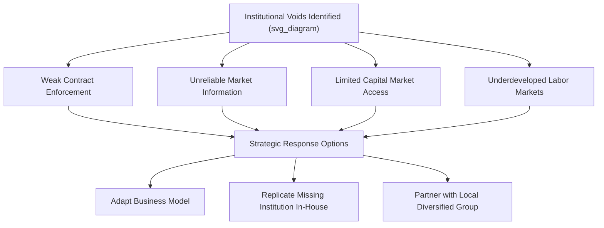

## Emerging Market Strategy

### Overview

Emerging Market Strategy addresses how firms formulate and execute competitive strategy when entering or operating in economies characterized by rapid growth, institutional transition, and structural differences from developed markets. Emerging markets — such as China, India, Brazil, Indonesia, and Vietnam — offer significant growth opportunities but also present distinctive strategic challenges rooted in weaker formal institutions, different consumer purchasing power structures, and unfamiliar competitive dynamics. This area draws heavily on institutional theory, particularly the work of scholars such as Tarun Khanna and Krishna Palepu on "institutional voids."

### Defining Emerging Markets

Emerging markets are typically characterized by:

- **Rapid but often volatile economic growth**, higher than mature developed economies
- **Transitioning institutional frameworks** — legal, regulatory, and market-supporting institutions that are still developing
- **Large and growing middle-class populations**, but with significant income inequality
- **Underdeveloped infrastructure** in some regions, alongside pockets of advanced infrastructure
- **Greater government involvement** in the economy, including state-owned enterprises and industrial policy
- **Higher political and currency risk** relative to developed markets

### Institutional Voids Framework

A central concept in emerging market strategy is the **institutional void** — the absence or weakness of intermediary institutions that developed markets take for granted, such as:

- Credible credit rating agencies and financial analysts
- Efficient labor recruitment and executive search firms
- Reliable market research and consumer information services
- Strong contract enforcement mechanisms and courts
- Well-functioning capital markets and venture funding ecosystems
- Effective regulatory bodies and consumer protection agencies

Institutional voids increase the transaction costs of doing business, because firms cannot rely on external institutions to verify quality, enforce agreements, or supply reliable information. This has significant strategic implications for both foreign entrants and domestic players.

### Strategic Responses to Institutional Voids

#### 1. Adapting the Business Model

Firms can modify products, pricing, or operations to function despite missing institutions rather than waiting for institutions to mature. Examples include:

- Offering smaller unit package sizes to match lower and irregular household incomes
- Building proprietary distribution networks where formal retail infrastructure is weak
- Using mobile-based payment and verification systems where formal banking penetration is low

#### 2. "Filling the Void" In-House

Large firms, particularly diversified business groups, often internalize functions that would otherwise be provided by external institutions:

- Building internal training academies where external vocational education is inadequate
- Creating internal capital allocation mechanisms where external capital markets are underdeveloped (a key explanation for why large diversified conglomerates, or "business groups," are more prevalent and often more successful in emerging markets than in developed ones)
- Establishing private arbitration or dispute resolution mechanisms where courts are slow or unreliable

#### 3. Partnering with Local Business Groups

Because large local conglomerates often already fill institutional voids for their affiliated businesses (financing, distribution, government relations, talent pipelines), foreign entrants frequently partner with or acquire stakes in these groups to gain access to the informal institutional infrastructure they have built.

### Market Entry Strategy Considerations

Emerging market entry requires evaluating standard entry mode decisions (exporting, licensing, joint venture, wholly owned subsidiary, acquisition) with additional emerging-market-specific factors:

| Factor | Consideration in Emerging Markets |
| --- | --- |
| Regulatory environment | Restrictions on foreign ownership, mandatory local partners, sector-specific approval requirements |
| Intellectual property risk | Weaker IP enforcement may argue against licensing or technology transfer without safeguards |
| Distribution access | Local partners often provide indispensable distribution and relationship capital |
| Government relations | Political connections and regulatory navigation may be a critical, non-market capability |
| Talent access | Joint ventures or acquisitions may provide faster access to scarce local management talent |
| Currency and repatriation risk | Capital controls may restrict profit repatriation, influencing entry mode and financing structure |

### The "Dual Strategy" Approach

[Inference] Firms operating across both developed and emerging markets often need a dual strategic posture rather than a single global approach:

- **In developed markets**: Compete on differentiation, brand equity, and premium positioning, leveraging strong institutional infrastructure
- **In emerging markets**: Compete on cost, accessibility, and adaptability, often requiring a fundamentally different value proposition and, in some cases, an entirely different product line

This has given rise to the concept of **reverse innovation**, where products are first developed for the specific constraints of emerging markets (low cost, ruggedness, minimal infrastructure dependence) and are subsequently found to have applicability in developed markets as well (e.g., low-cost medical diagnostic devices originally designed for rural markets later adopted in cost-conscious segments of developed healthcare systems).

### Base of the Pyramid (BoP) Strategy

A related strategic concept, popularized by C.K. Prahalad, focuses on serving the largest but poorest socioeconomic segment of the population (the "base of the economic pyramid") as a viable and scalable market rather than solely a philanthropic target. Key principles include:

- **Radical affordability**: Redesigning cost structures to hit dramatically lower price points, not merely trimming margins on existing products
- **Distribution innovation**: Creating novel last-mile distribution networks (e.g., micro-franchise or door-to-door sales models) to reach dispersed, low-income populations
- **Product reformulation**: Adjusting packaging, formulation, or functionality to fit local usage patterns and purchasing power (e.g., single-use sachets instead of full-size packaging)
- **Building local ecosystems**: Partnering with microfinance institutions, NGOs, and community organizations to support both distribution and demand generation

[Inference] While BoP strategy generated substantial academic and practitioner interest, its practical success has been mixed and is generally regarded as more viable when paired with genuine cost innovation rather than treated as a simple market-size opportunity.

### Competing Against Emerging Market Local Rivals

Multinational entrants must also account for the distinctive competitive advantages that local incumbents often hold:

- **Deep local market knowledge** and long-standing customer relationships
- **Government relationships and political capital**, sometimes decisive in regulated industries
- **Cost structures** adapted to local factor prices and informal economy dynamics
- **Speed and flexibility**, as local firms often move faster in adapting to shifting local conditions than multinational bureaucracies

At the same time, emerging market firms are increasingly expanding outward themselves — a phenomenon studied under the heading of "emerging market multinationals" — leveraging cost efficiency, adaptability, and South-South relationship networks to compete internationally, including in other emerging markets and increasingly in developed ones.

### Risk Management in Emerging Market Strategy

Given elevated volatility, firms typically build in specific risk mitigation approaches:

- **Political risk insurance and diversification**: Spreading exposure across multiple countries to avoid overreliance on any single regime
- **Staged/real options approach to investment**: Making smaller initial investments with embedded options to scale up as uncertainty resolves, rather than committing large capital up front
- **Local currency financing**: Matching revenue and financing currency to reduce exchange rate exposure
- **Scenario planning**: Explicitly modeling multiple political and macroeconomic trajectories given the wider range of plausible outcomes compared to developed markets

### Worked Example

**Example**: Consider a global consumer packaged goods company entering a large emerging market with strong urban-rural income disparity, fragmented retail, and underdeveloped consumer credit.

- **Institutional void identified**: Traditional retail data (e.g., point-of-sale analytics common in developed markets) is unavailable because most sales occur through millions of small, unorganized "mom-and-pop" outlets.
- **Strategic response**: The firm builds its own field sales force and distributor network to gather market intelligence directly, effectively replacing the missing market research institution.
- **Product adaptation**: The firm introduces smaller, lower-priced sachet packaging to match irregular daily-wage income patterns among lower-income consumers, rather than only offering standard developed-market pack sizes.
- **Entry mode choice**: Rather than a wholly owned subsidiary, the firm forms a joint venture with a respected local conglomerate that already has an established distribution network and government relationships, reducing both market entry risk and time-to-scale.
- **Risk mitigation**: The firm phases capital investment, starting with contract manufacturing before committing to owned production facilities, preserving flexibility as it learns about local demand patterns.

### Common Pitfalls and Critiques

- **Assuming institutional voids will be filled quickly**: Institutional development is typically a multi-decade process; strategies premised on rapid institutional convergence with developed markets often prove overly optimistic.
- **Underestimating local competitor capability**: Multinationals sometimes underestimate how effectively local incumbents have already adapted to institutional voids, leading to competitive misjudgment.
- **One-size-fits-all emerging market strategy**: Treating all emerging markets as strategically similar overlooks substantial heterogeneity in institutional maturity, consumer behavior, and regulatory environment between, for example, different major emerging economies.
- **Neglecting exit and downside planning**: Given higher volatility, failing to plan for contraction, divestment, or strategic retreat can leave firms overexposed during downturns or political disruption.

### Relationship to Other Frameworks

- **Integration-Responsiveness Framework**: Emerging markets often demand higher local responsiveness due to institutional and consumer heterogeneity, directly informing where a firm should sit on the IR matrix for that market.
- **CAGE Distance Framework**: The "Administrative" distance dimension is especially salient in emerging markets, capturing regulatory, political, and institutional differences from the home country.
- **Global Value Chain Configuration**: Institutional voids affect where activities can realistically be located (e.g., limited local supplier capability may necessitate more vertical integration than in developed markets).
- **Resource-Based View**: Internal capabilities built to fill institutional voids (proprietary distribution, in-house financing) can become durable, hard-to-imitate sources of competitive advantage.

**Related Topics**:

- Institutional Theory in International Business
- Base of the Pyramid Strategy and Frugal Innovation
- Emerging Market Multinationals and South-South Investment
- Political Risk Assessment and Management
- The CAGE Distance Framework
- Modes of Foreign Market Entry
- Reverse Innovation