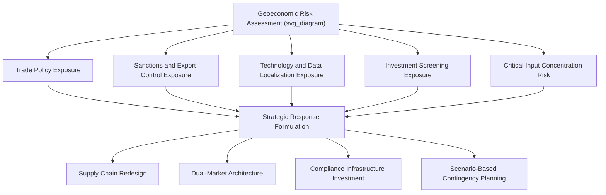

## Geopolitical Risk and Geoeconomic Strategy

### Overview

Geopolitical Risk and Geoeconomic Strategy examines how firms identify, assess, and respond to risks arising from the interaction of politics, national security, and international economic relationships. Where traditional political risk analysis focused primarily on the stability of individual host-country governments, geoeconomic strategy addresses a broader and increasingly consequential phenomenon: the deliberate use of economic tools — trade, investment, technology, and finance — by states as instruments of geopolitical power, and the corresponding strategic response required of multinational firms operating within or across these contested economic relationships.

### Distinguishing Political Risk from Geopolitical/Geoeconomic Risk

| Dimension | Traditional Political Risk | Geoeconomic Risk |
| --- | --- | --- |
| Primary source | Single host-country instability (coups, expropriation, civil unrest) | Great-power competition and cross-border state economic policy |
| Typical trigger | Domestic political events | Trade wars, sanctions regimes, export controls, technology decoupling |
| Scope of impact | Often localized to one country's operations | Can affect entire supply chains, technology platforms, and market access across multiple countries simultaneously |
| Time horizon | Often episodic and country-specific | Often structural and multi-year, tied to shifting alliance structures |
| Firm response | Localized risk mitigation, insurance, diversification | Structural supply chain redesign, dual-market strategies, compliance architecture |

### Core Categories of Geoeconomic Risk

#### 1. Trade Policy Risk

Tariffs, quotas, and trade agreement renegotiation or withdrawal can materially alter the cost structure of cross-border supply chains, sometimes with limited advance notice.

#### 2. Sanctions and Export Control Risk

Governments increasingly use targeted sanctions (against countries, entities, or individuals) and export controls (particularly on advanced technologies such as semiconductors, artificial intelligence hardware, and dual-use technologies) as strategic tools. Firms face:

- **Direct compliance risk**: Prohibition on selling to or sourcing from sanctioned/controlled entities
- **Extraterritorial exposure**: Some sanctions regimes apply to non-domestic firms with even indirect exposure to the regulating jurisdiction (e.g., through use of a particular currency, technology, or financial system)
- **Secondary sanctions risk**: Penalties applied to third parties that continue to do business with sanctioned entities

#### 3. Technology Decoupling and Data Localization

Increasing bifurcation of technology ecosystems (e.g., separate technology standards, restricted cross-border data flows, localization requirements for data storage and processing) forces firms to consider whether to maintain a single global technology architecture or build parallel, region-specific systems.

#### 4. Investment Screening Risk

Governments increasingly screen inbound foreign direct investment — particularly in sectors deemed critical to national security (semiconductors, critical infrastructure, defense-adjacent technology) — creating uncertainty around cross-border mergers, acquisitions, and greenfield investment approval.

#### 5. Supply Chain Weaponization Risk

Dependence on a single country or firm for critical inputs (rare earth minerals, semiconductors, pharmaceutical precursors) creates exposure to deliberate supply restriction used as a geopolitical lever.

### Strategic Response Frameworks

#### Supply Chain Redesign Strategies

Firms facing elevated geoeconomic risk have adopted several structural responses, often summarized along a spectrum of geographic realignment:

- **Reshoring**: Relocating production back to the home country to eliminate cross-border exposure entirely, typically at higher cost
- **Nearshoring**: Relocating production to geographically proximate countries to reduce logistics complexity and geopolitical distance simultaneously
- **Friend-shoring** (also called "ally-shoring"): Concentrating supply chains among politically aligned countries to reduce exposure to geopolitical rivals while retaining some cost advantages of dispersed production
- **China+1 / diversification strategies**: Maintaining a primary production base while deliberately building parallel capacity in an alternative country to reduce concentration risk without fully exiting the original location

#### Dual-Market or "Split" Strategies

[Inference] For firms operating in industries directly affected by technology decoupling (e.g., telecommunications, semiconductors, cloud infrastructure, social media platforms), a common strategic adaptation involves maintaining functionally separate business units, technology stacks, or corporate structures for different geopolitical blocs, sacrificing some global scale efficiency in exchange for continued market access and regulatory compliance in each bloc.

#### Compliance and Intelligence Infrastructure

Firms operating in geoeconomically sensitive sectors increasingly invest in:

- **Dedicated trade compliance and sanctions screening functions**, often integrated directly into transaction and logistics systems
- **Geopolitical intelligence and scenario planning units**, sometimes housed within corporate strategy or risk management functions, tasked with monitoring policy developments and modeling second-order effects
- **Government affairs and public policy engagement**, to represent firm interests in regulatory and legislative processes shaping geoeconomic policy

#### Scenario Planning and Real Options Thinking

Given the difficulty of predicting specific geopolitical outcomes, firms often apply scenario planning methodologies:

1. **Identify key uncertainties**: e.g., trajectory of a specific bilateral relationship, likelihood of new export controls in a given technology category
2. **Construct distinct plausible scenarios**: Rather than a single forecast, develop several internally consistent future states (e.g., continued status quo, moderate decoupling, severe decoupling)
3. **Stress-test current strategy against each scenario**: Identify which elements of the current strategy would be resilient, adaptable, or catastrophically exposed under each scenario
4. **Build in real options**: Structure investments (e.g., modular facility design, flexible supplier contracts, staged capital commitments) that preserve the ability to pivot as uncertainty resolves, rather than committing irreversibly to a single configuration

### Risk Assessment Methodologies

Firms typically assess geoeconomic exposure across several analytical dimensions:

- **Revenue concentration risk**: Percentage of revenue derived from geopolitically sensitive markets or relationships
- **Input concentration risk**: Reliance on single-country or single-firm sources for critical components or materials
- **Technology exposure risk**: Degree to which core products rely on technology, intellectual property, or standards controlled by a single geopolitical bloc
- **Regulatory exposure mapping**: Systematic tracking of current and pending trade, sanctions, and investment-screening regulations across all markets of operation
- **Second- and third-order effect modeling**: Assessing not only direct impacts but downstream effects on customers, suppliers, and financial counterparties

### Worked Example

**Example**: Consider a semiconductor equipment manufacturer headquartered in an advanced economy, with a global customer base including chip fabricators in multiple geopolitically distinct regions.

- **Risk identified**: The firm's most advanced equipment is subject to export controls restricting sales to certain countries, while its supply chain depends on specialized components sourced from a geographically concentrated set of suppliers.
- **Trade policy monitoring**: The firm establishes a dedicated compliance function that tracks evolving export control lists in real time and integrates automated screening into its order management system.
- **Supply chain response**: The firm qualifies a second source for a critical input material located in a different country, accepting a modest cost premium in exchange for reduced concentration risk.
- **Market strategy adaptation**: The firm segments its product roadmap, offering a full-capability product line to customers in unrestricted markets and a compliant, restricted-capability variant to customers in controlled markets, preserving some revenue in constrained markets without violating export regulations.
- **Scenario planning**: Corporate strategy models three scenarios for the bilateral technology relationship between key markets over a five-year horizon, and evaluates capital expenditure plans for resilience under each.

### Common Pitfalls and Critiques

- **Treating geoeconomic risk as a compliance checkbox rather than a strategic variable**: [Inference] Firms that assign geoeconomic risk management solely to legal or compliance functions, without integrating it into core strategic planning and capital allocation decisions, are often slower to adapt when conditions shift materially.
- **Overreacting to short-term political rhetoric**: Not all political statements translate into enacted policy; firms need frameworks to distinguish signal from noise in geopolitical commentary.
- **Underestimating the cost of full decoupling**: Complete supply chain separation from a major economic bloc is often prohibitively expensive; partial, risk-adjusted diversification is more common in practice than wholesale exit.
- **Static risk assessment**: Geoeconomic conditions can shift rapidly (new sanctions, export control updates, trade agreement changes); risk assessments require continuous updating rather than periodic, static review.
- **Ignoring second-order counterparty risk**: A firm may not be directly sanctioned or restricted but can still be materially affected through customers, suppliers, or financial partners who are.

### Relationship to Other Frameworks

- **Global Value Chain Configuration**: Geoeconomic risk is a primary driver behind the recent shift toward friend-shoring, nearshoring, and dual-sourcing configuration strategies.
- **Integration-Responsiveness Framework**: Rising geoeconomic fragmentation increases the practical pressure for local/regional responsiveness even in industries that were previously organized around global integration.
- **Emerging Market Strategy**: Many emerging markets sit at the center of geopolitical competition between major powers, compounding traditional institutional-void challenges with geoeconomic alignment risk.
- **Resource-Based View / Dynamic Capabilities**: The organizational capability to sense, interpret, and rapidly respond to geoeconomic shifts is increasingly framed as a source of competitive advantage in its own right.

**Related Topics**:

- Political Risk Assessment and Management
- Global Value Chain Configuration
- Sanctions Compliance and Export Control Management
- Scenario Planning and Strategic Foresight
- Supply Chain Resilience and Diversification Strategy
- Trade Policy and International Business
- Dynamic Capabilities in Turbulent Environments