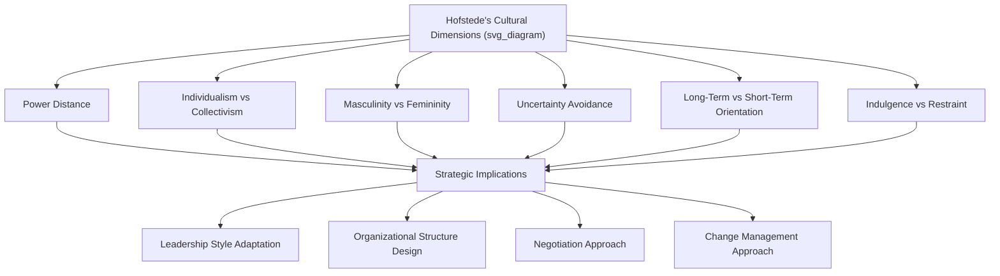

## Cross-Cultural Strategic Management

### Overview

Cross-Cultural Strategic Management examines how cultural differences across nations and organizations shape strategy formulation, implementation, and firm performance in international settings. It addresses how managers understand, anticipate, and adapt to variation in values, communication norms, decision-making styles, and organizational behavior across cultures, and how these differences affect critical strategic activities such as negotiation, leadership, mergers and acquisitions integration, team management, and organizational design.

### Foundational Cultural Frameworks

#### Hofstede's Cultural Dimensions Theory

Geert Hofstede's framework, based on large-scale survey research originally conducted within a single multinational corporation, identifies dimensions along which national cultures systematically differ. The commonly cited dimensions include:

- **Power Distance**: The degree to which unequal distribution of power is accepted and expected within a society (high power distance cultures accept hierarchical authority more readily than low power distance cultures)
- **Individualism versus Collectivism**: Whether individual achievement and autonomy are prioritized over group loyalty and collective identity
- **Masculinity versus Femininity**: The degree to which a society values competitive achievement and assertiveness versus cooperation, quality of life, and caring for others
- **Uncertainty Avoidance**: The degree to which a society is comfortable with ambiguity and unstructured situations versus preferring rules, structure, and predictability
- **Long-Term versus Short-Term Orientation**: Whether a society emphasizes long-term pragmatic virtues (thrift, perseverance) versus short-term normative concerns (tradition, immediate reciprocation)
- **Indulgence versus Restraint**: The degree to which a society allows relatively free gratification of basic human desires versus regulating it through strict social norms

#### The GLOBE Study Framework

The Global Leadership and Organizational Behavior Effectiveness (GLOBE) research program extended and refined cross-cultural dimensions with a specific focus on leadership, distinguishing between a society's **practices** (how things actually are) and its **values** (how things should be) across nine dimensions, including performance orientation, assertiveness, future orientation, humane orientation, institutional and in-group collectivism, gender egalitarianism, power distance, and uncertainty avoidance. A key contribution of GLOBE is its identification of culturally contingent leadership attributes — traits that are viewed as effective leadership behavior in some cultures but ineffective or even counterproductive in others.

#### Trompenaars' Seven Dimensions

Fons Trompenaars proposed an alternative framework emphasizing dimensions such as universalism versus particularism (whether rules or relationships take precedence), individualism versus communitarianism, neutral versus affective (emotional expressiveness), specific versus diffuse relationships, and achievement versus ascription (status based on accomplishment versus inherited position).

#### High-Context versus Low-Context Communication (Edward Hall)

This framework distinguishes cultures based on how meaning is communicated:

- **High-context cultures**: Much of the meaning is conveyed through context, relationships, and non-verbal cues rather than explicit words (common characterization of many East Asian, Middle Eastern, and Latin American cultures)
- **Low-context cultures**: Meaning is conveyed primarily through explicit, direct verbal communication (common characterization of many Northern European and North American cultures)

[Inference] These national-level characterizations represent generalized tendencies rather than deterministic predictions of individual behavior, and should be applied as a starting hypothesis for cross-cultural engagement rather than a rigid stereotype.

### Strategic Applications of Cultural Frameworks

#### Cross-Border Negotiation

Cultural dimensions materially affect negotiation style and expectations:

- **Time orientation**: Cultures with different time orientations may have divergent expectations about negotiation pace, with some prioritizing relationship-building before substantive discussion and others expecting rapid progression to deal terms
- **Communication style**: High-context negotiators may rely on indirect signals and expect counterparts to read between the lines, while low-context negotiators expect explicit statements of position
- **Decision-making authority**: High power distance cultures may concentrate negotiation authority in a single senior figure, while low power distance cultures may involve broader team-based decision-making
- **Contract versus relationship orientation**: Some cultures view a signed contract as the definitive end of negotiation, while others view it as a starting point subject to ongoing relationship-based renegotiation

#### Leadership and Management Style Adaptation

Effective cross-cultural leadership typically requires adapting management approach to local cultural context:

- In high power distance cultures, directive leadership styles and formal hierarchical communication channels are often expected and effective
- In low power distance cultures, participative and consultative leadership approaches tend to generate greater engagement and legitimacy
- In collectivist cultures, group-based incentive and recognition systems tend to be more motivating than individual-based systems, which may be more effective in individualist cultures
- In high uncertainty avoidance cultures, detailed rules, structured processes, and clear role definitions reduce anxiety and improve performance; in low uncertainty avoidance cultures, excessive structure can be perceived as unnecessarily rigid

#### Organizational Design and Structure

Cultural context influences which organizational structures are likely to be accepted and function effectively:

- High power distance cultures may find flat, egalitarian organizational structures dissonant with local expectations of hierarchy and authority
- Cultures with strong in-group collectivism may respond more effectively to team-based organizational units than to individually accountable roles
- Uncertainty avoidance levels influence tolerance for ambiguous, matrix-based reporting structures versus clear, single-line hierarchical reporting

### Cross-Cultural Challenges in Mergers and Acquisitions

International M&A integration is a domain where cross-cultural management has particularly high strategic stakes, since cultural incompatibility is frequently cited as a leading cause of M&A underperformance. Key considerations include:

- **National culture versus corporate culture distinction**: Both national cultural differences between merging firms' home countries and organizational/corporate culture differences (e.g., differing decision-making norms, risk tolerance, communication practices) must be assessed separately, as they can compound or offset one another
- **Cultural due diligence**: Conducting structured cultural assessment as part of pre-merger due diligence, alongside financial and legal due diligence, to identify potential integration risk areas
- **Integration approach selection**: Choosing between full cultural assimilation (imposing acquirer's culture), cultural preservation (allowing the acquired firm's culture to persist largely unchanged), or cultural integration/synthesis (deliberately blending elements of both cultures), based on the strategic rationale for the acquisition and the degree of interdependence required between the two organizations
- **Communication and change management**: Extending change management communication timelines and using culturally appropriate communication channels to manage uncertainty among employees of the acquired firm

### Managing Multicultural and Global Teams

Firms operating multicultural teams (whether physically co-located or virtual/distributed) face distinctive management challenges:

- **Faultline management**: Avoiding the emergence of subgroup divisions along cultural, linguistic, or national lines that can fragment team cohesion
- **Communication protocol design**: Establishing explicit communication norms (e.g., preferred channels, response time expectations, meeting conduct) to bridge differing cultural defaults, particularly important in low-context/high-context mixed teams
- **Psychological safety across cultural difference**: Building team environments where members from cultures with different norms around dissent, feedback, and hierarchy feel comfortable contributing perspectives
- **Cultural intelligence (CQ) development**: Investing in manager and team member capability to recognize, interpret, and adapt to unfamiliar cultural contexts, often treated as a distinct and trainable competency alongside cognitive and emotional intelligence

### Worked Example

**Example**: Consider a Northern European technology firm acquiring a mid-sized firm in East Asia to gain regional market access.

- **Cultural due diligence finding**: The acquiring firm operates with relatively low power distance and direct communication norms, while the target firm operates with higher power distance and more indirect, high-context communication patterns.
- **Negotiation adaptation**: The acquiring firm invests additional time in relationship-building prior to formal negotiations, recognizing that rushing to contractual terms could be perceived as disrespectful of relational norms important to the counterparty.
- **Post-merger integration approach**: Rather than immediately imposing the acquirer's flat organizational structure and open feedback culture, the firm adopts a phased integration plan that initially preserves more hierarchical local reporting structures, gradually introducing cross-cultural collaboration mechanisms as trust develops.
- **Leadership staffing decision**: The firm appoints a bicultural integration leader with credibility and fluency in both organizational cultures to manage the transition, rather than parachuting in a home-country executive unfamiliar with local norms.
- **Team design**: Cross-border project teams are given explicit communication protocols (e.g., structured agendas, written follow-up summaries) to bridge the high-context/low-context communication gap and reduce the risk of misaligned expectations.

### Common Pitfalls and Critiques

- **Stereotyping and overgeneralization**: [Inference] Applying national-level cultural dimension scores as fixed predictors of individual behavior overlooks substantial within-country variation and individual differences, and can lead to inaccurate or even discriminatory assumptions if applied too rigidly.
- **Static cultural assumptions**: Cultural frameworks such as Hofstede's were developed from data collected at specific points in time; cultures evolve, and younger generations or urban populations within a country may differ meaningfully from the aggregate national profile.
- **Ignoring organizational culture in favor of national culture alone**: Corporate/organizational culture differences can sometimes be as significant as national cultural differences, particularly in M&A contexts, and should not be overlooked in favor of national-level analysis alone.
- **One-way cultural adaptation**: Effective cross-cultural strategy typically requires mutual adaptation rather than solely expecting one party (often the local subsidiary or acquired firm) to adapt entirely to the other's cultural norms.
- **Underinvesting in cultural capability development**: Treating cross-cultural competence as an innate trait rather than a trainable capability can lead firms to neglect systematic cultural intelligence development for internationally deployed managers.

### Relationship to Other Frameworks

- **Integration-Responsiveness Framework**: Cultural distance is a major underlying driver of local responsiveness pressure, directly informing IR framework positioning.
- **CAGE Distance Framework**: Cultural distance is one of the four core dimensions (alongside Administrative, Geographic, and Economic distance) used to assess the overall difficulty of operating in a foreign market.
- **Emerging Market Strategy**: Cultural and institutional differences frequently compound in emerging markets, requiring integrated rather than siloed analysis.
- **Modes of Foreign Market Entry**: Cultural distance is a key variable influencing entry mode choice, with greater cultural distance often favoring modes that provide greater local knowledge access (joint ventures, acquisitions) over greenfield wholly owned subsidiaries.

**Related Topics**:

- The CAGE Distance Framework
- Cross-Border Mergers and Acquisitions Integration
- Cultural Intelligence and Global Leadership Development
- Modes of Foreign Market Entry
- Global Team Management and Virtual Collaboration
- Cross-Cultural Negotiation Strategy
- Emerging Market Strategy